# Sentinel-X 架构图文档

> 生成时间：2025-12-11
> 本文档包含项目的各类架构图（Mermaid 格式）

---

## 一、系统整体架构

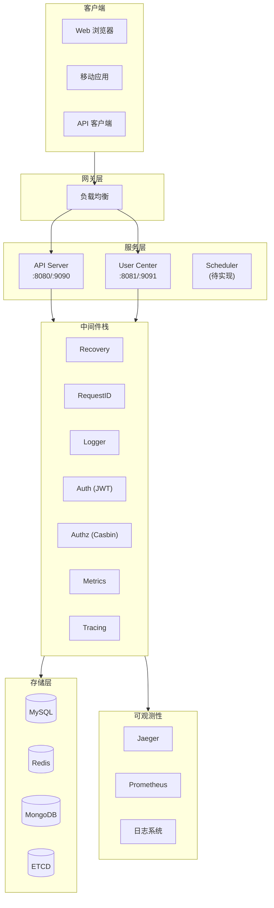

---

## 二、请求处理流程

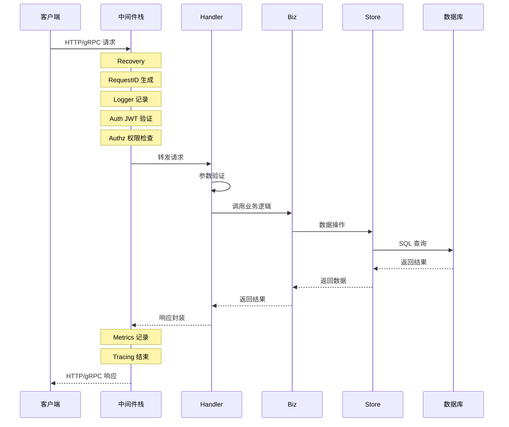

---

## 三、模块依赖关系

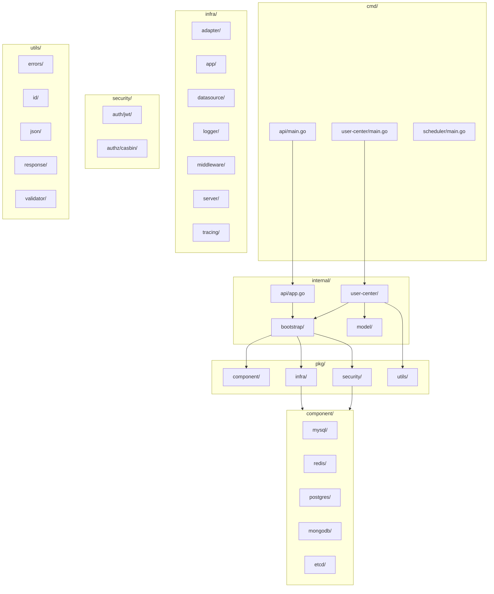

---

## 四、用户中心分层架构

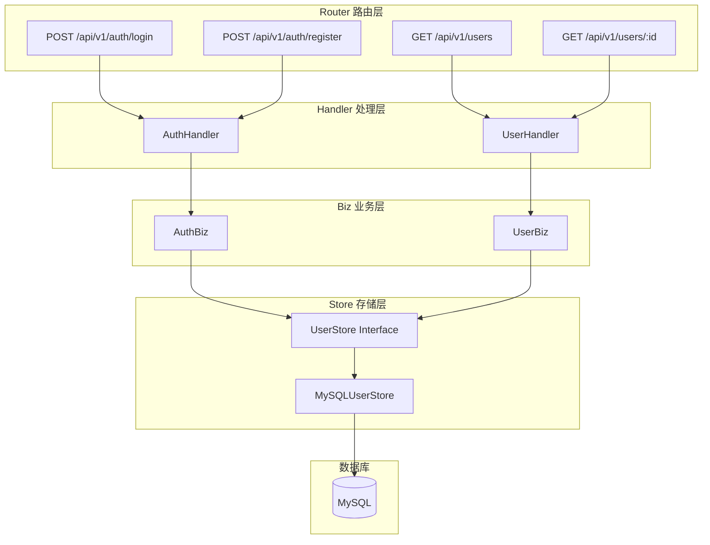

---

## 五、中间件执行顺序

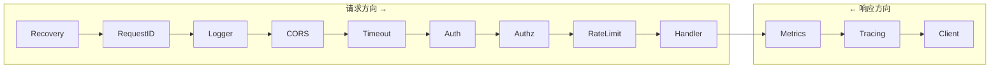

---

## 六、启动引导流程

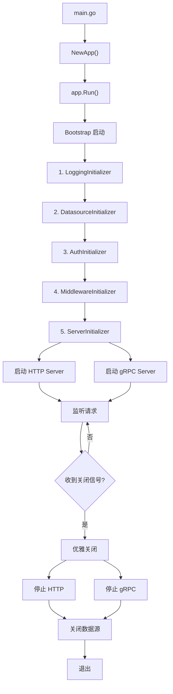

---

## 七、数据源管理架构

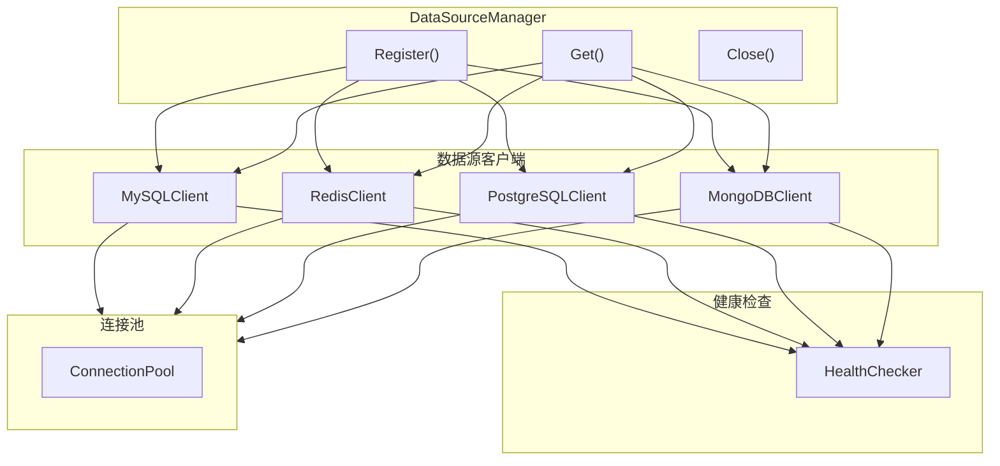

---

## 八、认证授权流程

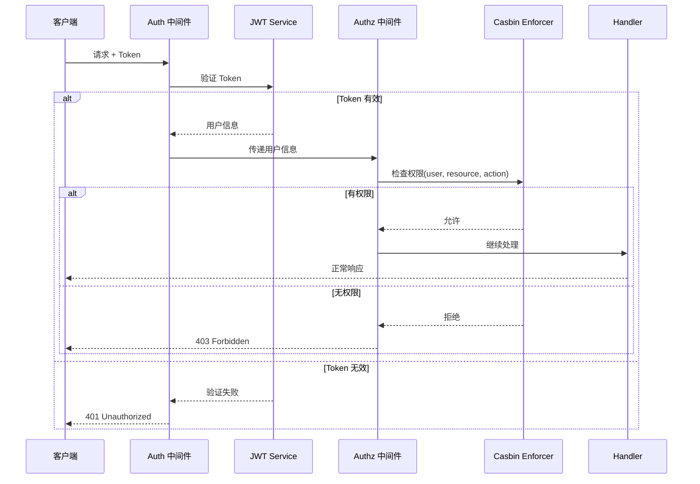

---

## 九、错误处理流程

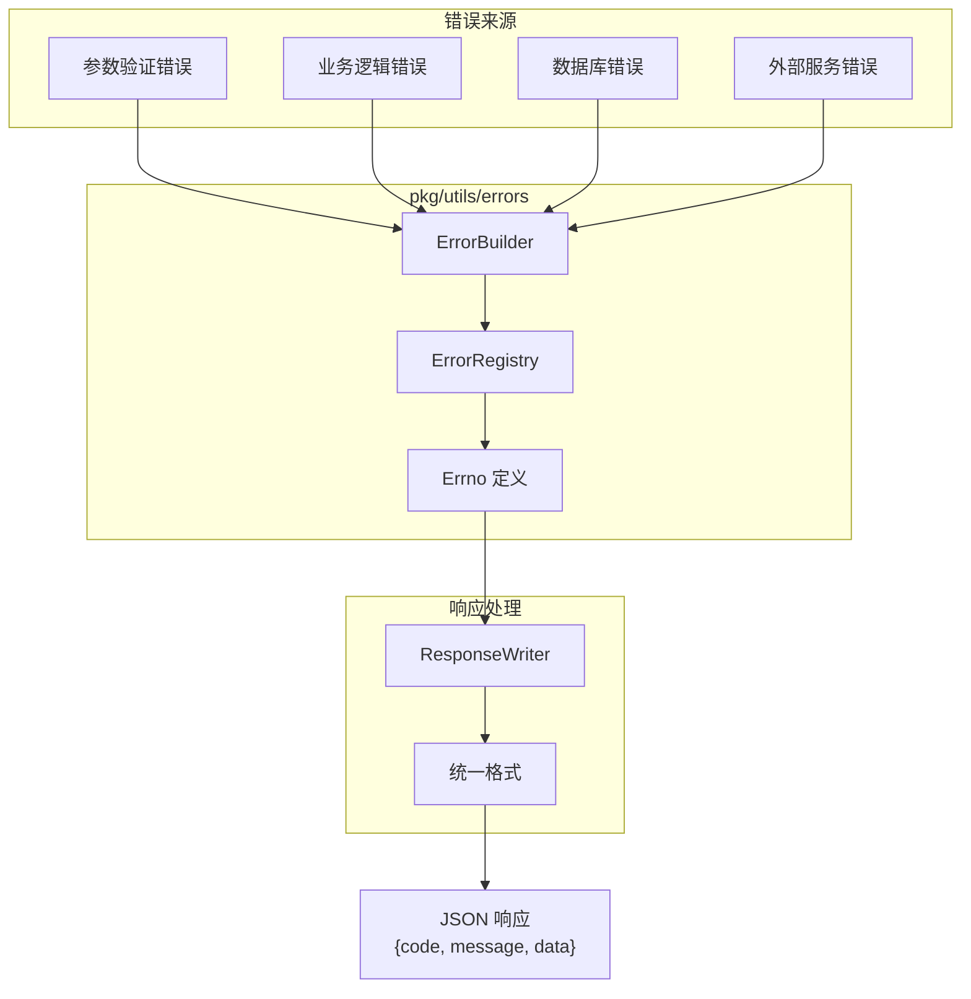

---

## 十、包结构概览

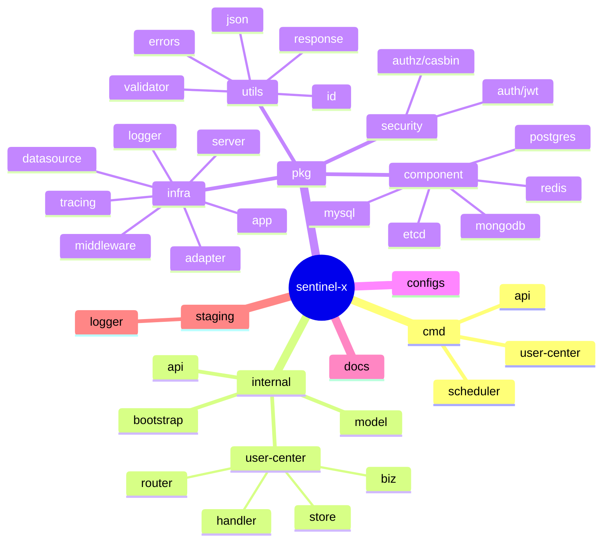

---

## 十一、部署架构

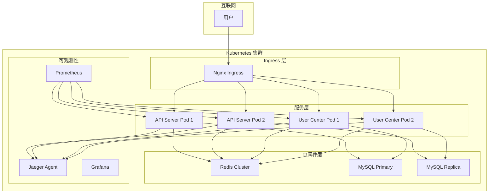

---

## 使用说明

以上架构图均使用 Mermaid 语法编写，可以：

1. 在 GitHub/GitLab 中直接渲染
2. 使用 VS Code 的 Mermaid 插件预览
3. 通过 [Mermaid Live Editor](https://mermaid.live/) 在线编辑
4. 集成到 Markdown 文档中使用
