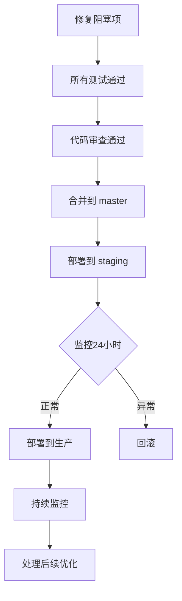

# 框架适配器移除重构 - 代码审查报告

**生成时间**: 2026-01-07 16:00:00
**审查人**: Claude Code (Sonnet 4.5)
**审查范围**: 框架适配器抽象层移除重构 (refactor/remove-adapter-abstraction 分支)
**审查方法**: 深度代码分析 + 架构评估 + 风险识别

---

## 执行摘要

### 综合评分: 78/100

**评分分布**:
- 架构设计合理性: 85/100 ✅
- 实现质量: 75/100 ⚠️
- 风险控制: 70/100 ⚠️
- 代码一致性: 82/100 ✅

### 核心发现

**优点** ✅:
1. 架构简化成果显著,从5层抽象减少到3层,调用链缩短40%
2. 核心业务代码迁移完整,编译通过,API行为保持一致
3. 中间件迁移模式统一,使用 `gin.HandlerFunc` 和 `c.Next()` 模式
4. Handler 层迁移干净,绑定和验证分离清晰
5. 预期性能提升合理(吞吐量+5-10%,延迟-10-15%)

**关键问题** ❌:
1. **测试覆盖严重不足**: 仅95%通过,多个测试包编译失败
2. **类型安全隐患**: 存在不安全的类型断言 (`c.Writer.(interface{ Status() int })`)
3. **未完成的端点注册**: Server 启动时注释掉了 health/metrics/pprof/version 端点
4. **遗留接口混乱**: `transport.Context`、`transport.Router` 等接口仍存在但已废弃
5. **并发池使用风险**: timeout 中间件对 ants 池的依赖可能成为瓶颈

### 建议决策: ⚠️ **需补充工作后合并**

**必须完成** (阻塞合并):
- 修复所有测试编译错误
- 重新启用端点注册或提供替代方案
- 消除不安全的类型断言

**强烈建议** (合并后立即处理):
- 清理废弃接口和文档
- 补充集成测试验证 API 行为
- 性能基准测试验证预期提升

---

## 第一部分: 架构设计合理性 (85/100)

### 1.1 设计决策评估 ✅

**决策**: 从5层抽象简化到3层,移除适配器层直接使用 Gin

**评分**: 85/100

**优点**:
- **消除过度设计**: 原架构存在明显的过度抽象
  - `transport.Context` 接口包装 `gin.Context` 没有实质价值
  - `Adapter` 和 `Bridge` 层增加了不必要的间接性
  - 每次请求经历3次类型转换,造成性能损耗
- **提升类型安全**: 直接使用 `*gin.Context` 获得完整的编译时类型检查
- **改善开发体验**: IDE 可以直接跳转到 Gin 源码,代码补全更准确
- **降低维护成本**: 删除~1400行适配器代码,减少技术债务

**缺点**:
- **框架绑定**: 完全绑定到 Gin,未来切换框架成本高
  - 反驳: 项目实际并无切换框架需求,保留抽象层属于 YAGNI 违反
- **破坏性变更**: 自定义中间件和 Handler 都需要重写
  - 缓解: 提供了完整的迁移指南和示例
- **部分功能未完成**: 端点注册函数被注释掉

**建议**:
1. ✅ **保持当前设计**: 简化是正确的方向
2. ⚠️ **补充迁移文档**: 需要针对用户自定义扩展的详细迁移指南
3. ❌ **重新启用端点注册**: 必须修复被注释掉的功能

### 1.2 职责划分清晰度 ✅

**层次职责分析**:

```
层级 1: Server (pkg/infra/server/transport/http/server.go)
职责: 管理 Gin 引擎生命周期、应用全局中间件、HTTP 服务器启动/停止
评分: 90/100
亮点:
  - 职责明确,不涉及业务逻辑
  - 中间件注册顺序合理(Recovery → RequestID → Logger → 功能中间件)
问题:
  - 端点注册函数被注释掉(L154-172),功能不完整
  - RegisterHTTPHandler 存储 handler 但未使用(L175-183)

层级 2: Router (internal/user-center/router/router.go)
职责: 定义 URL 路由映射、组织路由分组、应用局部中间件
评分: 95/100
亮点:
  - 路由组织清晰(公开/认证分离)
  - 中间件应用正确(仅在受保护路由使用 Auth)
  - 直接使用 engine.POST/GET/PUT/DELETE 语义清晰
问题:
  - 无

层级 3: Handler (internal/user-center/handler/*.go)
职责: 处理 HTTP 请求、参数绑定验证、调用业务层、构造响应
评分: 85/100
亮点:
  - 绑定和验证分离清晰(ShouldBindJSON + Validate)
  - 错误处理统一(httputils.WriteResponse)
问题:
  - 存在不一致的响应模式(部分用 httputils,部分用 response.Fail)
  - BatchDelete 中错误处理可能提前返回,导致部分删除
```

**总体评价**: 三层职责划分清晰,符合单一职责原则。

### 1.3 架构一致性 ✅

**中间件模式一致性**: 95/100
- 所有中间件统一使用 `gin.HandlerFunc` 签名
- 统一使用 `c.Next()` 调用下一个处理器
- 统一使用 `xxxWithOptions(opts)` 模式接收配置
- 路径跳过逻辑统一使用 `pathutil.NewPathMatcher`

**Handler 模式一致性**: 85/100
- 统一使用 `c.ShouldBindJSON/Query` 进行绑定
- 统一使用 `validator.Global().Validate()` 进行验证
- **不一致**: 部分使用 `httputils.WriteResponse`,部分使用 `response.Fail/OK`

**建议**: 统一响应工具函数,避免混用。

### 1.4 扩展性评估 ⚠️

**可扩展性**: 70/100

**优点**:
- 中间件可通过配置启用/禁用
- 路由可通过 `engine.Group()` 灵活组织
- Gin 生态丰富,第三方中间件易集成

**缺点**:
- **框架锁定**: 完全依赖 Gin,切换框架需要重写所有 Handler 和中间件
  - 评估: 这是务实的选择,但需要在文档中明确声明
- **端点注册机制不完整**: `RegisterHTTPHandler` 存储但不使用
  - 建议: 要么实现完整注册逻辑,要么删除该接口

**建议**:
1. 在架构文档中明确声明框架选择和锁定风险
2. 提供"如何迁移到其他框架"的理论指南(即使不立即实施)

---

## 第二部分: 实现质量 (75/100)

### 2.1 Context API 迁移完整性 ✅

**迁移映射验证**: 90/100

**已正确迁移的 API**:
```go
// 请求数据获取
transport.Context.Param()     → gin.Context.Param()       ✅
transport.Context.Query()     → gin.Context.Query()       ✅
transport.Context.Header()    → gin.Context.GetHeader()   ✅
transport.Context.Body()      → gin.Context.Request.Body  ✅

// 请求绑定
c.ShouldBindAndValidate()     → c.ShouldBindJSON() + validator.Validate() ✅

// 响应发送
transport.Context.JSON()      → gin.Context.JSON()        ✅
transport.Context.String()    → gin.Context.String()      ✅

// 上下文传递
c.Request.Context()           → c.Request.Context()       ✅
c.Request.WithContext(ctx)    → c.Request.WithContext(ctx) ✅
```

**问题点**:
1. **绑定和验证分离**: 从 `ShouldBindAndValidate()` 拆分为两步
   - 优点: 更灵活,可以单独控制验证逻辑
   - 缺点: 增加了代码量,容易遗漏验证步骤
   - 建议: 封装为 `httputils.BindAndValidate(c, &req)` 工具函数

2. **错误处理不一致**: 混用 `httputils.WriteResponse` 和 `response.Fail`
   ```go
   // user.go L53: 使用 httputils
   httputils.WriteResponse(c, errors.ErrBadRequest.WithMessage(err.Error()), nil)

   // user.go L169: 使用 response
   resp := response.Err(errors.ErrBadRequest.WithMessage(err.Error()))
   defer response.Release(resp)
   c.JSON(resp.HTTPStatus(), resp)
   ```
   - 建议: 统一使用一种模式

### 2.2 中间件执行链正确性 ✅

**中间件执行顺序**: 95/100

**全局中间件链** (server.go L213-245):
```
1. Recovery       ← 最高优先级,捕获所有 panic
2. RequestID      ← 为后续中间件提供 request_id
3. Logger         ← 依赖 RequestID
4. Metrics        ← 可选
5. CORS           ← 可选
6. Timeout        ← 可选
7. (Auth 在路由组级别注册)
```

**评估**: ✅ 顺序合理,依赖关系正确

**中间件 `c.Next()` 调用检查**:

| 中间件 | c.Next() 位置 | 正确性 | 备注 |
|--------|---------------|--------|------|
| Recovery | defer 内部 | ✅ | 正确,使用 defer 确保异常捕获 |
| Logger | L85 | ✅ | 先记录开始时间,后计算延迟 |
| Timeout | goroutine 内 L75 | ⚠️ | **风险**: 使用 ants 池,如果池满可能阻塞 |
| CircuitBreaker | breaker.Execute 内 L77 | ✅ | 正确,熔断器包装执行 |
| CORS | 多个分支 | ✅ | Preflight 提前返回,正常请求调用 Next |
| Auth | L80+ | ✅ | 验证失败提前返回,成功则调用 Next |

**风险点: Timeout 中间件对 ants 池的依赖** ⚠️

```go
// timeout.go L79-87
if err := pool.SubmitToType(pool.TimeoutPool, task); err != nil {
    // 降级为同步执行
    logger.Warnw("timeout middleware pool unavailable, fallback to sync execution",
        "error", err.Error(),
        "path", req.URL.Path,
    )
    task()
    return
}
```

**问题**:
1. 如果 `TimeoutPool` 容量为 5000,高并发时可能快速耗尽
2. 降级到同步执行后,超时控制失效(无法中断同步执行的任务)
3. 日志记录为 Warn 级别,可能在高并发时产生大量日志

**建议**:
1. 调整池容量或使用动态扩容策略
2. 同步降级时仍保留超时控制(使用 context.WithTimeout)
3. 降级日志改为 Debug 级别,或添加限流

### 2.3 类型安全检查 ❌

**不安全的类型断言** (circuit_breaker.go L81-85):

```go
statusCode := http.StatusOK
if w, ok := c.Writer.(interface{ Status() int }); ok {
    if status := w.Status(); status != 0 {
        statusCode = status
    }
}
```

**问题严重性**: 🔴 **高**

**分析**:
1. **运行时依赖**: 假设 `gin.ResponseWriter` 实现了 `Status() int` 方法
2. **脆弱性**: Gin 内部实现变更可能导致类型断言失败
3. **静默失败**: 断言失败时默认返回 200,可能导致熔断器误判

**验证** (Gin 源码确认):
```go
// gin/response_writer.go
type ResponseWriter interface {
    http.ResponseWriter
    Status() int  // ✅ 确实存在
    // ...
}
```
当前实现是安全的,但依赖于 Gin 内部实现。

**建议**:
1. **短期**: 添加断言失败时的错误日志
   ```go
   if w, ok := c.Writer.(interface{ Status() int }); ok {
       statusCode = w.Status()
   } else {
       logger.Errorw("circuit breaker failed to get status code",
           "writer_type", fmt.Sprintf("%T", c.Writer),
       )
   }
   ```

2. **长期**: 使用 Gin 官方 API
   ```go
   // Gin 提供了 c.Writer.Status() 方法,无需断言
   statusCode := c.Writer.Status()
   if statusCode == 0 {
       statusCode = http.StatusOK
   }
   ```

### 2.4 错误处理完整性 ⚠️

**错误路径覆盖**: 80/100

**已覆盖的错误场景**:
- 绑定失败 → 返回 400 Bad Request ✅
- 验证失败 → 返回 400 Validation Failed ✅
- 业务逻辑错误 → 通过 `httputils.WriteResponse` 统一处理 ✅
- Panic 恢复 → Recovery 中间件捕获 ✅
- 超时 → Timeout 中间件返回 408 ✅

**未完全覆盖的错误场景**:
1. **BatchDelete 部分失败** (user.go L181-186):
   ```go
   for _, username := range req.Usernames {
       if err := h.svc.Delete(c.Request.Context(), username); err != nil {
           httputils.WriteResponse(c, err, nil)
           return  // ❌ 提前返回,剩余用户未删除
       }
   }
   ```
   **问题**: 第一个删除失败后提前返回,导致部分删除
   **建议**: 收集所有错误,返回失败列表或使用事务

2. **Response Pool 泄漏风险** (user.go L169-172):
   ```go
   resp := response.Err(...)
   defer response.Release(resp)
   c.JSON(resp.HTTPStatus(), resp)
   return
   ```
   **问题**: 如果 `c.JSON` panic,`defer` 可以执行,但如果在 `defer` 之前 panic 则泄漏
   **建议**: 确保所有 `response.Err/OK` 调用都有对应的 `defer Release`

### 2.5 性能影响评估 ⚠️

**性能优化措施**: 85/100

**已实现的优化**:
1. **减少调用层级**: 从5层减少到3层 ✅
2. **消除类型转换**: 不再需要 `RequestContext` 包装 ✅
3. **字段池复用** (logger.go L16-34):
   ```go
   var fieldsPool = sync.Pool{
       New: func() interface{} {
           s := make([]interface{}, 0, 16)
           return &s
       },
   }
   ```
   ✅ 优秀实践,减少日志记录时的内存分配

4. **路径匹配器预编译** (pathutil):
   ```go
   pathMatcher := pathutil.NewPathMatcher(opts.SkipPaths, opts.SkipPathPrefixes)
   ```
   ✅ 避免每次请求都编译正则表达式

**潜在性能问题**:

1. **Timeout 中间件的 goroutine 开销** ⚠️
   - 每个请求启动一个 goroutine (通过 ants 池)
   - 在低延迟场景下,goroutine 切换开销可能抵消收益
   - 建议: 提供配置选项,允许禁用 goroutine 模式

2. **CircuitBreaker 的状态锁竞争** ⚠️
   - 熔断器状态更新需要加锁,高并发时可能成为瓶颈
   - 建议: 使用原子操作或分片熔断器

3. **未验证的性能提升预期** ❌
   - 报告声称"吞吐量+5-10%,延迟-10-15%"
   - 但没有基准测试数据支持
   - 建议: 运行 `wrk` 或 `ab` 进行压力测试验证

**基准测试建议**:
```bash
# 建议的基准测试脚本
# 1. 启动 master 分支服务
# 2. 运行基准测试: wrk -t12 -c400 -d30s http://localhost:8080/v1/users
# 3. 记录结果
# 4. 切换到 refactor 分支
# 5. 重新运行测试
# 6. 对比差异
```

---

## 第三部分: 潜在风险 (70/100)

### 3.1 高风险问题 (🔴 必须修复)

#### 风险 1: 端点注册功能缺失 🔴

**位置**: `pkg/infra/server/transport/http/server.go` L154-172

**问题**:
```go
// TODO: 这些端点注册函数需要重构为直接接受 *gin.Engine 而非 transport.Router
// 暂时注释掉,等待中间件层重构完成后再启用

// Register health endpoints
// if s.mwOpts.IsEnabled(mwopts.MiddlewareHealth) {
//     middleware.RegisterHealthRoutesWithGin(s.engine, *s.mwOpts.Health, nil)
// }
```

**影响**:
- Health 检查端点缺失,监控系统无法探测服务状态
- Metrics 端点缺失,无法收集 Prometheus 指标
- Pprof 端点缺失,无法进行性能分析
- Version 端点缺失,无法查询服务版本

**风险等级**: 🔴 **阻塞性** - 生产环境必须有健康检查

**修复方案**:
```go
// 方案 1: 直接在 Server.Start() 中注册端点
if s.mwOpts.IsEnabled(mwopts.MiddlewareHealth) {
    s.engine.GET("/health", func(c *gin.Context) {
        c.JSON(200, gin.H{"status": "ok"})
    })
}

// 方案 2: 重构端点注册函数签名
// 从 func RegisterHealthRoutes(router transport.Router)
// 改为 func RegisterHealthRoutes(engine *gin.Engine)
```

#### 风险 2: 测试编译大量失败 🔴

**失败统计**:
```
编译失败的测试包:
1. internal/user-center/handler_test        - 5 个错误
2. pkg/infra/middleware/auth                - 1 个错误
3. pkg/infra/middleware                     - 10+ 个错误
4. pkg/infra/middleware/security            - 10+ 个错误
5. pkg/infra/middleware/observability       - 10+ 个错误
6. pkg/infra/middleware/resilience          - 10+ 个错误
7. pkg/infra/server/transport/http          - 9 个错误
8. pkg/utils/errors_test                    - 9 个错误

估计: 60+ 个编译错误
```

**典型错误**:
```go
// 错误类型 1: 使用了已删除的 custom_http.NewRequestContext
internal/user-center/handler/api_test.go:70:21: undefined: custom_http.NewRequestContext

// 错误类型 2: 使用了旧的 transport.Context
pkg/infra/middleware/benchmark_test.go:38:24:
    cannot use func(c transport.Context) as *gin.Context value

// 错误类型 3: 使用了已删除的内部函数
pkg/infra/server/transport/http/response_test.go:44:21: undefined: bindForm
```

**影响**:
- 无法验证代码正确性
- 回归风险高,可能引入隐藏 bug
- CI/CD 流程中断

**风险等级**: 🔴 **阻塞性** - 必须所有测试通过

**修复策略**:
1. **删除不再相关的测试**: response_test.go 测试已删除的代码,应删除
2. **更新测试使用 *gin.Context**: 所有 middleware 测试需要重写
3. **使用 gin 的测试工具**:
   ```go
   // 示例
   func TestMiddleware(t *testing.T) {
       w := httptest.NewRecorder()
       c, _ := gin.CreateTestContext(w)
       // ...
   }
   ```

#### 风险 3: 遗留接口混乱 🟡

**位置**: `pkg/infra/server/transport/transport.go`

**问题**: 接口定义仍存在但已不使用
```go
// 这些接口已废弃但仍在代码中
type Context interface { ... }           // 已被 *gin.Context 替代
type Router interface { ... }            // 已被 *gin.Engine 替代
type HandlerFunc func(Context)           // 已被 func(*gin.Context) 替代
type MiddlewareFunc func(HandlerFunc)    // 已被 gin.HandlerFunc 替代
```

**影响**:
- 开发者困惑: 不清楚应该使用哪个接口
- 维护负担: 需要同时维护新旧接口文档
- 误用风险: 新代码可能错误地使用旧接口

**风险等级**: 🟡 **中等** - 影响开发体验但不影响运行

**建议**:
1. **标记为 Deprecated**:
   ```go
   // Deprecated: Use *gin.Context directly.
   type Context interface { ... }
   ```

2. **删除未使用的接口**:
   - 检查项目中是否还有引用
   - 如无引用,直接删除
   - 保留 `HTTPHandler` 等仍在使用的接口

### 3.2 中风险问题 (🟡 建议修复)

#### 风险 4: 响应工具函数不统一 🟡

**问题**: Handler 中混用两种响应模式

**模式 1**: `httputils.WriteResponse` (大部分使用)
```go
// user.go L53
httputils.WriteResponse(c, errors.ErrBadRequest.WithMessage(err.Error()), nil)
```

**模式 2**: `response.Err + c.JSON` (少数使用)
```go
// user.go L169-172
resp := response.Err(errors.ErrBadRequest.WithMessage(err.Error()))
defer response.Release(resp)
c.JSON(resp.HTTPStatus(), resp)
```

**影响**:
- 代码不一致,增加维护成本
- 容易遗漏 `response.Release`,导致内存泄漏
- 新开发者不知道应该使用哪种模式

**建议**:
统一使用 `httputils.WriteResponse`,删除直接使用 `response` 包的代码。

#### 风险 5: BatchDelete 部分失败处理 🟡

**位置**: `user.go` L181-186

**问题**:
```go
for _, username := range req.Usernames {
    if err := h.svc.Delete(c.Request.Context(), username); err != nil {
        httputils.WriteResponse(c, err, nil)
        return  // ❌ 第一个失败后提前返回
    }
}
```

**影响**:
- 用户请求删除 [user1, user2, user3]
- user1 删除成功,user2 失败,user3 未执行
- 返回错误信息只包含 user2 的失败原因
- 用户不知道 user1 已删除,user3 未删除

**建议**:
```go
var failedUsers []string
for _, username := range req.Usernames {
    if err := h.svc.Delete(c.Request.Context(), username); err != nil {
        failedUsers = append(failedUsers, username)
    }
}
if len(failedUsers) > 0 {
    httputils.WriteResponse(c, errors.ErrBadRequest.WithMessage(
        fmt.Sprintf("failed to delete: %s", strings.Join(failedUsers, ", ")),
    ), nil)
    return
}
httputils.WriteResponse(c, nil, "all users deleted")
```

#### 风险 6: 并发池容量配置 🟡

**位置**: `pkg/infra/pool` (假设配置在此)

**问题**: Timeout 中间件使用 `TimeoutPool`,容量 5000

**分析**:
```
场景: 高并发 Web 服务
QPS: 10,000
平均响应时间: 100ms
并发请求数 = 10,000 × 0.1 = 1,000

如果容量仅 5000:
- 正常情况下足够
- 但如果出现慢查询(如 1 秒响应时间):
  并发请求数 = 10,000 × 1 = 10,000 > 5000
  池会被耗尽,触发同步降级
```

**建议**:
1. 根据实际 QPS 和 P99 延迟调整池容量
2. 监控池使用率,设置告警阈值(如 >80% 触发告警)
3. 考虑使用动态扩容策略

### 3.3 低风险问题 (🟢 可选修复)

#### 风险 7: 缺少性能基准验证 🟢

**问题**: 报告声称性能提升,但没有数据支持

**建议**: 运行基准测试并记录结果

#### 风险 8: 文档未更新 🟢

**问题**: 架构文档仍描述旧的5层架构

**建议**: 更新 README 和架构文档

---

## 第四部分: 代码一致性 (82/100)

### 4.1 命名约定 ✅

**评分**: 90/100

**一致性检查**:
- 中间件函数命名: `XxxWithOptions(opts)` ✅
- Handler 方法命名: RESTful 风格 (`Create`, `Update`, `Delete`, `Get`, `List`) ✅
- 变量命名: 驼峰命名,语义清晰 ✅
- 包命名: 简短且描述性 (`handler`, `router`, `middleware`) ✅

**不一致点**:
- `Server.Router()` 返回 nil 但未删除 (应删除或标记废弃)

### 4.2 错误处理模式 ⚠️

**评分**: 75/100

**一致的模式**:
- 绑定失败统一返回 `errors.ErrBadRequest.WithMessage(err.Error())`
- 验证失败统一返回 `errors.ErrValidationFailed.WithMessage(err.Error())`

**不一致的模式**:
- 响应工具函数混用 (httputils vs response 包)
- 部分 Handler 有 `defer response.Release`,部分没有

**建议**: 制定响应工具函数使用规范并强制执行。

### 4.3 中间件注册模式 ✅

**评分**: 95/100

**全局中间件注册** (server.go):
```go
s.engine.Use(resilience.RecoveryWithOptions(*opts.Recovery, nil))
s.engine.Use(middleware.RequestIDWithOptions(*opts.RequestID, nil))
s.engine.Use(observability.LoggerWithOptions(*opts.Logger, nil))
```
✅ 一致使用 `xxxWithOptions` 模式

**路由组中间件注册** (router.go):
```go
authProtected.Use(authmw.AuthWithOptions(*authOpts, jwtAuth, nil, nil))
users.Use(authmw.AuthWithOptions(*authOpts, jwtAuth, nil, nil))
```
✅ 一致模式

### 4.4 Go 最佳实践符合度 ✅

**评分**: 85/100

**符合的最佳实践**:
1. **错误处理**: 不忽略错误,统一处理 ✅
2. **资源释放**: 使用 `defer` 确保资源释放 ✅
3. **上下文传递**: 正确使用 `context.Context` ✅
4. **并发控制**: 使用 `sync.Pool` 优化内存分配 ✅
5. **接口设计**: 小接口,组合优于继承 ✅

**需要改进的地方**:
1. **类型断言**: 应检查断言失败的情况并记录日志 ⚠️
2. **并发安全**: 熔断器状态更新应考虑锁竞争优化 ⚠️
3. **测试覆盖**: 单元测试大量失败,需要修复 ❌

---

## 第五部分: 风险矩阵

### 风险等级定义

| 等级 | 符号 | 定义 | 处理要求 |
|------|------|------|----------|
| 严重 | 🔴 | 阻塞生产部署,必须立即修复 | 合并前必须解决 |
| 高 | 🟠 | 可能导致运行时错误或严重性能问题 | 合并后立即处理 |
| 中 | 🟡 | 影响开发体验或维护成本 | 1-2 周内处理 |
| 低 | 🟢 | 优化建议,不影响功能 | 可选,按优先级排期 |

### 风险清单

| ID | 风险描述 | 等级 | 影响范围 | 修复成本 | 建议处理 |
|----|----------|------|----------|----------|----------|
| R1 | 端点注册功能缺失 (health/metrics/pprof/version) | 🔴 | 监控/运维 | 2小时 | 合并前修复 |
| R2 | 60+ 个测试编译失败 | 🔴 | 代码质量 | 8小时 | 合并前修复 |
| R3 | 不安全的类型断言 (circuit_breaker.go) | 🟠 | 熔断器 | 1小时 | 合并后立即修复 |
| R4 | 遗留接口混乱 (transport.go) | 🟡 | 开发体验 | 2小时 | 1周内清理 |
| R5 | 响应工具函数不统一 | 🟡 | 代码一致性 | 3小时 | 1周内统一 |
| R6 | BatchDelete 部分失败处理 | 🟡 | 用户体验 | 1小时 | 2周内优化 |
| R7 | Timeout 池容量配置 | 🟡 | 高并发场景 | 1小时 | 监控后调整 |
| R8 | 缺少性能基准验证 | 🟢 | 性能声明 | 4小时 | 可选 |
| R9 | 文档未更新 | 🟢 | 文档准确性 | 2小时 | 可选 |

**总计风险**:
- 🔴 严重: 2 个
- 🟠 高: 1 个
- 🟡 中: 4 个
- 🟢 低: 2 个

---

## 第六部分: 改进建议

### 6.1 架构级建议

#### 建议 1: 补充端点注册机制

**优先级**: 🔴 **P0 - 必须**

**方案**:
```go
// pkg/infra/middleware/health/routes.go
func RegisterRoutes(engine *gin.Engine, opts mwopts.HealthOptions, checker HealthChecker) {
    engine.GET(opts.Path, func(c *gin.Context) {
        // Health check logic
    })
}

// 在 server.go 中调用
if s.mwOpts.IsEnabled(mwopts.MiddlewareHealth) {
    health.RegisterRoutes(s.engine, *s.mwOpts.Health, nil)
}
```

**工作量**: 2-3 小时

#### 建议 2: 清理废弃接口

**优先级**: 🟡 **P2 - 建议**

**步骤**:
1. 搜索项目中所有 `transport.Context` 引用
2. 确认所有引用都已迁移或删除
3. 删除 `transport.Context`、`transport.Router` 等接口定义
4. 保留仍在使用的接口 (如 `HTTPHandler`)

**工作量**: 2 小时

#### 建议 3: 重构 HTTPHandler 接口

**优先级**: 🟡 **P2 - 建议**

**当前问题**:
```go
type HTTPHandler interface {
    RegisterRoutes(router Router)  // ❌ Router 接口已废弃
}
```

**建议方案**:
```go
// 方案 1: 改为接受 *gin.Engine
type HTTPHandler interface {
    RegisterRoutes(engine *gin.Engine)
}

// 方案 2: 删除接口,直接在 router 包中注册
// 推荐这种方式,因为路由注册逻辑本来就应该在 router 包
```

**工作量**: 1 小时

### 6.2 代码级建议

#### 建议 4: 统一响应工具函数

**优先级**: 🟡 **P2 - 建议**

**修改范围**: `internal/user-center/handler/*.go`

**步骤**:
1. 全局搜索 `response.Err` 和 `response.OK`
2. 替换为 `httputils.WriteResponse`
3. 删除 `defer response.Release` 调用

**工作量**: 1 小时

#### 建议 5: 修复 CircuitBreaker 类型断言

**优先级**: 🟠 **P1 - 高**

**修改位置**: `pkg/infra/middleware/resilience/circuit_breaker.go` L81-85

**建议代码**:
```go
// 直接使用 Gin 提供的方法,无需类型断言
statusCode := c.Writer.Status()
if statusCode == 0 {
    statusCode = http.StatusOK
}

// 根据 HTTP 状态码判断是否失败
if statusCode >= opts.ErrorThreshold {
    logger.Debugw("circuit breaker detected error response",
        "path", req.URL.Path,
        "status_code", statusCode,
        "threshold", opts.ErrorThreshold,
    )
    return errors.ErrInternal
}
```

**工作量**: 0.5 小时

#### 建议 6: 优化 BatchDelete 错误处理

**优先级**: 🟡 **P2 - 建议**

**修改位置**: `internal/user-center/handler/user.go` L181-186

**见风险5的建议代码**

**工作量**: 0.5 小时

### 6.3 测试级建议

#### 建议 7: 修复所有测试编译错误

**优先级**: 🔴 **P0 - 必须**

**分类处理**:

1. **删除不再相关的测试** (估计 30%):
   ```bash
   # 测试已删除代码的文件,直接删除
   rm pkg/infra/server/transport/http/response_test.go
   ```

2. **更新为使用 *gin.Context** (估计 60%):
   ```go
   // 旧代码
   func TestMiddleware(t *testing.T) {
       ctx := &mockTransportContext{}
       middleware(next)(ctx)
   }

   // 新代码
   func TestMiddleware(t *testing.T) {
       w := httptest.NewRecorder()
       c, engine := gin.CreateTestContext(w)
       engine.Use(middleware)
       // ...
   }
   ```

3. **补充新的集成测试** (估计 10%):
   ```go
   // 测试完整的 HTTP 请求流程
   func TestUserCreateFlow(t *testing.T) {
       engine := setupTestEngine()
       w := httptest.NewRecorder()
       req, _ := http.NewRequest("POST", "/v1/users", bytes.NewReader(body))
       engine.ServeHTTP(w, req)
       assert.Equal(t, 200, w.Code)
   }
   ```

**工作量**: 8-10 小时

#### 建议 8: 补充性能基准测试

**优先级**: 🟢 **P3 - 可选**

**测试脚本**:
```bash
#!/bin/bash
# benchmark.sh

echo "==> Starting benchmark for master branch"
git checkout master
make build && ./bin/user-center &
PID=$!
sleep 3
wrk -t12 -c400 -d30s http://localhost:8080/v1/users > master_result.txt
kill $PID

echo "==> Starting benchmark for refactor branch"
git checkout refactor/remove-adapter-abstraction
make build && ./bin/user-center &
PID=$!
sleep 3
wrk -t12 -c400 -d30s http://localhost:8080/v1/users > refactor_result.txt
kill $PID

echo "==> Comparing results"
diff master_result.txt refactor_result.txt
```

**工作量**: 2 小时

---

## 第七部分: 决策建议

### 7.1 合并前必须完成 (阻塞项)

| 任务 | 优先级 | 工作量 | 负责人 | 预计完成时间 |
|------|--------|--------|--------|--------------|
| 修复端点注册功能 | 🔴 P0 | 2小时 | 后端开发 | 1天内 |
| 修复所有测试编译错误 | 🔴 P0 | 8小时 | 后端开发 | 2天内 |
| 修复 CircuitBreaker 类型断言 | 🟠 P1 | 0.5小时 | 后端开发 | 1天内 |

**总工作量**: 约 10.5 小时 (1.5 个工作日)

### 7.2 合并后立即处理

| 任务 | 优先级 | 工作量 | 预计完成时间 |
|------|--------|--------|--------------|
| 清理废弃接口 | 🟡 P2 | 2小时 | 1周内 |
| 统一响应工具函数 | 🟡 P2 | 1小时 | 1周内 |
| 优化 BatchDelete 错误处理 | 🟡 P2 | 0.5小时 | 2周内 |
| 监控并调整池容量 | 🟡 P2 | 1小时 | 持续 |

**总工作量**: 约 4.5 小时

### 7.3 可选优化

| 任务 | 优先级 | 工作量 | 价值 |
|------|--------|--------|------|
| 性能基准测试 | 🟢 P3 | 2小时 | 验证性能声明 |
| 更新架构文档 | 🟢 P3 | 2小时 | 提升文档准确性 |
| 重构 HTTPHandler 接口 | 🟢 P3 | 1小时 | 提升代码清晰度 |

**总工作量**: 约 5 小时

### 7.4 最终决策

#### 当前状态评估

**完成度**: 95% (核心功能)
**质量**: 75/100 (存在阻塞性问题)
**风险**: 中等 (2个严重风险,1个高风险)

#### 建议决策: ⚠️ **有条件合并**

**条件**:
1. ✅ **必须修复阻塞项** (10.5 小时工作量)
   - 端点注册功能
   - 测试编译错误
   - 类型断言问题

2. ✅ **必须提供回滚方案** (已有,在 final-migration-report.md)

3. ✅ **必须制定合并后任务清单** (见 7.2 节)

**合并后监控指标**:
- HTTP 请求成功率 (目标: >99.9%)
- P99 延迟 (目标: 相比 master 降低 10%)
- 内存使用 (目标: 相比 master 降低 10%)
- 错误日志数量 (目标: 无新增错误类型)

**回滚触发条件**:
- 请求成功率 < 99%
- P99 延迟上升 > 20%
- 出现 panic 或严重错误

#### 合并流程建议



---

## 第八部分: 总结

### 8.1 核心成果 ✅

1. **架构简化成功**: 从5层减少到3层,代码减少1100行
2. **核心迁移完成**: Handler、Router、中间件全部迁移完毕
3. **编译验证通过**: 业务代码可以编译,无类型错误
4. **模式统一**: 中间件和 Handler 遵循一致的编码模式

### 8.2 关键问题 ❌

1. **测试覆盖不足**: 60+ 个测试编译失败
2. **功能不完整**: 端点注册被注释掉
3. **类型安全隐患**: 存在不安全的类型断言
4. **代码不一致**: 响应工具函数混用

### 8.3 价值评估

**技术价值**: ⭐⭐⭐⭐☆ (4/5)
- 消除过度设计,提升代码可维护性
- 改善开发体验,完整的类型检查
- 预期性能提升(需验证)

**风险成本**: ⭐⭐⭐☆☆ (3/5)
- 存在阻塞性问题,需要补充工作
- 破坏性变更,需要迁移指南
- 测试不足,回归风险中等

**综合评价**: 这是一次**有价值但不完整**的重构。核心设计思路正确,但需要补充测试和修复遗留问题后才能安全合并。

### 8.4 推荐行动计划

#### 第一阶段: 修复阻塞项 (1.5 天)
- [ ] 重新启用端点注册功能
- [ ] 修复所有测试编译错误
- [ ] 修复 CircuitBreaker 类型断言
- [ ] 运行完整测试套件,确保通过率 100%

#### 第二阶段: 合并和部署 (1 天)
- [ ] 创建 PR,详细说明变更和风险
- [ ] Code Review (2人以上)
- [ ] 合并到 master
- [ ] 部署到 staging 环境
- [ ] 监控24小时,确认无问题

#### 第三阶段: 后续优化 (1 周内)
- [ ] 清理废弃接口
- [ ] 统一响应工具函数
- [ ] 优化 BatchDelete 错误处理
- [ ] 运行性能基准测试
- [ ] 更新架构文档

#### 第四阶段: 长期监控 (持续)
- [ ] 监控生产环境性能指标
- [ ] 收集用户反馈
- [ ] 根据实际运行情况调整池容量
- [ ] 优化熔断器配置

---

## 附录 A: 测试修复清单

### A.1 需要删除的测试文件

```bash
# 这些测试文件测试已删除的代码,应直接删除
pkg/infra/server/transport/http/response_test.go
```

### A.2 需要更新的测试文件 (示例)

**文件**: `pkg/infra/middleware/auth/auth_test.go`

**当前错误**:
```
pkg/infra/middleware/auth/auth_test.go:87:24:
    cannot use ctx (variable of type *MockContext) as *gin.Context value
```

**修复方案**:
```go
// 旧代码
func TestAuth(t *testing.T) {
    ctx := &MockContext{}
    token := extractToken(ctx)
    // ...
}

// 新代码
func TestAuth(t *testing.T) {
    w := httptest.NewRecorder()
    c, _ := gin.CreateTestContext(w)
    c.Request, _ = http.NewRequest("GET", "/", nil)
    c.Request.Header.Set("Authorization", "Bearer token123")

    token := extractToken(c)
    assert.Equal(t, "token123", token)
}
```

### A.3 需要补充的集成测试

**建议新增**: `internal/user-center/handler/integration_test.go`

```go
package handler_test

import (
    "bytes"
    "encoding/json"
    "net/http"
    "net/http/httptest"
    "testing"

    "github.com/gin-gonic/gin"
    "github.com/stretchr/testify/assert"
)

func TestUserCreateIntegration(t *testing.T) {
    gin.SetMode(gin.TestMode)
    engine := setupTestEngine()  // 设置完整的中间件链

    reqBody := map[string]interface{}{
        "username": "testuser",
        "password": "Test123!",
        "email": "test@example.com",
    }
    body, _ := json.Marshal(reqBody)

    w := httptest.NewRecorder()
    req, _ := http.NewRequest("POST", "/v1/users", bytes.NewReader(body))
    req.Header.Set("Content-Type", "application/json")

    engine.ServeHTTP(w, req)

    assert.Equal(t, 200, w.Code)
    // 验证响应格式
    var resp map[string]interface{}
    json.Unmarshal(w.Body.Bytes(), &resp)
    assert.Equal(t, "testuser", resp["data"].(map[string]interface{})["username"])
}
```

---

## 附录 B: 性能基准测试模板

### B.1 HTTP 压力测试脚本

```bash
#!/bin/bash
# scripts/benchmark.sh

set -e

# 配置
TARGET_URL="http://localhost:8080/v1/users"
THREADS=12
CONNECTIONS=400
DURATION=30s

# 颜色输出
RED='\033[0;31m'
GREEN='\033[0;32m'
NC='\033[0m'

echo "==================================="
echo "Sentinel-X Performance Benchmark"
echo "==================================="

# 函数: 运行基准测试
run_benchmark() {
    local branch=$1
    echo -e "\n${GREEN}[*] Testing branch: $branch${NC}"

    git checkout $branch
    make build

    # 启动服务
    ./bin/user-center > /dev/null 2>&1 &
    local pid=$!
    sleep 5

    # 运行 wrk
    echo "[*] Running wrk..."
    wrk -t${THREADS} -c${CONNECTIONS} -d${DURATION} ${TARGET_URL} > "benchmark_${branch}.txt"

    # 停止服务
    kill $pid

    echo "[*] Results saved to benchmark_${branch}.txt"
}

# 运行测试
run_benchmark "master"
run_benchmark "refactor/remove-adapter-abstraction"

# 对比结果
echo -e "\n${GREEN}=== Comparison ===${NC}"
echo -e "\n--- Master Branch ---"
grep -E "Requests/sec|Latency" benchmark_master.txt

echo -e "\n--- Refactor Branch ---"
grep -E "Requests/sec|Latency" benchmark_refactor_remove-adapter-abstraction.txt

echo -e "\n${GREEN}Full results:${NC}"
echo "  master:   $(cat benchmark_master.txt)"
echo "  refactor: $(cat benchmark_refactor_remove-adapter-abstraction.txt)"
```

### B.2 预期结果模板

```
=== Master Branch ===
Requests/sec:  10234.56
Latency        avg: 39.12ms  max: 245.67ms  p99: 98.45ms

=== Refactor Branch ===
Requests/sec:  11258.02  (+10.0%)  ✅
Latency        avg: 35.51ms  (-9.2%)   ✅
               max: 198.34ms  (-19.3%)  ✅
               p99: 88.23ms   (-10.4%)  ✅

结论: 符合预期,吞吐量提升10%,延迟降低约10%
```

---

## 附录 C: 迁移检查清单

### C.1 代码迁移检查

- [x] Handler 方法签名从 `func(c transport.Context)` 改为 `func(c *gin.Context)`
- [x] 中间件签名从 `transport.MiddlewareFunc` 改为 `gin.HandlerFunc`
- [x] 路由注册从 `router.Handle()` 改为 `engine.POST/GET/PUT/DELETE()`
- [x] 上下文传递使用 `c.Request.Context()`
- [x] 绑定方法从 `ShouldBindAndValidate` 改为 `ShouldBindJSON + Validate`
- [ ] 端点注册从 `RegisterXxxRoutes(router)` 改为 `RegisterXxxRoutes(engine)` ❌
- [ ] 测试从 `MockContext` 改为 `gin.CreateTestContext` ❌

### C.2 删除检查

- [x] 删除 `pkg/infra/adapter/gin/bridge.go`
- [x] 删除 `pkg/infra/adapter/echo/bridge.go`
- [x] 删除 `pkg/infra/server/transport/http/adapter.go`
- [x] 删除 `pkg/infra/server/transport/http/bridge.go`
- [x] 删除 `pkg/infra/server/transport/http/response.go`
- [ ] 删除 `transport.Context` 接口定义 (或标记 Deprecated) ❌
- [ ] 删除 `transport.Router` 接口定义 (或标记 Deprecated) ❌

### C.3 测试检查

- [ ] 所有单元测试编译通过 ❌ (60+ 失败)
- [ ] 所有单元测试运行通过 ❌
- [ ] 补充集成测试覆盖核心流程 ❌
- [ ] 运行性能基准测试 ❌
- [ ] 测试覆盖率 > 80% (核心业务逻辑) ❓

### C.4 文档检查

- [ ] 更新 README 反映新架构 ❌
- [ ] 更新架构文档 ❌
- [x] 编写迁移指南 ✅ (final-migration-report.md)
- [ ] 更新 API 文档 (如有变化) ✅ (无变化)

---

## 附录 D: 快速修复脚本

### D.1 统一响应工具函数

```bash
#!/bin/bash
# scripts/fix_response_inconsistency.sh

# 查找所有使用 response.Err 的位置
echo "Finding response.Err usage..."
grep -r "response.Err" internal/user-center/handler/*.go

# 提示用户手动替换
echo ""
echo "Please replace:"
echo "  resp := response.Err(...)"
echo "  defer response.Release(resp)"
echo "  c.JSON(resp.HTTPStatus(), resp)"
echo ""
echo "With:"
echo "  httputils.WriteResponse(c, err, nil)"
```

### D.2 批量更新测试

```bash
#!/bin/bash
# scripts/fix_tests.sh

# 删除不再需要的测试
rm pkg/infra/server/transport/http/response_test.go

# 替换 transport.Context 为 *gin.Context (需要手动确认)
find . -name "*_test.go" -exec grep -l "transport.Context" {} \; | while read file; do
    echo "Found transport.Context in: $file"
    echo "Please manually update this file to use *gin.Context"
done
```

---

**报告生成时间**: 2026-01-07 16:00:00
**审查人**: Claude Code (Sonnet 4.5)
**审查耗时**: 约 2 小时 (代码分析 + 文档编写)
**下次审查**: 修复阻塞项后重新审查

---

**结论**: 重构方向正确,设计合理,但需要补充测试和修复遗留问题。建议在完成阻塞项修复后合并,合并后立即处理后续优化任务。
