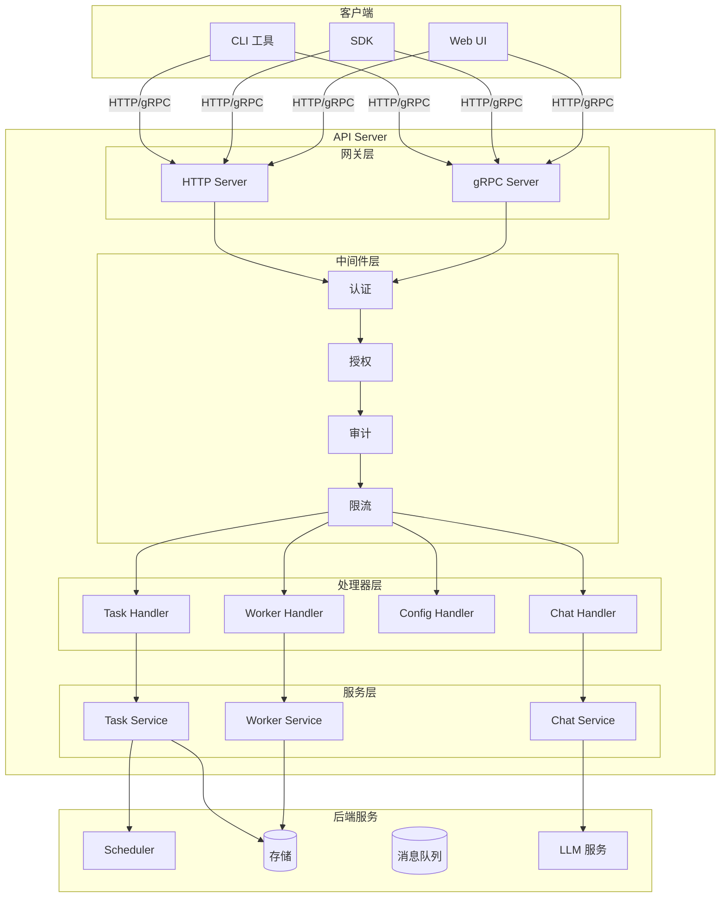
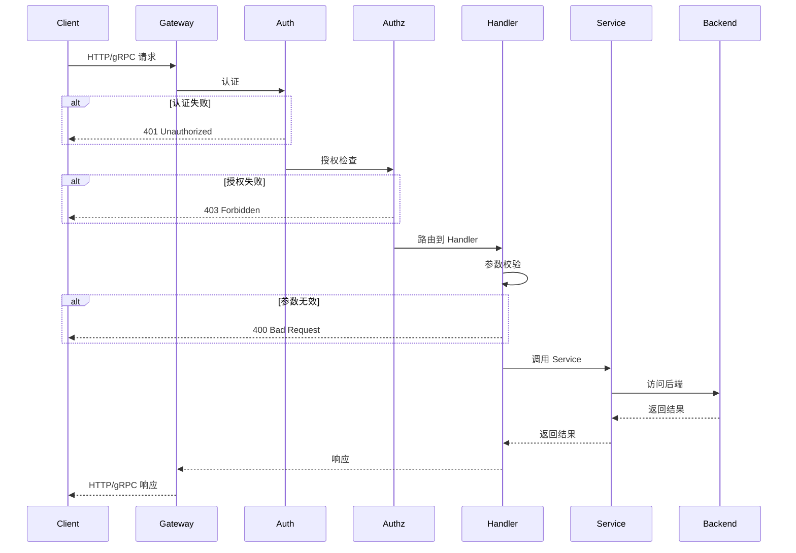
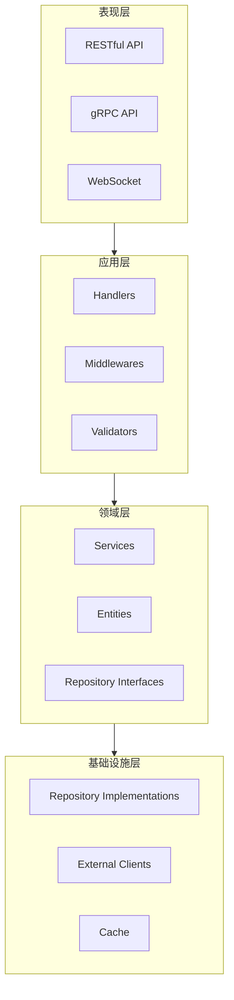
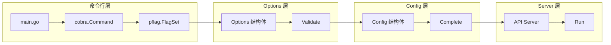

# API Server 设计与实现文档

## 1. 概述

API Server 是 Sentinel-X 分布式智能运维系统的核心入口组件，提供 RESTful API 和 gRPC 接口，负责接收用户请求、任务管理、认证授权和与其他组件的交互。其设计参考了 [Kubernetes API Server](https://kubernetes.io/docs/reference/command-line-tools-reference/kube-apiserver/) 的架构模式。

### 1.1 设计目标

| 目标 | 描述 |
|------|------|
| **统一入口** | 提供系统的统一 API 入口，支持 RESTful 和 gRPC |
| **高可用** | 支持多实例部署，无状态设计 |
| **安全性** | 完整的认证、授权和审计能力 |
| **可扩展** | 支持 API 版本管理和扩展 |
| **可观测** | 完整的日志、追踪和指标支持 |

### 1.2 核心职责

| 职责 | 描述 |
|------|------|
| **请求处理** | 接收和处理用户的 HTTP/gRPC 请求 |
| **认证授权** | 验证用户身份和权限 |
| **任务管理** | 创建、查询、取消任务 |
| **资源管理** | 管理 Worker、配置等资源 |
| **事件通知** | 提供 Webhook 和事件订阅能力 |

## 2. 系统架构

### 2.1 整体架构



### 2.2 请求处理流程



### 2.3 分层架构



## 3. 目录结构

参考 Kubernetes API Server 的组织方式：

```text
cmd/api/
├── main.go                         # 程序入口 (cobra command)
├── app/
│   ├── server.go                   # 服务器启动逻辑
│   └── options/
│       ├── options.go              # 命令行参数定义
│       ├── validation.go           # 参数校验
│       └── config.go               # Config 定义和 Options.Config()

internal/api/
├── server/
│   ├── server.go                   # HTTP/gRPC 服务器
│   ├── config.go                   # 服务器配置
│   └── routes.go                   # 路由注册
├── handler/
│   ├── handler.go                  # Handler 基础接口
│   ├── task/
│   │   ├── handler.go              # Task Handler
│   │   ├── create.go               # 创建任务
│   │   ├── get.go                  # 获取任务
│   │   ├── list.go                 # 列出任务
│   │   ├── cancel.go               # 取消任务
│   │   └── watch.go                # 监听任务
│   ├── worker/
│   │   ├── handler.go              # Worker Handler
│   │   ├── register.go             # 注册 Worker
│   │   ├── heartbeat.go            # 心跳
│   │   └── list.go                 # 列出 Workers
│   ├── chat/
│   │   ├── handler.go              # Chat Handler
│   │   ├── complete.go             # 对话补全
│   │   └── stream.go               # 流式对话
│   └── health/
│       └── handler.go              # 健康检查
├── middleware/
│   ├── auth/
│   │   ├── auth.go                 # 认证中间件
│   │   ├── jwt.go                  # JWT 认证
│   │   └── apikey.go               # API Key 认证
│   ├── authz/
│   │   ├── authz.go                # 授权中间件
│   │   └── rbac.go                 # RBAC 授权
│   ├── audit/
│   │   └── audit.go                # 审计中间件
│   ├── ratelimit/
│   │   └── ratelimit.go            # 限流中间件
│   ├── logging/
│   │   └── logging.go              # 日志中间件
│   ├── recovery/
│   │   └── recovery.go             # 恢复中间件
│   └── cors/
│       └── cors.go                 # CORS 中间件
├── service/
│   ├── task/
│   │   ├── service.go              # Task Service 接口
│   │   └── impl.go                 # Task Service 实现
│   ├── worker/
│   │   ├── service.go              # Worker Service 接口
│   │   └── impl.go                 # Worker Service 实现
│   └── chat/
│       ├── service.go              # Chat Service 接口
│       └── impl.go                 # Chat Service 实现
├── repository/
│   ├── task/
│   │   ├── repository.go           # Task Repository 接口
│   │   ├── redis.go                # Redis 实现
│   │   └── memory.go               # 内存实现
│   └── worker/
│       ├── repository.go           # Worker Repository 接口
│       └── redis.go                # Redis 实现
└── metrics/
    └── metrics.go                  # Prometheus 指标

pkg/api/
├── types/
│   └── v1/
│       ├── types.go                # API 类型定义
│       ├── task.go                 # Task 相关类型
│       ├── worker.go               # Worker 相关类型
│       ├── chat.go                 # Chat 相关类型
│       └── error.go                # 错误类型
├── client/
│   ├── client.go                   # API 客户端
│   ├── task.go                     # Task 客户端
│   ├── worker.go                   # Worker 客户端
│   └── chat.go                     # Chat 客户端
└── openapi/
    └── v1/
        └── openapi.yaml            # OpenAPI 3.0 规范
```

## 4. Options 与 Config 设计

### 4.1 设计流程



### 4.2 Options 定义

```go
// cmd/api/app/options/options.go
package options

import (
    "time"

    "github.com/spf13/pflag"
    "k8s.io/component-base/logs"
)

// Options 包含所有 API Server 的命令行参数
type Options struct {
    // HTTP 服务配置
    HTTP *HTTPOptions

    // gRPC 服务配置
    GRPC *GRPCOptions

    // 认证配置
    Authentication *AuthenticationOptions

    // 授权配置
    Authorization *AuthorizationOptions

    // 审计配置
    Audit *AuditOptions

    // 存储配置
    Storage *StorageOptions

    // Scheduler 客户端配置
    Scheduler *SchedulerClientOptions

    // LLM 配置
    LLM *LLMOptions

    // 日志配置
    Logs *logs.Options

    // 指标配置
    Metrics *MetricsOptions
}

// HTTPOptions HTTP 服务配置
type HTTPOptions struct {
    // BindAddress 绑定地址
    BindAddress string
    // BindPort 绑定端口
    BindPort int
    // ReadTimeout 读取超时
    ReadTimeout time.Duration
    // WriteTimeout 写入超时
    WriteTimeout time.Duration
    // TLS 配置
    TLS *TLSOptions
}

// TLSOptions TLS 配置
type TLSOptions struct {
    // CertFile 证书文件
    CertFile string
    // KeyFile 密钥文件
    KeyFile string
    // CAFile CA 证书文件
    CAFile string
}

// GRPCOptions gRPC 服务配置
type GRPCOptions struct {
    // BindAddress 绑定地址
    BindAddress string
    // BindPort 绑定端口
    BindPort int
    // MaxRecvMsgSize 最大接收消息大小
    MaxRecvMsgSize int
    // MaxSendMsgSize 最大发送消息大小
    MaxSendMsgSize int
}

// AuthenticationOptions 认证配置
type AuthenticationOptions struct {
    // Mode 认证模式: jwt, apikey, oidc
    Mode string
    // JWT 配置
    JWT *JWTOptions
    // APIKey 配置
    APIKey *APIKeyOptions
}

// JWTOptions JWT 配置
type JWTOptions struct {
    // Secret JWT 密钥
    Secret string
    // Issuer 签发者
    Issuer string
    // Expiration 过期时间
    Expiration time.Duration
}

// APIKeyOptions API Key 配置
type APIKeyOptions struct {
    // Header API Key 头名称
    Header string
    // QueryParam API Key 查询参数名称
    QueryParam string
}

// AuthorizationOptions 授权配置
type AuthorizationOptions struct {
    // Mode 授权模式: rbac, abac, webhook
    Mode string
    // RBAC 配置
    RBAC *RBACOptions
}

// RBACOptions RBAC 配置
type RBACOptions struct {
    // PolicyFile 策略文件路径
    PolicyFile string
}

// AuditOptions 审计配置
type AuditOptions struct {
    // Enabled 是否启用审计
    Enabled bool
    // LogPath 审计日志路径
    LogPath string
    // MaxAge 最大保留天数
    MaxAge int
    // MaxBackups 最大备份数
    MaxBackups int
}

// StorageOptions 存储配置
type StorageOptions struct {
    // Type 存储类型: redis, etcd, memory
    Type string
    // Redis 配置
    Redis *RedisOptions
}

// RedisOptions Redis 配置
type RedisOptions struct {
    // Addr 地址
    Addr string
    // Password 密码
    Password string
    // DB 数据库
    DB int
    // PoolSize 连接池大小
    PoolSize int
}

// SchedulerClientOptions Scheduler 客户端配置
type SchedulerClientOptions struct {
    // Addr Scheduler gRPC 地址
    Addr string
    // Timeout 超时时间
    Timeout time.Duration
}

// LLMOptions LLM 配置
type LLMOptions struct {
    // DefaultProvider 默认提供商
    DefaultProvider string
    // Kimi 配置
    Kimi *KimiOptions
    // OpenAI 配置
    OpenAI *OpenAIOptions
}

// KimiOptions Kimi 配置
type KimiOptions struct {
    // APIKey API 密钥
    APIKey string
    // Model 模型
    Model string
    // BaseURL 基础 URL
    BaseURL string
}

// OpenAIOptions OpenAI 配置
type OpenAIOptions struct {
    // APIKey API 密钥
    APIKey string
    // Model 模型
    Model string
    // BaseURL 基础 URL
    BaseURL string
}

// MetricsOptions 指标配置
type MetricsOptions struct {
    // Enabled 是否启用
    Enabled bool
    // BindAddress 绑定地址
    BindAddress string
}

// NewOptions 创建默认 Options
func NewOptions() *Options {
    return &Options{
        HTTP: &HTTPOptions{
            BindAddress:  "0.0.0.0",
            BindPort:     8080,
            ReadTimeout:  30 * time.Second,
            WriteTimeout: 30 * time.Second,
        },
        GRPC: &GRPCOptions{
            BindAddress:    "0.0.0.0",
            BindPort:       9090,
            MaxRecvMsgSize: 16 * 1024 * 1024, // 16MB
            MaxSendMsgSize: 16 * 1024 * 1024,
        },
        Authentication: &AuthenticationOptions{
            Mode: "jwt",
            JWT: &JWTOptions{
                Issuer:     "sentinel-x",
                Expiration: 24 * time.Hour,
            },
            APIKey: &APIKeyOptions{
                Header:     "X-API-Key",
                QueryParam: "api_key",
            },
        },
        Authorization: &AuthorizationOptions{
            Mode: "rbac",
        },
        Audit: &AuditOptions{
            Enabled:    true,
            MaxAge:     30,
            MaxBackups: 10,
        },
        Storage: &StorageOptions{
            Type: "redis",
            Redis: &RedisOptions{
                Addr:     "localhost:6379",
                DB:       0,
                PoolSize: 10,
            },
        },
        Scheduler: &SchedulerClientOptions{
            Addr:    "localhost:50051",
            Timeout: 30 * time.Second,
        },
        LLM: &LLMOptions{
            DefaultProvider: "kimi",
            Kimi: &KimiOptions{
                Model: "moonshot-v1-8k",
            },
            OpenAI: &OpenAIOptions{
                Model: "gpt-4",
            },
        },
        Metrics: &MetricsOptions{
            Enabled:     true,
            BindAddress: "0.0.0.0:9091",
        },
        Logs: logs.NewOptions(),
    }
}

// Flags 返回命令行标志集
func (o *Options) Flags() *pflag.FlagSet {
    fs := pflag.NewFlagSet("api-server", pflag.ContinueOnError)

    // HTTP 配置
    fs.StringVar(&o.HTTP.BindAddress, "http-bind-address", o.HTTP.BindAddress,
        "The IP address on which to listen for HTTP requests.")
    fs.IntVar(&o.HTTP.BindPort, "http-port", o.HTTP.BindPort,
        "The port on which to serve HTTP requests.")
    fs.DurationVar(&o.HTTP.ReadTimeout, "http-read-timeout", o.HTTP.ReadTimeout,
        "HTTP read timeout.")
    fs.DurationVar(&o.HTTP.WriteTimeout, "http-write-timeout", o.HTTP.WriteTimeout,
        "HTTP write timeout.")

    // gRPC 配置
    fs.StringVar(&o.GRPC.BindAddress, "grpc-bind-address", o.GRPC.BindAddress,
        "The IP address on which to listen for gRPC requests.")
    fs.IntVar(&o.GRPC.BindPort, "grpc-port", o.GRPC.BindPort,
        "The port on which to serve gRPC requests.")

    // 认证配置
    fs.StringVar(&o.Authentication.Mode, "auth-mode", o.Authentication.Mode,
        "Authentication mode (jwt, apikey, oidc).")
    fs.StringVar(&o.Authentication.JWT.Secret, "jwt-secret", o.Authentication.JWT.Secret,
        "JWT signing secret.")
    fs.DurationVar(&o.Authentication.JWT.Expiration, "jwt-expiration", o.Authentication.JWT.Expiration,
        "JWT token expiration duration.")

    // 存储配置
    fs.StringVar(&o.Storage.Type, "storage-type", o.Storage.Type,
        "Storage type (redis, etcd, memory).")
    fs.StringVar(&o.Storage.Redis.Addr, "redis-addr", o.Storage.Redis.Addr,
        "Redis server address.")
    fs.StringVar(&o.Storage.Redis.Password, "redis-password", o.Storage.Redis.Password,
        "Redis password.")

    // Scheduler 配置
    fs.StringVar(&o.Scheduler.Addr, "scheduler-addr", o.Scheduler.Addr,
        "Scheduler gRPC address.")

    // LLM 配置
    fs.StringVar(&o.LLM.DefaultProvider, "llm-provider", o.LLM.DefaultProvider,
        "Default LLM provider (kimi, openai).")
    fs.StringVar(&o.LLM.Kimi.APIKey, "kimi-api-key", o.LLM.Kimi.APIKey,
        "Kimi API key.")
    fs.StringVar(&o.LLM.OpenAI.APIKey, "openai-api-key", o.LLM.OpenAI.APIKey,
        "OpenAI API key.")

    // 指标配置
    fs.BoolVar(&o.Metrics.Enabled, "enable-metrics", o.Metrics.Enabled,
        "Enable metrics endpoint.")
    fs.StringVar(&o.Metrics.BindAddress, "metrics-bind-address", o.Metrics.BindAddress,
        "Metrics bind address.")

    // 日志
    o.Logs.AddFlags(fs)

    return fs
}
```

### 4.3 Options 校验

```go
// cmd/api/app/options/validation.go
package options

import (
    "fmt"
    "net"

    "k8s.io/apimachinery/pkg/util/validation/field"
)

// Validate 校验 Options
func (o *Options) Validate() []error {
    var errs []error

    errs = append(errs, o.validateHTTP()...)
    errs = append(errs, o.validateGRPC()...)
    errs = append(errs, o.validateAuthentication()...)
    errs = append(errs, o.validateStorage()...)
    errs = append(errs, o.validateLLM()...)

    return errs
}

func (o *Options) validateHTTP() []error {
    var errs []error
    fldPath := field.NewPath("http")

    if o.HTTP.BindPort < 0 || o.HTTP.BindPort > 65535 {
        errs = append(errs, field.Invalid(fldPath.Child("bindPort"),
            o.HTTP.BindPort, "must be between 0 and 65535"))
    }

    if o.HTTP.BindAddress != "" {
        if ip := net.ParseIP(o.HTTP.BindAddress); ip == nil {
            errs = append(errs, field.Invalid(fldPath.Child("bindAddress"),
                o.HTTP.BindAddress, "must be a valid IP address"))
        }
    }

    return errs
}

func (o *Options) validateGRPC() []error {
    var errs []error
    fldPath := field.NewPath("grpc")

    if o.GRPC.BindPort < 0 || o.GRPC.BindPort > 65535 {
        errs = append(errs, field.Invalid(fldPath.Child("bindPort"),
            o.GRPC.BindPort, "must be between 0 and 65535"))
    }

    return errs
}

func (o *Options) validateAuthentication() []error {
    var errs []error
    fldPath := field.NewPath("authentication")

    validModes := map[string]bool{"jwt": true, "apikey": true, "oidc": true}
    if !validModes[o.Authentication.Mode] {
        errs = append(errs, field.NotSupported(fldPath.Child("mode"),
            o.Authentication.Mode, []string{"jwt", "apikey", "oidc"}))
    }

    if o.Authentication.Mode == "jwt" && o.Authentication.JWT.Secret == "" {
        errs = append(errs, field.Required(fldPath.Child("jwt", "secret"),
            "JWT secret is required when auth mode is jwt"))
    }

    return errs
}

func (o *Options) validateStorage() []error {
    var errs []error
    fldPath := field.NewPath("storage")

    validTypes := map[string]bool{"redis": true, "etcd": true, "memory": true}
    if !validTypes[o.Storage.Type] {
        errs = append(errs, field.NotSupported(fldPath.Child("type"),
            o.Storage.Type, []string{"redis", "etcd", "memory"}))
    }

    if o.Storage.Type == "redis" && o.Storage.Redis.Addr == "" {
        errs = append(errs, field.Required(fldPath.Child("redis", "addr"),
            "Redis address is required when storage type is redis"))
    }

    return errs
}

func (o *Options) validateLLM() []error {
    var errs []error
    fldPath := field.NewPath("llm")

    validProviders := map[string]bool{"kimi": true, "openai": true, "claude": true}
    if !validProviders[o.LLM.DefaultProvider] {
        errs = append(errs, field.NotSupported(fldPath.Child("defaultProvider"),
            o.LLM.DefaultProvider, []string{"kimi", "openai", "claude"}))
    }

    return errs
}
```

### 4.4 Config 构建

```go
// cmd/api/app/options/config.go
package options

import (
    "fmt"

    "github.com/kart-io/logger"
    "github.com/redis/go-redis/v9"
)

// Config 包含运行 API Server 所需的所有配置
type Config struct {
    // HTTP 服务配置
    HTTP *HTTPConfig

    // gRPC 服务配置
    GRPC *GRPCConfig

    // 认证配置
    Authentication *AuthenticationConfig

    // 授权配置
    Authorization *AuthorizationConfig

    // 审计配置
    Audit *AuditConfig

    // 存储客户端
    Storage StorageClient

    // Scheduler 客户端
    SchedulerClient SchedulerClient

    // LLM 客户端
    LLMClient LLMClient

    // 日志器
    Logger logger.Logger
}

// HTTPConfig HTTP 服务配置
type HTTPConfig struct {
    BindAddress  string
    BindPort     int
    ReadTimeout  time.Duration
    WriteTimeout time.Duration
    TLSConfig    *tls.Config
}

// GRPCConfig gRPC 服务配置
type GRPCConfig struct {
    BindAddress    string
    BindPort       int
    MaxRecvMsgSize int
    MaxSendMsgSize int
}

// AuthenticationConfig 认证配置
type AuthenticationConfig struct {
    Mode      string
    JWTSecret string
    JWTIssuer string
}

// AuthorizationConfig 授权配置
type AuthorizationConfig struct {
    Mode       string
    PolicyFile string
}

// AuditConfig 审计配置
type AuditConfig struct {
    Enabled    bool
    LogPath    string
    MaxAge     int
    MaxBackups int
}

// CompletedConfig 已完成的配置（不可变）
type CompletedConfig struct {
    *Config
}

// Complete 完成配置，填充默认值
func (c *Config) Complete() CompletedConfig {
    return CompletedConfig{c}
}

// Config 从 Options 创建 Config
func (o *Options) Config() (*Config, error) {
    // 1. 校验 Options
    if errs := o.Validate(); len(errs) > 0 {
        return nil, fmt.Errorf("invalid options: %v", errs)
    }

    // 2. 创建日志器
    log := logger.New(
        logger.WithLevel("info"),
        logger.WithFormat("json"),
    )

    // 3. 创建存储客户端
    storageClient, err := o.createStorageClient()
    if err != nil {
        return nil, fmt.Errorf("failed to create storage client: %w", err)
    }

    // 4. 创建 Scheduler 客户端
    schedulerClient, err := o.createSchedulerClient()
    if err != nil {
        return nil, fmt.Errorf("failed to create scheduler client: %w", err)
    }

    // 5. 创建 LLM 客户端
    llmClient, err := o.createLLMClient()
    if err != nil {
        return nil, fmt.Errorf("failed to create LLM client: %w", err)
    }

    // 6. 构建 Config
    cfg := &Config{
        HTTP: &HTTPConfig{
            BindAddress:  o.HTTP.BindAddress,
            BindPort:     o.HTTP.BindPort,
            ReadTimeout:  o.HTTP.ReadTimeout,
            WriteTimeout: o.HTTP.WriteTimeout,
        },
        GRPC: &GRPCConfig{
            BindAddress:    o.GRPC.BindAddress,
            BindPort:       o.GRPC.BindPort,
            MaxRecvMsgSize: o.GRPC.MaxRecvMsgSize,
            MaxSendMsgSize: o.GRPC.MaxSendMsgSize,
        },
        Authentication: &AuthenticationConfig{
            Mode:      o.Authentication.Mode,
            JWTSecret: o.Authentication.JWT.Secret,
            JWTIssuer: o.Authentication.JWT.Issuer,
        },
        Authorization: &AuthorizationConfig{
            Mode:       o.Authorization.Mode,
            PolicyFile: o.Authorization.RBAC.PolicyFile,
        },
        Audit: &AuditConfig{
            Enabled:    o.Audit.Enabled,
            LogPath:    o.Audit.LogPath,
            MaxAge:     o.Audit.MaxAge,
            MaxBackups: o.Audit.MaxBackups,
        },
        Storage:         storageClient,
        SchedulerClient: schedulerClient,
        LLMClient:       llmClient,
        Logger:          log,
    }

    return cfg, nil
}

// createStorageClient 创建存储客户端
func (o *Options) createStorageClient() (StorageClient, error) {
    switch o.Storage.Type {
    case "redis":
        client := redis.NewClient(&redis.Options{
            Addr:     o.Storage.Redis.Addr,
            Password: o.Storage.Redis.Password,
            DB:       o.Storage.Redis.DB,
            PoolSize: o.Storage.Redis.PoolSize,
        })
        return &RedisStorageClient{client: client}, nil
    case "memory":
        return NewMemoryStorageClient(), nil
    default:
        return nil, fmt.Errorf("unsupported storage type: %s", o.Storage.Type)
    }
}

// createSchedulerClient 创建 Scheduler 客户端
func (o *Options) createSchedulerClient() (SchedulerClient, error) {
    conn, err := grpc.Dial(o.Scheduler.Addr,
        grpc.WithTransportCredentials(insecure.NewCredentials()),
        grpc.WithDefaultCallOptions(
            grpc.MaxCallRecvMsgSize(16*1024*1024),
            grpc.MaxCallSendMsgSize(16*1024*1024),
        ),
    )
    if err != nil {
        return nil, err
    }

    return &schedulerClient{
        conn:    conn,
        timeout: o.Scheduler.Timeout,
    }, nil
}

// createLLMClient 创建 LLM 客户端
func (o *Options) createLLMClient() (LLMClient, error) {
    switch o.LLM.DefaultProvider {
    case "kimi":
        return NewKimiClient(o.LLM.Kimi.APIKey, o.LLM.Kimi.Model)
    case "openai":
        return NewOpenAIClient(o.LLM.OpenAI.APIKey, o.LLM.OpenAI.Model)
    default:
        return nil, fmt.Errorf("unsupported LLM provider: %s", o.LLM.DefaultProvider)
    }
}
```

### 4.5 Server 启动

```go
// cmd/api/app/server.go
package app

import (
    "context"
    "fmt"
    "net"
    "net/http"
    "os/signal"
    "syscall"

    "github.com/gin-gonic/gin"
    "github.com/spf13/cobra"
    "github.com/spf13/pflag"
    "google.golang.org/grpc"
    "github.com/kart/sentinel-x/cmd/api/app/options"
    "github.com/kart/sentinel-x/internal/api/handler"
    "github.com/kart/sentinel-x/internal/api/middleware"
    "github.com/kart/sentinel-x/internal/api/service"
)

// NewAPIServerCommand 创建 API Server 命令
func NewAPIServerCommand() *cobra.Command {
    opts := options.NewOptions()

    cmd := &cobra.Command{
        Use:   "sentinel-api",
        Short: "Sentinel-X API Server",
        Long: `The Sentinel-X API Server provides RESTful and gRPC APIs
for managing tasks, workers, and intelligent operations.`,
        RunE: func(cmd *cobra.Command, args []string) error {
            return runCommand(cmd, opts)
        },
    }

    // 添加命令行标志
    fs := cmd.Flags()
    opts.Flags().VisitAll(func(f *pflag.Flag) {
        fs.AddFlag(f)
    })

    return cmd
}

// runCommand 运行 API Server
func runCommand(cmd *cobra.Command, opts *options.Options) error {
    // 1. 创建 Config
    cfg, err := opts.Config()
    if err != nil {
        return fmt.Errorf("failed to create config: %w", err)
    }

    // 2. 完成配置
    cc := cfg.Complete()

    // 3. 运行服务器
    return Run(cmd.Context(), cc)
}

// Run 运行 API Server
func Run(ctx context.Context, cc options.CompletedConfig) error {
    log := cc.Logger

    log.Info("Starting Sentinel-X API Server")

    // 1. 设置信号处理
    ctx, cancel := signal.NotifyContext(ctx, syscall.SIGINT, syscall.SIGTERM)
    defer cancel()

    // 2. 创建服务
    taskService := service.NewTaskService(cc.Storage, cc.SchedulerClient, log)
    workerService := service.NewWorkerService(cc.Storage, log)
    chatService := service.NewChatService(cc.LLMClient, log)

    // 3. 创建 HTTP 服务器
    httpServer, err := createHTTPServer(cc, taskService, workerService, chatService)
    if err != nil {
        return fmt.Errorf("failed to create HTTP server: %w", err)
    }

    // 4. 创建 gRPC 服务器
    grpcServer, err := createGRPCServer(cc, taskService, workerService, chatService)
    if err != nil {
        return fmt.Errorf("failed to create gRPC server: %w", err)
    }

    // 5. 启动服务器
    errCh := make(chan error, 2)

    // 启动 HTTP 服务器
    go func() {
        addr := fmt.Sprintf("%s:%d", cc.HTTP.BindAddress, cc.HTTP.BindPort)
        log.Info("HTTP server listening", logger.String("addr", addr))
        if err := httpServer.ListenAndServe(); err != nil && err != http.ErrServerClosed {
            errCh <- fmt.Errorf("HTTP server error: %w", err)
        }
    }()

    // 启动 gRPC 服务器
    go func() {
        addr := fmt.Sprintf("%s:%d", cc.GRPC.BindAddress, cc.GRPC.BindPort)
        lis, err := net.Listen("tcp", addr)
        if err != nil {
            errCh <- fmt.Errorf("gRPC listen error: %w", err)
            return
        }
        log.Info("gRPC server listening", logger.String("addr", addr))
        if err := grpcServer.Serve(lis); err != nil {
            errCh <- fmt.Errorf("gRPC server error: %w", err)
        }
    }()

    // 6. 等待退出信号
    select {
    case <-ctx.Done():
        log.Info("Shutting down servers...")
    case err := <-errCh:
        log.Error("Server error", logger.Error(err))
        cancel()
    }

    // 7. 优雅关闭
    shutdownCtx, shutdownCancel := context.WithTimeout(context.Background(), 30*time.Second)
    defer shutdownCancel()

    if err := httpServer.Shutdown(shutdownCtx); err != nil {
        log.Error("HTTP server shutdown error", logger.Error(err))
    }

    grpcServer.GracefulStop()

    log.Info("Servers stopped")
    return nil
}

// createHTTPServer 创建 HTTP 服务器
func createHTTPServer(
    cc options.CompletedConfig,
    taskService service.TaskService,
    workerService service.WorkerService,
    chatService service.ChatService,
) (*http.Server, error) {
    // 创建 Gin 引擎
    gin.SetMode(gin.ReleaseMode)
    router := gin.New()

    // 添加中间件
    router.Use(middleware.Recovery(cc.Logger))
    router.Use(middleware.Logging(cc.Logger))
    router.Use(middleware.CORS())

    // API v1 路由组
    v1 := router.Group("/api/v1")
    {
        // 认证中间件
        v1.Use(middleware.Auth(cc.Authentication))

        // Task 路由
        taskHandler := handler.NewTaskHandler(taskService, cc.Logger)
        tasks := v1.Group("/tasks")
        {
            tasks.POST("", taskHandler.Create)
            tasks.GET("", taskHandler.List)
            tasks.GET("/:id", taskHandler.Get)
            tasks.DELETE("/:id", taskHandler.Cancel)
            tasks.GET("/:id/logs", taskHandler.GetLogs)
        }

        // Worker 路由
        workerHandler := handler.NewWorkerHandler(workerService, cc.Logger)
        workers := v1.Group("/workers")
        {
            workers.POST("/register", workerHandler.Register)
            workers.POST("/heartbeat", workerHandler.Heartbeat)
            workers.GET("", workerHandler.List)
            workers.GET("/:id", workerHandler.Get)
        }

        // Chat 路由
        chatHandler := handler.NewChatHandler(chatService, cc.Logger)
        chat := v1.Group("/chat")
        {
            chat.POST("/completions", chatHandler.Complete)
            chat.POST("/completions/stream", chatHandler.Stream)
        }
    }

    // 健康检查路由
    router.GET("/healthz", handler.Healthz)
    router.GET("/readyz", handler.Readyz)

    // 指标路由
    router.GET("/metrics", gin.WrapH(promhttp.Handler()))

    return &http.Server{
        Addr:         fmt.Sprintf("%s:%d", cc.HTTP.BindAddress, cc.HTTP.BindPort),
        Handler:      router,
        ReadTimeout:  cc.HTTP.ReadTimeout,
        WriteTimeout: cc.HTTP.WriteTimeout,
    }, nil
}

// createGRPCServer 创建 gRPC 服务器
func createGRPCServer(
    cc options.CompletedConfig,
    taskService service.TaskService,
    workerService service.WorkerService,
    chatService service.ChatService,
) (*grpc.Server, error) {
    // gRPC 服务器选项
    opts := []grpc.ServerOption{
        grpc.MaxRecvMsgSize(cc.GRPC.MaxRecvMsgSize),
        grpc.MaxSendMsgSize(cc.GRPC.MaxSendMsgSize),
        grpc.ChainUnaryInterceptor(
            middleware.GRPCLogging(cc.Logger),
            middleware.GRPCRecovery(cc.Logger),
            middleware.GRPCAuth(cc.Authentication),
        ),
        grpc.ChainStreamInterceptor(
            middleware.GRPCStreamLogging(cc.Logger),
            middleware.GRPCStreamRecovery(cc.Logger),
        ),
    }

    server := grpc.NewServer(opts...)

    // 注册服务
    pb.RegisterTaskServiceServer(server, handler.NewTaskGRPCHandler(taskService))
    pb.RegisterWorkerServiceServer(server, handler.NewWorkerGRPCHandler(workerService))
    pb.RegisterChatServiceServer(server, handler.NewChatGRPCHandler(chatService))

    // 注册反射服务 (用于 grpcurl 等工具)
    reflection.Register(server)

    return server, nil
}
```

### 4.6 Main 入口

```go
// cmd/api/main.go
package main

import (
    "os"

    "github.com/kart/sentinel-x/cmd/api/app"
    "k8s.io/component-base/cli"
)

func main() {
    command := app.NewAPIServerCommand()
    code := cli.Run(command)
    os.Exit(code)
}
```

## 5. API 类型定义

### 5.1 Task 类型

```go
// pkg/api/types/v1/task.go
package v1

import (
    "time"
)

// CreateTaskRequest 创建任务请求
type CreateTaskRequest struct {
    // Name 任务名称
    Name string `json:"name" binding:"required"`
    // Type 任务类型
    Type string `json:"type" binding:"required,oneof=Command K8sOps LLMChat Agent Workflow"`
    // Priority 优先级 (0-1000)
    Priority *int32 `json:"priority,omitempty"`
    // Timeout 超时时间（秒）
    Timeout *int64 `json:"timeout,omitempty"`
    // Payload 任务载荷
    Payload TaskPayload `json:"payload" binding:"required"`
    // Labels 标签
    Labels map[string]string `json:"labels,omitempty"`
}

// TaskPayload 任务载荷
type TaskPayload struct {
    Command  *CommandPayload  `json:"command,omitempty"`
    K8sOps   *K8sOpsPayload   `json:"k8sOps,omitempty"`
    LLMChat  *LLMChatPayload  `json:"llmChat,omitempty"`
    Agent    *AgentPayload    `json:"agent,omitempty"`
    Workflow *WorkflowPayload `json:"workflow,omitempty"`
}

// CommandPayload 命令载荷
type CommandPayload struct {
    Command []string          `json:"command" binding:"required"`
    Args    []string          `json:"args,omitempty"`
    Env     map[string]string `json:"env,omitempty"`
    WorkDir string            `json:"workDir,omitempty"`
}

// K8sOpsPayload Kubernetes 操作载荷
type K8sOpsPayload struct {
    Action    string `json:"action" binding:"required,oneof=Apply Delete Scale Restart Rollout"`
    Cluster   string `json:"cluster,omitempty"`
    Namespace string `json:"namespace" binding:"required"`
    Resource  string `json:"resource" binding:"required"`
    Name      string `json:"name" binding:"required"`
    Manifest  string `json:"manifest,omitempty"`
    Replicas  *int32 `json:"replicas,omitempty"`
}

// LLMChatPayload LLM 对话载荷
type LLMChatPayload struct {
    Provider    string    `json:"provider,omitempty"`
    Model       string    `json:"model,omitempty"`
    Messages    []Message `json:"messages" binding:"required,dive"`
    Temperature *float64  `json:"temperature,omitempty"`
    MaxTokens   *int32    `json:"maxTokens,omitempty"`
}

// Message 对话消息
type Message struct {
    Role    string `json:"role" binding:"required,oneof=system user assistant"`
    Content string `json:"content" binding:"required"`
}

// AgentPayload Agent 任务载荷
type AgentPayload struct {
    AgentType     string            `json:"agentType" binding:"required,oneof=ReAct CoT ToT PoT"`
    Goal          string            `json:"goal" binding:"required"`
    Tools         []string          `json:"tools,omitempty"`
    Context       map[string]string `json:"context,omitempty"`
    MaxIterations *int32            `json:"maxIterations,omitempty"`
}

// WorkflowPayload 工作流载荷
type WorkflowPayload struct {
    Steps     []WorkflowStep `json:"steps" binding:"required,dive"`
    OnFailure string         `json:"onFailure,omitempty"`
}

// WorkflowStep 工作流步骤
type WorkflowStep struct {
    Name      string      `json:"name" binding:"required"`
    Type      string      `json:"type" binding:"required"`
    Payload   TaskPayload `json:"payload" binding:"required"`
    DependsOn []string    `json:"dependsOn,omitempty"`
}

// TaskResponse 任务响应
type TaskResponse struct {
    ID             string            `json:"id"`
    Name           string            `json:"name"`
    Type           string            `json:"type"`
    Status         string            `json:"status"`
    Priority       int32             `json:"priority"`
    WorkerName     string            `json:"workerName,omitempty"`
    Result         *TaskResult       `json:"result,omitempty"`
    CreatedAt      time.Time         `json:"createdAt"`
    StartedAt      *time.Time        `json:"startedAt,omitempty"`
    CompletedAt    *time.Time        `json:"completedAt,omitempty"`
    Labels         map[string]string `json:"labels,omitempty"`
}

// TaskResult 任务结果
type TaskResult struct {
    Success  bool              `json:"success"`
    Output   string            `json:"output,omitempty"`
    Error    string            `json:"error,omitempty"`
    ExitCode *int32            `json:"exitCode,omitempty"`
    Metadata map[string]string `json:"metadata,omitempty"`
}

// ListTasksRequest 列出任务请求
type ListTasksRequest struct {
    Status   string            `form:"status"`
    Type     string            `form:"type"`
    Labels   map[string]string `form:"labels"`
    Limit    int               `form:"limit,default=20"`
    Offset   int               `form:"offset,default=0"`
    OrderBy  string            `form:"orderBy,default=createdAt"`
    OrderDir string            `form:"orderDir,default=desc"`
}

// ListTasksResponse 列出任务响应
type ListTasksResponse struct {
    Tasks      []TaskResponse `json:"tasks"`
    Total      int64          `json:"total"`
    HasMore    bool           `json:"hasMore"`
}
```

### 5.2 Chat 类型

```go
// pkg/api/types/v1/chat.go
package v1

// ChatCompletionRequest 对话补全请求
type ChatCompletionRequest struct {
    // Provider LLM 提供商
    Provider string `json:"provider,omitempty"`
    // Model 模型名称
    Model string `json:"model,omitempty"`
    // Messages 消息列表
    Messages []Message `json:"messages" binding:"required,dive"`
    // Temperature 温度参数
    Temperature *float64 `json:"temperature,omitempty"`
    // MaxTokens 最大 Token 数
    MaxTokens *int32 `json:"maxTokens,omitempty"`
    // Stream 是否流式输出
    Stream bool `json:"stream,omitempty"`
}

// ChatCompletionResponse 对话补全响应
type ChatCompletionResponse struct {
    // ID 响应 ID
    ID string `json:"id"`
    // Object 对象类型
    Object string `json:"object"`
    // Created 创建时间戳
    Created int64 `json:"created"`
    // Model 使用的模型
    Model string `json:"model"`
    // Choices 选项列表
    Choices []ChatChoice `json:"choices"`
    // Usage 使用统计
    Usage *Usage `json:"usage,omitempty"`
}

// ChatChoice 对话选项
type ChatChoice struct {
    // Index 索引
    Index int `json:"index"`
    // Message 消息
    Message Message `json:"message"`
    // FinishReason 结束原因
    FinishReason string `json:"finishReason"`
}

// Usage 使用统计
type Usage struct {
    PromptTokens     int `json:"promptTokens"`
    CompletionTokens int `json:"completionTokens"`
    TotalTokens      int `json:"totalTokens"`
}

// ChatCompletionStreamResponse 流式对话补全响应
type ChatCompletionStreamResponse struct {
    ID      string             `json:"id"`
    Object  string             `json:"object"`
    Created int64              `json:"created"`
    Model   string             `json:"model"`
    Choices []ChatStreamChoice `json:"choices"`
}

// ChatStreamChoice 流式对话选项
type ChatStreamChoice struct {
    Index        int          `json:"index"`
    Delta        MessageDelta `json:"delta"`
    FinishReason string       `json:"finishReason,omitempty"`
}

// MessageDelta 消息增量
type MessageDelta struct {
    Role    string `json:"role,omitempty"`
    Content string `json:"content,omitempty"`
}
```

### 5.3 通用类型

```go
// pkg/api/types/v1/types.go
package v1

// Response 通用响应
type Response struct {
    Code    int         `json:"code"`
    Message string      `json:"message"`
    Data    interface{} `json:"data,omitempty"`
}

// ErrorResponse 错误响应
type ErrorResponse struct {
    Code    int    `json:"code"`
    Message string `json:"message"`
    Details string `json:"details,omitempty"`
}

// PaginationResponse 分页响应
type PaginationResponse struct {
    Total   int64 `json:"total"`
    Limit   int   `json:"limit"`
    Offset  int   `json:"offset"`
    HasMore bool  `json:"hasMore"`
}
```

## 6. Handler 实现

### 6.1 Task Handler

```go
// internal/api/handler/task/handler.go
package task

import (
    "net/http"

    "github.com/gin-gonic/gin"
    "github.com/kart-io/logger"
    "github.com/kart/sentinel-x/internal/api/service"
    typesv1 "github.com/kart/sentinel-x/pkg/api/types/v1"
)

// Handler Task HTTP Handler
type Handler struct {
    service service.TaskService
    logger  logger.Logger
}

// NewHandler 创建 Task Handler
func NewHandler(svc service.TaskService, log logger.Logger) *Handler {
    return &Handler{
        service: svc,
        logger:  log,
    }
}

// Create 创建任务
// @Summary 创建任务
// @Description 创建一个新的运维任务
// @Tags tasks
// @Accept json
// @Produce json
// @Param request body typesv1.CreateTaskRequest true "创建任务请求"
// @Success 201 {object} typesv1.Response{data=typesv1.TaskResponse}
// @Failure 400 {object} typesv1.ErrorResponse
// @Failure 500 {object} typesv1.ErrorResponse
// @Router /api/v1/tasks [post]
func (h *Handler) Create(c *gin.Context) {
    var req typesv1.CreateTaskRequest
    if err := c.ShouldBindJSON(&req); err != nil {
        c.JSON(http.StatusBadRequest, typesv1.ErrorResponse{
            Code:    400,
            Message: "Invalid request",
            Details: err.Error(),
        })
        return
    }

    task, err := h.service.Create(c.Request.Context(), &req)
    if err != nil {
        h.logger.Error("Failed to create task", logger.Error(err))
        c.JSON(http.StatusInternalServerError, typesv1.ErrorResponse{
            Code:    500,
            Message: "Failed to create task",
            Details: err.Error(),
        })
        return
    }

    c.JSON(http.StatusCreated, typesv1.Response{
        Code:    201,
        Message: "Task created",
        Data:    task,
    })
}

// Get 获取任务
// @Summary 获取任务
// @Description 根据 ID 获取任务详情
// @Tags tasks
// @Accept json
// @Produce json
// @Param id path string true "任务 ID"
// @Success 200 {object} typesv1.Response{data=typesv1.TaskResponse}
// @Failure 404 {object} typesv1.ErrorResponse
// @Router /api/v1/tasks/{id} [get]
func (h *Handler) Get(c *gin.Context) {
    id := c.Param("id")

    task, err := h.service.Get(c.Request.Context(), id)
    if err != nil {
        if err == service.ErrTaskNotFound {
            c.JSON(http.StatusNotFound, typesv1.ErrorResponse{
                Code:    404,
                Message: "Task not found",
            })
            return
        }
        h.logger.Error("Failed to get task", logger.Error(err))
        c.JSON(http.StatusInternalServerError, typesv1.ErrorResponse{
            Code:    500,
            Message: "Failed to get task",
        })
        return
    }

    c.JSON(http.StatusOK, typesv1.Response{
        Code:    200,
        Message: "Success",
        Data:    task,
    })
}

// List 列出任务
// @Summary 列出任务
// @Description 列出所有任务，支持分页和过滤
// @Tags tasks
// @Accept json
// @Produce json
// @Param status query string false "任务状态"
// @Param type query string false "任务类型"
// @Param limit query int false "每页数量" default(20)
// @Param offset query int false "偏移量" default(0)
// @Success 200 {object} typesv1.Response{data=typesv1.ListTasksResponse}
// @Router /api/v1/tasks [get]
func (h *Handler) List(c *gin.Context) {
    var req typesv1.ListTasksRequest
    if err := c.ShouldBindQuery(&req); err != nil {
        c.JSON(http.StatusBadRequest, typesv1.ErrorResponse{
            Code:    400,
            Message: "Invalid request",
            Details: err.Error(),
        })
        return
    }

    resp, err := h.service.List(c.Request.Context(), &req)
    if err != nil {
        h.logger.Error("Failed to list tasks", logger.Error(err))
        c.JSON(http.StatusInternalServerError, typesv1.ErrorResponse{
            Code:    500,
            Message: "Failed to list tasks",
        })
        return
    }

    c.JSON(http.StatusOK, typesv1.Response{
        Code:    200,
        Message: "Success",
        Data:    resp,
    })
}

// Cancel 取消任务
// @Summary 取消任务
// @Description 取消一个正在执行的任务
// @Tags tasks
// @Accept json
// @Produce json
// @Param id path string true "任务 ID"
// @Success 200 {object} typesv1.Response
// @Failure 404 {object} typesv1.ErrorResponse
// @Router /api/v1/tasks/{id} [delete]
func (h *Handler) Cancel(c *gin.Context) {
    id := c.Param("id")

    if err := h.service.Cancel(c.Request.Context(), id); err != nil {
        if err == service.ErrTaskNotFound {
            c.JSON(http.StatusNotFound, typesv1.ErrorResponse{
                Code:    404,
                Message: "Task not found",
            })
            return
        }
        h.logger.Error("Failed to cancel task", logger.Error(err))
        c.JSON(http.StatusInternalServerError, typesv1.ErrorResponse{
            Code:    500,
            Message: "Failed to cancel task",
        })
        return
    }

    c.JSON(http.StatusOK, typesv1.Response{
        Code:    200,
        Message: "Task cancelled",
    })
}
```

### 6.2 Chat Handler

```go
// internal/api/handler/chat/handler.go
package chat

import (
    "bufio"
    "encoding/json"
    "net/http"

    "github.com/gin-gonic/gin"
    "github.com/kart-io/logger"
    "github.com/kart/sentinel-x/internal/api/service"
    typesv1 "github.com/kart/sentinel-x/pkg/api/types/v1"
)

// Handler Chat HTTP Handler
type Handler struct {
    service service.ChatService
    logger  logger.Logger
}

// NewHandler 创建 Chat Handler
func NewHandler(svc service.ChatService, log logger.Logger) *Handler {
    return &Handler{
        service: svc,
        logger:  log,
    }
}

// Complete 对话补全
// @Summary 对话补全
// @Description 调用 LLM 进行对话补全
// @Tags chat
// @Accept json
// @Produce json
// @Param request body typesv1.ChatCompletionRequest true "对话补全请求"
// @Success 200 {object} typesv1.ChatCompletionResponse
// @Failure 400 {object} typesv1.ErrorResponse
// @Router /api/v1/chat/completions [post]
func (h *Handler) Complete(c *gin.Context) {
    var req typesv1.ChatCompletionRequest
    if err := c.ShouldBindJSON(&req); err != nil {
        c.JSON(http.StatusBadRequest, typesv1.ErrorResponse{
            Code:    400,
            Message: "Invalid request",
            Details: err.Error(),
        })
        return
    }

    resp, err := h.service.Complete(c.Request.Context(), &req)
    if err != nil {
        h.logger.Error("Failed to complete chat", logger.Error(err))
        c.JSON(http.StatusInternalServerError, typesv1.ErrorResponse{
            Code:    500,
            Message: "Failed to complete chat",
            Details: err.Error(),
        })
        return
    }

    c.JSON(http.StatusOK, resp)
}

// Stream 流式对话补全
// @Summary 流式对话补全
// @Description 调用 LLM 进行流式对话补全
// @Tags chat
// @Accept json
// @Produce text/event-stream
// @Param request body typesv1.ChatCompletionRequest true "对话补全请求"
// @Success 200 {object} typesv1.ChatCompletionStreamResponse
// @Router /api/v1/chat/completions/stream [post]
func (h *Handler) Stream(c *gin.Context) {
    var req typesv1.ChatCompletionRequest
    if err := c.ShouldBindJSON(&req); err != nil {
        c.JSON(http.StatusBadRequest, typesv1.ErrorResponse{
            Code:    400,
            Message: "Invalid request",
            Details: err.Error(),
        })
        return
    }

    // 设置 SSE 头
    c.Header("Content-Type", "text/event-stream")
    c.Header("Cache-Control", "no-cache")
    c.Header("Connection", "keep-alive")

    // 获取流式响应
    stream, err := h.service.Stream(c.Request.Context(), &req)
    if err != nil {
        h.logger.Error("Failed to start stream", logger.Error(err))
        c.SSEvent("error", err.Error())
        return
    }
    defer stream.Close()

    // 写入流式响应
    c.Stream(func(w io.Writer) bool {
        resp, err := stream.Recv()
        if err != nil {
            if err == io.EOF {
                c.SSEvent("done", "[DONE]")
                return false
            }
            h.logger.Error("Stream error", logger.Error(err))
            return false
        }

        data, _ := json.Marshal(resp)
        c.SSEvent("message", string(data))
        return true
    })
}
```

## 7. 中间件实现

### 7.1 认证中间件

```go
// internal/api/middleware/auth/auth.go
package auth

import (
    "net/http"
    "strings"

    "github.com/gin-gonic/gin"
    "github.com/golang-jwt/jwt/v5"
    "github.com/kart/sentinel-x/cmd/api/app/options"
    typesv1 "github.com/kart/sentinel-x/pkg/api/types/v1"
)

// Middleware 返回认证中间件
func Middleware(cfg *options.AuthenticationConfig) gin.HandlerFunc {
    return func(c *gin.Context) {
        // 跳过健康检查和指标端点
        if c.Request.URL.Path == "/healthz" ||
            c.Request.URL.Path == "/readyz" ||
            c.Request.URL.Path == "/metrics" {
            c.Next()
            return
        }

        switch cfg.Mode {
        case "jwt":
            if err := validateJWT(c, cfg); err != nil {
                c.AbortWithStatusJSON(http.StatusUnauthorized, typesv1.ErrorResponse{
                    Code:    401,
                    Message: "Unauthorized",
                    Details: err.Error(),
                })
                return
            }
        case "apikey":
            if err := validateAPIKey(c, cfg); err != nil {
                c.AbortWithStatusJSON(http.StatusUnauthorized, typesv1.ErrorResponse{
                    Code:    401,
                    Message: "Unauthorized",
                    Details: err.Error(),
                })
                return
            }
        }

        c.Next()
    }
}

func validateJWT(c *gin.Context, cfg *options.AuthenticationConfig) error {
    authHeader := c.GetHeader("Authorization")
    if authHeader == "" {
        return fmt.Errorf("missing authorization header")
    }

    parts := strings.SplitN(authHeader, " ", 2)
    if len(parts) != 2 || parts[0] != "Bearer" {
        return fmt.Errorf("invalid authorization header format")
    }

    tokenString := parts[1]

    token, err := jwt.Parse(tokenString, func(token *jwt.Token) (interface{}, error) {
        if _, ok := token.Method.(*jwt.SigningMethodHMAC); !ok {
            return nil, fmt.Errorf("unexpected signing method")
        }
        return []byte(cfg.JWTSecret), nil
    })

    if err != nil {
        return err
    }

    if claims, ok := token.Claims.(jwt.MapClaims); ok && token.Valid {
        // 将用户信息存入上下文
        c.Set("user_id", claims["sub"])
        c.Set("username", claims["username"])
        return nil
    }

    return fmt.Errorf("invalid token")
}

func validateAPIKey(c *gin.Context, cfg *options.AuthenticationConfig) error {
    apiKey := c.GetHeader("X-API-Key")
    if apiKey == "" {
        apiKey = c.Query("api_key")
    }

    if apiKey == "" {
        return fmt.Errorf("missing API key")
    }

    // TODO: 验证 API Key
    // 可以从数据库或缓存中查询
    if !isValidAPIKey(apiKey) {
        return fmt.Errorf("invalid API key")
    }

    return nil
}
```

### 7.2 限流中间件

```go
// internal/api/middleware/ratelimit/ratelimit.go
package ratelimit

import (
    "net/http"
    "sync"
    "time"

    "github.com/gin-gonic/gin"
    "golang.org/x/time/rate"
    typesv1 "github.com/kart/sentinel-x/pkg/api/types/v1"
)

// Config 限流配置
type Config struct {
    // Rate 每秒请求数
    Rate rate.Limit
    // Burst 突发请求数
    Burst int
}

// Middleware 返回限流中间件
func Middleware(cfg *Config) gin.HandlerFunc {
    limiters := &sync.Map{}

    return func(c *gin.Context) {
        // 获取客户端标识 (IP 或 用户 ID)
        key := c.ClientIP()
        if userID, exists := c.Get("user_id"); exists {
            key = userID.(string)
        }

        // 获取或创建限流器
        limiter, _ := limiters.LoadOrStore(key, rate.NewLimiter(cfg.Rate, cfg.Burst))

        if !limiter.(*rate.Limiter).Allow() {
            c.AbortWithStatusJSON(http.StatusTooManyRequests, typesv1.ErrorResponse{
                Code:    429,
                Message: "Too many requests",
                Details: "Rate limit exceeded",
            })
            return
        }

        c.Next()
    }
}
```

## 8. 配置示例

### 8.1 服务器配置

```yaml
# config/api-server.yaml
http:
  bindAddress: "0.0.0.0"
  bindPort: 8080
  readTimeout: 30s
  writeTimeout: 30s
  tls:
    certFile: /etc/sentinel-x/tls/tls.crt
    keyFile: /etc/sentinel-x/tls/tls.key

grpc:
  bindAddress: "0.0.0.0"
  bindPort: 9090
  maxRecvMsgSize: 16777216
  maxSendMsgSize: 16777216

authentication:
  mode: jwt
  jwt:
    secret: ${JWT_SECRET}
    issuer: sentinel-x
    expiration: 24h

authorization:
  mode: rbac
  rbac:
    policyFile: /etc/sentinel-x/rbac/policy.yaml

audit:
  enabled: true
  logPath: /var/log/sentinel-x/audit.log
  maxAge: 30
  maxBackups: 10

storage:
  type: redis
  redis:
    addr: localhost:6379
    password: ${REDIS_PASSWORD}
    db: 0
    poolSize: 10

scheduler:
  addr: sentinel-scheduler:50051
  timeout: 30s

llm:
  defaultProvider: kimi
  kimi:
    apiKey: ${KIMI_API_KEY}
    model: moonshot-v1-8k
  openai:
    apiKey: ${OPENAI_API_KEY}
    model: gpt-4

metrics:
  enabled: true
  bindAddress: "0.0.0.0:9091"
```

### 8.2 环境变量

```bash
# .env
JWT_SECRET=your-jwt-secret-key
REDIS_PASSWORD=your-redis-password
KIMI_API_KEY=your-kimi-api-key
OPENAI_API_KEY=your-openai-api-key
```

## 9. 监控指标

| 指标 | 类型 | 描述 |
|------|------|------|
| `api_requests_total` | Counter | API 请求总数 |
| `api_request_duration_seconds` | Histogram | 请求延迟分布 |
| `api_requests_in_flight` | Gauge | 正在处理的请求数 |
| `api_response_size_bytes` | Histogram | 响应大小分布 |
| `api_errors_total` | Counter | 错误总数 |
| `grpc_requests_total` | Counter | gRPC 请求总数 |
| `grpc_request_duration_seconds` | Histogram | gRPC 请求延迟 |
| `llm_requests_total` | Counter | LLM 请求总数 |
| `llm_tokens_used_total` | Counter | LLM Token 使用量 |

## 10. 实现路线图

### 阶段一: 核心框架

- [ ] 实现 Options 和 Config
- [ ] 实现 HTTP 服务器骨架
- [ ] 实现基础中间件 (日志、恢复)
- [ ] 实现健康检查端点

### 阶段二: API 实现

- [ ] 实现 Task API (CRUD)
- [ ] 实现 Worker API
- [ ] 实现 Chat API (对话补全)
- [ ] 实现 gRPC 服务

### 阶段三: 安全特性

- [ ] 实现 JWT 认证
- [ ] 实现 API Key 认证
- [ ] 实现 RBAC 授权
- [ ] 实现审计日志

### 阶段四: 生产就绪

- [ ] 完善限流和熔断
- [ ] 添加 OpenAPI 文档
- [ ] 性能优化和压测
- [ ] 文档和示例完善

## 参考资料

- [Kubernetes API Server](https://kubernetes.io/docs/reference/command-line-tools-reference/kube-apiserver/)
- [Gin Web Framework](https://gin-gonic.com/docs/)
- [gRPC Go](https://grpc.io/docs/languages/go/)
- [OpenAPI 3.0 Specification](https://swagger.io/specification/)
