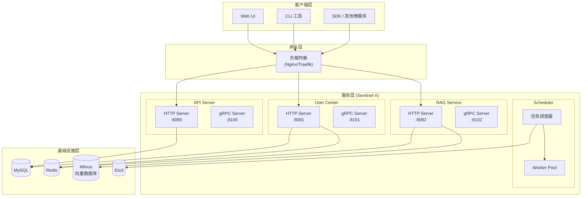
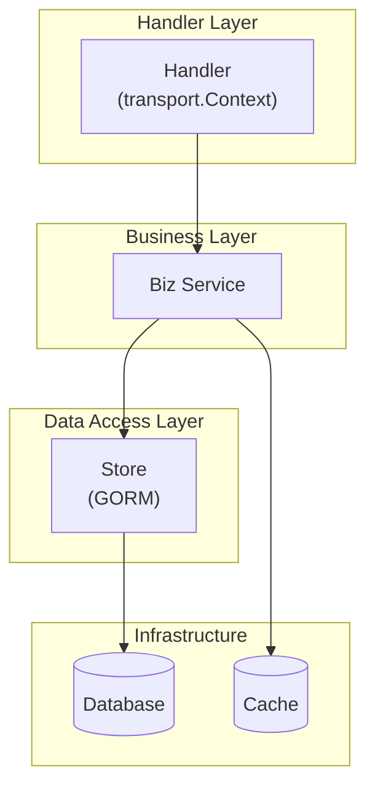
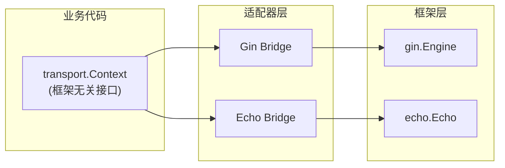
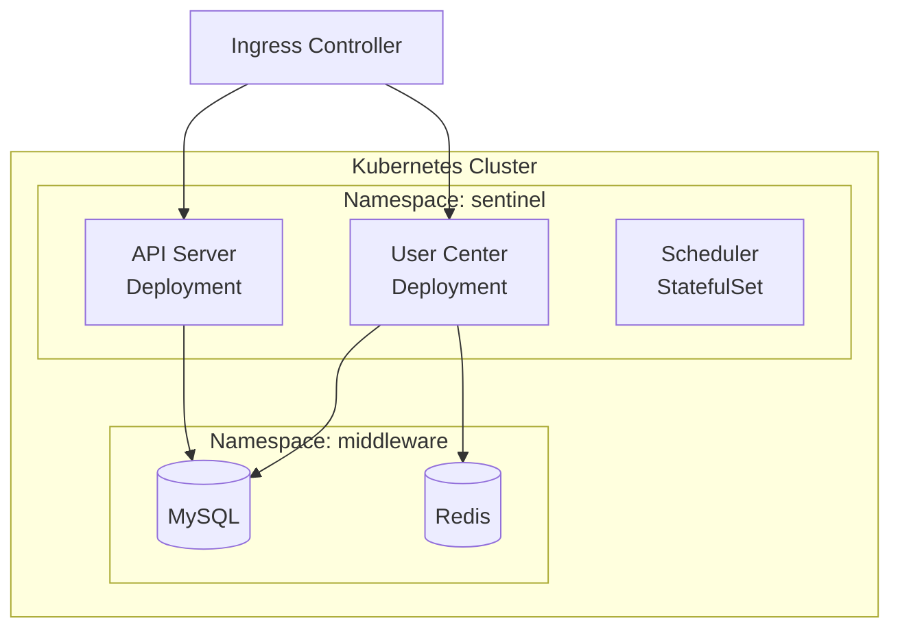

# 系统架构设计

## 概述

Sentinel-X 是一个分布式智能运维系统，旨在提供高可用、可扩展的监控和自动化运维能力。

## 系统架构图



## 核心组件

| 组件 | 职责 | 端口 | 说明 |
|------|------|------|------|
| **API Server** | 提供 RESTful API 接口，处理用户请求 | 8080 (HTTP), 8100 (gRPC) | 通用 API 网关（可选） |
| **User Center** | 用户管理、认证授权 | 8081 (HTTP), 8101 (gRPC) | JWT 认证、RBAC 授权、用户 CRUD |
| **RAG Service** | 知识库索引与问答 | 8082 (HTTP), 8102 (gRPC) | 文档索引、向量检索、LLM 问答 |
| **Scheduler** | 任务调度器，负责分发运维任务 | - | 定时任务、异步任务调度（规划中） |
| **GoAgent** | 核心代理库，封装底层系统交互逻辑 | - | 预留（未实现） |

### 服务职责说明

#### User Center
- **核心功能**：
  - 用户注册、登录、信息管理
  - JWT Token 生成、验证、刷新
  - 基于 Casbin 的 RBAC 权限控制
  - Token 黑名单管理（Redis）

- **数据存储**：
  - MySQL：用户信息、角色、权限
  - Redis：JWT 黑名单、会话缓存

#### RAG Service
- **核心功能**：
  - 文档索引：URL/本地文件 → 文本分块 → Embedding → 向量存储
  - 向量检索：问题 Embedding → 相似度搜索 → Top-K 文档
  - 答案生成：上下文拼接 → LLM 生成 → 返回答案+来源
  - 查询增强：Query Rewrite、HyDE、Rerank（可配置）

- **数据存储**：
  - Milvus：向量索引和检索
  - Redis：查询结果缓存、Embedding 缓存

#### API Server
- **说明**：当前作为通用 API 网关（可选组件）
- **建议**：
  - 方案 1：作为 API Gateway，负责路由转发、统一认证
  - 方案 2：移除此服务，各服务独立暴露接口

## 分层架构



| 层级 | 职责 | 示例 |
|------|------|------|
| **Handler** | 请求解析、参数验证、响应构建 | UserHandler, AuthHandler |
| **Biz** | 业务逻辑编排 | UserService, AuthService |
| **Store** | 数据持久化操作 | UserStore |
| **Infra** | 基础设施（数据库、缓存、消息队列） | MySQL, Redis |

## 技术栈

| 类别 | 技术选型 | 说明 |
|------|----------|------|
| **语言** | Go 1.25.0 | - |
| **Web 框架** | Gin, Echo (适配器模式) | 支持零代码切换 |
| **数据库 ORM** | GORM | - |
| **关系数据库** | MySQL, PostgreSQL | 用户数据、权限管理 |
| **缓存** | Redis | JWT 黑名单、查询缓存 |
| **向量数据库** | Milvus v2.6 | RAG 向量存储和检索 |
| **LLM 提供商** | Ollama, OpenAI, DeepSeek | Embedding 和 Chat |
| **认证** | JWT (RS256/HS256) | Token 认证和刷新 |
| **授权** | Casbin (RBAC) | 基于角色的访问控制 |
| **可观测性** | OpenTelemetry | 日志、追踪、指标 |
| **日志** | github.com/kart-io/logger | 基于 Zap 的结构化日志 |
| **配置** | Viper (YAML) | 支持环境变量覆盖 |
| **并发控制** | ants/v2 | Goroutine 池管理 |

## 目录结构

```
sentinel-x/
├── cmd/                    # 应用程序入口
│   ├── api/                # API Server
│   ├── user-center/        # User Center
│   └── scheduler/          # Scheduler
├── internal/               # 私有应用代码
│   ├── api/                # API Server 业务
│   ├── user-center/        # User Center 业务
│   │   ├── handler/        # 请求处理
│   │   ├── biz/            # 业务逻辑
│   │   ├── store/          # 数据访问
│   │   └── router/         # 路由注册
│   └── model/              # 数据模型
├── pkg/                    # 公共库代码
│   ├── infra/              # 基础设施
│   │   ├── adapter/        # HTTP 框架适配器
│   │   ├── middleware/     # 中间件
│   │   ├── server/         # 服务器抽象
│   │   └── pool/           # Goroutine 池
│   ├── security/           # 安全组件
│   │   ├── auth/           # 认证 (JWT)
│   │   └── authz/          # 授权 (Casbin)
│   └── utils/              # 工具函数
├── staging/                # 核心依赖库源码
│   └── src/github.com/kart-io/
│       ├── goagent/        # 代理库
│       └── logger/         # 日志库
├── configs/                # 配置文件
├── docs/                   # 文档
└── vendor/                 # 第三方依赖
```

## HTTP 框架适配器

支持零代码修改切换 HTTP 框架：



**配置切换**：
```yaml
server:
  http:
    adapter: gin  # 改为 echo 即可切换
```

## 中间件链

| 中间件 | 功能 |
|--------|------|
| Recovery | Panic 恢复，防止服务崩溃 |
| RequestID | 请求追踪标识 |
| Logger | 结构化日志记录 |
| CORS | 跨域资源共享 |
| Timeout | 请求超时控制 |
| Auth | JWT 认证 |
| RateLimit | 请求限流 |

## 部署架构



## 服务间通信

### 通信协议

| 场景 | 协议 | 说明 |
|------|------|------|
| **外部客户端 → 服务** | HTTP/REST | 通过负载均衡器访问各服务的 HTTP 端口 |
| **服务间调用** | gRPC (规划) | 当前各服务独立，未来可通过 gRPC 实现服务间调用 |
| **服务发现** | Etcd (预留) | 当前使用静态配置，未来可集成 Etcd |

### 当前架构模式

**独立服务模式**：
- 每个服务独立暴露 HTTP 和 gRPC 端口
- 客户端通过负载均衡器直接访问各服务
- 服务间暂无直接调用（未来可通过 gRPC 实现）

### 数据流示例

#### 用户登录流程
```
Client → User Center (HTTP :8081)
  → MySQL (验证用户名密码)
  → 生成 JWT Token
  → Redis (缓存会话)
  → 返回 Token
```

#### RAG 查询流程
```
Client → RAG Service (HTTP :8082)
  → Redis (检查缓存)
  → Embedding Provider (Ollama/OpenAI)
  → Milvus (向量检索)
  → Chat Provider (DeepSeek/OpenAI)
  → Redis (缓存结果)
  → 返回答案
```

### 未来演进方向

1. **API Gateway 模式**（可选）：
   - 使用 API Server 作为统一入口
   - 负责路由转发、认证、限流
   - 后端服务只暴露 gRPC 端口

2. **服务网格**（长期）：
   - 集成 Istio/Linkerd
   - 实现服务间加密通信
   - 流量管理和可观测性


## 参考资料

- [User Center 设计文档](user-center.md)
- [错误码设计](error-code-design.md)
- [并发规范](../concurrency-spec.md)
