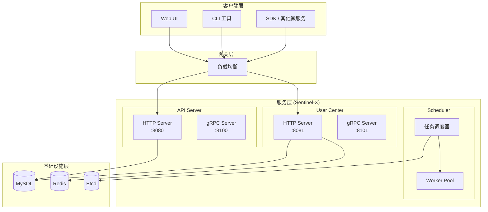
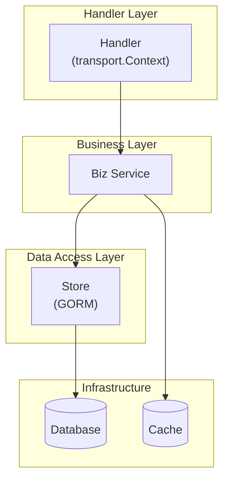
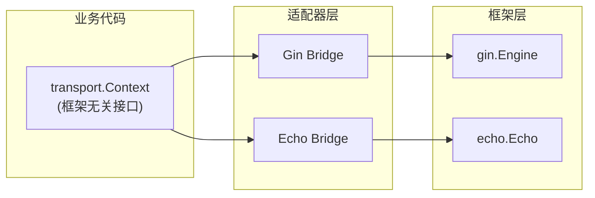
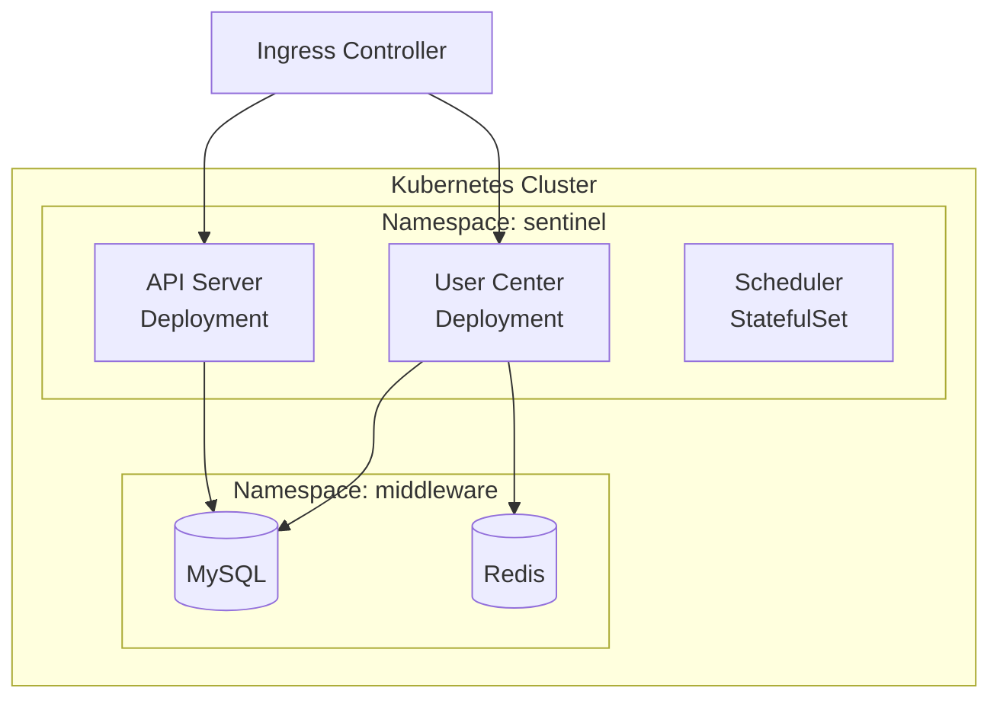

# 系统架构设计

## 概述

Sentinel-X 是一个分布式智能运维系统，旨在提供高可用、可扩展的监控和自动化运维能力。

## 系统架构图



## 核心组件

| 组件 | 职责 | 端口 |
|------|------|------|
| **API Server** | 提供 RESTful API 接口，处理用户请求 | 8080 (HTTP), 8100 (gRPC) |
| **User Center** | 用户管理、认证授权 | 8081 (HTTP), 8101 (gRPC) |
| **Scheduler** | 任务调度器，负责分发运维任务 | - |
| **GoAgent** | 核心代理库，封装底层系统交互逻辑 | - |

## 分层架构



| 层级 | 职责 | 示例 |
|------|------|------|
| **Handler** | 请求解析、参数验证、响应构建 | UserHandler, AuthHandler |
| **Biz** | 业务逻辑编排 | UserService, AuthService |
| **Store** | 数据持久化操作 | UserStore |
| **Infra** | 基础设施（数据库、缓存、消息队列） | MySQL, Redis |

## 技术栈

| 类别 | 技术选型 |
|------|----------|
| **语言** | Go 1.25.0 |
| **Web 框架** | Gin, Echo (适配器模式) |
| **数据库 ORM** | GORM |
| **数据库** | MySQL, PostgreSQL |
| **缓存** | Redis |
| **认证** | JWT |
| **授权** | Casbin (RBAC) |
| **可观测性** | OpenTelemetry |
| **日志** | github.com/kart-io/logger |
| **配置** | Viper (YAML) |

## 目录结构

```
sentinel-x/
├── cmd/                    # 应用程序入口
│   ├── api/                # API Server
│   ├── user-center/        # User Center
│   └── scheduler/          # Scheduler
├── internal/               # 私有应用代码
│   ├── api/                # API Server 业务
│   ├── user-center/        # User Center 业务
│   │   ├── handler/        # 请求处理
│   │   ├── biz/            # 业务逻辑
│   │   ├── store/          # 数据访问
│   │   └── router/         # 路由注册
│   └── model/              # 数据模型
├── pkg/                    # 公共库代码
│   ├── infra/              # 基础设施
│   │   ├── adapter/        # HTTP 框架适配器
│   │   ├── middleware/     # 中间件
│   │   ├── server/         # 服务器抽象
│   │   └── pool/           # Goroutine 池
│   ├── security/           # 安全组件
│   │   ├── auth/           # 认证 (JWT)
│   │   └── authz/          # 授权 (Casbin)
│   └── utils/              # 工具函数
├── staging/                # 核心依赖库源码
│   └── src/github.com/kart-io/
│       ├── goagent/        # 代理库
│       └── logger/         # 日志库
├── configs/                # 配置文件
├── docs/                   # 文档
└── vendor/                 # 第三方依赖
```

## HTTP 框架适配器

支持零代码修改切换 HTTP 框架：



**配置切换**：
```yaml
server:
  http:
    adapter: gin  # 改为 echo 即可切换
```

## 中间件链

| 中间件 | 功能 |
|--------|------|
| Recovery | Panic 恢复，防止服务崩溃 |
| RequestID | 请求追踪标识 |
| Logger | 结构化日志记录 |
| CORS | 跨域资源共享 |
| Timeout | 请求超时控制 |
| Auth | JWT 认证 |
| RateLimit | 请求限流 |

## 部署架构



## 参考资料

- [User Center 设计文档](user-center.md)
- [错误码设计](error-code-design.md)
- [并发规范](../concurrency-spec.md)
