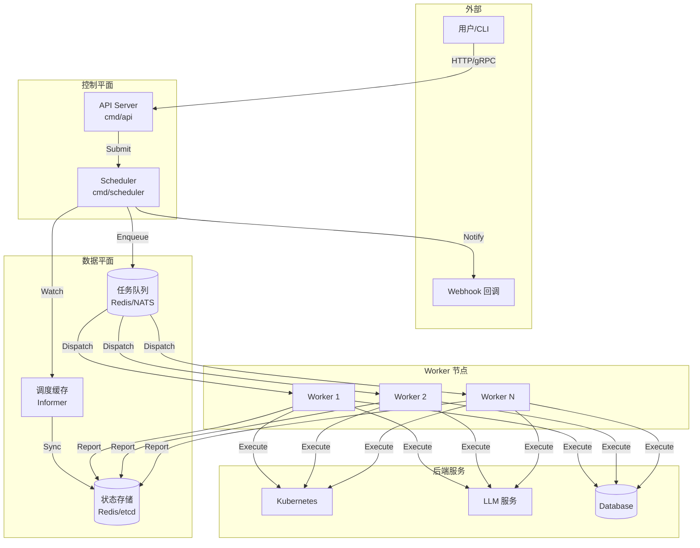
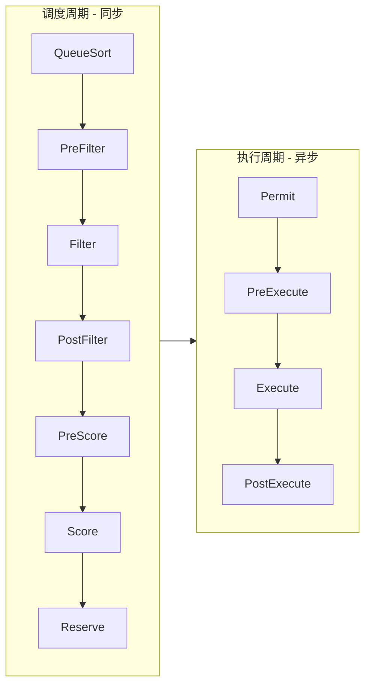
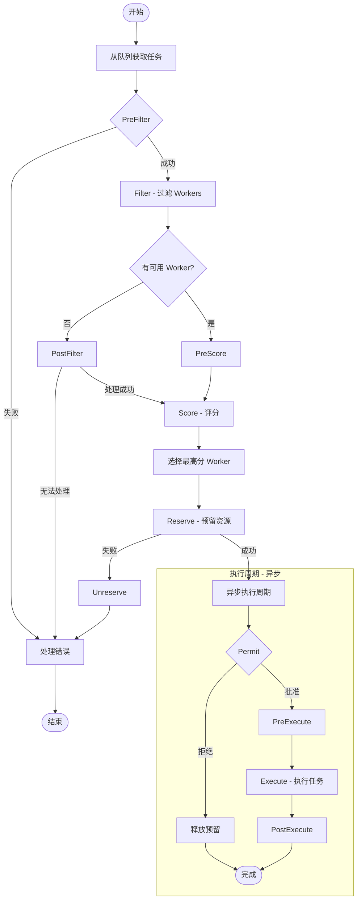

# Scheduler 设计与实现文档

## 1. 概述

Scheduler 是 Sentinel-X 分布式智能运维系统的核心组件，负责运维任务的调度、分发和执行管理。其设计参考了 [Kubernetes Scheduling Framework](https://kubernetes.io/docs/concepts/scheduling-eviction/scheduling-framework/)，采用插件化架构，保持核心轻量的同时提供强大的扩展能力。

### 1.1 设计目标

| 目标 | 描述 |
|------|------|
| **插件化架构** | 核心保持轻量，调度逻辑通过插件实现，支持灵活扩展 |
| **高可用** | 支持多实例部署，Leader 选举，避免单点故障 |
| **可扩展** | 水平扩展能力，支持大规模任务调度 |
| **智能化** | 集成 LLM Agent 能力，实现智能运维决策 |
| **可观测** | 完整的日志、追踪和指标支持 |

### 1.2 核心概念

| 概念 | 描述 |
|------|------|
| **Task** | 运维任务的最小调度单元，类似 K8s 的 Pod |
| **Worker** | 任务执行节点，类似 K8s 的 Node |
| **Plugin** | 实现特定调度逻辑的插件 |
| **Extension Point** | 插件的挂载点，定义插件在调度流程中的执行时机 |
| **Profile** | 调度配置，定义启用哪些插件及其配置 |

## 2. 系统架构

### 2.1 整体架构



### 2.2 调度框架架构

参考 [Kubernetes Scheduler Framework](https://kubernetes.io/docs/concepts/scheduling-eviction/scheduling-framework/)，调度过程分为 **调度周期 (Scheduling Cycle)** 和 **执行周期 (Execution Cycle)**：



### 2.3 扩展点 (Extension Points)

| 扩展点 | 阶段 | 描述 |
|--------|------|------|
| **QueueSort** | 排队 | 对待调度任务进行排序 |
| **PreFilter** | 预过滤 | 预处理任务信息，检查前置条件 |
| **Filter** | 过滤 | 过滤不满足条件的 Worker |
| **PostFilter** | 后过滤 | 无可用 Worker 时的处理（如触发扩容） |
| **PreScore** | 预评分 | 评分前的预处理 |
| **Score** | 评分 | 对通过过滤的 Worker 进行打分 |
| **Reserve** | 预留 | 预留 Worker 资源 |
| **Permit** | 准入 | 批准、拒绝或延迟任务执行 |
| **PreExecute** | 预执行 | 执行前的准备工作 |
| **Execute** | 执行 | 实际执行任务 |
| **PostExecute** | 后执行 | 执行完成后的清理和通知 |

## 3. 目录结构

参考 [Kubernetes pkg/scheduler](https://github.com/kubernetes/kubernetes/tree/master/pkg/scheduler) 的组织方式：

```text
cmd/scheduler/
├── main.go                     # 程序入口
├── app/
│   ├── server.go               # 服务器启动逻辑
│   ├── options/
│   │   ├── options.go          # 命令行参数定义
│   │   └── validation.go       # 参数校验
│   └── config/
│       └── config.go           # 配置加载

internal/scheduler/
├── scheduler.go                # 调度器主逻辑 (类似 k8s scheduler.go)
├── schedule_one.go             # 单任务调度逻辑 (类似 k8s schedule_one.go)
├── framework/
│   ├── interface.go            # 插件接口定义
│   ├── runtime/
│   │   ├── framework.go        # 框架运行时
│   │   └── registry.go         # 插件注册表
│   ├── plugins/
│   │   ├── names/
│   │   │   └── names.go        # 插件名称常量
│   │   ├── queuesort/
│   │   │   └── priority.go     # 优先级排序插件
│   │   ├── filter/
│   │   │   ├── resource.go     # 资源过滤插件
│   │   │   └── affinity.go     # 亲和性过滤插件
│   │   ├── score/
│   │   │   ├── resource.go     # 资源评分插件
│   │   │   └── loadbalance.go  # 负载均衡评分插件
│   │   └── executor/
│   │       ├── command.go      # 命令执行插件
│   │       ├── k8s.go          # K8s 操作插件
│   │       └── agent.go        # GoAgent 执行插件
│   └── parallelize/
│       └── parallelize.go      # 并行化工具
├── backend/
│   ├── cache/
│   │   ├── interface.go        # 缓存接口
│   │   ├── cache.go            # 缓存实现
│   │   └── snapshot.go         # 快照
│   └── heap/
│       └── heap.go             # 堆实现
├── queue/
│   ├── interface.go            # 队列接口
│   ├── scheduling_queue.go     # 调度队列
│   └── active_queue.go         # 活跃队列
├── profile/
│   ├── profile.go              # 调度配置文件
│   └── default.go              # 默认配置
├── metrics/
│   └── metrics.go              # Prometheus 指标
└── eventhandlers.go            # 事件处理器

pkg/scheduler/
├── apis/
│   ├── config/
│   │   ├── types.go            # 配置类型定义
│   │   ├── v1/
│   │   │   ├── types.go        # v1 API 类型
│   │   │   ├── defaults.go     # 默认值
│   │   │   └── register.go     # 类型注册
│   │   └── validation/
│   │       └── validation.go   # 配置校验
│   └── task/
│       └── v1/
│           ├── types.go        # Task API 类型
│           └── register.go     # 类型注册
└── client/
    ├── clientset/
    │   └── clientset.go        # 客户端集合
    └── informers/
        └── factory.go          # Informer 工厂
```

## 4. 核心接口设计

### 4.1 Plugin 接口

```go
// pkg/scheduler/apis/config/types.go
package config

// Plugin 插件配置
type Plugin struct {
    // Name 插件名称
    Name string `json:"name"`
    // Weight 权重 (仅用于 Score 插件)
    Weight int32 `json:"weight,omitempty"`
}

// PluginSet 插件集合
type PluginSet struct {
    Enabled  []Plugin `json:"enabled,omitempty"`
    Disabled []Plugin `json:"disabled,omitempty"`
}

// Plugins 各扩展点的插件配置
type Plugins struct {
    QueueSort  PluginSet `json:"queueSort,omitempty"`
    PreFilter  PluginSet `json:"preFilter,omitempty"`
    Filter     PluginSet `json:"filter,omitempty"`
    PostFilter PluginSet `json:"postFilter,omitempty"`
    PreScore   PluginSet `json:"preScore,omitempty"`
    Score      PluginSet `json:"score,omitempty"`
    Reserve    PluginSet `json:"reserve,omitempty"`
    Permit     PluginSet `json:"permit,omitempty"`
    PreExecute PluginSet `json:"preExecute,omitempty"`
    Execute    PluginSet `json:"execute,omitempty"`
    PostExecute PluginSet `json:"postExecute,omitempty"`
}

// SchedulerProfile 调度器配置文件
type SchedulerProfile struct {
    // SchedulerName 调度器名称
    SchedulerName string `json:"schedulerName"`
    // Plugins 插件配置
    Plugins *Plugins `json:"plugins,omitempty"`
    // PluginConfig 插件参数配置
    PluginConfig []PluginConfig `json:"pluginConfig,omitempty"`
}

// PluginConfig 插件参数
type PluginConfig struct {
    Name string                 `json:"name"`
    Args map[string]interface{} `json:"args,omitempty"`
}
```

### 4.2 Framework 接口

```go
// internal/scheduler/framework/interface.go
package framework

import (
    "context"

    taskv1 "github.com/kart/sentinel-x/pkg/scheduler/apis/task/v1"
)

// Plugin 所有插件的基础接口
type Plugin interface {
    Name() string
}

// QueueSortPlugin 队列排序插件
type QueueSortPlugin interface {
    Plugin
    Less(t1, t2 *QueuedTaskInfo) bool
}

// PreFilterPlugin 预过滤插件
type PreFilterPlugin interface {
    Plugin
    PreFilter(ctx context.Context, state *CycleState, task *taskv1.Task) *Status
    PreFilterExtensions() PreFilterExtensions
}

// FilterPlugin 过滤插件
type FilterPlugin interface {
    Plugin
    Filter(ctx context.Context, state *CycleState, task *taskv1.Task, worker *WorkerInfo) *Status
}

// PostFilterPlugin 后过滤插件
type PostFilterPlugin interface {
    Plugin
    PostFilter(ctx context.Context, state *CycleState, task *taskv1.Task,
        filteredWorkerStatusMap WorkerToStatusMap) (*PostFilterResult, *Status)
}

// PreScorePlugin 预评分插件
type PreScorePlugin interface {
    Plugin
    PreScore(ctx context.Context, state *CycleState, task *taskv1.Task,
        workers []*WorkerInfo) *Status
}

// ScorePlugin 评分插件
type ScorePlugin interface {
    Plugin
    Score(ctx context.Context, state *CycleState, task *taskv1.Task,
        workerName string) (int64, *Status)
    ScoreExtensions() ScoreExtensions
}

// ScoreExtensions 评分扩展接口
type ScoreExtensions interface {
    NormalizeScore(ctx context.Context, state *CycleState, task *taskv1.Task,
        scores WorkerScoreList) *Status
}

// ReservePlugin 资源预留插件
type ReservePlugin interface {
    Plugin
    Reserve(ctx context.Context, state *CycleState, task *taskv1.Task,
        workerName string) *Status
    Unreserve(ctx context.Context, state *CycleState, task *taskv1.Task,
        workerName string)
}

// PermitPlugin 准入插件
type PermitPlugin interface {
    Plugin
    Permit(ctx context.Context, state *CycleState, task *taskv1.Task,
        workerName string) (*Status, time.Duration)
}

// PreExecutePlugin 预执行插件
type PreExecutePlugin interface {
    Plugin
    PreExecute(ctx context.Context, state *CycleState, task *taskv1.Task,
        workerName string) *Status
}

// ExecutePlugin 执行插件
type ExecutePlugin interface {
    Plugin
    Execute(ctx context.Context, state *CycleState, task *taskv1.Task,
        workerName string) *Status
}

// PostExecutePlugin 后执行插件
type PostExecutePlugin interface {
    Plugin
    PostExecute(ctx context.Context, state *CycleState, task *taskv1.Task,
        workerName string) *Status
}
```

### 4.3 Framework Runtime

```go
// internal/scheduler/framework/runtime/framework.go
package runtime

import (
    "context"

    "github.com/kart/sentinel-x/internal/scheduler/framework"
    configv1 "github.com/kart/sentinel-x/pkg/scheduler/apis/config/v1"
)

// Framework 调度框架接口
type Framework interface {
    // 插件运行方法
    RunPreFilterPlugins(ctx context.Context, state *framework.CycleState,
        task *taskv1.Task) *framework.Status
    RunFilterPlugins(ctx context.Context, state *framework.CycleState,
        task *taskv1.Task, worker *framework.WorkerInfo) *framework.Status
    RunPostFilterPlugins(ctx context.Context, state *framework.CycleState,
        task *taskv1.Task, filteredWorkerStatusMap framework.WorkerToStatusMap) (
        *framework.PostFilterResult, *framework.Status)
    RunPreScorePlugins(ctx context.Context, state *framework.CycleState,
        task *taskv1.Task, workers []*framework.WorkerInfo) *framework.Status
    RunScorePlugins(ctx context.Context, state *framework.CycleState,
        task *taskv1.Task, workers []*framework.WorkerInfo) (
        framework.PluginToWorkerScores, *framework.Status)
    RunReservePluginsReserve(ctx context.Context, state *framework.CycleState,
        task *taskv1.Task, workerName string) *framework.Status
    RunReservePluginsUnreserve(ctx context.Context, state *framework.CycleState,
        task *taskv1.Task, workerName string)
    RunPermitPlugins(ctx context.Context, state *framework.CycleState,
        task *taskv1.Task, workerName string) *framework.Status
    RunPreExecutePlugins(ctx context.Context, state *framework.CycleState,
        task *taskv1.Task, workerName string) *framework.Status
    RunExecutePlugins(ctx context.Context, state *framework.CycleState,
        task *taskv1.Task, workerName string) *framework.Status
    RunPostExecutePlugins(ctx context.Context, state *framework.CycleState,
        task *taskv1.Task, workerName string) *framework.Status

    // 工具方法
    QueueSortFunc() framework.LessFunc
    HasFilterPlugins() bool
    HasPostFilterPlugins() bool
    HasScorePlugins() bool
}

// frameworkImpl Framework 实现
type frameworkImpl struct {
    registry              Registry
    queueSortPlugins      []framework.QueueSortPlugin
    preFilterPlugins      []framework.PreFilterPlugin
    filterPlugins         []framework.FilterPlugin
    postFilterPlugins     []framework.PostFilterPlugin
    preScorePlugins       []framework.PreScorePlugin
    scorePlugins          []framework.ScorePlugin
    reservePlugins        []framework.ReservePlugin
    permitPlugins         []framework.PermitPlugin
    preExecutePlugins     []framework.PreExecutePlugin
    executePlugins        []framework.ExecutePlugin
    postExecutePlugins    []framework.PostExecutePlugin

    metricsRecorder       *metricsRecorder
    parallelizer          parallelize.Parallelizer
}

// NewFramework 创建框架实例
func NewFramework(r Registry, profile *configv1.SchedulerProfile,
    opts ...Option) (Framework, error) {
    // ...
}
```

## 5. 数据模型

### 5.1 Task 模型

```go
// pkg/scheduler/apis/task/v1/types.go
package v1

import (
    metav1 "k8s.io/apimachinery/pkg/apis/meta/v1"
)

// TaskType 任务类型
type TaskType string

const (
    TaskTypeCommand   TaskType = "Command"    // Shell 命令
    TaskTypeK8sOps    TaskType = "K8sOps"     // Kubernetes 操作
    TaskTypeLLMChat   TaskType = "LLMChat"    // LLM 对话
    TaskTypeAgent     TaskType = "Agent"      // Agent 复合任务
    TaskTypeWorkflow  TaskType = "Workflow"   // 工作流
)

// TaskPhase 任务阶段
type TaskPhase string

const (
    TaskPhasePending   TaskPhase = "Pending"   // 等待调度
    TaskPhaseScheduled TaskPhase = "Scheduled" // 已调度
    TaskPhaseRunning   TaskPhase = "Running"   // 执行中
    TaskPhaseSucceeded TaskPhase = "Succeeded" // 成功
    TaskPhaseFailed    TaskPhase = "Failed"    // 失败
    TaskPhaseCancelled TaskPhase = "Cancelled" // 已取消
)

// Task 任务定义
// +genclient
// +k8s:deepcopy-gen:interfaces=k8s.io/apimachinery/pkg/runtime.Object
type Task struct {
    metav1.TypeMeta   `json:",inline"`
    metav1.ObjectMeta `json:"metadata,omitempty"`

    Spec   TaskSpec   `json:"spec"`
    Status TaskStatus `json:"status,omitempty"`
}

// TaskSpec 任务规格
type TaskSpec struct {
    // Type 任务类型
    Type TaskType `json:"type"`

    // SchedulerName 使用的调度器名称
    SchedulerName string `json:"schedulerName,omitempty"`

    // Priority 优先级 (0-1000)
    Priority *int32 `json:"priority,omitempty"`

    // ActiveDeadlineSeconds 最大执行时长
    ActiveDeadlineSeconds *int64 `json:"activeDeadlineSeconds,omitempty"`

    // Resources 资源需求
    Resources ResourceRequirements `json:"resources,omitempty"`

    // Affinity 亲和性配置
    Affinity *Affinity `json:"affinity,omitempty"`

    // Tolerations 容忍配置
    Tolerations []Toleration `json:"tolerations,omitempty"`

    // Payload 任务载荷 (根据 Type 不同而不同)
    Payload TaskPayload `json:"payload"`

    // RetryPolicy 重试策略
    RetryPolicy *RetryPolicy `json:"retryPolicy,omitempty"`
}

// TaskPayload 任务载荷
type TaskPayload struct {
    // Command 命令任务
    Command *CommandPayload `json:"command,omitempty"`

    // K8sOps Kubernetes 操作任务
    K8sOps *K8sOpsPayload `json:"k8sOps,omitempty"`

    // LLMChat LLM 对话任务
    LLMChat *LLMChatPayload `json:"llmChat,omitempty"`

    // Agent Agent 任务
    Agent *AgentPayload `json:"agent,omitempty"`

    // Workflow 工作流任务
    Workflow *WorkflowPayload `json:"workflow,omitempty"`
}

// CommandPayload 命令载荷
type CommandPayload struct {
    Image   string            `json:"image,omitempty"`
    Command []string          `json:"command"`
    Args    []string          `json:"args,omitempty"`
    Env     []EnvVar          `json:"env,omitempty"`
    WorkDir string            `json:"workDir,omitempty"`
}

// K8sOpsPayload Kubernetes 操作载荷
type K8sOpsPayload struct {
    // Action 操作类型: Apply, Delete, Scale, Restart, Rollout
    Action    string `json:"action"`
    // Cluster 目标集群
    Cluster   string `json:"cluster,omitempty"`
    // Namespace 命名空间
    Namespace string `json:"namespace"`
    // Resource 资源类型
    Resource  string `json:"resource"`
    // Name 资源名称
    Name      string `json:"name"`
    // Manifest YAML 清单 (用于 Apply)
    Manifest  string `json:"manifest,omitempty"`
    // Replicas 副本数 (用于 Scale)
    Replicas  *int32 `json:"replicas,omitempty"`
}

// LLMChatPayload LLM 对话载荷
type LLMChatPayload struct {
    Provider    string    `json:"provider"`
    Model       string    `json:"model"`
    Messages    []Message `json:"messages"`
    Temperature *float64  `json:"temperature,omitempty"`
    MaxTokens   *int32    `json:"maxTokens,omitempty"`
}

// Message 对话消息
type Message struct {
    Role    string `json:"role"`
    Content string `json:"content"`
}

// AgentPayload Agent 任务载荷
type AgentPayload struct {
    // AgentType Agent 类型: ReAct, CoT, ToT, PoT
    AgentType string            `json:"agentType"`
    // Goal 任务目标
    Goal      string            `json:"goal"`
    // Tools 可用工具列表
    Tools     []string          `json:"tools,omitempty"`
    // Context 上下文信息
    Context   map[string]string `json:"context,omitempty"`
    // MaxIterations 最大迭代次数
    MaxIterations *int32        `json:"maxIterations,omitempty"`
}

// WorkflowPayload 工作流载荷
type WorkflowPayload struct {
    Steps     []WorkflowStep `json:"steps"`
    OnFailure string         `json:"onFailure,omitempty"` // Abort, Continue, Retry
}

// WorkflowStep 工作流步骤
type WorkflowStep struct {
    Name      string      `json:"name"`
    TaskSpec  TaskSpec    `json:"taskSpec"`
    DependsOn []string    `json:"dependsOn,omitempty"`
    Condition string      `json:"condition,omitempty"`
}

// ResourceRequirements 资源需求
type ResourceRequirements struct {
    Limits   ResourceList `json:"limits,omitempty"`
    Requests ResourceList `json:"requests,omitempty"`
}

// ResourceList 资源列表
type ResourceList map[ResourceName]string

// ResourceName 资源名称
type ResourceName string

const (
    ResourceCPU    ResourceName = "cpu"
    ResourceMemory ResourceName = "memory"
    ResourceGPU    ResourceName = "gpu"
)

// Affinity 亲和性
type Affinity struct {
    WorkerAffinity *WorkerAffinity `json:"workerAffinity,omitempty"`
}

// WorkerAffinity Worker 亲和性
type WorkerAffinity struct {
    RequiredDuringScheduling  *WorkerSelector `json:"requiredDuringScheduling,omitempty"`
    PreferredDuringScheduling []WeightedWorkerSelector `json:"preferredDuringScheduling,omitempty"`
}

// WorkerSelector Worker 选择器
type WorkerSelector struct {
    MatchLabels      map[string]string          `json:"matchLabels,omitempty"`
    MatchExpressions []WorkerSelectorRequirement `json:"matchExpressions,omitempty"`
}

// WeightedWorkerSelector 带权重的 Worker 选择器
type WeightedWorkerSelector struct {
    Weight   int32          `json:"weight"`
    Selector WorkerSelector `json:"selector"`
}

// WorkerSelectorRequirement Worker 选择器要求
type WorkerSelectorRequirement struct {
    Key      string   `json:"key"`
    Operator string   `json:"operator"` // In, NotIn, Exists, DoesNotExist
    Values   []string `json:"values,omitempty"`
}

// Toleration 容忍
type Toleration struct {
    Key      string `json:"key,omitempty"`
    Operator string `json:"operator,omitempty"` // Equal, Exists
    Value    string `json:"value,omitempty"`
    Effect   string `json:"effect,omitempty"` // NoSchedule, NoExecute
}

// RetryPolicy 重试策略
type RetryPolicy struct {
    MaxRetries int32  `json:"maxRetries"`
    BackoffMs  int64  `json:"backoffMs"`
}

// TaskStatus 任务状态
type TaskStatus struct {
    Phase              TaskPhase       `json:"phase"`
    Conditions         []TaskCondition `json:"conditions,omitempty"`
    WorkerName         string          `json:"workerName,omitempty"`
    StartTime          *metav1.Time    `json:"startTime,omitempty"`
    CompletionTime     *metav1.Time    `json:"completionTime,omitempty"`
    RetryCount         int32           `json:"retryCount"`
    Result             *TaskResult     `json:"result,omitempty"`
}

// TaskCondition 任务条件
type TaskCondition struct {
    Type               string      `json:"type"`
    Status             string      `json:"status"` // True, False, Unknown
    LastTransitionTime metav1.Time `json:"lastTransitionTime"`
    Reason             string      `json:"reason,omitempty"`
    Message            string      `json:"message,omitempty"`
}

// TaskResult 任务结果
type TaskResult struct {
    Success  bool              `json:"success"`
    Output   string            `json:"output,omitempty"`
    Error    string            `json:"error,omitempty"`
    ExitCode *int32            `json:"exitCode,omitempty"`
    Metadata map[string]string `json:"metadata,omitempty"`
}

// TaskList 任务列表
// +k8s:deepcopy-gen:interfaces=k8s.io/apimachinery/pkg/runtime.Object
type TaskList struct {
    metav1.TypeMeta `json:",inline"`
    metav1.ListMeta `json:"metadata,omitempty"`
    Items           []Task `json:"items"`
}
```

### 5.2 Worker 模型

```go
// pkg/scheduler/apis/task/v1/worker_types.go
package v1

import (
    metav1 "k8s.io/apimachinery/pkg/apis/meta/v1"
)

// WorkerPhase Worker 阶段
type WorkerPhase string

const (
    WorkerPhaseReady    WorkerPhase = "Ready"
    WorkerPhaseNotReady WorkerPhase = "NotReady"
)

// Worker 执行节点
// +genclient
// +k8s:deepcopy-gen:interfaces=k8s.io/apimachinery/pkg/runtime.Object
type Worker struct {
    metav1.TypeMeta   `json:",inline"`
    metav1.ObjectMeta `json:"metadata,omitempty"`

    Spec   WorkerSpec   `json:"spec"`
    Status WorkerStatus `json:"status,omitempty"`
}

// WorkerSpec Worker 规格
type WorkerSpec struct {
    // Taints 污点
    Taints []Taint `json:"taints,omitempty"`

    // Unschedulable 是否不可调度
    Unschedulable bool `json:"unschedulable,omitempty"`
}

// Taint 污点
type Taint struct {
    Key    string `json:"key"`
    Value  string `json:"value,omitempty"`
    Effect string `json:"effect"` // NoSchedule, NoExecute
}

// WorkerStatus Worker 状态
type WorkerStatus struct {
    Phase       WorkerPhase       `json:"phase"`
    Conditions  []WorkerCondition `json:"conditions,omitempty"`
    Capacity    ResourceList      `json:"capacity,omitempty"`
    Allocatable ResourceList      `json:"allocatable,omitempty"`
    Addresses   []WorkerAddress   `json:"addresses,omitempty"`
}

// WorkerCondition Worker 条件
type WorkerCondition struct {
    Type               string      `json:"type"`
    Status             string      `json:"status"`
    LastHeartbeatTime  metav1.Time `json:"lastHeartbeatTime"`
    LastTransitionTime metav1.Time `json:"lastTransitionTime"`
    Reason             string      `json:"reason,omitempty"`
    Message            string      `json:"message,omitempty"`
}

// WorkerAddress Worker 地址
type WorkerAddress struct {
    Type    string `json:"type"` // Hostname, InternalIP, ExternalIP
    Address string `json:"address"`
}

// WorkerList Worker 列表
// +k8s:deepcopy-gen:interfaces=k8s.io/apimachinery/pkg/runtime.Object
type WorkerList struct {
    metav1.TypeMeta `json:",inline"`
    metav1.ListMeta `json:"metadata,omitempty"`
    Items           []Worker `json:"items"`
}
```

## 6. 调度流程

### 6.1 主调度循环

```go
// internal/scheduler/scheduler.go
package scheduler

import (
    "context"
    "time"

    "github.com/kart-io/logger"
    "github.com/kart/sentinel-x/internal/scheduler/backend/cache"
    "github.com/kart/sentinel-x/internal/scheduler/framework"
    "github.com/kart/sentinel-x/internal/scheduler/framework/runtime"
    "github.com/kart/sentinel-x/internal/scheduler/queue"
    taskv1 "github.com/kart/sentinel-x/pkg/scheduler/apis/task/v1"
)

// Scheduler 调度器
type Scheduler struct {
    Cache             cache.Cache
    SchedulingQueue   queue.SchedulingQueue
    Frameworks        map[string]runtime.Framework
    NextTask          func() *framework.QueuedTaskInfo
    Error             func(*framework.QueuedTaskInfo, error)
    StopEverything    <-chan struct{}
    logger            logger.Logger
}

// Run 启动调度器
func (sched *Scheduler) Run(ctx context.Context) {
    sched.SchedulingQueue.Run()

    go wait.UntilWithContext(ctx, sched.scheduleOne, 0)

    <-ctx.Done()
    sched.SchedulingQueue.Close()
}
```

### 6.2 单任务调度

```go
// internal/scheduler/schedule_one.go
package scheduler

import (
    "context"
    "time"

    "github.com/kart/sentinel-x/internal/scheduler/framework"
    taskv1 "github.com/kart/sentinel-x/pkg/scheduler/apis/task/v1"
)

// scheduleOne 调度单个任务
func (sched *Scheduler) scheduleOne(ctx context.Context) {
    // 1. 从队列获取任务
    taskInfo := sched.NextTask()
    if taskInfo == nil {
        return
    }

    task := taskInfo.Task
    fwk, err := sched.frameworkForTask(task)
    if err != nil {
        sched.Error(taskInfo, err)
        return
    }

    sched.logger.Info("Attempting to schedule task",
        logger.String("task", task.Name),
        logger.String("namespace", task.Namespace))

    // 2. 调度周期
    state := framework.NewCycleState()
    schedulingCycleCtx, cancel := context.WithCancel(ctx)
    defer cancel()

    scheduleResult, err := sched.schedulingCycle(schedulingCycleCtx, state, fwk, task)
    if err != nil {
        sched.handleSchedulingFailure(fwk, taskInfo, err)
        return
    }

    // 3. 执行周期 (异步)
    go func() {
        executionCycleCtx := context.Background()
        sched.executionCycle(executionCycleCtx, state, fwk, task, scheduleResult)
    }()
}

// schedulingCycle 调度周期
func (sched *Scheduler) schedulingCycle(
    ctx context.Context,
    state *framework.CycleState,
    fwk runtime.Framework,
    task *taskv1.Task,
) (ScheduleResult, error) {

    // 1. PreFilter
    preFilterStatus := fwk.RunPreFilterPlugins(ctx, state, task)
    if !preFilterStatus.IsSuccess() {
        return ScheduleResult{}, preFilterStatus.AsError()
    }

    // 2. Filter
    feasibleWorkers, err := sched.findWorkersThatFitTask(ctx, fwk, state, task)
    if err != nil {
        return ScheduleResult{}, err
    }

    // 3. PostFilter (如果没有可用 Worker)
    if len(feasibleWorkers) == 0 {
        return sched.handleNoAvailableWorkers(ctx, fwk, state, task)
    }

    // 4. PreScore & Score
    priorityList, err := sched.prioritizeWorkers(ctx, fwk, state, task, feasibleWorkers)
    if err != nil {
        return ScheduleResult{}, err
    }

    // 5. 选择最高分 Worker
    selectedWorker, err := sched.selectWorker(priorityList)
    if err != nil {
        return ScheduleResult{}, err
    }

    // 6. Reserve
    reserveStatus := fwk.RunReservePluginsReserve(ctx, state, task, selectedWorker)
    if !reserveStatus.IsSuccess() {
        fwk.RunReservePluginsUnreserve(ctx, state, task, selectedWorker)
        return ScheduleResult{}, reserveStatus.AsError()
    }

    sched.logger.Info("Successfully scheduled task",
        logger.String("task", task.Name),
        logger.String("worker", selectedWorker))

    return ScheduleResult{
        SuggestedWorker: selectedWorker,
    }, nil
}

// executionCycle 执行周期
func (sched *Scheduler) executionCycle(
    ctx context.Context,
    state *framework.CycleState,
    fwk runtime.Framework,
    task *taskv1.Task,
    scheduleResult ScheduleResult,
) {
    workerName := scheduleResult.SuggestedWorker

    // 1. Permit
    permitStatus := fwk.RunPermitPlugins(ctx, state, task, workerName)
    if !permitStatus.IsSuccess() {
        fwk.RunReservePluginsUnreserve(ctx, state, task, workerName)
        return
    }

    // 2. PreExecute
    preExecuteStatus := fwk.RunPreExecutePlugins(ctx, state, task, workerName)
    if !preExecuteStatus.IsSuccess() {
        fwk.RunReservePluginsUnreserve(ctx, state, task, workerName)
        return
    }

    // 3. Execute
    executeStatus := fwk.RunExecutePlugins(ctx, state, task, workerName)

    // 4. PostExecute
    fwk.RunPostExecutePlugins(ctx, state, task, workerName)

    if !executeStatus.IsSuccess() {
        sched.logger.Error("Task execution failed",
            logger.String("task", task.Name),
            logger.String("worker", workerName),
            logger.Error(executeStatus.AsError()))
    }
}
```

### 6.3 调度流程图



## 7. 内置插件

### 7.1 QueueSort 插件

```go
// internal/scheduler/framework/plugins/queuesort/priority.go
package queuesort

import (
    "github.com/kart/sentinel-x/internal/scheduler/framework"
)

const Name = "PrioritySort"

// PrioritySort 按优先级排序
type PrioritySort struct{}

func (ps *PrioritySort) Name() string {
    return Name
}

func (ps *PrioritySort) Less(t1, t2 *framework.QueuedTaskInfo) bool {
    p1 := getPriority(t1.Task)
    p2 := getPriority(t2.Task)
    // 优先级高的排前面，相同优先级按时间排序
    if p1 != p2 {
        return p1 > p2
    }
    return t1.Timestamp.Before(t2.Timestamp)
}
```

### 7.2 Filter 插件

```go
// internal/scheduler/framework/plugins/filter/resource.go
package filter

import (
    "context"

    "github.com/kart/sentinel-x/internal/scheduler/framework"
    taskv1 "github.com/kart/sentinel-x/pkg/scheduler/apis/task/v1"
)

const ResourceFitName = "ResourceFit"

// ResourceFit 资源过滤插件
type ResourceFit struct{}

func (rf *ResourceFit) Name() string {
    return ResourceFitName
}

func (rf *ResourceFit) Filter(
    ctx context.Context,
    state *framework.CycleState,
    task *taskv1.Task,
    worker *framework.WorkerInfo,
) *framework.Status {
    // 检查 Worker 资源是否满足任务需求
    if !rf.checkResources(task, worker) {
        return framework.NewStatus(framework.Unschedulable,
            "Insufficient resources on worker")
    }
    return nil
}
```

### 7.3 Execute 插件 (GoAgent)

```go
// internal/scheduler/framework/plugins/executor/agent.go
package executor

import (
    "context"

    "github.com/kart-io/goagent/agents/react"
    "github.com/kart-io/goagent/llm"
    "github.com/kart-io/goagent/llm/providers"
    "github.com/kart-io/logger"
    "github.com/kart/sentinel-x/internal/scheduler/framework"
    taskv1 "github.com/kart/sentinel-x/pkg/scheduler/apis/task/v1"
)

const AgentExecutorName = "AgentExecutor"

// AgentExecutor GoAgent 执行插件
type AgentExecutor struct {
    logger logger.Logger
    llmCfg *LLMConfig
}

func (ae *AgentExecutor) Name() string {
    return AgentExecutorName
}

func (ae *AgentExecutor) Execute(
    ctx context.Context,
    state *framework.CycleState,
    task *taskv1.Task,
    workerName string,
) *framework.Status {
    payload := task.Spec.Payload.Agent
    if payload == nil {
        return framework.NewStatus(framework.Error, "Agent payload is nil")
    }

    // 创建 LLM Provider
    provider, err := ae.createProvider()
    if err != nil {
        return framework.NewStatus(framework.Error, err.Error())
    }

    // 创建 Agent
    agent := react.New(provider,
        react.WithMaxIterations(int(*payload.MaxIterations)),
    )

    // 执行
    ae.logger.Info("Executing agent task",
        logger.String("task", task.Name),
        logger.String("goal", payload.Goal))

    result, err := agent.Run(ctx, payload.Goal)
    if err != nil {
        return framework.NewStatus(framework.Error, err.Error())
    }

    // 存储结果
    state.Write(framework.TaskResultKey, &taskv1.TaskResult{
        Success: true,
        Output:  result.Output,
    })

    return nil
}
```

## 8. 配置示例

### 8.1 调度器配置

```yaml
# config/scheduler-config.yaml
apiVersion: scheduler.sentinel-x.io/v1
kind: SchedulerConfiguration
leaderElection:
  leaderElect: true
  resourceNamespace: sentinel-system
  resourceName: scheduler
clientConnection:
  kubeconfig: ""
  qps: 50
  burst: 100
profiles:
  - schedulerName: default-scheduler
    plugins:
      queueSort:
        enabled:
          - name: PrioritySort
      preFilter:
        enabled:
          - name: TaskValidation
      filter:
        enabled:
          - name: ResourceFit
          - name: WorkerAffinity
          - name: TaintToleration
      score:
        enabled:
          - name: ResourceBalanced
            weight: 1
          - name: WorkerAffinity
            weight: 2
      execute:
        enabled:
          - name: CommandExecutor
          - name: K8sOpsExecutor
          - name: AgentExecutor
    pluginConfig:
      - name: AgentExecutor
        args:
          llm:
            provider: kimi
            model: moonshot-v1-8k
          maxIterations: 10
```

### 8.2 环境变量

```bash
# LLM 配置
KIMI_API_KEY=your-kimi-api-key
OPENAI_API_KEY=your-openai-api-key

# 存储配置
REDIS_ADDR=localhost:6379
ETCD_ENDPOINTS=localhost:2379

# 日志配置
LOG_LEVEL=info
LOG_FORMAT=json
```

## 9. 监控指标

参考 [Kubernetes Scheduler Metrics](https://kubernetes.io/docs/reference/scheduling/config/#metrics)：

| 指标 | 类型 | 描述 |
|------|------|------|
| `scheduler_scheduling_attempt_total` | Counter | 调度尝试总数 |
| `scheduler_scheduling_duration_seconds` | Histogram | 调度耗时 |
| `scheduler_pending_tasks` | Gauge | 待调度任务数 |
| `scheduler_queue_incoming_tasks_total` | Counter | 入队任务总数 |
| `scheduler_preemption_attempts_total` | Counter | 抢占尝试总数 |
| `scheduler_framework_extension_point_duration_seconds` | Histogram | 各扩展点执行耗时 |
| `scheduler_plugin_execution_duration_seconds` | Histogram | 插件执行耗时 |

## 10. 实现路线图

### 阶段一: 核心框架

- [ ] 实现 Framework 接口和 Runtime
- [ ] 实现调度队列 (SchedulingQueue)
- [ ] 实现基础插件 (QueueSort, Filter, Score)
- [ ] 实现 schedule_one 调度循环

### 阶段二: 执行能力

- [ ] 实现 CommandExecutor 插件
- [ ] 实现 K8sOpsExecutor 插件
- [ ] 实现 AgentExecutor 插件 (GoAgent 集成)
- [ ] 实现 Worker 管理和心跳

### 阶段三: 高级特性

- [ ] 实现 Affinity/Anti-Affinity
- [ ] 实现 Taint/Toleration
- [ ] 实现任务抢占 (Preemption)
- [ ] 实现工作流任务 (Workflow)

### 阶段四: 生产就绪

- [ ] 实现 Leader Election
- [ ] 完善监控指标
- [ ] 性能优化和压测
- [ ] 文档和示例完善

## 参考资料

- [Kubernetes Scheduling Framework](https://kubernetes.io/docs/concepts/scheduling-eviction/scheduling-framework/)
- [Kubernetes Scheduler Configuration](https://kubernetes.io/docs/reference/scheduling/config/)
- [kubernetes/pkg/scheduler](https://github.com/kubernetes/kubernetes/tree/master/pkg/scheduler)
- [Deep Dive into the Kubernetes Scheduler Framework](https://medium.com/@helayoty/deep-dive-into-the-kubernetes-scheduler-framework-db548bca5134)
