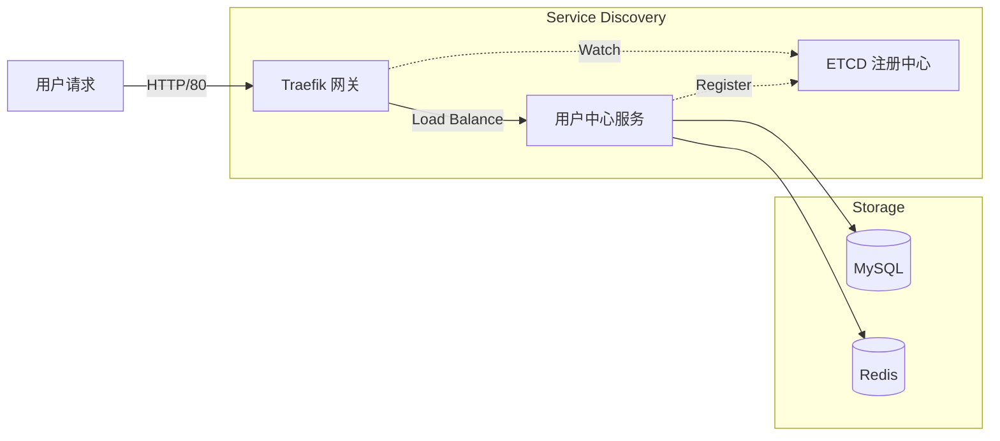

# 网关与微服务架构

本文档详细说明 Sentinel-X 的网关集成与服务发现机制。

## 架构概览

Sentinel-X 采用微服务架构，使用 **Traefik** 作为统一流量网关，**ETCD** 作为服务注册中心。所有微服务实例启动时自动注册到 ETCD，网关实时感知服务变化并更新路由。



## 核心组件

| 组件 | 角色 | 说明 |
|------|------|------|
| **Traefik** | 边缘网关 | 处理所有入站流量，负责路由分发、负载均衡和 SSL 终止。 |
| **ETCD** | 注册中心 | 存储服务元数据（IP、端口、权重），提供分布式键值存储。 |
| **User Center** | 业务服务 | 用户认证与管理核心服务，无状态设计，支持水平扩展。 |

## 服务发现机制

1.  **服务注册**：
    *   `User Center` 启动时，读取 `configs/user-center.yaml` 中的 `etcd` 配置。
    *   服务将自身的 IP 地址、端口（默认 8081/HTTP, 8101/gRPC）和元数据写入 ETCD 的特定目录。
    *   服务维持与 ETCD 的心跳（Lease），确保实例下线时自动从注册中心移除。

2.  **服务发现与路由**：
    *   `Traefik` 通过配置 `--providers.etcd=true` 启用 ETCD 提供者。
    *   Traefik 监听 ETCD 中服务键值的变化。
    *   一旦检测到新实例注册，Traefik 自动生成路由规则，将流量转发到新实例。

## 配置详解

### 1. 网关配置 (`deploy/docker-compose.yaml`)

Traefik 被配置为直接监听 Docker 网络中的 ETCD 服务：

```yaml
  traefik:
    image: traefik:v2.10
    command:
      - "--api.insecure=true"           # 开启 Dashboard (端口 8080)
      - "--providers.etcd=true"         # 启用 ETCD 提供者
      - "--providers.etcd.endpoints=etcd:2379" # ETCD 地址
      - "--entrypoints.web.address=:80" # HTTP 入口点
    depends_on:
      - etcd
```

### 2. 服务配置 (`configs/user-center.yaml`)

用户中心配置了连接 ETCD 的参数，用于自我注册：

```yaml
etcd:
  endpoints:
    - "127.0.0.1:2379" # 本地开发或容器内连接地址
```

在 Docker 环境中，服务通过环境变量覆盖上述地址以指向容器名 `etcd`。
