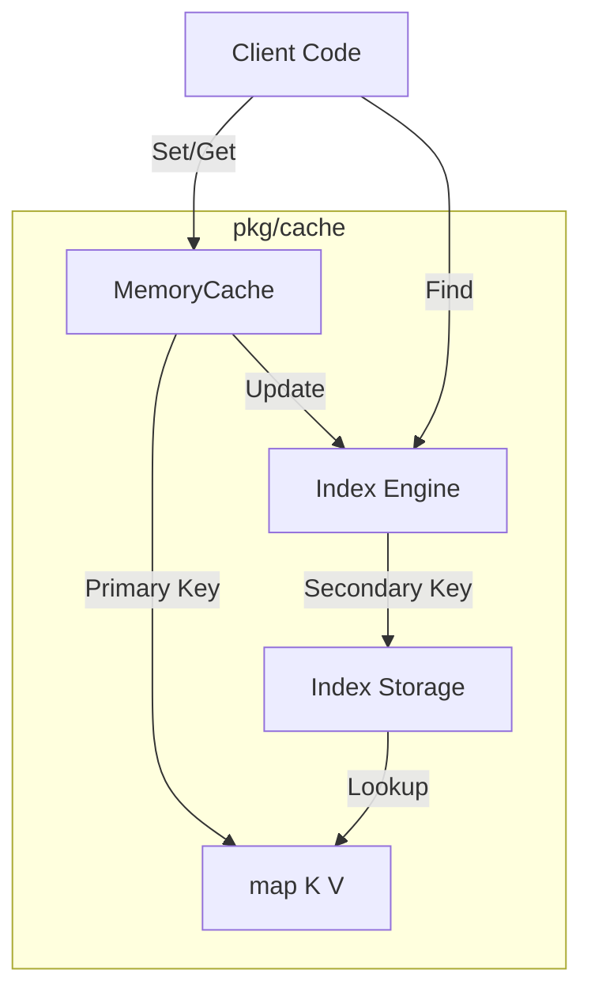
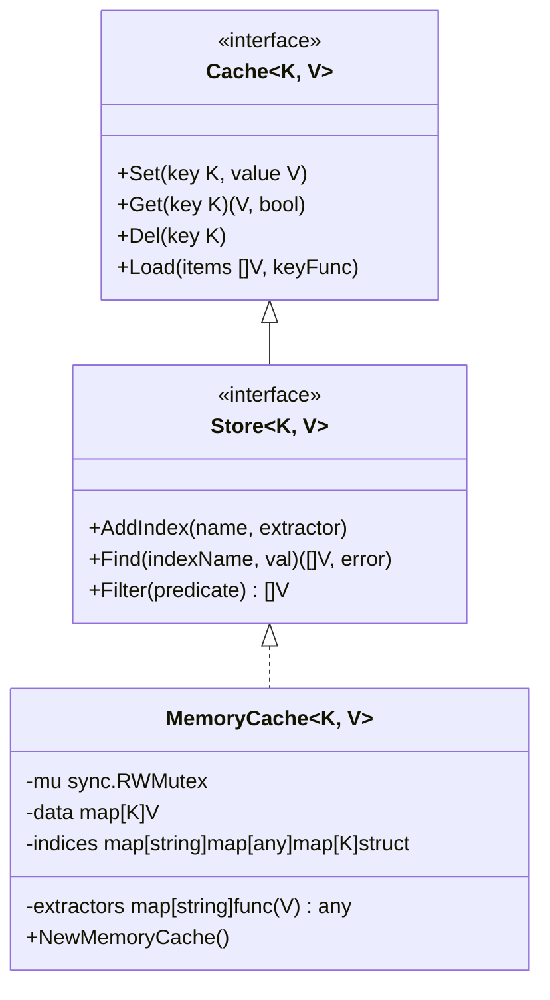
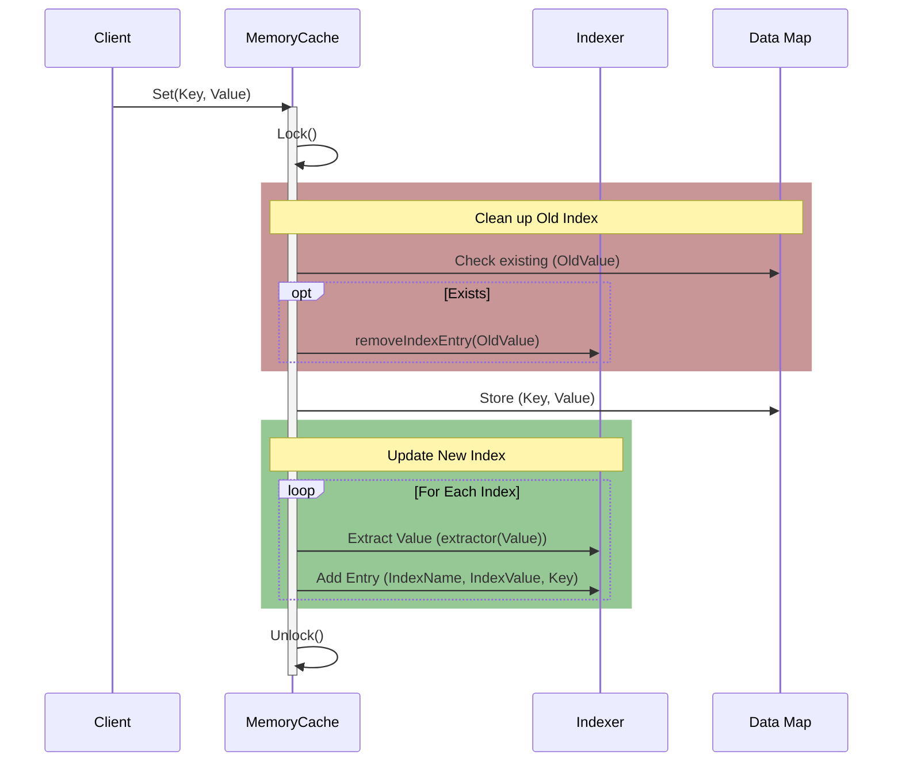
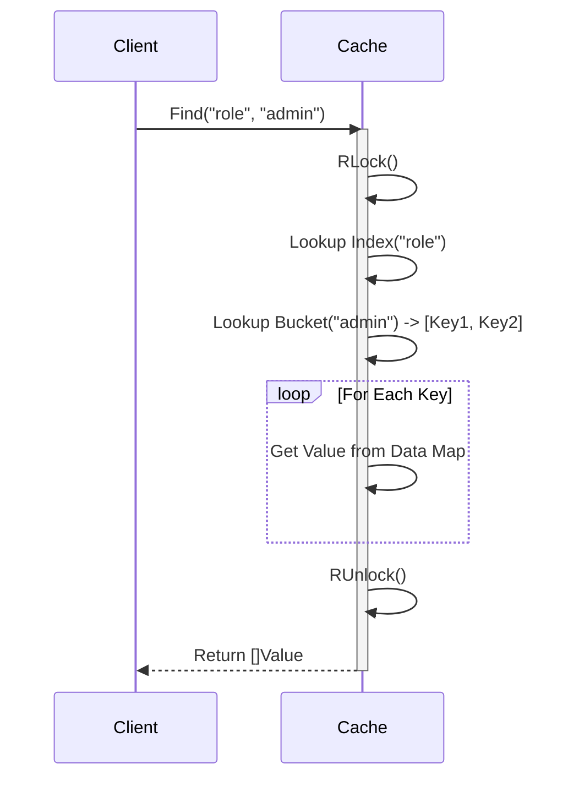

# Generic Memory Cache

This package provides a generic, thread-safe in-memory cache implementation with support for:
- **Direct Access**: $O(1)$ key-value storage.
- **Secondary Indexing**: Relational-style querying via custom index extractors.
- **Batch Loading**: Efficient bulk import of data.

## 1. Architecture

The `MemoryCache` serves as a high-performance local storage component. It is built upon standard Go maps protected by `sync.RWMutex` for concurrent access.

## 2. Design

The design leverages Go Generics (`[K comparable, V any]`) to provide type safety without reflection overhead for standard operations. The `Store` interface extends the basic `Cache` capability with querying features.

### Internal Data Structures
- **Data**: `map[K]V` - Stores the actual objects.
- **Indices**: `map[indexName]map[indexValue]Set[K]` - Reverse lookup maps.
    - Level 1: Index Name (e.g., "role")
    - Level 2: Index Value (e.g., "admin")
    - Level 3: Set of Primary Keys (e.g., {1, 5, 8})

## 3. Workflow

### 3.1 Data Insertion & Indexing Flow

When data is inserted (`Set`) or loaded (`Load`), the cache automatically maintains all registered secondary indexes.

### 3.2 Query Flow

Querying via `Find` leverages the index for $O(1)$ complexity (amortized) relative to the number of items in the index bucket, avoiding full table scans.

