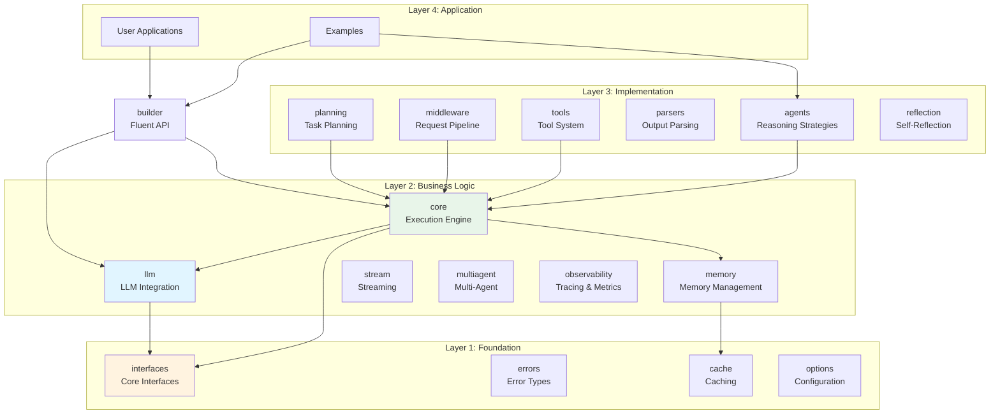
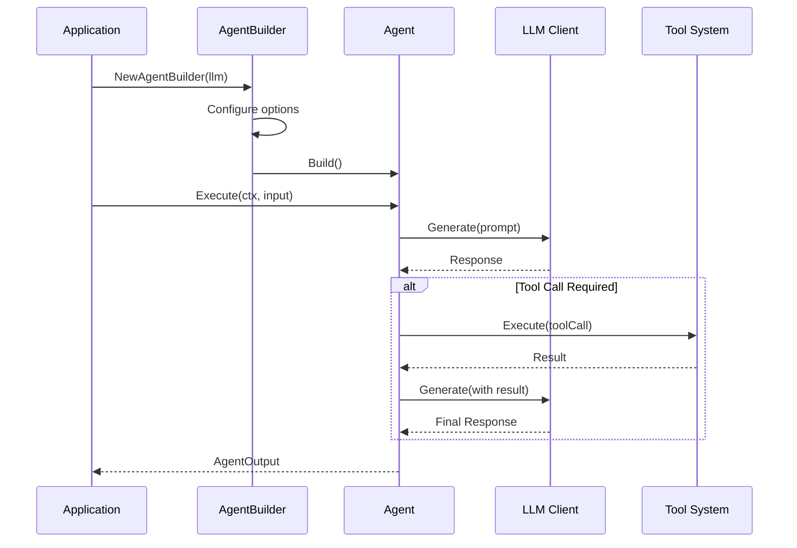

# GoAgent - AI Agent Framework for Go

[](https://go.dev/)
[](https://github.com/kart-io/goagent/actions/workflows/ci.yml)
[](LICENSE)
[](docs/)
[](https://github.com/kart-io/goagent/releases/latest)
[](https://goreportcard.com/report/github.com/kart-io/goagent)
[](https://pkg.go.dev/github.com/kart-io/goagent)
[](https://deepwiki.com/kart-io/goagent)

[English](README.md) | [中文](README_CN.md)

GoAgent is a comprehensive, production-ready AI agent framework for Go, inspired by LangChain. It provides agents, tools, memory, LLM abstraction, and orchestration capabilities with enterprise-grade features like distributed tracing, persistent storage, and multi-agent coordination.

## Features

- **Intelligent Agents** - Autonomous agents with reasoning capabilities and tool execution
- **High Performance** - Hot path optimization with InvokeFast reducing latency by 4-6%
- **Flexible Architecture** - 4-layer modular design with clear separation of concerns
- **LLM Abstraction** - Support for multiple LLM providers (OpenAI, Anthropic Claude, Cohere, HuggingFace, Gemini, DeepSeek)
- **Memory Management** - Conversation history, case-based reasoning, and vector storage
- **Tool System** - Extensible tool registry with parallel execution and dependency management
- **State Management** - Thread-safe state with checkpointing and persistence
- **Observability** - OpenTelemetry integration with distributed tracing
- **Enterprise Ready** - Redis, PostgreSQL support, NATS messaging, and high availability

## Quick Start

### Installation

```bash
go get github.com/kart-io/goagent
```

### Basic Example

```go
package main

import (
    "context"
    "log"

    "github.com/kart-io/goagent/builder"
    "github.com/kart-io/goagent/llm"
)

func main() {
    // Create LLM client
    llmClient := llm.NewOpenAIClient("your-api-key")

    // Build agent with fluent API
    agent, err := builder.NewAgentBuilder(llmClient).
        WithSystemPrompt("You are a helpful assistant").
        WithMaxIterations(10).
        WithTimeout(30 * time.Second).
        Build()

    if err != nil {
        log.Fatal(err)
    }

    // Execute agent
    result, err := agent.Execute(context.Background(), "Analyze the latest sales data")
    if err != nil {
        log.Fatal(err)
    }

    log.Printf("Result: %v", result)
}
```

### Using Pre-configured Agents

```go
// Create a RAG agent for document Q&A
ragAgent, err := builder.RAGAgent(llmClient, vectorStore)

// Create an analysis agent (low temperature, high precision)
analysisAgent, err := builder.AnalysisAgent(llmClient, dataSource)

// Create a monitoring agent (long-running, periodic checks)
monitoringAgent, err := builder.MonitoringAgent(llmClient, 30*time.Second)
```

## Architecture

GoAgent follows a 4-layer architecture for maintainability and scalability:



### Request Flow



See [Architecture Documentation](docs/architecture/) for details.

## Module Reference

| Module | Description | Documentation |
|--------|-------------|---------------|
| **[core](core/)** | Execution engine, state management, runtime | [README](core/README.md) |
| **[llm](llm/)** | LLM provider integration (OpenAI, Anthropic, etc.) | [README](llm/README.md) |
| **[builder](builder/)** | Fluent API for agent construction | [README](builder/README.md) |
| **[agents](agents/)** | Reasoning strategies (ReAct, CoT, ToT) | [README](agents/README.md) |
| **[tools](tools/)** | Tool system and registry | [README](tools/README.md) |
| **[memory](memory/)** | Memory management and vector storage | [README](memory/README.md) |
| **[multiagent](multiagent/)** | Multi-agent coordination | [README](multiagent/README.md) |
| **[stream](stream/)** | Streaming data processing | [README](stream/README.md) |
| **[middleware](middleware/)** | Request/response middleware | [README](middleware/README.md) |
| **[observability](observability/)** | Tracing and metrics | [README](observability/README.md) |
| **[cache](cache/)** | Caching system | [README](cache/README.md) |
| **[interfaces](interfaces/)** | Core interface definitions | [README](interfaces/README.md) |
| **[errors](errors/)** | Error types and handling | [README](errors/README.md) |
| **[planning](planning/)** | Task planning system | [README](planning/README.md) |
| **[reflection](reflection/)** | Self-reflective agents | [README](reflection/README.md) |
| **[prompt](prompt/)** | Prompt templates | [README](prompt/README.md) |
| **[parsers](parsers/)** | Output parsing | [README](parsers/README.md) |
| **[options](options/)** | Configuration options | [README](options/README.md) |
| **[toolkits](toolkits/)** | Toolkit management | [README](toolkits/README.md) |
| **[testing](testing/)** | Testing utilities and mocks | [README](testing/README.md) |
| **[distributed](distributed/)** | Distributed computing | [README](distributed/README.md) |

## Core Components

### Agents
Autonomous entities that can reason, use tools, and make decisions.

```go
type Agent interface {
    Execute(ctx context.Context, input *AgentInput) (*AgentOutput, error)
    Name() string
    Description() string
    Capabilities() []string
}
```

### Tools
Extensible functions that agents can call to interact with external systems.

```go
type Tool interface {
    Name() string
    Description() string
    Execute(ctx context.Context, input map[string]interface{}) (interface{}, error)
}
```

### Memory
Persistent storage for conversations, cases, and application state.

```go
type Manager interface {
    AddConversation(ctx context.Context, conv *Conversation) error
    GetConversationHistory(ctx context.Context, sessionID string, limit int) ([]*Conversation, error)
    SearchSimilarCases(ctx context.Context, query string, limit int) ([]*Case, error)
}
```

### Builder
Fluent API for constructing agents with complex configurations.

```go
agent := builder.NewAgentBuilder(llmClient).
    WithSystemPrompt("You are an expert analyst").
    WithTools(searchTool, calcTool).
    WithMemory(memoryManager).
    WithMiddleware(loggingMW, cacheMW).
    Build()
```

## Advanced Features

### State Management & Checkpointing

```go
// Create checkpointer for session persistence
checkpointer := core.NewRedisCheckpointer(redisClient, "agent:")

agent := builder.NewAgentBuilder(llmClient).
    WithCheckpointer(checkpointer).
    WithConfig(&builder.AgentConfig{EnableAutoSave: true}).
    Build()
```

### Distributed Tracing

```go
// Initialize OpenTelemetry
provider := observability.NewTelemetryProvider(&observability.TelemetryConfig{
    ServiceName: "my-agent",
    OTLPEndpoint: "localhost:4317",
})

// Traces are automatically propagated across agent calls
```

### Multi-Agent Communication

```go
// NATS-based distributed communication
comm := multiagent.NewNATSCommunicator("agent-1", natsConn, tracer)

// Send message to another agent
message := &multiagent.AgentMessage{
    From: "agent-1",
    To: "agent-2",
    Type: multiagent.MessageTypeRequest,
    Payload: map[string]interface{}{"task": "analyze"},
}
comm.Send(ctx, "agent-2", message)
```

### Parallel Tool Execution

```go
// Execute multiple tools concurrently
executor := tools.NewToolExecutor(tools.ToolExecutorConfig{
    MaxConcurrency: 10,
    Timeout: 30 * time.Second,
})

results, err := executor.ExecuteParallel(ctx, []tools.ToolCallRequest{
    {Tool: searchTool, Input: map[string]interface{}{"query": "Go"}},
    {Tool: calcTool, Input: map[string]interface{}{"expr": "2+2"}},
})
```

## Documentation

- **[Quick Start Guide](docs/guides/quickstart.md)** - Get started in 5 minutes
- **[Architecture](docs/architecture/)** - System design and import layering
- **[Migration Guide](docs/guides/MIGRATION_GUIDE.md)** - Upgrade from older versions
- **[LLM Providers](docs/guides/LLM_PROVIDERS.md)** - Supported LLM integrations
- **[Testing Best Practices](docs/development/TESTING_BEST_PRACTICES.md)** - Writing tests
- **[Production Deployment](docs/guides/PRODUCTION_DEPLOYMENT.md)** - Deploy at scale
- **[API Reference](docs/api/)** - Complete API documentation

See [DOCUMENTATION_INDEX.md](DOCUMENTATION_INDEX.md) for a complete guide.

## Examples

Explore working examples in the [`examples/`](examples/) directory:

- **Basic** - Simple agent creation and execution
- **Advanced** - Complex workflows with state management
- **Integration** - Multi-component systems
- **Streaming** - Real-time streaming responses
- **Observability** - Tracing and metrics
- **Multi-agent** - Agent-to-agent communication

Run an example:

```bash
go run examples/basic/01-simple-agent/main.go
```

## Performance

### Core Performance Metrics
- **Builder Construction**: ~100μs/op
- **Agent Execution**: ~1ms/op (excluding LLM calls)
- **Middleware Overhead**: <5%
- **Parallel Tool Execution**: Linear scaling to 100+ concurrent calls
- **Cache Hit Rate**: >90% with LRU caching
- **OpenTelemetry Overhead**: <2% at 10% sampling

### InvokeFast Optimization 🚀

GoAgent provides **InvokeFast**, a hot path optimization that bypasses callbacks and middleware for internal calls:

**Performance Gains** (ReActAgent benchmarks on Intel i7-14700KF):
- **Latency**: 4-6% faster execution (1494ns → 1399ns per call)
- **Memory**: 5-8% reduction in allocations
- **Chain Calls (10x)**: 4.4% faster (15508ns → 14825ns)

**Automatic Optimization**:
- `ChainableAgent` automatically uses InvokeFast for internal calls
- `SupervisorAgent` optimizes sub-agent coordination
- `ExecutorAgent` optimizes wrapped agent execution
- Zero code changes required for existing applications

**Use Cases**:
- Multi-agent systems with nested calls
- High-frequency reasoning loops (ReAct)
- Chain compositions with multiple agents
- Performance-critical production workloads

See [InvokeFast Optimization Guide](docs/guides/INVOKE_FAST_OPTIMIZATION.md) for implementation details and benchmarks.

### Benchmarking Your Agents

```go
import "testing"

func BenchmarkYourAgent(b *testing.B) {
    agent := createYourAgent()
    ctx := context.Background()
    input := &core.AgentInput{Task: "test"}

    b.Run("Standard", func(b *testing.B) {
        for i := 0; i < b.N; i++ {
            _, _ = agent.Invoke(ctx, input)
        }
    })

    b.Run("Optimized", func(b *testing.B) {
        for i := 0; i < b.N; i++ {
            _, _ = agent.InvokeFast(ctx, input)
        }
    })
}
```

See [Test Coverage Report](docs/development/TEST_COVERAGE_REPORT.md) for detailed benchmarks.

## Contributing

We welcome contributions! Please see [CONTRIBUTING.md](CONTRIBUTING.md) for guidelines.

### Development Setup

```bash
# Clone repository
git clone https://github.com/kart-io/goagent.git
cd goagent

# Install dependencies
go mod download

# Run tests
go test ./...

# Run linter
golangci-lint run

# Run examples
go run examples/basic/01-simple-agent/main.go
```

### Code Quality

- Minimum test coverage: 80%
- All public APIs must have documentation
- Follow [import layering rules](docs/architecture/IMPORT_LAYERING.md)
- Run verification: `./scripts/verify_imports.sh`

## Roadmap

- [x] Additional LLM providers (Anthropic Claude, Cohere, Hugging Face)
- [ ] Production vector database integration (Qdrant, Milvus, Pinecone)
- [ ] Graphical workflow designer
- [ ] Enhanced monitoring dashboard
- [ ] Agent versioning and A/B testing
- [ ] Performance optimizations (connection pooling, batch processing)

See [archived roadmaps](docs/archive/roadmaps/) for historical planning.

## Design Principles

1. **Interface First** - Clear interfaces supporting multiple implementations
2. **Composability** - Components can be flexibly combined and extended
3. **Type Safety** - Strong typing to catch errors at compile time
4. **Context Aware** - All operations support `context.Context`
5. **Observability** - Built-in tracing, metrics, and logging
6. **Ease of Use** - Sensible defaults and fluent APIs

## License

This project is licensed under the Apache License 2.0 - see the [LICENSE](LICENSE) file for details.

## Support

- **Documentation**: [docs/](docs/)
- **Issues**: [GitHub Issues](https://github.com/kart-io/goagent/issues)
- **Discussions**: [GitHub Discussions](https://github.com/kart-io/goagent/discussions)

## Acknowledgments

GoAgent is inspired by:
- [LangChain](https://github.com/langchain-ai/langchain) - Python AI framework
- [LangGraph](https://github.com/langchain-ai/langgraph) - Graph-based agent workflows
- [AutoGen](https://github.com/microsoft/autogen) - Multi-agent conversations

---

**Status**: Production Ready
**Version**: 1.0
**Go Version**: 1.25.0+
**Last Updated**: 2025-11-15
