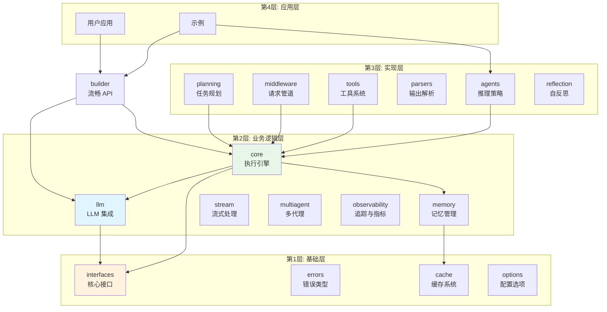
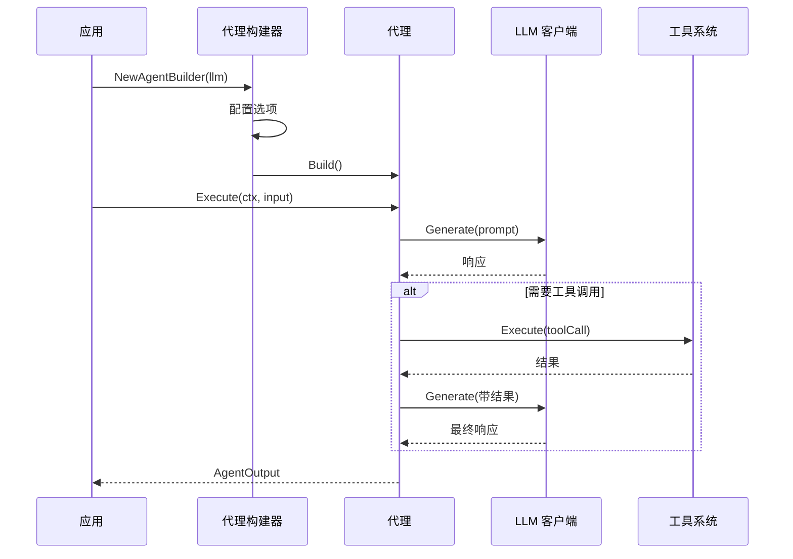

# GoAgent - Go 语言 AI Agent 框架

[](https://go.dev/)
[](https://github.com/kart-io/goagent/actions/workflows/ci.yml)
[](LICENSE)
[](docs/)
[](https://github.com/kart-io/goagent/releases/latest)
[](https://goreportcard.com/report/github.com/kart-io/goagent)
[](https://pkg.go.dev/github.com/kart-io/goagent)
[](https://deepwiki.com/kart-io/goagent)

[English](README.md) | [中文](README_CN.md)

GoAgent 是一个功能完整、生产就绪的 Go 语言 AI Agent 框架，灵感来源于 LangChain。它提供智能代理、工具系统、记忆管理、LLM 抽象和编排能力，具备企业级特性如分布式追踪、持久化存储和多代理协调。

## 特性

- **智能代理** - 具备推理能力和工具执行的自主代理
- **高性能** - 热路径优化，InvokeFast 减少 4-6% 延迟
- **灵活架构** - 4 层模块化设计，职责分离清晰
- **LLM 抽象** - 支持多个 LLM 提供商（OpenAI、Anthropic Claude、Cohere、HuggingFace、Gemini、DeepSeek）
- **记忆管理** - 对话历史、案例推理和向量存储
- **工具系统** - 可扩展工具注册表，支持并行执行和依赖管理
- **状态管理** - 线程安全状态，支持检查点和持久化
- **可观测性** - OpenTelemetry 集成，分布式追踪
- **企业就绪** - 支持 Redis、PostgreSQL、NATS 消息队列和高可用

## 快速开始

### 安装

```bash
go get github.com/kart-io/goagent
```

### 基础示例

```go
package main

import (
    "context"
    "log"
    "time"

    "github.com/kart-io/goagent/builder"
    "github.com/kart-io/goagent/llm"
)

func main() {
    // 创建 LLM 客户端
    llmClient := llm.NewOpenAIClient("your-api-key")

    // 使用流畅 API 构建代理
    agent, err := builder.NewAgentBuilder(llmClient).
        WithSystemPrompt("你是一个有帮助的助手").
        WithMaxIterations(10).
        WithTimeout(30 * time.Second).
        Build()

    if err != nil {
        log.Fatal(err)
    }

    // 执行代理
    result, err := agent.Execute(context.Background(), "分析最新的销售数据")
    if err != nil {
        log.Fatal(err)
    }

    log.Printf("结果: %v", result)
}
```

### 使用预配置代理

```go
// 创建 RAG 代理用于文档问答
ragAgent, err := builder.RAGAgent(llmClient, vectorStore)

// 创建分析代理（低温度，高精度）
analysisAgent, err := builder.AnalysisAgent(llmClient, dataSource)

// 创建监控代理（长时间运行，周期性检查）
monitoringAgent, err := builder.MonitoringAgent(llmClient, 30*time.Second)
```

## 架构设计

GoAgent 采用 4 层架构设计，确保可维护性和可扩展性：



### 请求流程



详见 [架构文档](docs/architecture/)。

## 模块参考

| 模块 | 说明 | 文档 |
|------|------|------|
| **[core](core/)** | 执行引擎、状态管理、运行时 | [README](core/README.md) |
| **[llm](llm/)** | LLM 提供商集成（OpenAI、Anthropic 等） | [README](llm/README.md) |
| **[builder](builder/)** | 代理构建流畅 API | [README](builder/README.md) |
| **[agents](agents/)** | 推理策略（ReAct、CoT、ToT） | [README](agents/README.md) |
| **[tools](tools/)** | 工具系统和注册表 | [README](tools/README.md) |
| **[memory](memory/)** | 记忆管理和向量存储 | [README](memory/README.md) |
| **[multiagent](multiagent/)** | 多代理协调 | [README](multiagent/README.md) |
| **[stream](stream/)** | 流式数据处理 | [README](stream/README.md) |
| **[middleware](middleware/)** | 请求/响应中间件 | [README](middleware/README.md) |
| **[observability](observability/)** | 追踪和指标 | [README](observability/README.md) |
| **[cache](cache/)** | 缓存系统 | [README](cache/README.md) |
| **[interfaces](interfaces/)** | 核心接口定义 | [README](interfaces/README.md) |
| **[errors](errors/)** | 错误类型和处理 | [README](errors/README.md) |
| **[planning](planning/)** | 任务规划系统 | [README](planning/README.md) |
| **[reflection](reflection/)** | 自反思代理 | [README](reflection/README.md) |
| **[prompt](prompt/)** | 提示词模板 | [README](prompt/README.md) |
| **[parsers](parsers/)** | 输出解析 | [README](parsers/README.md) |
| **[options](options/)** | 配置选项 | [README](options/README.md) |
| **[toolkits](toolkits/)** | 工具包管理 | [README](toolkits/README.md) |
| **[testing](testing/)** | 测试工具和 Mock | [README](testing/README.md) |
| **[distributed](distributed/)** | 分布式计算 | [README](distributed/README.md) |

## 核心组件

### 代理（Agents）

自主实体，能够推理、使用工具和做出决策。

```go
type Agent interface {
    Execute(ctx context.Context, input *AgentInput) (*AgentOutput, error)
    Name() string
    Description() string
    Capabilities() []string
}
```

### 工具（Tools）

可扩展函数，代理可以调用它们与外部系统交互。

```go
type Tool interface {
    Name() string
    Description() string
    Execute(ctx context.Context, input map[string]interface{}) (interface{}, error)
}
```

### 记忆（Memory）

对话、案例和应用状态的持久存储。

```go
type Manager interface {
    AddConversation(ctx context.Context, conv *Conversation) error
    GetConversationHistory(ctx context.Context, sessionID string, limit int) ([]*Conversation, error)
    SearchSimilarCases(ctx context.Context, query string, limit int) ([]*Case, error)
}
```

### 构建器（Builder）

用于构建复杂配置代理的流畅 API。

```go
agent := builder.NewAgentBuilder(llmClient).
    WithSystemPrompt("你是一个专业分析师").
    WithTools(searchTool, calcTool).
    WithMemory(memoryManager).
    WithMiddleware(loggingMW, cacheMW).
    Build()
```

## 高级功能

### 状态管理与检查点

```go
// 创建检查点器用于会话持久化
checkpointer := core.NewRedisCheckpointer(redisClient, "agent:")

agent := builder.NewAgentBuilder(llmClient).
    WithCheckpointer(checkpointer).
    WithConfig(&builder.AgentConfig{EnableAutoSave: true}).
    Build()
```

### 分布式追踪

```go
// 初始化 OpenTelemetry
provider := observability.NewTelemetryProvider(&observability.TelemetryConfig{
    ServiceName: "my-agent",
    OTLPEndpoint: "localhost:4317",
})

// 追踪自动跨代理调用传播
```

### 多代理通信

```go
// 基于 NATS 的分布式通信
comm := multiagent.NewNATSCommunicator("agent-1", natsConn, tracer)

// 发送消息给另一个代理
message := &multiagent.AgentMessage{
    From: "agent-1",
    To: "agent-2",
    Type: multiagent.MessageTypeRequest,
    Payload: map[string]interface{}{"task": "analyze"},
}
comm.Send(ctx, "agent-2", message)
```

### 并行工具执行

```go
// 并发执行多个工具
executor := tools.NewToolExecutor(tools.ToolExecutorConfig{
    MaxConcurrency: 10,
    Timeout: 30 * time.Second,
})

results, err := executor.ExecuteParallel(ctx, []tools.ToolCallRequest{
    {Tool: searchTool, Input: map[string]interface{}{"query": "Go"}},
    {Tool: calcTool, Input: map[string]interface{}{"expr": "2+2"}},
})
```

## 文档

- **[快速入门指南](docs/guides/quickstart.md)** - 5 分钟快速上手
- **[架构设计](docs/architecture/)** - 系统设计和导入分层
- **[迁移指南](docs/guides/MIGRATION_GUIDE.md)** - 从旧版本升级
- **[LLM 提供商](docs/guides/LLM_PROVIDERS.md)** - 支持的 LLM 集成
- **[测试最佳实践](docs/development/TESTING_BEST_PRACTICES.md)** - 编写测试
- **[生产部署](docs/guides/PRODUCTION_DEPLOYMENT.md)** - 大规模部署
- **[API 参考](docs/api/)** - 完整 API 文档

完整指南见 [DOCUMENTATION_INDEX.md](DOCUMENTATION_INDEX.md)。

## 示例

在 [`examples/`](examples/) 目录中探索工作示例：

- **基础** - 简单代理创建和执行
- **高级** - 复杂工作流与状态管理
- **集成** - 多组件系统
- **流式** - 实时流式响应
- **可观测性** - 追踪和指标
- **多代理** - 代理间通信

运行示例：

```bash
go run examples/basic/01-simple-agent/main.go
```

## 性能

### 核心性能指标

- **构建器构建**: ~100μs/op
- **代理执行**: ~1ms/op（不含 LLM 调用）
- **中间件开销**: <5%
- **并行工具执行**: 线性扩展至 100+ 并发调用
- **缓存命中率**: >90%（使用 LRU 缓存）
- **OpenTelemetry 开销**: <2%（10% 采样率）

### InvokeFast 优化 🚀

GoAgent 提供 **InvokeFast**，一种热路径优化，为内部调用绕过回调和中间件：

**性能提升**（ReActAgent 基准测试，Intel i7-14700KF）：
- **延迟**: 执行快 4-6%（1494ns → 1399ns 每次调用）
- **内存**: 分配减少 5-8%
- **链式调用（10x）**: 快 4.4%（15508ns → 14825ns）

**自动优化**：
- `ChainableAgent` 自动为内部调用使用 InvokeFast
- `SupervisorAgent` 优化子代理协调
- `ExecutorAgent` 优化包装代理执行
- 现有应用零代码更改

**适用场景**：
- 嵌套调用的多代理系统
- 高频推理循环（ReAct）
- 多代理链式组合
- 性能关键的生产负载

详见 [InvokeFast 优化指南](docs/guides/INVOKE_FAST_OPTIMIZATION.md)。

### 代理基准测试

```go
import "testing"

func BenchmarkYourAgent(b *testing.B) {
    agent := createYourAgent()
    ctx := context.Background()
    input := &core.AgentInput{Task: "test"}

    b.Run("Standard", func(b *testing.B) {
        for i := 0; i < b.N; i++ {
            _, _ = agent.Invoke(ctx, input)
        }
    })

    b.Run("Optimized", func(b *testing.B) {
        for i := 0; i < b.N; i++ {
            _, _ = agent.InvokeFast(ctx, input)
        }
    })
}
```

详见 [测试覆盖率报告](docs/development/TEST_COVERAGE_REPORT.md)。

## 贡献

欢迎贡献！请查看 [CONTRIBUTING.md](CONTRIBUTING.md) 了解指南。

### 开发设置

```bash
# 克隆仓库
git clone https://github.com/kart-io/goagent.git
cd goagent

# 安装依赖
go mod download

# 运行测试
go test ./...

# 运行 linter
golangci-lint run

# 运行示例
go run examples/basic/01-simple-agent/main.go
```

### 代码质量

- 最低测试覆盖率: 80%
- 所有公共 API 必须有文档
- 遵循 [导入分层规则](docs/architecture/IMPORT_LAYERING.md)
- 运行验证: `./scripts/verify_imports.sh`

## 路线图

- [x] 更多 LLM 提供商（Anthropic Claude、Cohere、Hugging Face）
- [ ] 生产级向量数据库集成（Qdrant、Milvus、Pinecone）
- [ ] 图形化工作流设计器
- [ ] 增强监控仪表板
- [ ] 代理版本控制和 A/B 测试
- [ ] 性能优化（连接池、批处理）

历史规划见 [归档路线图](docs/archive/roadmaps/)。

## 设计原则

1. **接口优先** - 清晰的接口支持多种实现
2. **可组合性** - 组件可以灵活组合和扩展
3. **类型安全** - 强类型在编译时捕获错误
4. **上下文感知** - 所有操作支持 `context.Context`
5. **可观测性** - 内置追踪、指标和日志
6. **易用性** - 合理默认值和流畅 API

## 许可证

本项目采用 Apache License 2.0 许可证 - 详见 [LICENSE](LICENSE) 文件。

## 支持

- **文档**: [docs/](docs/)
- **问题**: [GitHub Issues](https://github.com/kart-io/goagent/issues)
- **讨论**: [GitHub Discussions](https://github.com/kart-io/goagent/discussions)

## 致谢

GoAgent 的灵感来源：
- [LangChain](https://github.com/langchain-ai/langchain) - Python AI 框架
- [LangGraph](https://github.com/langchain-ai/langgraph) - 基于图的代理工作流
- [AutoGen](https://github.com/microsoft/autogen) - 多代理对话

---

**状态**: 生产就绪
**版本**: 1.0
**Go 版本**: 1.25.0+
**最后更新**: 2025-12-07
