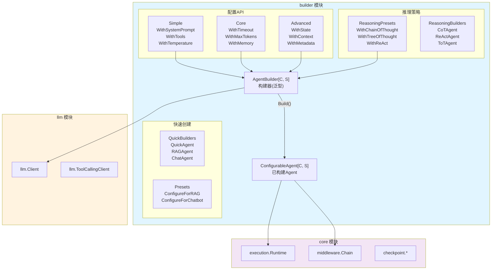
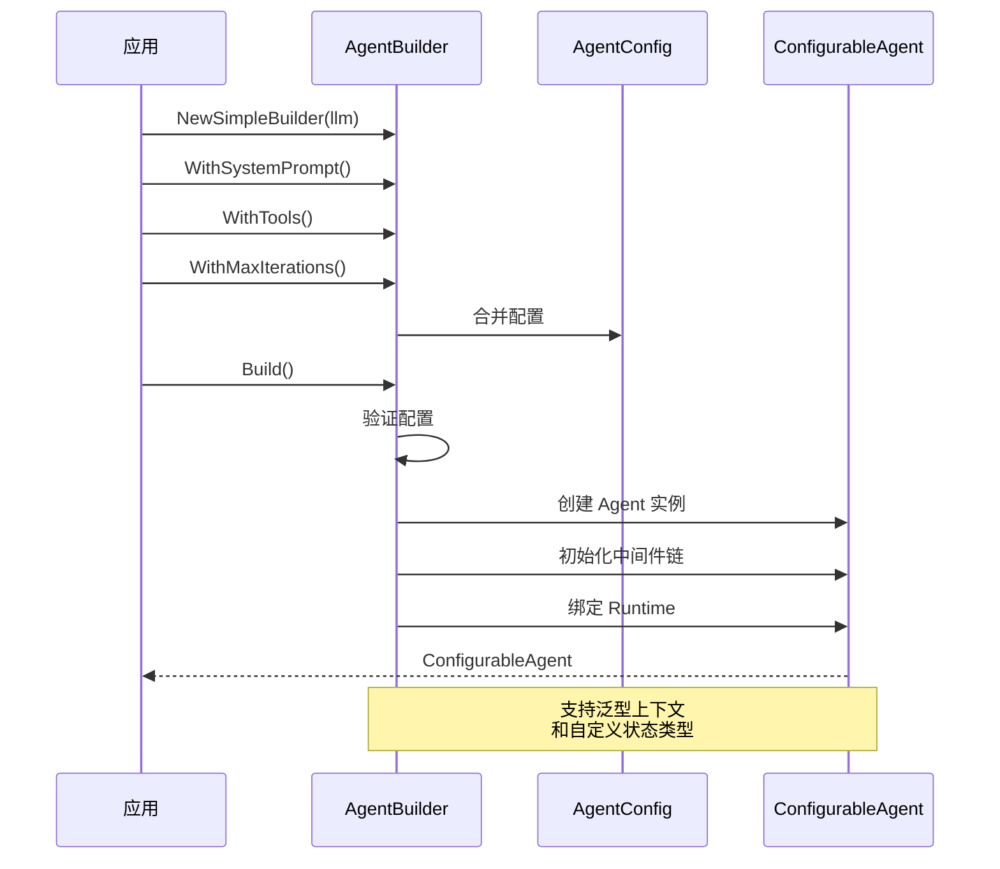

# builder Agent 构建器

本模块是 goagent 框架的 Agent 构造工厂，提供流畅 API（Fluent API）模式构建不同类型的 Agent。

## 目录

- [架构设计](#架构设计)
- [核心组件](#核心组件)
- [使用方法](#使用方法)
- [API 层级](#api-层级)
- [推理策略](#推理策略)
- [代码结构](#代码结构)

## 架构设计

### 系统架构图



### 构建流程



### 架构分层

```text
┌─────────────────────────────────────────────────────────┐
│              应用层 (Application)                        │
│         使用 builder 构建和使用 Agent                    │
└─────────────────────────────────────────────────────────┘
                          ↓
┌─────────────────────────────────────────────────────────┐
│            API 层 (builder 模块)                         │
│  ┌──────────────────────────────────────────────────┐  │
│  │  快速创建API (80% 场景)                          │  │
│  │  - QuickAgent, RAGAgent, ChatAgent ...          │  │
│  └──────────────────────────────────────────────────┘  │
│  ┌──────────────────────────────────────────────────┐  │
│  │  通用构建API (95% 场景)                          │  │
│  │  - NewSimpleBuilder / NewAgentBuilder           │  │
│  │  - WithXxx() 流畅配置链                         │  │
│  └──────────────────────────────────────────────────┘  │
│  ┌──────────────────────────────────────────────────┐  │
│  │  推理策略API (特定场景)                          │  │
│  │  - WithChainOfThought / WithReAct ...           │  │
│  └──────────────────────────────────────────────────┘  │
└─────────────────────────────────────────────────────────┘
```

## 核心组件

### 1. AgentBuilder 构建器

泛型构建器，支持自定义上下文和状态类型：

```go
type AgentBuilder[C any, S core.State] struct {
    llmClient    llm.Client
    tools        []interfaces.Tool
    systemPrompt string
    state        S
    store        store.Store
    checkpointer checkpoint.Checkpointer
    middlewares  []middleware.Middleware
    config       *AgentConfig
    callbacks    []core.Callback
    // ...
}
```

### 2. ConfigurableAgent 可配置 Agent

构建完成后的 Agent 实例：

```go
type ConfigurableAgent[C any, S core.State] struct {
    llmClient     llm.Client
    tools         []interfaces.Tool
    systemPrompt  string
    runtime       *execution.Runtime[C, S]
    chain         *middleware.MiddlewareChain
    config        *AgentConfig
    memoryManager interfaces.MemoryManager
    // ...
}
```

### 3. AgentConfig 配置

运行时配置选项：

| 配置项 | 默认值 | 说明 |
|--------|--------|------|
| `MaxIterations` | 10 | 最大迭代次数 |
| `Timeout` | 5min | 执行超时 |
| `MaxTokens` | 2000 | LLM 最大 token 数 |
| `Temperature` | 0.7 | 采样温度 |
| `EnableStreaming` | false | 流式响应 |
| `EnableAutoSave` | true | 自动保存状态 |
| `SaveInterval` | 30s | 自动保存间隔 |
| `Verbose` | false | 详细日志 |
| `MaxConversationHistory` | 20 | 对话历史轮数 |

## 使用方法

### 快速创建（推荐）

```go
// 最简单的方式
agent, err := builder.QuickAgent(llmClient, "你是一个智能助手")
if err != nil {
    log.Fatal(err)
}

// RAG Agent
agent, err := builder.RAGAgent(llmClient, retriever)

// 聊天 Agent
agent, err := builder.ChatAgent(llmClient, "用户名")

// 分析 Agent
agent, err := builder.AnalysisAgent(llmClient, dataSource)
```

### 流畅 API 构建

```go
agent, err := builder.NewSimpleBuilder(llmClient).
    WithSystemPrompt("你是一个专业的数据分析师").
    WithTools(calculatorTool, searchTool).
    WithMaxIterations(5).
    WithTimeout(2 * time.Minute).
    WithTemperature(0.5).
    WithOutputFormat(builder.OutputFormatJSON).
    Build()

if err != nil {
    log.Fatal(err)
}

// 执行
output, err := agent.Execute(ctx, "分析这些数据...")
```

### 高级配置

```go
agent, err := builder.NewAgentBuilder[MyContext, *MyState](llmClient).
    // 基础配置
    WithSystemPrompt("系统提示").
    WithTools(tools...).

    // 运行时配置
    WithMaxIterations(10).
    WithTimeout(5 * time.Minute).
    WithMaxTokens(4000).

    // 存储和状态
    WithStore(redisStore).
    WithCheckpointer(checkpoint.NewRedisSaver(redisClient)).
    WithState(initialState).
    WithSessionID("session-001").

    // 对话记忆
    WithMemory(memoryManager).
    WithMaxConversationHistory(50).

    // 中间件
    WithMiddleware(
        middleware.NewLoggingMiddleware(logger),
        middleware.NewTimingMiddleware(),
        middleware.NewRateLimiterMiddleware(100),
    ).

    // 回调
    WithCallbacks(
        core.NewMetricsCallback(metrics),
        core.NewTracingCallback(tracer),
    ).

    // 错误处理
    WithErrorHandler(func(err error) error {
        log.Printf("错误: %v", err)
        return err
    }).

    Build()
```

### 推理策略 Agent

```go
// Chain-of-Thought Agent
agent := builder.NewSimpleBuilder(llmClient).
    WithChainOfThought().
    Build()

// ReAct Agent
agent := builder.NewSimpleBuilder(llmClient).
    WithReAct(react.ReActConfig{
        MaxIterations: 5,
        Verbose:       true,
    }).
    WithTools(searchTool, calculatorTool).
    Build()

// Tree-of-Thought Agent
agent := builder.NewSimpleBuilder(llmClient).
    WithTreeOfThought(tot.ToTConfig{
        MaxDepth:   3,
        BeamWidth:  4,
    }).
    Build()

// 快速创建推理 Agent
cotAgent := builder.QuickCoTAgent(llmClient)
reactAgent := builder.QuickReActAgent(llmClient, tools)
totAgent := builder.QuickToTAgent(llmClient)
```

### 场景预设

```go
// RAG 场景预设
agent := builder.NewSimpleBuilder(llmClient).
    ConfigureForRAG().
    WithTools(retrieverTool).
    Build()

// 聊天机器人预设
agent := builder.NewSimpleBuilder(llmClient).
    ConfigureForChatbot().
    WithMaxConversationHistory(100).
    Build()

// 数据分析预设
agent := builder.NewSimpleBuilder(llmClient).
    ConfigureForAnalysis().
    WithTools(dataTools...).
    Build()
```

## API 层级

### Simple API（80% 场景）

最常用的配置方法：

```go
WithSystemPrompt(prompt string)       // 系统提示
WithTools(tools ...interfaces.Tool)   // 添加工具
WithMaxIterations(max int)            // 最大迭代
WithTemperature(temp float64)         // 采样温度
WithOutputFormat(format OutputFormat) // 输出格式
```

### Core API（95% 场景）

标准功能配置：

```go
WithTimeout(timeout time.Duration)    // 超时设置
WithMaxTokens(max int)                // Token 限制
WithVerbose(verbose bool)             // 详细日志
WithMaxConversationHistory(max int)   // 对话历史
WithCallbacks(callbacks ...Callback)  // 回调
WithErrorHandler(handler func(error) error) // 错误处理
WithMemory(memMgr MemoryManager)      // 对话记忆
WithStore(st store.Store)             // 键值存储
WithCheckpointer(cp Checkpointer)     // 检查点
WithMiddleware(mw ...Middleware)      // 中间件
```

### Advanced API（100% 场景）

高级定制配置：

```go
WithState(state S)                    // 自定义状态
WithContext(context C)                // 自定义上下文
WithMetadata(key string, value interface{}) // 元数据
WithTelemetry(provider interface{})   // OpenTelemetry
WithCommunicator(comm interface{})    // Agent 间通信
WithSessionID(sessionID string)       // 会话 ID
WithAutoSaveEnabled(enabled bool)     // 自动保存
WithSaveInterval(interval time.Duration) // 保存间隔
WithStreamingEnabled(enabled bool)    // 流式响应
```

## 推理策略

### 支持的推理算法

| 策略 | 说明 | 适用场景 |
|------|------|---------|
| **CoT** | Chain-of-Thought 链式思维 | 逻辑推理、数学问题 |
| **ReAct** | Reasoning + Acting | 需要工具调用的任务 |
| **ToT** | Tree-of-Thought 树状思维 | 复杂决策、规划问题 |
| **GoT** | Graph-of-Thought 图状思维 | 多路径推理 |
| **PoT** | Program-of-Thought | 编程问题、计算任务 |
| **SoT** | Skeleton-of-Thought | 长文本生成 |
| **MetaCoT** | 元推理 | 自适应策略选择 |

### 配置推理策略

```go
// Zero-shot CoT
agent := builder.NewSimpleBuilder(llmClient).
    WithZeroShotCoT().
    Build()

// Few-shot CoT
examples := []cot.CoTExample{
    {Input: "问题1", Reasoning: "推理1", Output: "答案1"},
    {Input: "问题2", Reasoning: "推理2", Output: "答案2"},
}
agent := builder.NewSimpleBuilder(llmClient).
    WithFewShotCoT(examples).
    Build()

// Beam Search ToT
agent := builder.NewSimpleBuilder(llmClient).
    WithBeamSearchToT(4, 3). // beamWidth=4, maxDepth=3
    Build()

// Monte Carlo ToT
agent := builder.NewSimpleBuilder(llmClient).
    WithMonteCarloToT().
    Build()
```

## 代码结构

```text
builder/
├── builder.go              # 核心构建器
├── configurable_agent.go   # 已构建 Agent 实例
├── agent_options.go        # Agent 配置方法
├── config_options.go       # 运行时配置方法
├── runtime_options.go      # 运行时组件配置
├── tool_options.go         # 工具配置
├── presets.go              # 场景预设配置
├── quick_builders.go       # 快速创建函数
├── reasoning_builders.go   # 推理型 Agent 构建
├── reasoning_presets.go    # 推理策略预设
├── builder_test.go         # 单元测试
└── reasoning_presets_test.go # 推理算法测试
```

## 输出格式

支持多种输出格式：

```go
const (
    OutputFormatDefault   = ""          // 不指定格式
    OutputFormatPlainText = "plain_text" // 纯文本
    OutputFormatMarkdown  = "markdown"   // Markdown
    OutputFormatJSON      = "json"       // JSON
    OutputFormatCustom    = "custom"     // 自定义
)

// 使用
agent := builder.NewSimpleBuilder(llmClient).
    WithOutputFormat(builder.OutputFormatJSON).
    Build()

// 自定义格式
agent := builder.NewSimpleBuilder(llmClient).
    WithCustomOutputFormat("请以 YAML 格式输出结果").
    Build()
```

## 执行 Agent

```go
// 基础执行
output, err := agent.Execute(ctx, "你的问题或任务")

// 带工具调用的执行
output, err := agent.ExecuteWithTools(ctx, input)

// 生命周期管理
err := agent.Initialize(ctx)
defer agent.Shutdown(ctx)

// 获取状态
state := agent.GetState()

// 获取指标
metrics := agent.GetMetrics()
```

## 扩展阅读

- [core](../core/) - 核心执行引擎
- [agents](../agents/) - 推理策略实现
- [llm](../llm/) - LLM 客户端
- [tools](../tools/) - 工具系统
