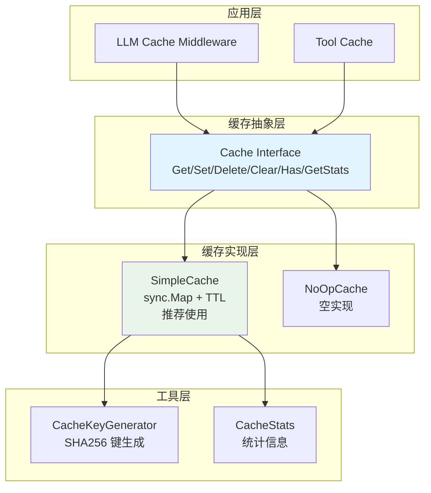
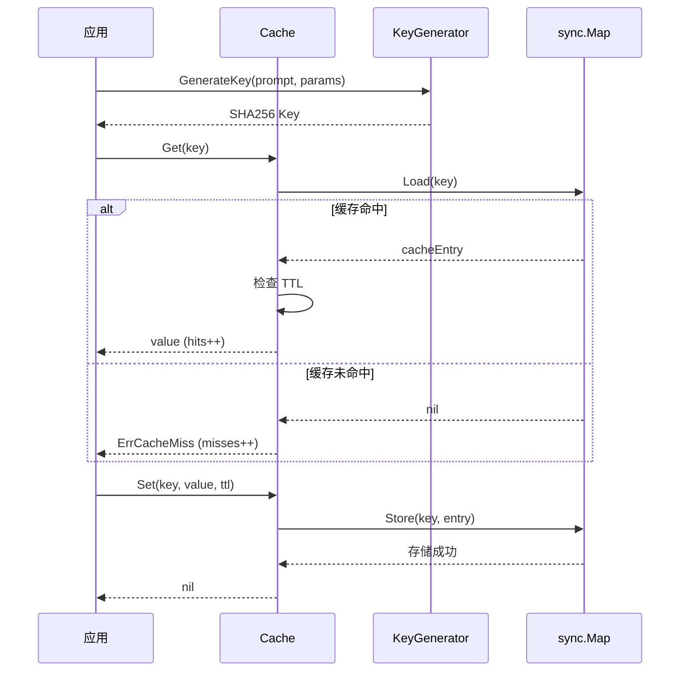

# cache 缓存系统

本模块是 goagent 框架的缓存系统，为 LLM 调用和工具执行提供缓存能力。

## 目录

- [架构设计](#架构设计)
- [核心组件](#核心组件)
- [使用方法](#使用方法)
- [API 参考](#api-参考)
- [代码结构](#代码结构)

## 架构设计

### 系统架构图



### 缓存访问流程



## 核心组件

### 1. Cache 接口

统一的缓存接口定义：

```go
type Cache interface {
    Get(ctx context.Context, key string) (interface{}, error)
    Set(ctx context.Context, key string, value interface{}, ttl time.Duration) error
    Delete(ctx context.Context, key string) error
    Clear(ctx context.Context) error
    Has(ctx context.Context, key string) (bool, error)
    GetStats() CacheStats
}
```

### 2. SimpleCache

推荐使用的缓存实现，基于 `sync.Map + TTL`：

```go
type SimpleCache struct {
    data   sync.Map
    ttl    time.Duration
    hits   atomic.Int64
    misses atomic.Int64
}
```

### 3. CacheKeyGenerator

基于 SHA256 的缓存键生成器：

```go
type CacheKeyGenerator struct {
    prefix string
}
```

### 4. CacheStats

缓存统计信息：

```go
type CacheStats struct {
    Hits      int64   // 命中次数
    Misses    int64   // 未命中次数
    Sets      int64   // 设置次数
    Deletes   int64   // 删除次数
    Evictions int64   // 驱逐次数
    Size      int64   // 当前大小
    MaxSize   int64   // 最大大小
    HitRate   float64 // 命中率
}
```

## 使用方法

### 基础缓存操作

```go
// 创建缓存（推荐）
cache := cache.NewSimpleCache(5 * time.Minute)

// 设置缓存
err := cache.Set(ctx, "key", "value", 10*time.Minute)

// 获取缓存
value, err := cache.Get(ctx, "key")
if err == cache.ErrCacheMiss {
    // 缓存未命中
}

// 检查是否存在
exists, err := cache.Has(ctx, "key")

// 删除缓存
err := cache.Delete(ctx, "key")

// 清空所有缓存
err := cache.Clear(ctx)

// 获取统计信息
stats := cache.GetStats()
fmt.Printf("命中率: %.2f%%\n", stats.HitRate*100)

// 关闭缓存（停止后台清理）
cache.Close()
```

### LLM 调用缓存

```go
// 创建缓存
llmCache := cache.NewSimpleCache(5 * time.Minute)

// 创建键生成器
keyGen := cache.NewCacheKeyGenerator("llm")

// 生成缓存键
key := keyGen.GenerateKey(prompt, map[string]interface{}{
    "temperature": 0.7,
    "max_tokens":  100,
    "model":       "gpt-4",
})

// 检查缓存
if cached, err := llmCache.Get(ctx, key); err == nil {
    return cached.(*CompletionResponse), nil
}

// 调用 LLM
response, err := llmClient.Complete(ctx, request)
if err != nil {
    return nil, err
}

// 缓存结果
llmCache.Set(ctx, key, response, 5*time.Minute)
return response, nil
```

### 工具执行缓存

```go
// 使用缓存中间件
cacheMW := middleware.NewCachingMiddleware(
    middleware.WithCache(cache.NewSimpleCache(10*time.Minute)),
    middleware.WithTTL(10*time.Minute),
)

// 包装工具
cachedTool := cacheMW.Wrap(originalTool)

// 执行（自动缓存）
result, err := cachedTool.Invoke(ctx, input)
```

### 键生成

```go
// 创建键生成器
gen := cache.NewCacheKeyGenerator("llm")

// 复杂键生成（基于 prompt + 参数）
key := gen.GenerateKey("hello world", map[string]interface{}{
    "temp":       0.7,
    "max_tokens": 100,
})
// 输出: llm:sha256:abc123...

// 简单键生成
key := gen.GenerateKeySimple("model", "gpt4", "system")
// 输出: llm:model:gpt4:system
```

### 禁用缓存

```go
// 使用空缓存实现
cache := cache.NewNoOpCache()

// 所有操作都是空操作
cache.Set(ctx, "key", "value", time.Hour) // 不存储
value, err := cache.Get(ctx, "key")        // 总是返回 ErrCacheMiss
```

### 基于配置创建

```go
// 默认配置
config := cache.DefaultCacheConfig()

// 自定义配置
config := &cache.CacheConfig{
    Enabled:         true,
    Type:            "simple",
    MaxSize:         10000,
    DefaultTTL:      5 * time.Minute,
    CleanupInterval: time.Minute,
}

// 从配置创建
c := cache.NewCacheFromConfig(config)
```

## API 参考

### 工厂函数

```go
// 创建简化缓存（推荐）
NewSimpleCache(ttl time.Duration) *SimpleCache

// 创建空缓存
NewNoOpCache() *NoOpCache

// 从配置创建
NewCacheFromConfig(config *CacheConfig) Cache

// 默认配置
DefaultCacheConfig() *CacheConfig
```

### Cache 接口

```go
Get(ctx context.Context, key string) (interface{}, error)
Set(ctx context.Context, key string, value interface{}, ttl time.Duration) error
Delete(ctx context.Context, key string) error
Clear(ctx context.Context) error
Has(ctx context.Context, key string) (bool, error)
GetStats() CacheStats
```

### CacheKeyGenerator

```go
// 创建键生成器
NewCacheKeyGenerator(prefix string) *CacheKeyGenerator

// 生成复杂键
GenerateKey(prompt string, params map[string]interface{}) string

// 生成简单键
GenerateKeySimple(parts ...string) string
```

### 错误类型

```go
var (
    ErrCacheMiss     = errors.New("cache miss")
    ErrCacheInvalid  = errors.New("invalid cache entry")
    ErrCacheDisabled = errors.New("cache is disabled")
)
```

## 代码结构

```text
cache/
├── base.go             # 核心接口和配置
├── simple_cache.go     # SimpleCache 实现
├── cache_test.go       # 测试
└── simple_cache_test.go
```

## 设计特点

### SimpleCache 优势

- **高性能**：使用 `sync.Map` 无锁读取
- **简洁可维护**：核心代码仅 ~180 行
- **自动清理**：后台定时清理过期条目
- **生命周期管理**：支持优雅关闭

### 自动清理机制

```go
// 后台清理线程
// 每 ttl/2 间隔运行一次清理
// 遍历并删除所有过期条目
func (c *SimpleCache) cleanupExpired() {
    now := time.Now()
    c.data.Range(func(key, value interface{}) bool {
        entry := value.(*cacheEntry)
        if now.After(entry.expiresAt) {
            c.data.Delete(key)
        }
        return true
    })
}
```

## 扩展阅读

- [llm/cache](../llm/cache/) - LLM 语义缓存
- [tools/middleware](../tools/middleware/) - 工具缓存中间件
- [core](../core/) - 核心执行引擎
