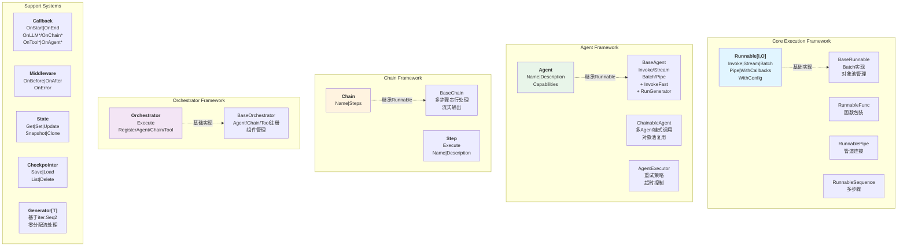
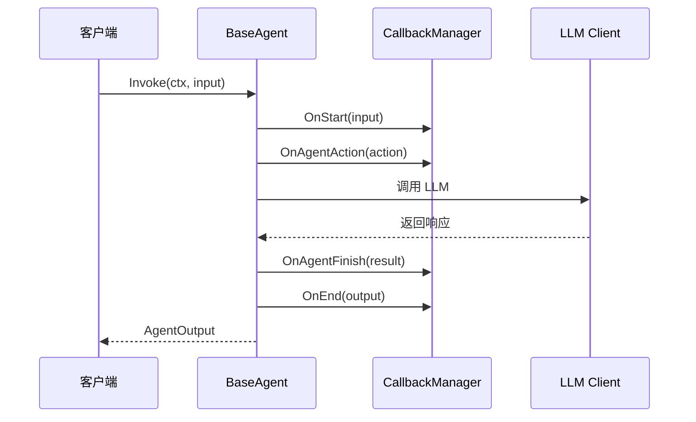
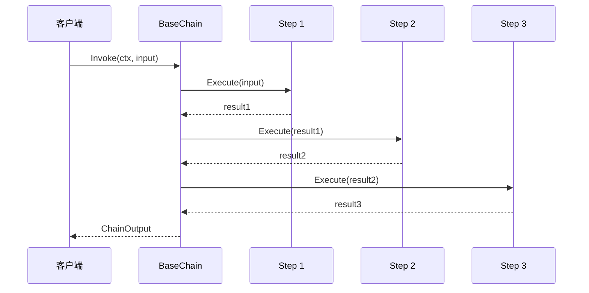
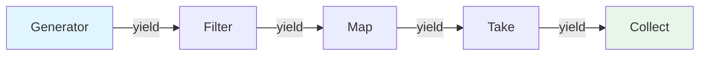

# core 核心执行引擎

本模块是 goagent 框架的核心执行引擎，提供统一的可执行接口、智能体执行框架、链式处理和工作流编排能力。

## 目录

- [架构设计](#架构设计)
- [核心组件](#核心组件)
- [执行流程](#执行流程)
- [使用方法](#使用方法)
- [API 参考](#api-参考)
- [代码结构](#代码结构)

## 架构设计

### 系统架构图



### 组件关系图

```mermaid
classDiagram
    class Runnable~I,O~ {
        <<interface>>
        +Invoke(ctx, input I) (O, error)
        +Stream(ctx, input I) (<-chan StreamChunk~O~, error)
        +Batch(ctx, inputs []I) ([]O, error)
        +Pipe(next Runnable~O,any~) Runnable~I,any~
        +WithCallbacks(...Callback) Runnable~I,O~
        +WithConfig(RunnableConfig) Runnable~I,O~
    }

    class Agent {
        <<interface>>
        +Name() string
        +Description() string
        +Capabilities() []string
    }

    class Chain {
        <<interface>>
        +Name() string
        +Steps() int
    }

    class Orchestrator {
        <<interface>>
        +Execute(ctx, request) (*OrchestratorResponse, error)
        +RegisterAgent(name, agent) error
        +RegisterChain(name, chain) error
        +RegisterTool(name, tool) error
        +Name() string
    }

    class Callback {
        <<interface>>
        +OnStart(ctx, input) error
        +OnEnd(ctx, output) error
        +OnError(ctx, err) error
    }

    class State {
        <<interface>>
        +Get(key) (interface{}, bool)
        +Set(key, value)
        +Update(updates map)
        +Snapshot() map
        +Clone() State
    }

    class Checkpointer {
        <<interface>>
        +Save(ctx, threadID, state) error
        +Load(ctx, threadID) (State, error)
        +List(ctx) ([]CheckpointInfo, error)
        +Delete(ctx, threadID) error
    }

    Runnable <|-- Agent : 继承
    Runnable <|-- Chain : 继承
    Agent --> Callback : 使用
    Agent --> State : 访问
    Agent --> Checkpointer : 保存
```

## 核心组件

### 1. Runnable 统一可执行接口

`Runnable[I, O]` 是核心抽象，所有可执行组件都实现此接口：

| 方法 | 说明 |
|------|------|
| `Invoke(ctx, input)` | 单次执行 |
| `Stream(ctx, input)` | 流式执行 |
| `Batch(ctx, inputs)` | 批量执行 |
| `Pipe(next)` | 管道连接 |
| `WithCallbacks(...)` | 添加回调 |
| `WithConfig(config)` | 配置设置 |

### 2. Agent 智能体框架

负责 LLM 推理、工具调用和记忆管理：

```go
type Agent interface {
    Runnable[*AgentInput, *AgentOutput]
    Name() string
    Description() string
    Capabilities() []string
}
```

### 3. Chain 链式处理

支持多步骤串行数据流处理：

```go
type Chain interface {
    Runnable[*ChainInput, *ChainOutput]
    Name() string
    Steps() int
}
```

### 4. Orchestrator 工作流编排

协调复杂多步骤工作流：

```go
type Orchestrator interface {
    Execute(ctx, request *OrchestratorRequest) (*OrchestratorResponse, error)
    RegisterAgent(name string, agent Agent) error
    RegisterChain(name string, chain Chain) error
    RegisterTool(name string, tool Tool) error
}
```

### 5. Callback 回调系统

提供全方位的执行监控：

| 回调类型 | 说明 |
|---------|------|
| `OnStart/OnEnd/OnError` | 基础生命周期 |
| `OnLLMStart/OnLLMEnd` | LLM 调用监控 |
| `OnChainStart/OnChainEnd` | Chain 执行监控 |
| `OnToolStart/OnToolEnd` | 工具调用监控 |
| `OnAgentAction/OnAgentFinish` | Agent 行为监控 |

### 6. State 状态管理

线程安全的状态存储：

```go
type State interface {
    Get(key string) (interface{}, bool)
    Set(key string, value interface{})
    Update(updates map[string]interface{})
    Snapshot() map[string]interface{}
    Clone() State
}
```

### 7. Checkpoint 持久化

会话状态保存与恢复：

```go
type Checkpointer interface {
    Save(ctx, threadID string, state State) error
    Load(ctx, threadID string) (State, error)
    List(ctx) ([]CheckpointInfo, error)
    Delete(ctx, threadID string) error
}
```

## 执行流程

### Agent 执行流程



### Chain 执行流程



### Generator 流式处理



## 使用方法

### 创建和使用 Agent

```go
// 创建 Agent
agent := core.NewBaseAgent("assistant", "AI 助手", []string{"对话", "分析"})

// 配置回调
agent = agent.WithCallbacks(
    core.NewLoggingCallback(logger, true),
    core.NewMetricsCallback(metrics),
)

// 执行
input := &core.AgentInput{
    Task: "分析这段文本",
    Context: map[string]interface{}{
        "text": "需要分析的内容...",
    },
}

output, err := agent.Invoke(ctx, input)
if err != nil {
    log.Fatal(err)
}

fmt.Printf("结果: %v\n", output.Result)
fmt.Printf("耗时: %v\n", output.Latency)
```

### 创建和使用 Chain

```go
// 定义步骤
steps := []core.Step{
    &DataCollectorStep{},
    &DataProcessorStep{},
    &DataAnalyzerStep{},
}

// 创建 Chain
chain := core.NewBaseChain("data-pipeline", steps)

// 执行
input := &core.ChainInput{
    Data: rawData,
    Vars: map[string]interface{}{
        "format": "json",
    },
}

output, err := chain.Invoke(ctx, input)
if err != nil {
    log.Fatal(err)
}

fmt.Printf("处理结果: %v\n", output.Data)
fmt.Printf("执行步骤: %d\n", len(output.StepsExecuted))
```

### 使用 Orchestrator

```go
// 创建编排器
orchestrator := core.NewBaseOrchestrator("workflow")

// 注册组件
orchestrator.RegisterAgent("analyzer", analyzerAgent)
orchestrator.RegisterChain("pipeline", dataPipeline)
orchestrator.RegisterTool("calculator", calcTool)

// 执行请求
request := &core.OrchestratorRequest{
    TaskID:      "task-001",
    TaskType:    "analysis",
    Description: "执行数据分析流程",
    Parameters: map[string]interface{}{
        "source": "database",
    },
}

response, err := orchestrator.Execute(ctx, request)
```

### 使用 Generator 流式处理

```go
// 创建 Generator
gen := agent.RunGenerator(ctx, input)

// 使用 Go 1.25 迭代器语法
for item, err := range gen {
    if err != nil {
        log.Printf("错误: %v", err)
        continue
    }
    fmt.Printf("收到: %v\n", item)
}

// 或使用工具函数
results, err := core.Collect(gen)
filtered := core.Filter(gen, func(item *AgentOutput) bool {
    return item.Status == "success"
})
first10 := core.Take(gen, 10)
```

### 状态管理和检查点

```go
// 创建状态
state := core.NewAgentState()
state.Set("user_id", "12345")
state.Set("session_data", sessionMap)

// 保存检查点
checkpointer := checkpoint.NewInMemorySaver()
err := checkpointer.Save(ctx, "session-001", state)

// 恢复检查点
restoredState, err := checkpointer.Load(ctx, "session-001")
```

## API 参考

### Runnable API

```go
// 创建基础 Runnable
NewBaseRunnable[I, O]() *BaseRunnable[I, O]
NewRunnableFunc[I, O](fn func(ctx, I) (O, error)) *RunnableFunc[I, O]
NewRunnablePipe[I, M, O](first, second) *RunnablePipe[I, M, O]
NewRunnableSequence(...Runnable[any, any]) *RunnableSequence
```

### Agent API

```go
// 创建 Agent
NewBaseAgent(name, description string, capabilities []string) *BaseAgent
NewChainableAgent(name, description string, agents ...Agent) *ChainableAgent
NewAgentExecutor(agent Agent, opts ...ExecutorOption) *AgentExecutor

// 执行方法
agent.Invoke(ctx, input) (*AgentOutput, error)
agent.InvokeFast(ctx, input) (*AgentOutput, error)  // 快速路径
agent.Stream(ctx, input) (<-chan StreamChunk[*AgentOutput], error)
agent.Batch(ctx, inputs) ([]*AgentOutput, error)
agent.RunGenerator(ctx, input) Generator[*AgentOutput]
```

### Chain API

```go
// 创建 Chain
NewBaseChain(name string, steps []Step) *BaseChain

// 对象池优化
GetChainInput() *ChainInput
PutChainInput(input *ChainInput)
GetChainOutput() *ChainOutput
PutChainOutput(output *ChainOutput)
```

### Callback API

```go
// 创建回调
NewBaseCallback() *BaseCallback
NewCallbackManager(...Callback) *CallbackManager
NewLoggingCallback(logger Logger, verbose bool) *LoggingCallback
NewMetricsCallback(metrics MetricsCollector) *MetricsCallback
NewTracingCallback(tracer Tracer) *TracingCallback
```

### State API

```go
// 创建状态
state.NewAgentState() *AgentState
state.NewAgentStateWithData(data map[string]interface{}) *AgentState

// 类型安全访问
state.GetString(key) (string, bool)
state.GetInt(key) (int, bool)
state.GetBool(key) (bool, bool)
state.GetFloat64(key) (float64, bool)
```

### Checkpoint API

```go
// 创建 Checkpointer
checkpoint.NewInMemorySaver() *InMemorySaver
checkpoint.NewRedisSaver(client redis.Client) *RedisSaver
checkpoint.NewDistributedCheckpointer(config) *DistributedCheckpointer
```

## 代码结构

```text
core/
├── runnable.go              # 统一可执行接口
├── agent.go                 # Agent 执行框架
├── chain.go                 # 链式处理框架
├── orchestrator.go          # 工作流编排
├── callback.go              # 事件回调系统
├── generator.go             # Go 1.25 迭代器支持
├── fast_invoker.go          # 性能优化路径
├── interrupt.go             # 人工介入支持
├── lifecycle_manager.go     # 生命周期管理
├── panic_handler.go         # panic 恢复隔离
├── timeout.go               # 超时控制
├── errors.go                # 错误定义
├── state/                   # 状态管理
│   └── state.go
├── checkpoint/              # 会话持久化
│   ├── checkpointer.go
│   ├── memory_saver.go
│   └── distributed.go
├── middleware/              # 中间件系统
│   ├── middleware.go
│   └── chain.go
└── execution/               # 执行运行时
    └── runtime.go
```

## 性能优化

### 对象池复用

```go
// 使用对象池减少 GC 压力
input := core.GetChainInput()
defer core.PutChainInput(input)

input.Data = yourData
output, err := chain.Invoke(ctx, input)
```

### 快速调用路径

```go
// 跳过回调，提升 4-6% 性能
if fastAgent, ok := agent.(core.FastInvoker); ok {
    output, err := fastAgent.InvokeFast(ctx, input)
}

// 或使用便捷函数
output, err := core.TryInvokeFast(ctx, agent, input)
```

### Generator 零分配流处理

```go
// 基于 iter.Seq2，支持 early termination
gen := agent.RunGenerator(ctx, input)
for item, err := range gen {
    if shouldStop(item) {
        break  // 提前终止，不浪费资源
    }
    process(item)
}
```

## 扩展阅读

- [agents](../agents/) - 推理策略实现
- [builder](../builder/) - Agent 构建器
- [multiagent](../multiagent/) - 多智能体协作
- [middleware](../middleware/) - 中间件系统
