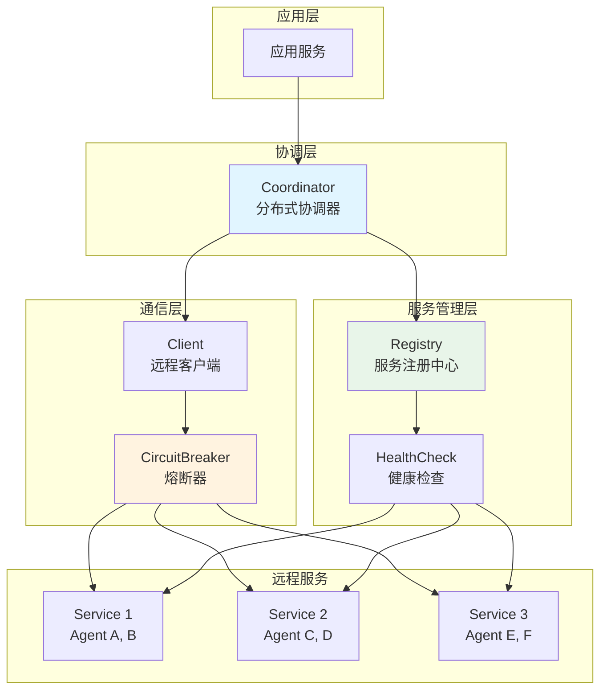
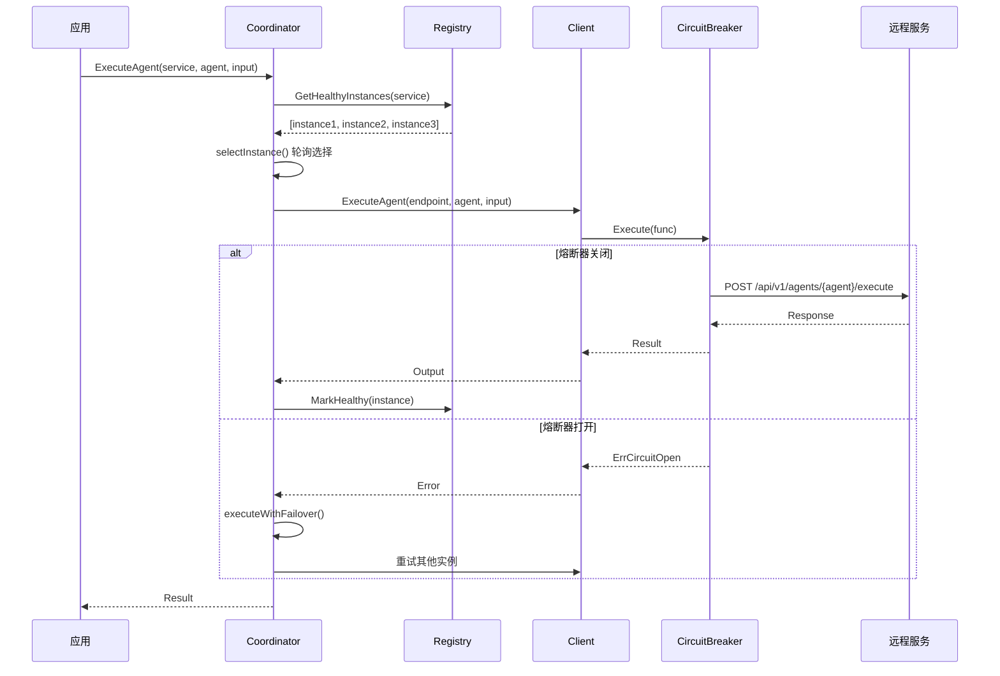
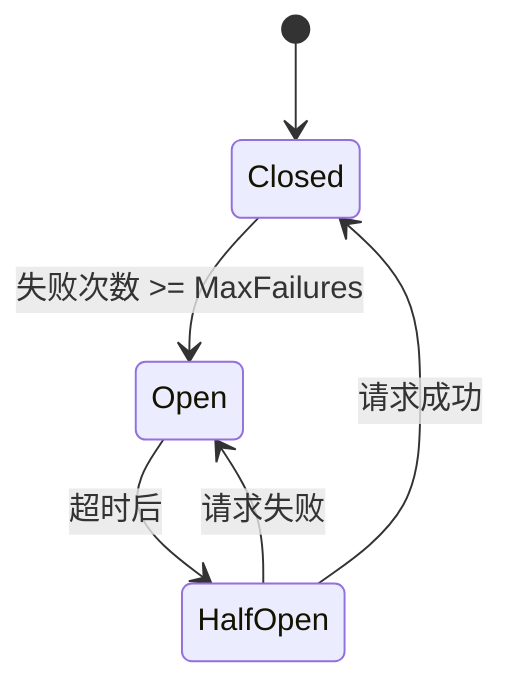

# distributed 分布式协调系统

本模块是 goagent 框架的分布式协调系统，提供跨服务的 Agent 调用、服务发现、负载均衡和故障处理能力。

## 目录

- [架构设计](#架构设计)
- [核心组件](#核心组件)
- [使用方法](#使用方法)
- [API 参考](#api-参考)
- [代码结构](#代码结构)

## 架构设计

### 系统架构图



### 执行流程



## 核心组件

### 1. Client 远程客户端

HTTP 客户端，用于调用远程 Agent：

```go
type Client struct {
    client         *httpclient.Client
    logger         core.Logger
    circuitBreaker *CircuitBreaker
}
```

| 方法 | 说明 | HTTP 端点 |
|------|------|----------|
| `ExecuteAgent()` | 同步执行远程 Agent | POST `/api/v1/agents/{agent}/execute` |
| `ExecuteAgentAsync()` | 异步执行远程 Agent | POST `/api/v1/agents/{agent}/execute/async` |
| `GetAsyncResult()` | 获取异步执行结果 | GET `/api/v1/agents/tasks/{taskID}` |
| `WaitForAsyncResult()` | 等待异步执行完成 | - |
| `Ping()` | 健康检查 | GET `/health` |
| `ListAgents()` | 列出支持的 Agent | GET `/api/v1/agents` |

### 2. Coordinator 协调器

分布式协调器，管理服务发现和负载均衡：

```go
type Coordinator struct {
    registry        *Registry
    client          *Client
    logger          core.Logger
    roundRobinIndex map[string]int
    maxConcurrency  int
}
```

| 方法 | 说明 |
|------|------|
| `ExecuteAgent()` | 执行远程 Agent（含故障转移） |
| `ExecuteAgentWithRetry()` | 带重试的 Agent 执行 |
| `ExecuteParallel()` | 并行执行多个任务 |
| `ExecuteSequential()` | 顺序执行多个任务 |

### 3. Registry 服务注册中心

管理服务实例的注册与发现：

```go
type Registry struct {
    services  map[string][]*ServiceInstance
    instances map[string]*ServiceInstance
    logger    core.Logger
}

type ServiceInstance struct {
    ID          string
    ServiceName string
    Endpoint    string
    Agents      []string
    Metadata    map[string]interface{}
    RegisterAt  time.Time
    LastSeen    time.Time
    Healthy     bool
}
```

### 4. CircuitBreaker 熔断器

防止级联故障的熔断器实现：



```go
type CircuitBreaker struct {
    config       *CircuitBreakerConfig
    state        atomic.Int32
    failures     atomic.Uint32
    lastFailTime atomic.Int64
}

type CircuitBreakerConfig struct {
    MaxFailures   uint32
    Timeout       time.Duration
    OnStateChange func(from, to CircuitState)
}
```

## 使用方法

### 基础使用

```go
// 初始化
logger := createLogger()
registry := distributed.NewRegistry(logger)
client := distributed.NewClient(logger)
coordinator := distributed.NewCoordinator(registry, client, logger)

// 注册服务实例
instance := &distributed.ServiceInstance{
    ID:          "service-1",
    ServiceName: "user-service",
    Endpoint:    "http://user-service:8080",
    Agents:      []string{"ListUsersAgent", "CreateUserAgent"},
}
registry.Register(instance)

// 执行 Agent
input := &agentcore.AgentInput{
    Task: "list_users",
}
output, err := coordinator.ExecuteAgent(ctx, "user-service", "ListUsersAgent", input)
```

### 异步执行

```go
// 启动异步任务
taskID, err := client.ExecuteAgentAsync(ctx, "http://service:8080", "Agent", input)

// 方式1: 轮询结果
output, completed, err := client.GetAsyncResult(ctx, "http://service:8080", taskID)

// 方式2: 等待完成
output, err := client.WaitForAsyncResult(ctx, "http://service:8080", taskID, 1*time.Second)
```

### 带重试的执行

```go
output, err := coordinator.ExecuteAgentWithRetry(
    ctx,
    "service-name",
    "AgentName",
    input,
    3,  // 最大重试次数
)
// 重试策略：指数退避（1s, 2s, 4s...）
// 仅重试网络错误（连接、超时等）
```

### 并行执行

```go
tasks := []distributed.AgentTask{
    {ServiceName: "user-service", AgentName: "ListUsersAgent", Input: input1},
    {ServiceName: "order-service", AgentName: "ListOrdersAgent", Input: input2},
    {ServiceName: "product-service", AgentName: "ListProductsAgent", Input: input3},
}

results, err := coordinator.ExecuteParallel(ctx, tasks)
for i, result := range results {
    if result.Error != nil {
        log.Printf("Task %d failed: %v", i, result.Error)
    } else {
        log.Printf("Task %d result: %v", i, result.Output.Result)
    }
}
```

### 顺序执行（数据管道）

```go
tasks := []distributed.AgentTask{
    {
        ServiceName: "user-service",
        AgentName:   "GetUserAgent",
        Input:       &agentcore.AgentInput{Task: "get_user", Context: map[string]interface{}{"user_id": "123"}},
    },
    {
        ServiceName: "order-service",
        AgentName:   "GetUserOrdersAgent",
        Input:       &agentcore.AgentInput{Task: "get_orders"},
        // Context["previous_output"] 会自动填充为前一个任务的输出
    },
}

results, err := coordinator.ExecuteSequential(ctx, tasks)
```

### 熔断器配置

```go
cbConfig := &distributed.CircuitBreakerConfig{
    MaxFailures: 5,                // 5次失败后打开
    Timeout:     60 * time.Second, // 60秒后尝试半开
    OnStateChange: func(from, to distributed.CircuitState) {
        log.Printf("Circuit: %s -> %s", from.String(), to.String())
    },
}
client := distributed.NewClientWithCircuitBreaker(logger, cbConfig)
```

## API 参考

### Client API

```go
// 创建客户端
NewClient(logger core.Logger) *Client
NewClientWithCircuitBreaker(logger core.Logger, config *CircuitBreakerConfig) *Client

// 同步执行
ExecuteAgent(ctx context.Context, endpoint, agentName string, input *AgentInput) (*AgentOutput, error)

// 异步执行
ExecuteAgentAsync(ctx context.Context, endpoint, agentName string, input *AgentInput) (string, error)
GetAsyncResult(ctx context.Context, endpoint, taskID string) (*AgentOutput, bool, error)
WaitForAsyncResult(ctx context.Context, endpoint, taskID string, pollInterval time.Duration) (*AgentOutput, error)

// 服务发现
Ping(ctx context.Context, endpoint string) error
ListAgents(ctx context.Context, endpoint string) ([]string, error)
```

### Coordinator API

```go
// 创建协调器
NewCoordinator(registry *Registry, client *Client, logger core.Logger, opts ...CoordinatorOption) *Coordinator

// 配置选项
WithMaxConcurrency(n int) CoordinatorOption

// 执行方法
ExecuteAgent(ctx context.Context, serviceName, agentName string, input *AgentInput) (*AgentOutput, error)
ExecuteAgentWithRetry(ctx context.Context, serviceName, agentName string, input *AgentInput, maxRetries int) (*AgentOutput, error)
ExecuteParallel(ctx context.Context, tasks []AgentTask) ([]TaskResult, error)
ExecuteSequential(ctx context.Context, tasks []AgentTask) ([]TaskResult, error)
```

### Registry API

```go
// 创建注册中心
NewRegistry(logger core.Logger) *Registry

// 实例管理
Register(instance *ServiceInstance) error
Deregister(instanceID string) error
Heartbeat(instanceID string) error

// 查询
GetHealthyInstances(serviceName string) []*ServiceInstance
GetInstance(instanceID string) (*ServiceInstance, bool)

// 状态管理
MarkHealthy(instanceID string)
MarkUnhealthy(instanceID string)

// 统计
GetStatistics() *RegistryStatistics
```

### CircuitBreaker API

```go
// 创建熔断器
NewCircuitBreaker(config *CircuitBreakerConfig) *CircuitBreaker

// 执行
Execute(fn func() error) error

// 状态查询
State() CircuitState
Failures() uint32
Reset()
```

## 代码结构

```text
distributed/
├── client_distributed.go      # 远程客户端实现
├── coordinator.go             # 分布式协调器
├── circuit_breaker.go         # 熔断器实现
├── registry_distributed.go    # 服务注册中心
├── test_helpers.go            # 测试辅助函数
└── *_test.go                  # 测试文件
```

## 设计特点

### 负载均衡

- **轮询策略**：按顺序分配请求到健康实例
- **自动故障转移**：失败时自动尝试其他实例

### 故障处理

- **熔断器**：防止级联故障
- **重试机制**：指数退避重试
- **健康检查**：后台定期检查实例健康状态

### 并发控制

- **信号量模式**：限制并行任务数量
- **上下文取消**：支持优雅取消

## 扩展阅读

- [core](../core/) - 核心执行引擎
- [multiagent](../multiagent/) - 多智能体协作
- [observability](../observability/) - 可观测性
