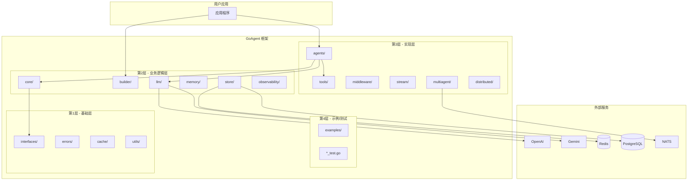
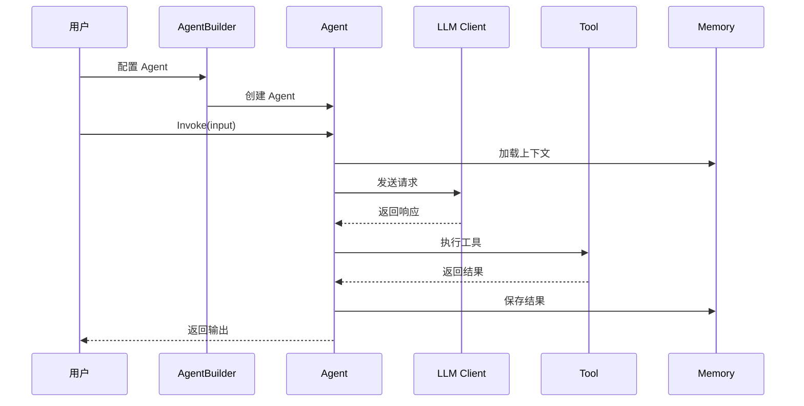
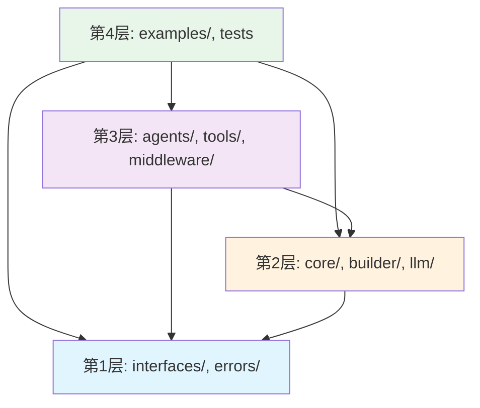

# GoAgent 架构概述

## 简介

GoAgent 是一个全面的、生产就绪的 Go AI Agent 框架，灵感来自 LangChain。它提供 Agent、工具、内存、LLM 抽象和编排能力，具备企业级特性。

## 核心技术栈

- **Go 1.25.0+**
- **OpenTelemetry** - 可观测性
- **Redis、PostgreSQL、NATS** - 分布式系统支持
- **多 LLM 提供商** - OpenAI、Gemini、DeepSeek、Anthropic、Cohere 等

## 系统架构图

### 整体架构



### 核心组件交互



### 4层导入规则



## 架构层次

GoAgent 采用严格的 4 层架构，通过自动化验证确保导入规则的正确性。

### 第 1 层：基础层（无 GoAgent 内部导入）

```text
interfaces/  - 所有公共接口定义
errors/      - 错误类型和辅助函数
cache/       - 基础缓存工具
utils/       - 工具函数
```

**规则**：第 1 层不能导入任何其他 GoAgent 包（仅允许标准库和外部依赖）。

### 第 2 层：业务逻辑层（仅导入 L1）

```text
core/          - 基础实现 (BaseAgent, BaseChain)
core/execution/ - 执行引擎
core/state/    - 状态管理
core/checkpoint/ - 检查点逻辑
core/middleware/ - 中间件框架
builder/       - 流式 API 构建器 (AgentBuilder)
llm/           - LLM 客户端实现
memory/        - 内存管理
store/         - 存储实现 (memory, redis, postgres)
retrieval/     - 文档检索
observability/ - 遥测和监控
performance/   - 性能工具
planning/      - 规划工具
prompt/        - 提示工程
reflection/    - 反射工具
```

**规则**：第 2 层只能从第 1 层导入。

### 第 3 层：实现层（导入 L1+L2）

```text
agents/       - Agent 实现 (executor, react, 特化)
tools/        - 工具定义和实现
middleware/   - 中间件实现
parsers/      - 输出解析器
stream/       - 流处理
multiagent/   - 多 Agent 编排
distributed/  - 分布式执行
mcp/          - 模型上下文协议
document/     - 文档处理
toolkits/     - 工具集合
```

**规则**：第 3 层可以从第 1 层和第 2 层导入。

### 第 4 层：示例和测试（可导入所有层）

```text
examples/     - 使用示例
*_test.go     - 测试文件
```

## 核心架构概念

### Agent 模式

Agent 是能够推理、使用工具和做出决策的自主实体：

```go
type Agent interface {
    Runnable
    Name() string
    Description() string
    Plan(ctx context.Context, input *Input) (*Plan, error)
}
```

#### Agent 类型

| Agent 类型 | 描述 | 位置 |
|-----------|------|------|
| ExecutorAgent | 工具执行 Agent | `agents/executor/` |
| ReActAgent | ReAct 推理 Agent | `agents/react/` |
| CoTAgent | 思维链 Agent | `agents/cot/` |
| ToTAgent | 思维树 Agent | `agents/tot/` |
| GoTAgent | 思维图 Agent | `agents/got/` |
| PoTAgent | 程序思维 Agent | `agents/pot/` |
| SoTAgent | 骨架思维 Agent | `agents/sot/` |
| MetaCoTAgent | 元思维链 Agent | `agents/metacot/` |

### Builder 模式

流式 `AgentBuilder` 是构建 Agent 的主要方式：

```go
agent := builder.NewAgentBuilder(llmClient).
    WithSystemPrompt("你是一个有帮助的助手").
    WithTools(searchTool, calcTool).
    WithMemory(memoryManager).
    WithMiddleware(loggingMW, cacheMW).
    WithTimeout(30 * time.Second).
    Build()
```

#### 推理预设

Builder 支持多种推理模式预设：

```go
// 零样本思维链
agent := builder.NewAgentBuilder(llm).WithZeroShotCoT().Build()

// 少样本思维链
agent := builder.NewAgentBuilder(llm).WithFewShotCoT(examples).Build()

// 思维树（束搜索）
agent := builder.NewAgentBuilder(llm).WithBeamSearchToT(beamWidth, maxDepth).Build()

// 思维树（蒙特卡洛）
agent := builder.NewAgentBuilder(llm).WithMonteCarloToT().Build()
```

### Runnable 模式

灵感来自 LangChain，`Runnable` 为所有可执行组件提供可组合接口：

```go
type Runnable interface {
    Invoke(ctx context.Context, input *Input) (*Output, error)
    Stream(ctx context.Context, input *Input) (<-chan *StreamChunk, error)
}
```

### 状态管理

状态通过 `State` 接口管理，支持线程安全操作：

- `core/state/` - 状态实现
- `core/checkpoint/` - 持久化检查点
- Redis 和 PostgreSQL 后端支持

### 工具系统

工具是 Agent 可以调用的可扩展函数：

```go
type Tool interface {
    Name() string
    Description() string
    Invoke(ctx context.Context, input *ToolInput) (*ToolOutput, error)
    ArgsSchema() string
}
```

#### 工具分类

| 分类 | 位置 | 说明 |
|------|------|------|
| Shell | `tools/shell/` | Shell 命令执行 |
| HTTP | `tools/http/` | HTTP 请求 |
| Search | `tools/search/` | 搜索操作 |
| Compute | `tools/compute/` | 计算工具 |
| Practical | `tools/practical/` | 文件操作、数据库查询、网页抓取 |

### 中间件系统

中间件包装 Agent 执行以添加横切关注点：

```go
type Middleware func(next Runnable) Runnable
```

常用中间件：可观测性、缓存、工具选择、速率限制。

### 内存管理

`MemoryManager` 接口提供统一的内存抽象：

```go
type MemoryManager interface {
    AddConversation(ctx context.Context, conv *Conversation) error
    GetConversationHistory(ctx context.Context, sessionID string, limit int) ([]*Conversation, error)
    ClearConversation(ctx context.Context, sessionID string) error
    AddCase(ctx context.Context, caseMemory *Case) error
    SearchSimilarCases(ctx context.Context, query string, limit int) ([]*Case, error)
    Store(ctx context.Context, key string, value interface{}) error
    Retrieve(ctx context.Context, key string) (interface{}, error)
    Delete(ctx context.Context, key string) error
    Clear(ctx context.Context) error
}
```

### 检查点系统

`Checkpointer` 接口用于保存/加载 Agent 状态：

```go
type Checkpointer interface {
    SaveCheckpoint(ctx context.Context, checkpoint *Checkpoint) error
    LoadCheckpoint(ctx context.Context, checkpointID string) (*Checkpoint, error)
    ListCheckpoints(ctx context.Context, threadID string, limit int) ([]*CheckpointMetadata, error)
    DeleteCheckpoint(ctx context.Context, checkpointID string) error
}
```

支持的实现：

- `MemoryCheckpointer` - 内存存储
- `RedisCheckpointer` - Redis 存储
- `DistributedCheckpointer` - 分布式存储

## 数据流

```text
用户输入 → Input → Agent → Middleware → LLM → Tool → Output → 用户输出
              ↓                           ↓
           State                       Memory
              ↓                           ↓
         Checkpoint                   Store
```

## 性能考虑

根据基准测试：

- Builder 构建：约 100μs/op
- Agent 执行：约 1ms/op（不包括 LLM 调用）
- 中间件开销：小于 5%
- 并行工具执行：线性扩展至 100+ 并发调用
- 缓存命中率：LRU 缓存超过 90%

优化方向：

- 尽可能并行执行工具
- 正确的上下文取消
- 高效的状态更新
- 最小化中间件栈

## 可观测性

- **结构化日志**：生产环境使用 JSON 格式
- **OpenTelemetry**：启用 OTLP 导出进行分布式追踪
- **版本跟踪**：在指标和日志中嵌入版本信息
- **健康检查**：在健康端点中包含版本信息

## 分布式支持

- **NATS 消息**：多 Agent 通信
- **Redis 存储**：分布式状态和检查点
- **PostgreSQL**：持久化存储
- **分布式协调**：跨节点执行

## 外部依赖

主要外部包：

- `github.com/sashabaranov/go-openai` - OpenAI 客户端
- `cloud.google.com/go/vertexai` - Google Gemini
- `github.com/redis/go-redis/v9` - Redis 客户端
- `gorm.io/gorm` - 数据库 ORM
- `github.com/nats-io/nats.go` - NATS 消息
- `go.opentelemetry.io/otel` - 可观测性

## 相关文档

- [导入层级说明](IMPORT_LAYERING.md)
- [快速入门](../guides/QUICKSTART.md)
- [LLM 提供商指南](../guides/LLM_PROVIDERS.md)
- [测试最佳实践](../development/TESTING_BEST_PRACTICES.md)