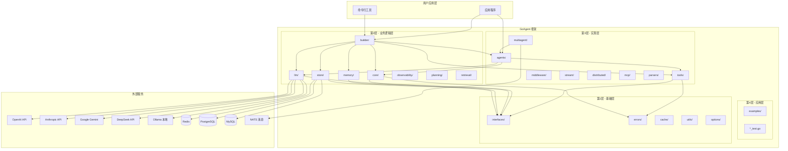
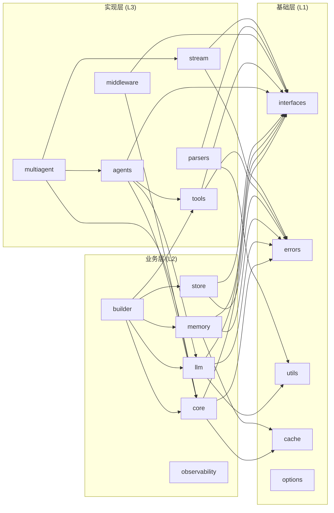
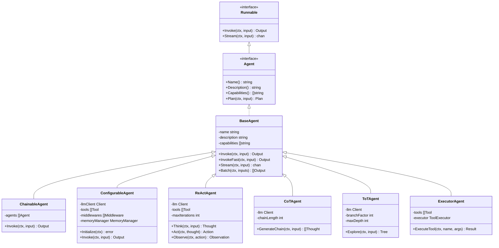
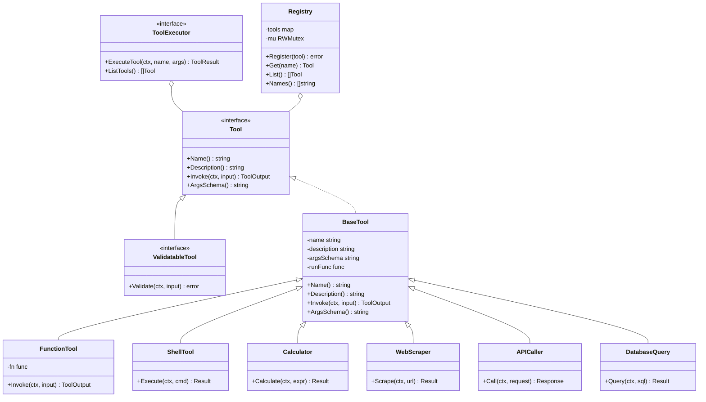
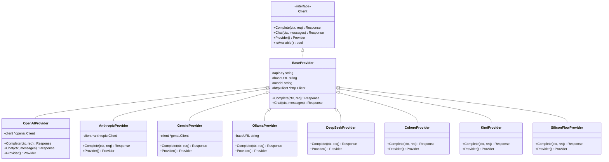
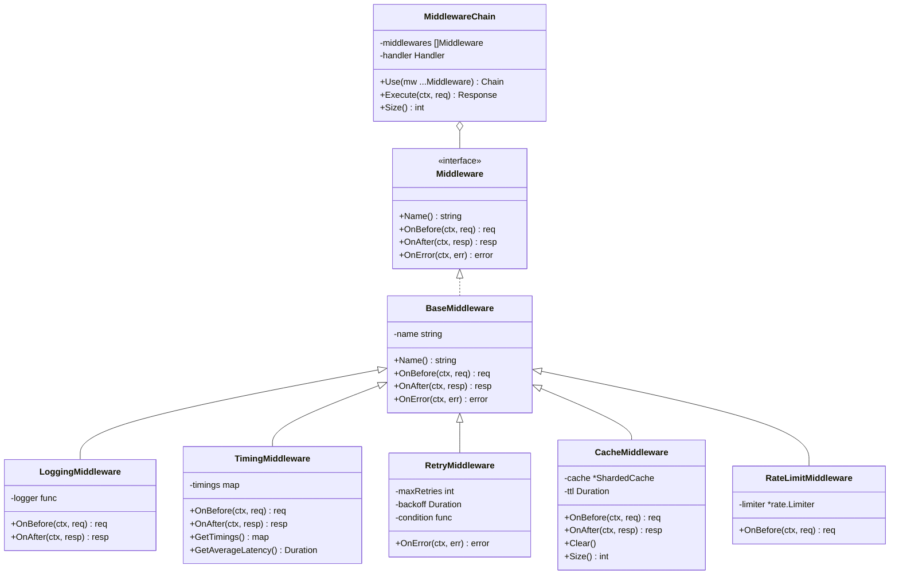
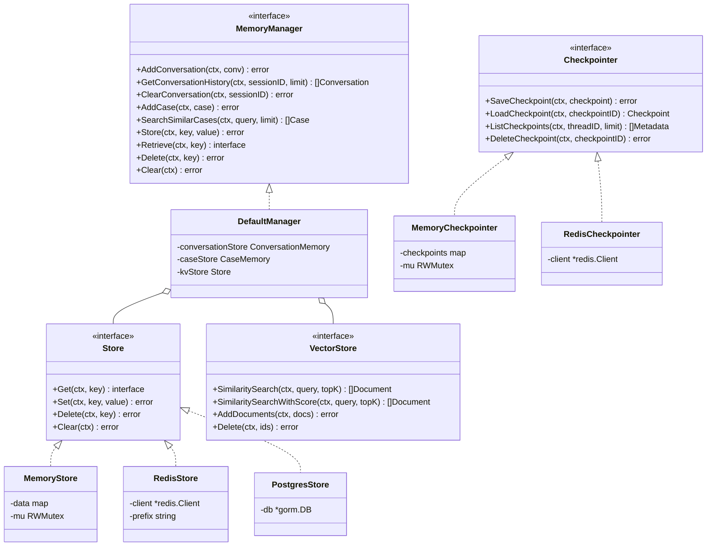
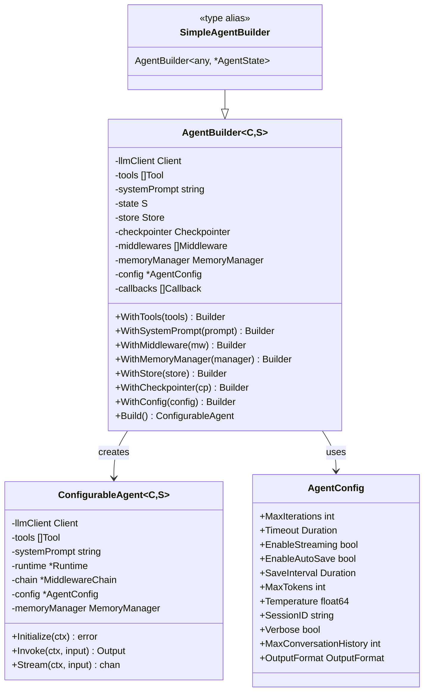
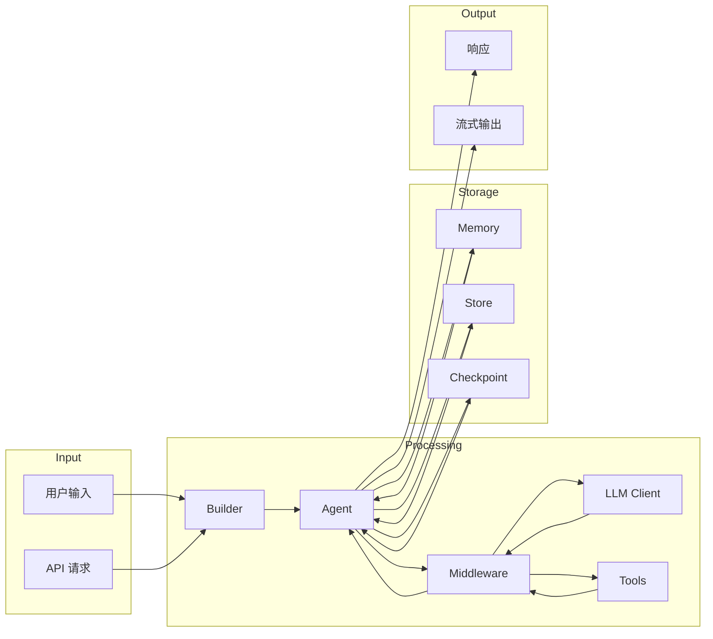
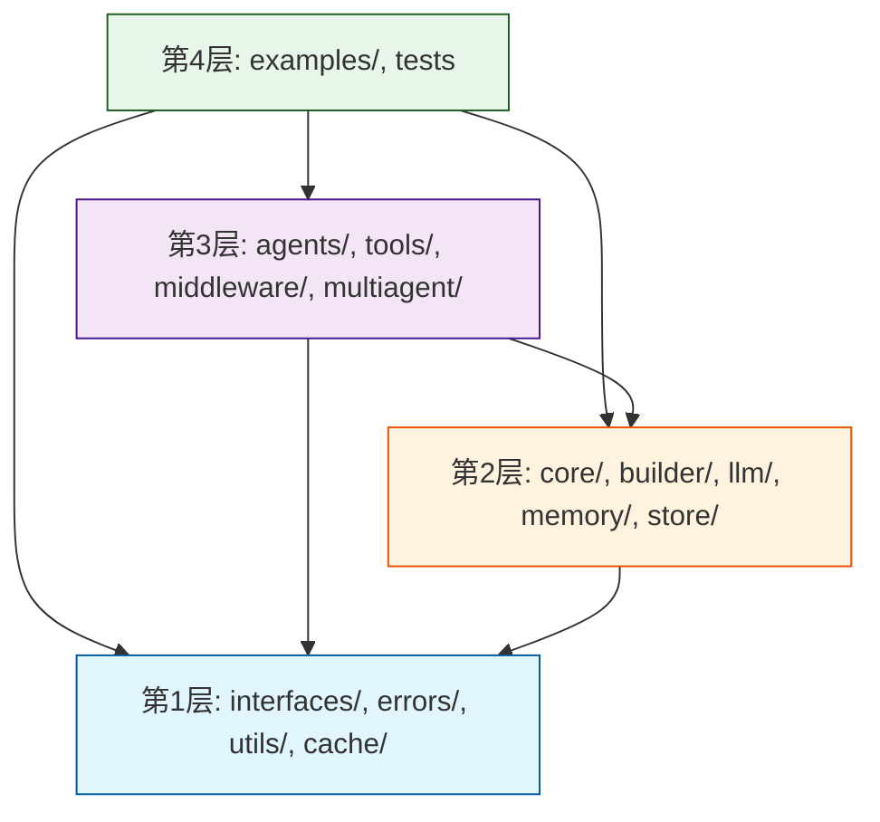

# GoAgent 组件关系图

本文档展示 GoAgent 框架中各组件之间的关系和依赖。

## 整体架构图

## 核心模块依赖图

## Agent 类型关系图

## Tool 系统类图

## LLM Provider 类图

## 中间件系统类图

## Memory 和 Store 系统类图

## Builder 模式类图

## 数据流图

## 包导入层级图

## 相关文档

- [架构概述](ARCHITECTURE.md)
- [导入层级说明](IMPORT_LAYERING.md)
- [设计概述](../design/DESIGN_OVERVIEW.md)
