# GoAgent 设计概述

本文档描述 GoAgent 框架的核心设计理念、架构决策和关键设计模式。

## 设计原则

### 1. 接口驱动设计

GoAgent 采用接口驱动的设计方式，所有核心组件都通过接口定义规范：

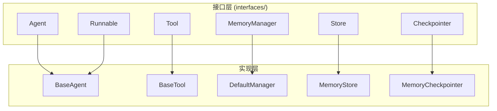

### 2. 分层架构

框架采用严格的 4 层架构，通过导入规则确保依赖方向单一：

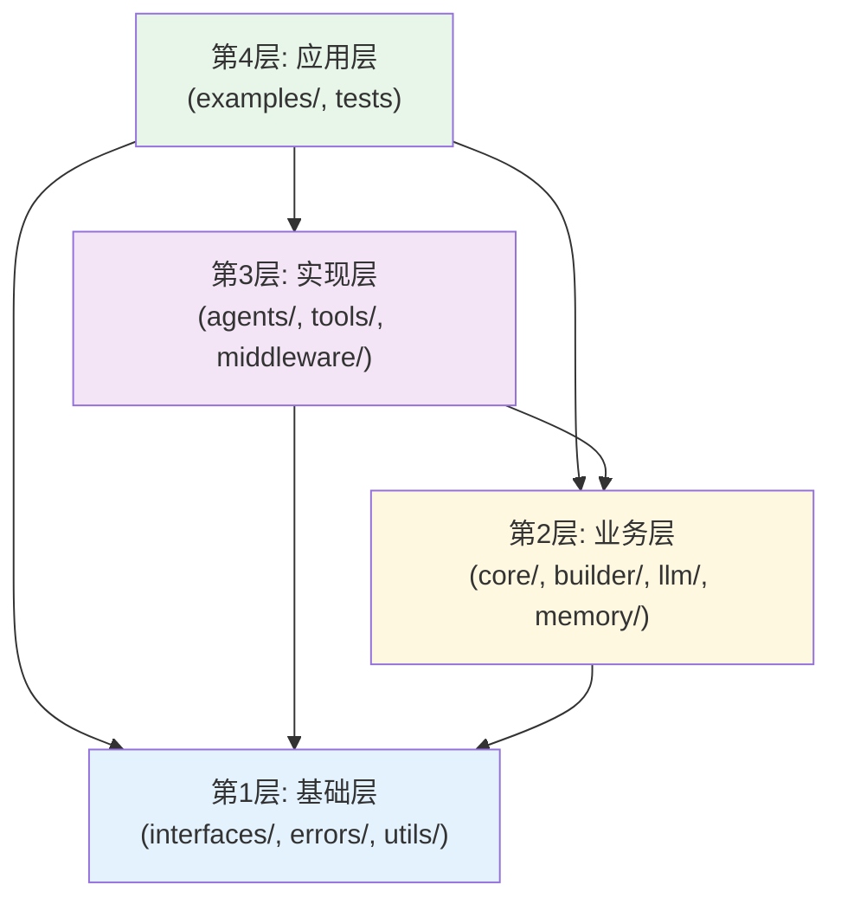

### 3. 组合优于继承

GoAgent 优先使用组合模式而非继承：

```go
// 组合模式示例
type ConfigurableAgent struct {
    llmClient     llm.Client        // 组合 LLM 客户端
    tools         []Tool            // 组合工具集
    middlewares   []Middleware      // 组合中间件
    memoryManager MemoryManager     // 组合内存管理
}
```

## 核心设计模式

### 1. Builder 模式

AgentBuilder 提供流畅的 API 来构建复杂的 Agent：

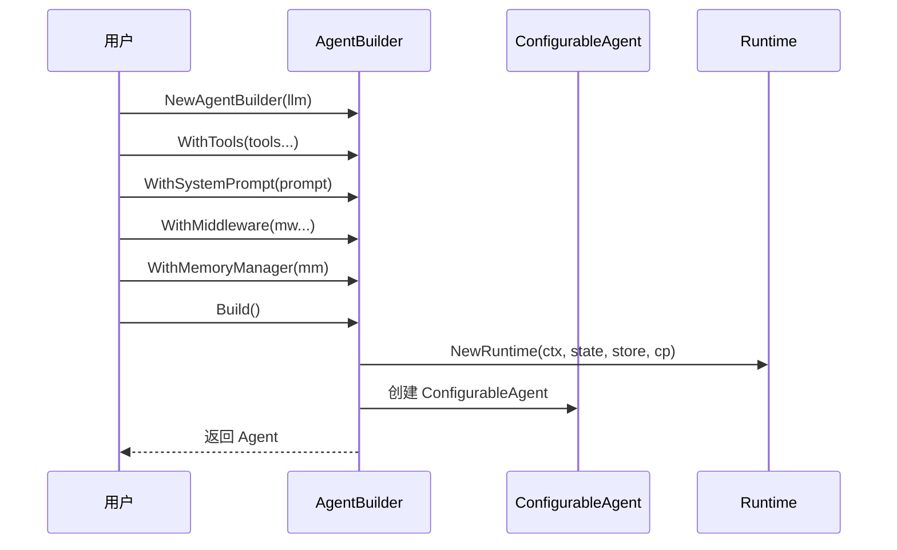

### 2. Chain of Responsibility 模式

中间件系统使用责任链模式处理请求：

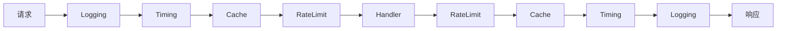

### 3. Strategy 模式

不同的推理策略（ReAct、CoT、ToT 等）使用策略模式：

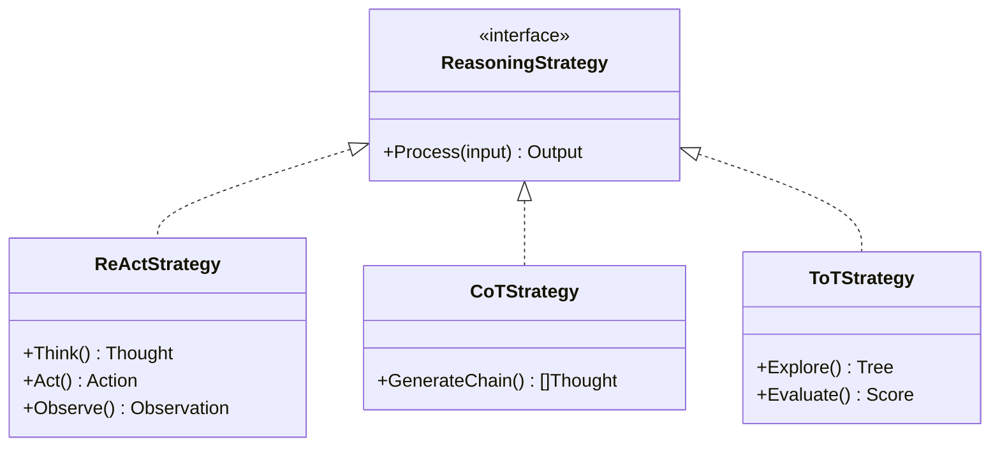

### 4. Factory 模式

LLM Provider 和 Store 使用工厂模式创建实例：

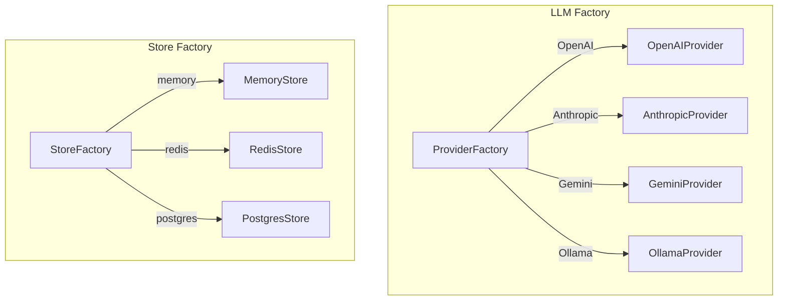

### 5. Decorator 模式

工具中间件使用装饰器模式增强功能：

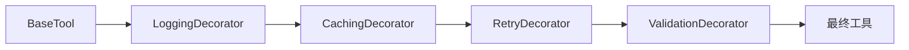

## 关键流程设计

### Agent 执行流程

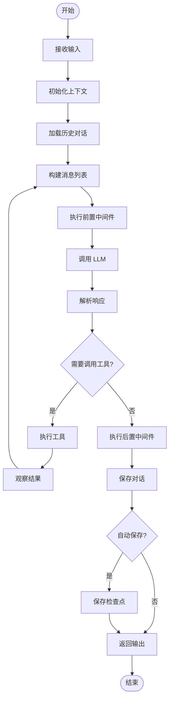

### Tool 执行流程

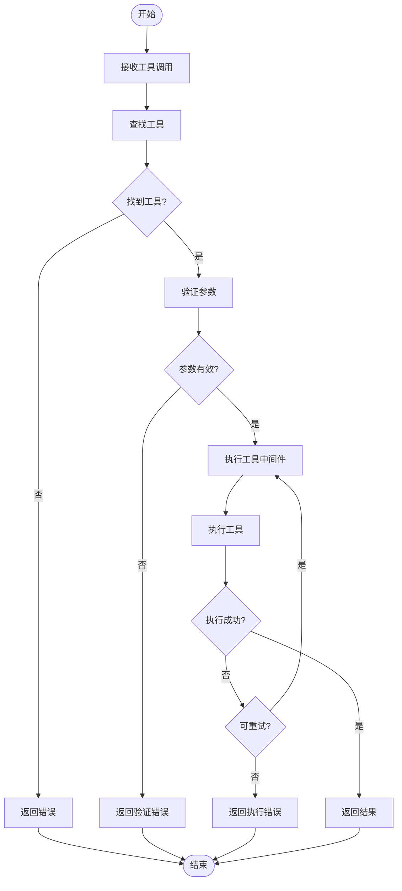

### Memory 管理流程

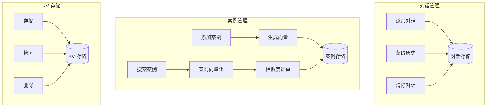

## 状态管理设计

### State 生命周期

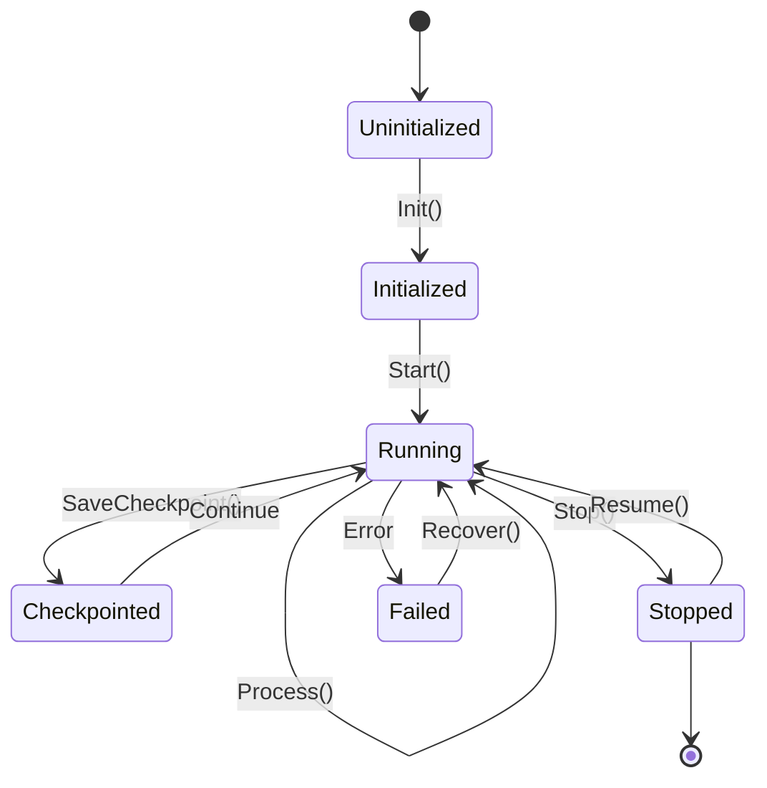

### Checkpoint 机制

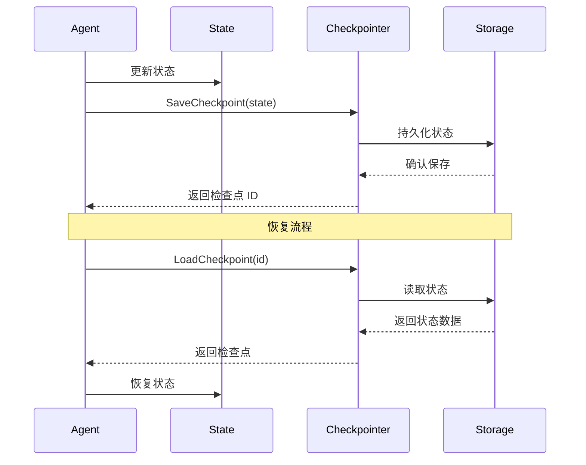

## 并发设计

### 并行工具执行

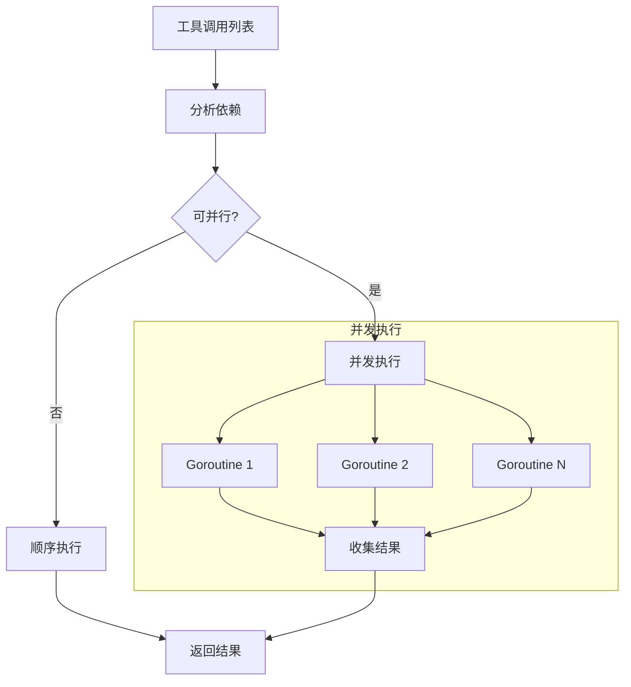

### 线程安全设计

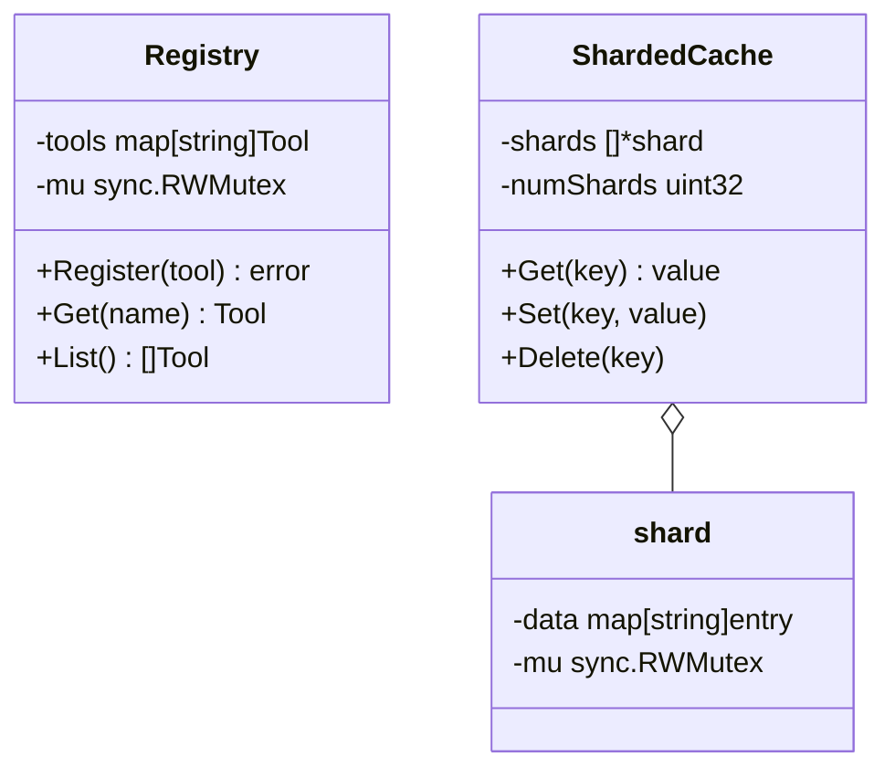

## 扩展性设计

### 插件架构

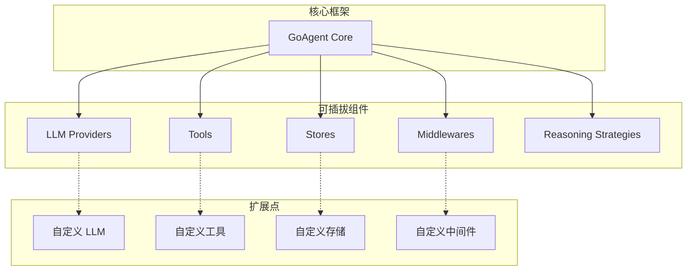

### 接口扩展点

| 扩展点 | 接口 | 说明 |
|-------|------|------|
| LLM Provider | `llm.Client` | 添加新的 LLM 提供商 |
| Tool | `interfaces.Tool` | 添加自定义工具 |
| Store | `interfaces.Store` | 添加新的存储后端 |
| Middleware | `middleware.Middleware` | 添加请求处理中间件 |
| Memory | `interfaces.MemoryManager` | 自定义内存管理 |
| Checkpointer | `interfaces.Checkpointer` | 自定义检查点存储 |
| Parser | `parsers.OutputParser` | 自定义输出解析器 |

## 性能优化设计

### 对象池

```mermaid
flowchart LR
    subgraph "对象池系统"
        REQ_POOL[RequestPool]
        RESP_POOL[ResponsePool]
        INPUT_POOL[InputPool]
        OUTPUT_POOL[OutputPool]
    end

    GET[Get()] --> REQ_POOL
    REQ_POOL --> USE[使用对象]
    USE --> PUT[Put()]
    PUT --> REQ_POOL
```

### 缓存策略

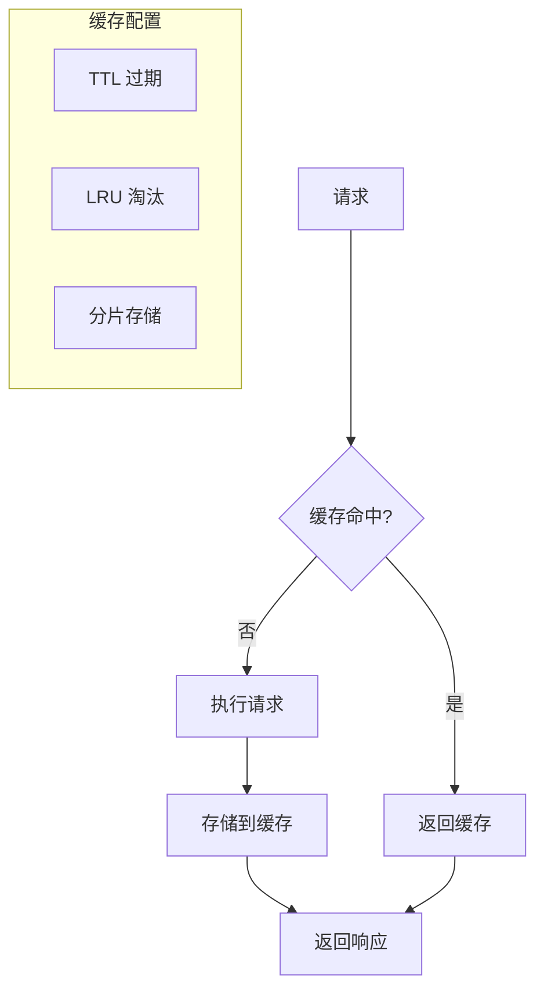

## 相关文档

- [时序图详解](SEQUENCE_DIAGRAMS.md)
- [流程图详解](FLOW_DIAGRAMS.md)
- [架构概述](../architecture/ARCHITECTURE.md)
- [组件关系图](../architecture/COMPONENT_DIAGRAM.md)
