# GoAgent 流程图

本文档详细展示 GoAgent 框架中各核心流程的流程图。

## 1. Agent 生命周期流程

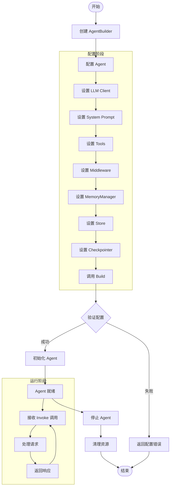

## 2. 请求处理流程

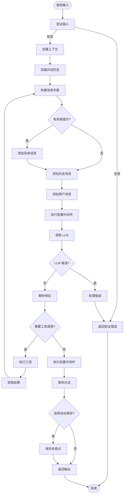

## 3. ReAct 推理流程

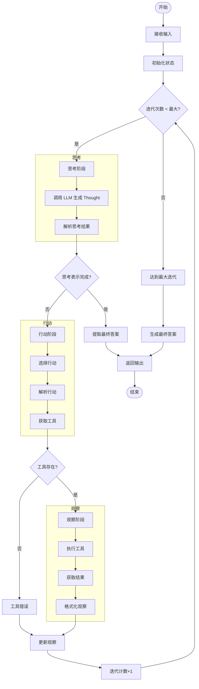

## 4. Tool 执行流程

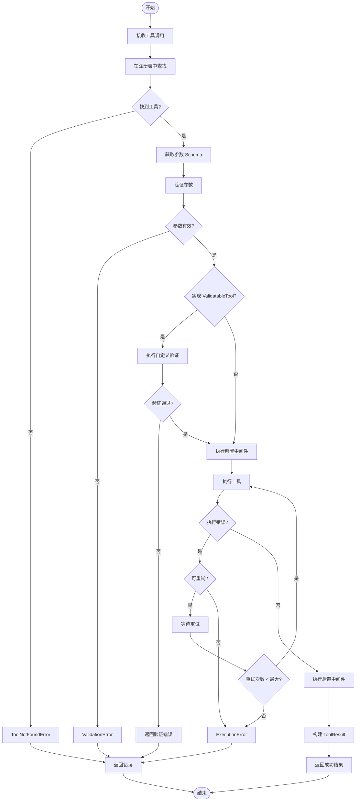

## 5. 中间件链执行流程

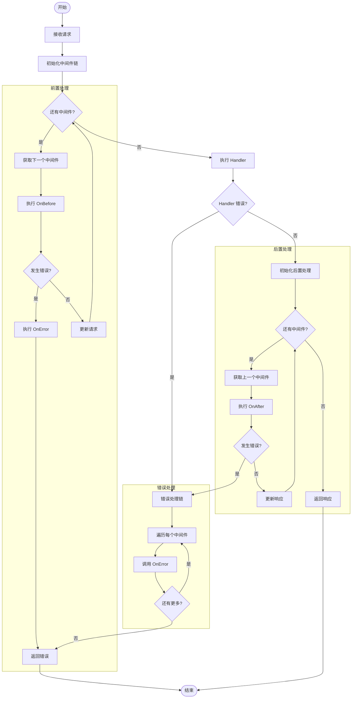

## 6. Memory 操作流程

### 6.1 对话管理流程

```mermaid
flowchart TB
    subgraph ADD_CONV[添加对话]
        A_START([开始]) --> A_VALIDATE[验证对话数据]
        A_VALIDATE --> A_VALID{有效?}
        A_VALID -->|否| A_ERROR[返回错误]
        A_VALID -->|是| A_GENERATE_ID[生成 ID]
        A_GENERATE_ID --> A_SET_TIME[设置时间戳]
        A_SET_TIME --> A_STORE[存储到 ConversationStore]
        A_STORE --> A_SUCCESS[返回成功]
        A_ERROR --> A_END([结束])
        A_SUCCESS --> A_END
    end

    subgraph GET_HISTORY[获取历史]
        G_START([开始]) --> G_QUERY[查询 SessionID]
        G_QUERY --> G_FOUND{找到记录?}
        G_FOUND -->|否| G_EMPTY[返回空列表]
        G_FOUND -->|是| G_LIMIT{超过限制?}
        G_LIMIT -->|是| G_TRUNCATE[截断到限制]
        G_LIMIT -->|否| G_RETURN
        G_TRUNCATE --> G_RETURN[返回对话列表]
        G_EMPTY --> G_END([结束])
        G_RETURN --> G_END
    end

    subgraph CLEAR_CONV[清除对话]
        C_START([开始]) --> C_DELETE[删除 SessionID 记录]
        C_DELETE --> C_SUCCESS[返回成功]
        C_SUCCESS --> C_END([结束])
    end
```

### 6.2 案例搜索流程

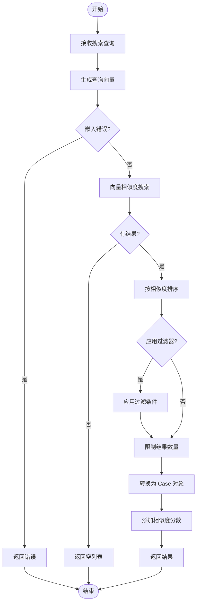

## 7. Checkpoint 流程

### 7.1 保存检查点

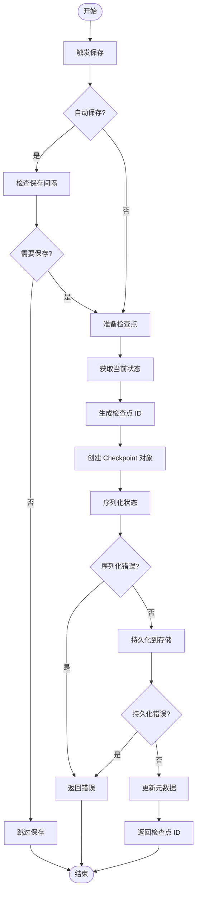

### 7.2 恢复检查点

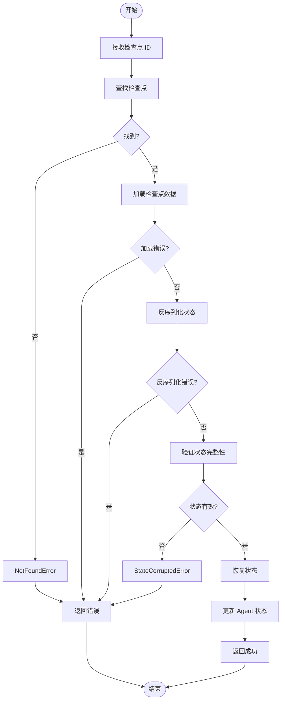

## 8. LLM 调用流程

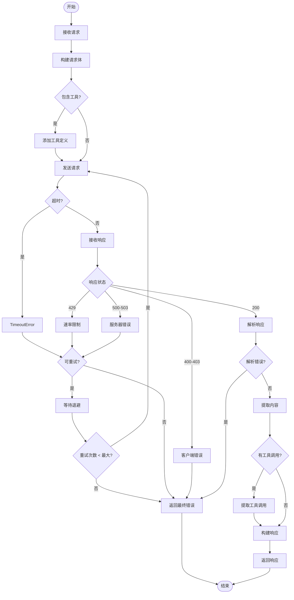

## 9. 并行执行流程

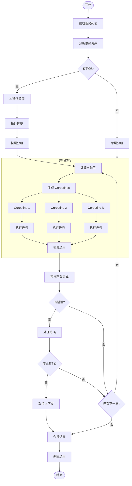

## 10. 错误处理流程

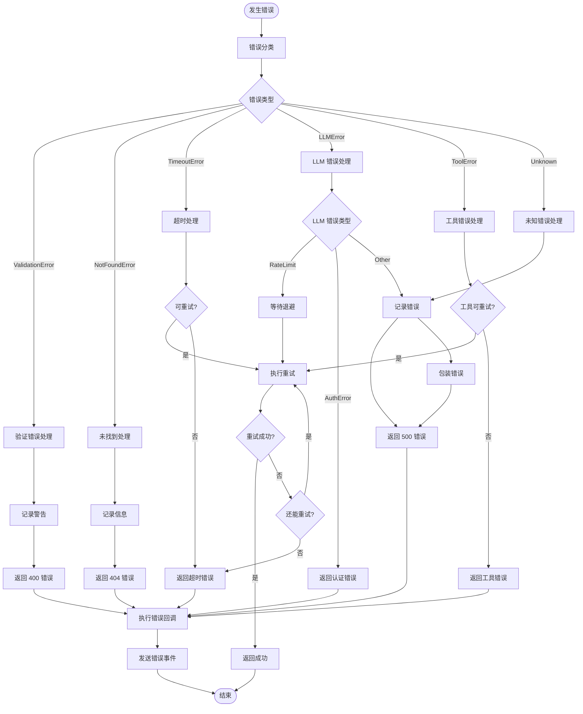

## 11. 缓存流程

```mermaid
flowchart TB
    START([开始]) --> RECEIVE[接收请求]
    RECEIVE --> HASH[计算请求哈希]

    HASH --> SHARD[确定分片]
    SHARD --> LOCK[获取读锁]
    LOCK --> LOOKUP[查找缓存]

    LOOKUP --> HIT{缓存命中?}

    HIT -->|是| CHECK_TTL[检查 TTL]
    CHECK_TTL --> EXPIRED{已过期?}
    EXPIRED -->|是| UNLOCK_R[释放读锁]
    UNLOCK_R --> MISS_FLOW
    EXPIRED -->|否| GET_VALUE[获取缓存值]
    GET_VALUE --> UNLOCK_R2[释放读锁]
    UNLOCK_R2 --> RETURN_CACHED[返回缓存结果]

    HIT -->|否| UNLOCK_R3[释放读锁]
    UNLOCK_R3 --> MISS_FLOW[缓存未命中流程]

    subgraph MISS_FLOW[缓存未命中]
        MISS_FLOW --> EXECUTE[执行实际请求]
        EXECUTE --> EXEC_ERROR{执行错误?}
        EXEC_ERROR -->|是| RETURN_ERROR[返回错误]
        EXEC_ERROR -->|否| SHOULD_CACHE{应该缓存?}
        SHOULD_CACHE -->|否| RETURN_RESULT[返回结果]
        SHOULD_CACHE -->|是| WRITE_LOCK[获取写锁]
        WRITE_LOCK --> STORE_CACHE[存储到缓存]
        STORE_CACHE --> CHECK_SIZE{超过容量?}
        CHECK_SIZE -->|是| EVICT[LRU 淘汰]
        EVICT --> UNLOCK_W
        CHECK_SIZE -->|否| UNLOCK_W[释放写锁]
        UNLOCK_W --> RETURN_RESULT
    end

    RETURN_CACHED --> END([结束])
    RETURN_RESULT --> END
    RETURN_ERROR --> END
```

## 相关文档

- [时序图详解](SEQUENCE_DIAGRAMS.md)
- [设计概述](DESIGN_OVERVIEW.md)
- [架构概述](../architecture/ARCHITECTURE.md)
