# GoAgent 时序图

本文档详细展示 GoAgent 框架中各组件交互的时序图。

## 1. Agent 完整执行时序

### 1.1 基本执行流程

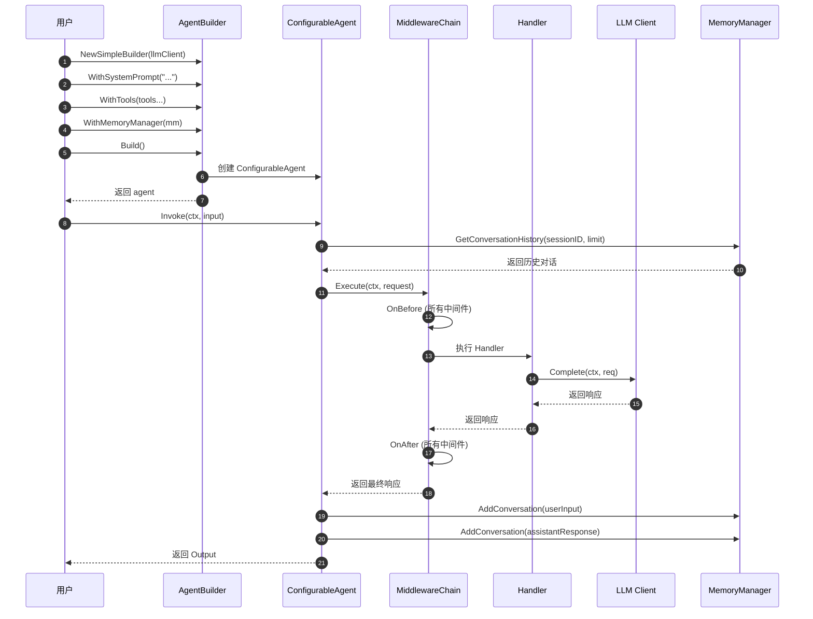
```mermaid
sequenceDiagram
    autonumber
    participant User as 用户
    participant Builder as AgentBuilder
    participant Agent as ConfigurableAgent
    participant Chain as MiddlewareChain
    participant Handler as Handler
    participant LLM as LLM Client
    participant Memory as MemoryManager

    User->>Builder: NewSimpleBuilder(llmClient)
    User->>Builder: WithSystemPrompt("...")
    User->>Builder: WithTools(tools...)
    User->>Builder: WithMemoryManager(mm)
    User->>Builder: Build()
    Builder->>Agent: 创建 ConfigurableAgent
    Builder-->>User: 返回 agent

    User->>Agent: Invoke(ctx, input)
    Agent->>Memory: GetConversationHistory(sessionID, limit)
    Memory-->>Agent: 返回历史对话

    Agent->>Chain: Execute(ctx, request)
    Chain->>Chain: OnBefore (所有中间件)
    Chain->>Handler: 执行 Handler
    Handler->>LLM: Complete(ctx, req)
    LLM-->>Handler: 返回响应
    Handler-->>Chain: 返回响应
    Chain->>Chain: OnAfter (所有中间件)
    Chain-->>Agent: 返回最终响应

    Agent->>Memory: AddConversation(userInput)
    Agent->>Memory: AddConversation(assistantResponse)
    Agent-->>User: 返回 Output
```

### 1.2 带工具调用的执行流程

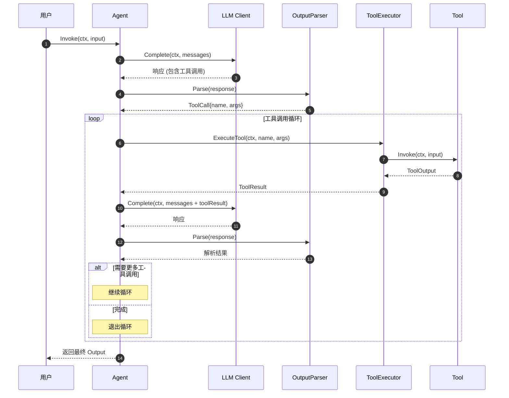
```mermaid
sequenceDiagram
    autonumber
    participant User as 用户
    participant Agent as Agent
    participant LLM as LLM Client
    participant Parser as OutputParser
    participant Executor as ToolExecutor
    participant Tool as Tool

    User->>Agent: Invoke(ctx, input)
    Agent->>LLM: Complete(ctx, messages)
    LLM-->>Agent: 响应 (包含工具调用)

    Agent->>Parser: Parse(response)
    Parser-->>Agent: ToolCall{name, args}

    loop 工具调用循环
        Agent->>Executor: ExecuteTool(ctx, name, args)
        Executor->>Tool: Invoke(ctx, input)
        Tool-->>Executor: ToolOutput
        Executor-->>Agent: ToolResult

        Agent->>LLM: Complete(ctx, messages + toolResult)
        LLM-->>Agent: 响应

        Agent->>Parser: Parse(response)
        Parser-->>Agent: 解析结果

        alt 需要更多工具调用
            Note over Agent: 继续循环
        else 完成
            Note over Agent: 退出循环
        end
    end

    Agent-->>User: 返回最终 Output
```

### 1.3 流式执行时序

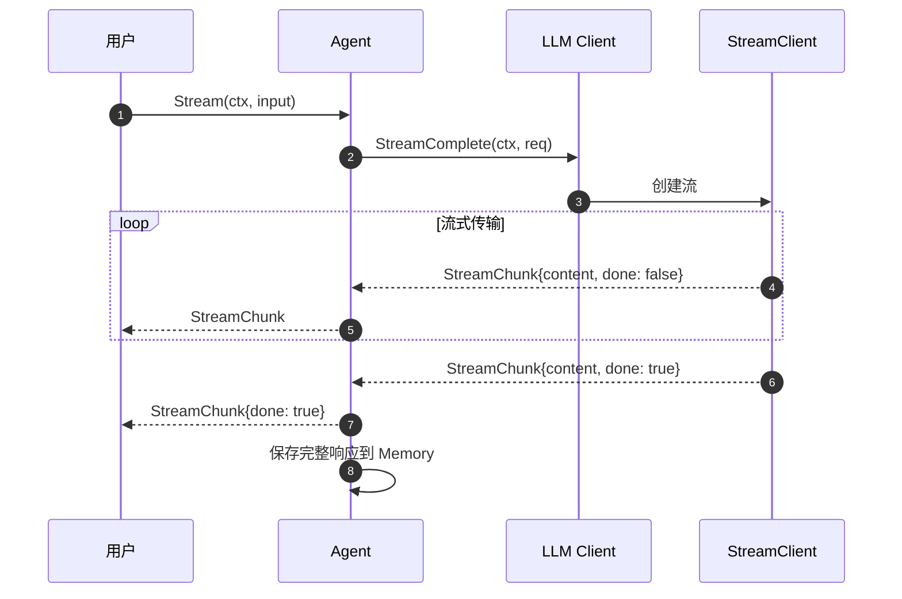
```mermaid
sequenceDiagram
    autonumber
    participant User as 用户
    participant Agent as Agent
    participant LLM as LLM Client
    participant Stream as StreamClient

    User->>Agent: Stream(ctx, input)
    Agent->>LLM: StreamComplete(ctx, req)
    LLM->>Stream: 创建流

    loop 流式传输
        Stream-->>Agent: StreamChunk{content, done: false}
        Agent-->>User: StreamChunk
    end

    Stream-->>Agent: StreamChunk{content, done: true}
    Agent-->>User: StreamChunk{done: true}
    Agent->>Agent: 保存完整响应到 Memory
```

## 2. ReAct Agent 执行时序

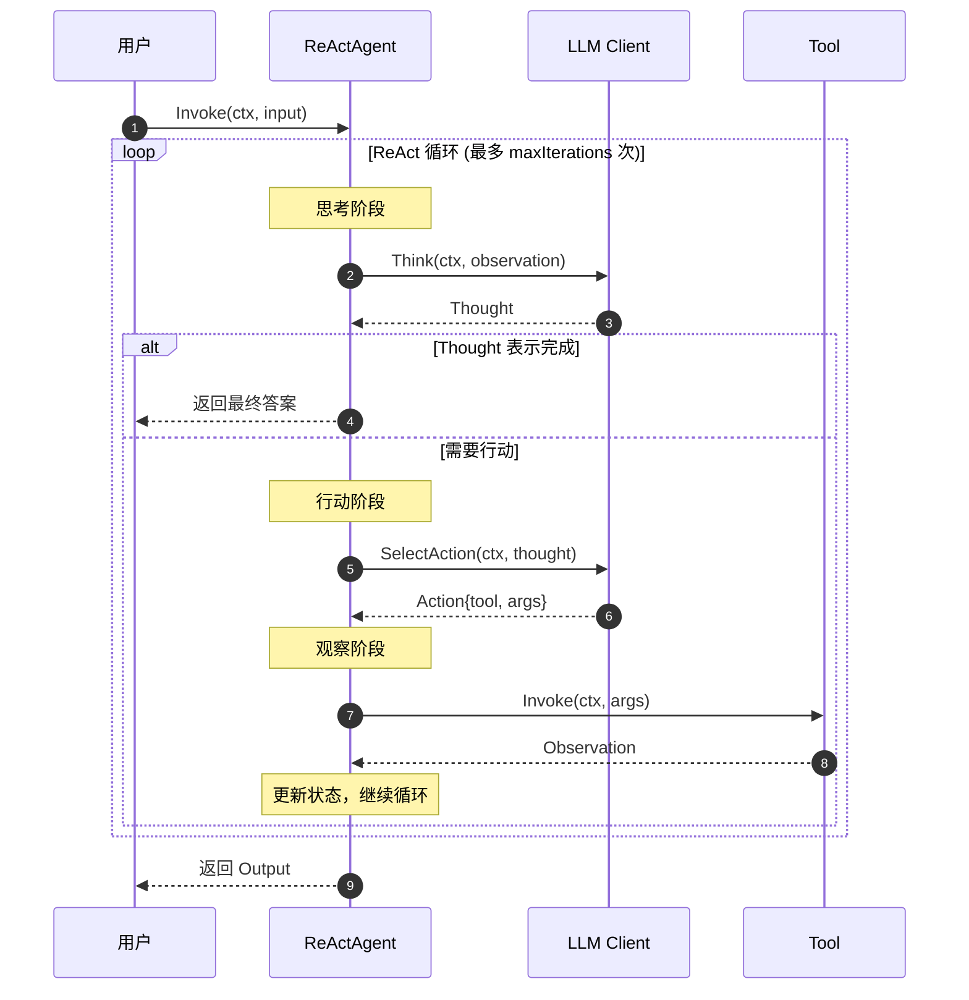
```mermaid
sequenceDiagram
    autonumber
    participant User as 用户
    participant ReAct as ReActAgent
    participant LLM as LLM Client
    participant Tool as Tool

    User->>ReAct: Invoke(ctx, input)

    loop ReAct 循环 (最多 maxIterations 次)
        Note over ReAct: 思考阶段
        ReAct->>LLM: Think(ctx, observation)
        LLM-->>ReAct: Thought

        alt Thought 表示完成
            ReAct-->>User: 返回最终答案
        else 需要行动
            Note over ReAct: 行动阶段
            ReAct->>LLM: SelectAction(ctx, thought)
            LLM-->>ReAct: Action{tool, args}

            Note over ReAct: 观察阶段
            ReAct->>Tool: Invoke(ctx, args)
            Tool-->>ReAct: Observation

            Note over ReAct: 更新状态，继续循环
        end
    end

    ReAct-->>User: 返回 Output
```

## 3. 中间件链执行时序

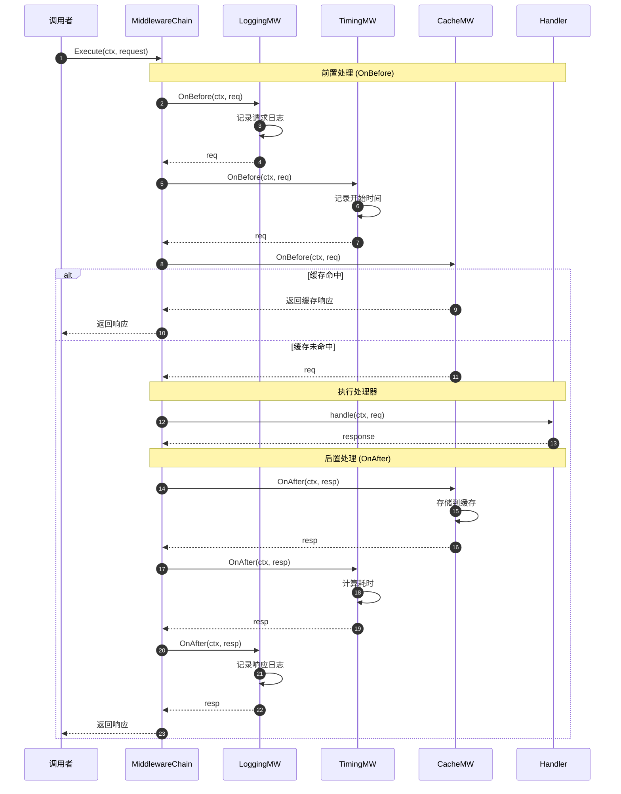
```mermaid
sequenceDiagram
    autonumber
    participant Caller as 调用者
    participant Chain as MiddlewareChain
    participant Log as LoggingMW
    participant Time as TimingMW
    participant Cache as CacheMW
    participant Handler as Handler

    Caller->>Chain: Execute(ctx, request)

    Note over Chain,Handler: 前置处理 (OnBefore)
    Chain->>Log: OnBefore(ctx, req)
    Log->>Log: 记录请求日志
    Log-->>Chain: req

    Chain->>Time: OnBefore(ctx, req)
    Time->>Time: 记录开始时间
    Time-->>Chain: req

    Chain->>Cache: OnBefore(ctx, req)
    alt 缓存命中
        Cache-->>Chain: 返回缓存响应
        Chain-->>Caller: 返回响应
    else 缓存未命中
        Cache-->>Chain: req

        Note over Chain,Handler: 执行处理器
        Chain->>Handler: handle(ctx, req)
        Handler-->>Chain: response

        Note over Chain,Handler: 后置处理 (OnAfter)
        Chain->>Cache: OnAfter(ctx, resp)
        Cache->>Cache: 存储到缓存
        Cache-->>Chain: resp

        Chain->>Time: OnAfter(ctx, resp)
        Time->>Time: 计算耗时
        Time-->>Chain: resp

        Chain->>Log: OnAfter(ctx, resp)
        Log->>Log: 记录响应日志
        Log-->>Chain: resp

        Chain-->>Caller: 返回响应
    end
```

## 4. Tool 执行时序

### 4.1 单工具执行

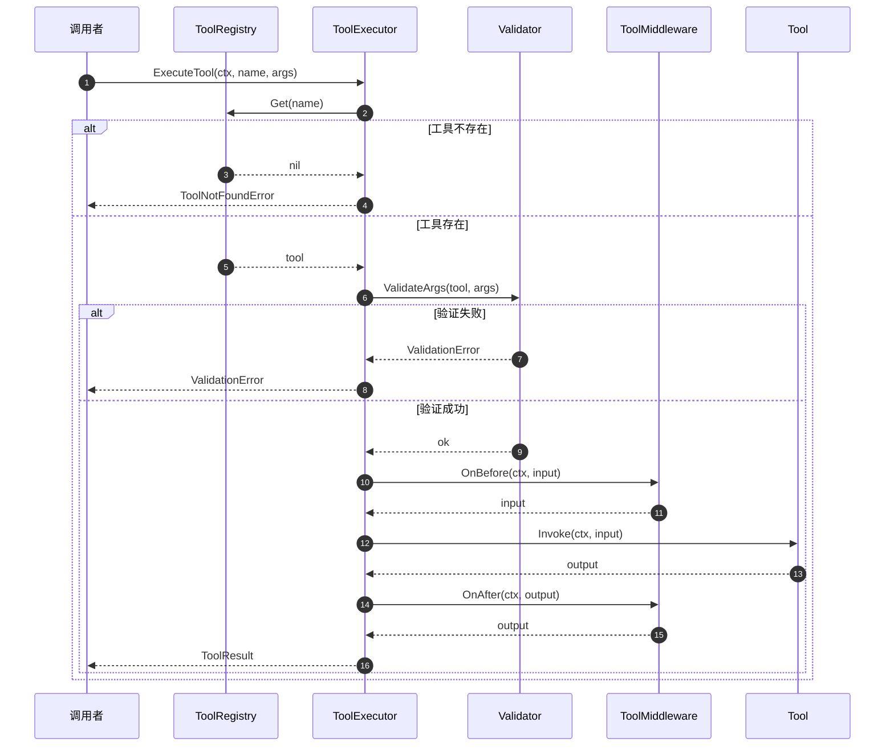
```mermaid
sequenceDiagram
    autonumber
    participant Caller as 调用者
    participant Registry as ToolRegistry
    participant Executor as ToolExecutor
    participant Validator as Validator
    participant MW as ToolMiddleware
    participant Tool as Tool

    Caller->>Executor: ExecuteTool(ctx, name, args)
    Executor->>Registry: Get(name)

    alt 工具不存在
        Registry-->>Executor: nil
        Executor-->>Caller: ToolNotFoundError
    else 工具存在
        Registry-->>Executor: tool

        Executor->>Validator: ValidateArgs(tool, args)
        alt 验证失败
            Validator-->>Executor: ValidationError
            Executor-->>Caller: ValidationError
        else 验证成功
            Validator-->>Executor: ok

            Executor->>MW: OnBefore(ctx, input)
            MW-->>Executor: input

            Executor->>Tool: Invoke(ctx, input)
            Tool-->>Executor: output

            Executor->>MW: OnAfter(ctx, output)
            MW-->>Executor: output

            Executor-->>Caller: ToolResult
        end
    end
```

### 4.2 并行工具执行

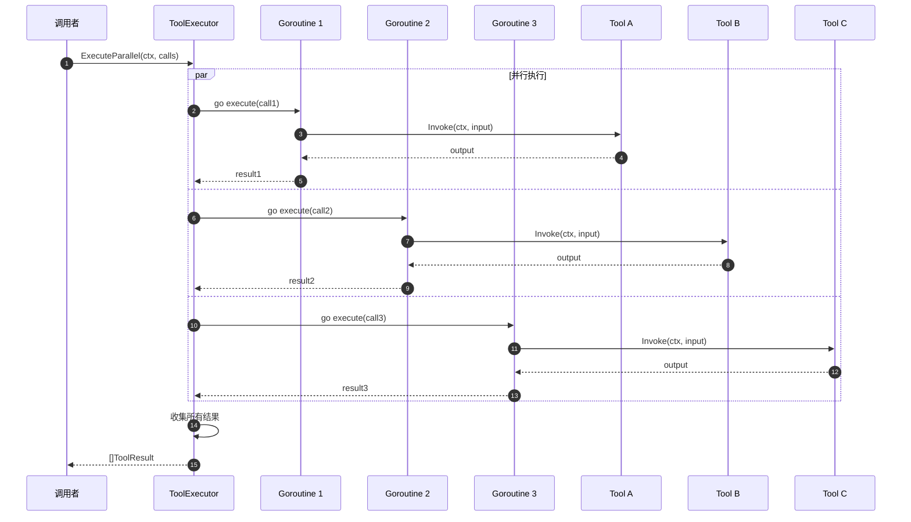
```mermaid
sequenceDiagram
    autonumber
    participant Caller as 调用者
    participant Executor as ToolExecutor
    participant G1 as Goroutine 1
    participant G2 as Goroutine 2
    participant G3 as Goroutine 3
    participant Tool1 as Tool A
    participant Tool2 as Tool B
    participant Tool3 as Tool C

    Caller->>Executor: ExecuteParallel(ctx, calls)

    par 并行执行
        Executor->>G1: go execute(call1)
        G1->>Tool1: Invoke(ctx, input)
        Tool1-->>G1: output
        G1-->>Executor: result1
    and
        Executor->>G2: go execute(call2)
        G2->>Tool2: Invoke(ctx, input)
        Tool2-->>G2: output
        G2-->>Executor: result2
    and
        Executor->>G3: go execute(call3)
        G3->>Tool3: Invoke(ctx, input)
        Tool3-->>G3: output
        G3-->>Executor: result3
    end

    Executor->>Executor: 收集所有结果
    Executor-->>Caller: []ToolResult
```

## 5. Memory 操作时序

### 5.1 对话存储

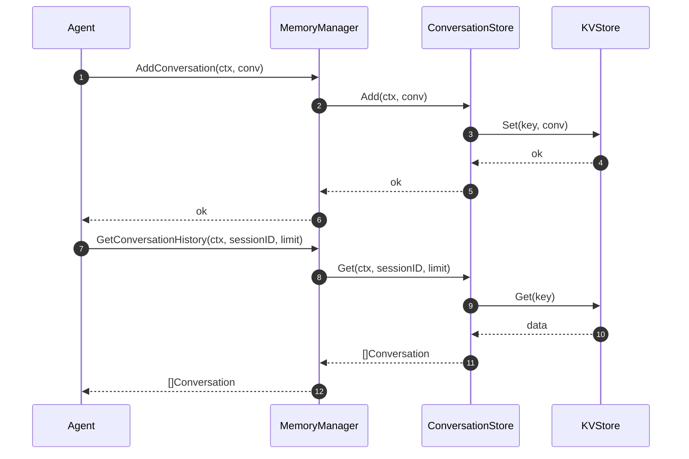
```mermaid
sequenceDiagram
    autonumber
    participant Agent as Agent
    participant MM as MemoryManager
    participant Conv as ConversationStore
    participant KV as KVStore

    Agent->>MM: AddConversation(ctx, conv)
    MM->>Conv: Add(ctx, conv)
    Conv->>KV: Set(key, conv)
    KV-->>Conv: ok
    Conv-->>MM: ok
    MM-->>Agent: ok

    Agent->>MM: GetConversationHistory(ctx, sessionID, limit)
    MM->>Conv: Get(ctx, sessionID, limit)
    Conv->>KV: Get(key)
    KV-->>Conv: data
    Conv-->>MM: []Conversation
    MM-->>Agent: []Conversation
```

### 5.2 案例搜索

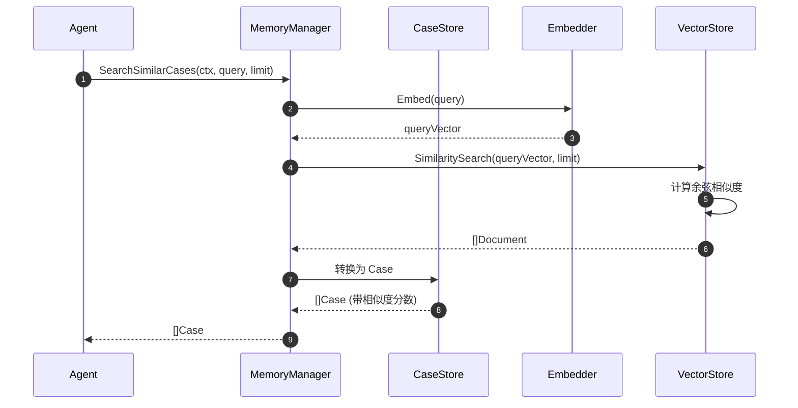
```mermaid
sequenceDiagram
    autonumber
    participant Agent as Agent
    participant MM as MemoryManager
    participant Case as CaseStore
    participant Embed as Embedder
    participant VS as VectorStore

    Agent->>MM: SearchSimilarCases(ctx, query, limit)
    MM->>Embed: Embed(query)
    Embed-->>MM: queryVector

    MM->>VS: SimilaritySearch(queryVector, limit)
    VS->>VS: 计算余弦相似度
    VS-->>MM: []Document

    MM->>Case: 转换为 Case
    Case-->>MM: []Case (带相似度分数)
    MM-->>Agent: []Case
```

## 6. Checkpoint 操作时序

### 6.1 保存检查点

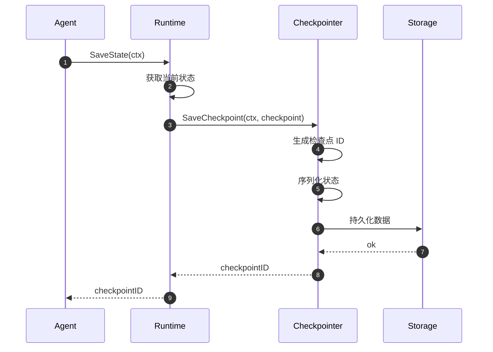
```mermaid
sequenceDiagram
    autonumber
    participant Agent as Agent
    participant Runtime as Runtime
    participant CP as Checkpointer
    participant Store as Storage

    Agent->>Runtime: SaveState(ctx)
    Runtime->>Runtime: 获取当前状态
    Runtime->>CP: SaveCheckpoint(ctx, checkpoint)

    CP->>CP: 生成检查点 ID
    CP->>CP: 序列化状态
    CP->>Store: 持久化数据
    Store-->>CP: ok
    CP-->>Runtime: checkpointID
    Runtime-->>Agent: checkpointID
```

### 6.2 恢复检查点

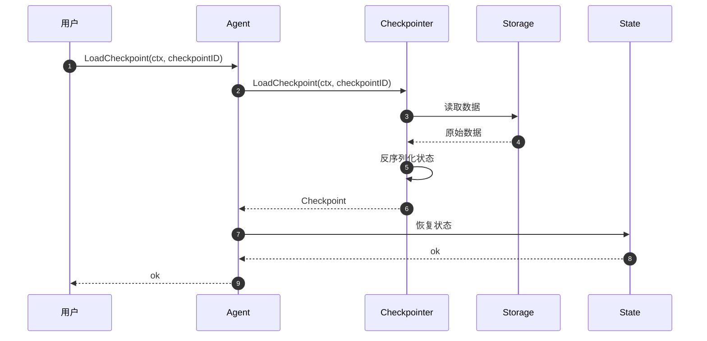
```mermaid
sequenceDiagram
    autonumber
    participant User as 用户
    participant Agent as Agent
    participant CP as Checkpointer
    participant Store as Storage
    participant State as State

    User->>Agent: LoadCheckpoint(ctx, checkpointID)
    Agent->>CP: LoadCheckpoint(ctx, checkpointID)
    CP->>Store: 读取数据
    Store-->>CP: 原始数据
    CP->>CP: 反序列化状态
    CP-->>Agent: Checkpoint

    Agent->>State: 恢复状态
    State-->>Agent: ok
    Agent-->>User: ok
```

## 7. LLM 调用时序

### 7.1 基本调用

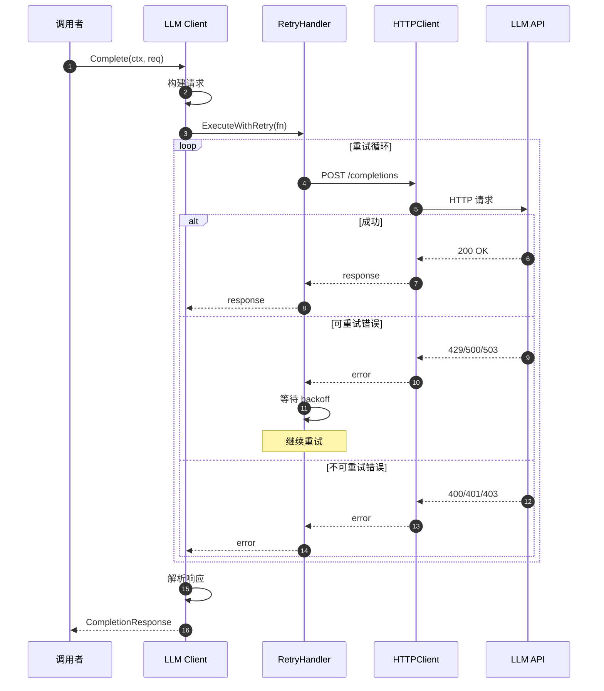
```mermaid
sequenceDiagram
    autonumber
    participant Caller as 调用者
    participant Client as LLM Client
    participant Retry as RetryHandler
    participant HTTP as HTTPClient
    participant API as LLM API

    Caller->>Client: Complete(ctx, req)
    Client->>Client: 构建请求
    Client->>Retry: ExecuteWithRetry(fn)

    loop 重试循环
        Retry->>HTTP: POST /completions
        HTTP->>API: HTTP 请求

        alt 成功
            API-->>HTTP: 200 OK
            HTTP-->>Retry: response
            Retry-->>Client: response
        else 可重试错误
            API-->>HTTP: 429/500/503
            HTTP-->>Retry: error
            Retry->>Retry: 等待 backoff
            Note over Retry: 继续重试
        else 不可重试错误
            API-->>HTTP: 400/401/403
            HTTP-->>Retry: error
            Retry-->>Client: error
        end
    end

    Client->>Client: 解析响应
    Client-->>Caller: CompletionResponse
```

### 7.2 带工具调用的 LLM 请求

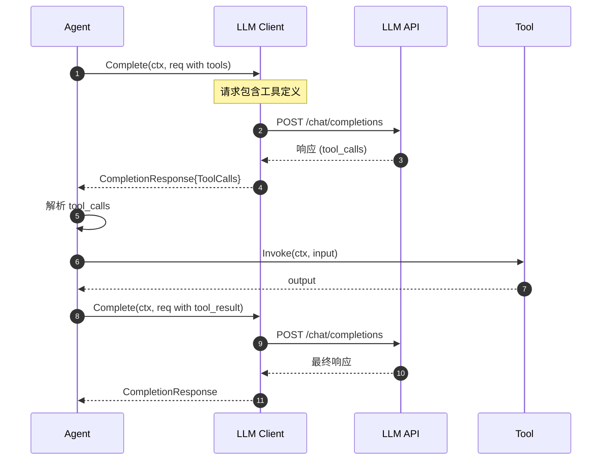
```mermaid
sequenceDiagram
    autonumber
    participant Agent as Agent
    participant Client as LLM Client
    participant API as LLM API
    participant Tool as Tool

    Agent->>Client: Complete(ctx, req with tools)
    Note over Client: 请求包含工具定义

    Client->>API: POST /chat/completions
    API-->>Client: 响应 (tool_calls)

    Client-->>Agent: CompletionResponse{ToolCalls}

    Agent->>Agent: 解析 tool_calls
    Agent->>Tool: Invoke(ctx, input)
    Tool-->>Agent: output

    Agent->>Client: Complete(ctx, req with tool_result)
    Client->>API: POST /chat/completions
    API-->>Client: 最终响应

    Client-->>Agent: CompletionResponse
```

## 8. Builder 构建时序

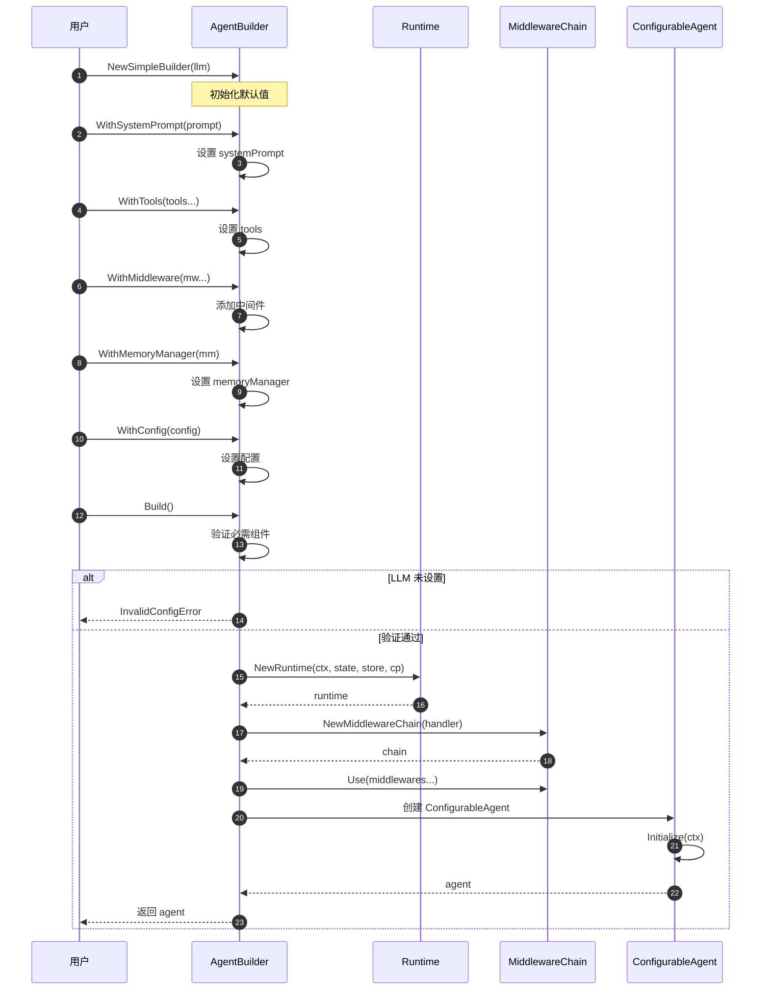
```mermaid
sequenceDiagram
    autonumber
    participant User as 用户
    participant B as AgentBuilder
    participant R as Runtime
    participant MW as MiddlewareChain
    participant A as ConfigurableAgent

    User->>B: NewSimpleBuilder(llm)
    Note over B: 初始化默认值

    User->>B: WithSystemPrompt(prompt)
    B->>B: 设置 systemPrompt

    User->>B: WithTools(tools...)
    B->>B: 设置 tools

    User->>B: WithMiddleware(mw...)
    B->>B: 添加中间件

    User->>B: WithMemoryManager(mm)
    B->>B: 设置 memoryManager

    User->>B: WithConfig(config)
    B->>B: 设置配置

    User->>B: Build()

    B->>B: 验证必需组件
    alt LLM 未设置
        B-->>User: InvalidConfigError
    else 验证通过
        B->>R: NewRuntime(ctx, state, store, cp)
        R-->>B: runtime

        B->>MW: NewMiddlewareChain(handler)
        MW-->>B: chain

        B->>MW: Use(middlewares...)

        B->>A: 创建 ConfigurableAgent
        A->>A: Initialize(ctx)
        A-->>B: agent

        B-->>User: 返回 agent
    end
```

## 9. 多 Agent 协作时序

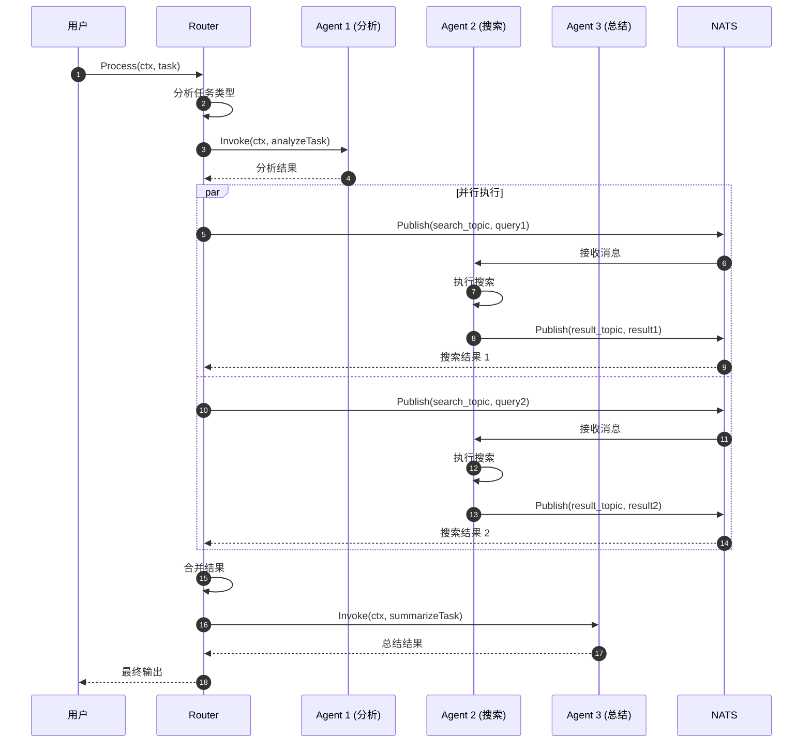
```mermaid
sequenceDiagram
    autonumber
    participant User as 用户
    participant Router as Router
    participant A1 as Agent 1 (分析)
    participant A2 as Agent 2 (搜索)
    participant A3 as Agent 3 (总结)
    participant NATS as NATS

    User->>Router: Process(ctx, task)

    Router->>Router: 分析任务类型
    Router->>A1: Invoke(ctx, analyzeTask)
    A1-->>Router: 分析结果

    par 并行执行
        Router->>NATS: Publish(search_topic, query1)
        NATS->>A2: 接收消息
        A2->>A2: 执行搜索
        A2->>NATS: Publish(result_topic, result1)
        NATS-->>Router: 搜索结果 1
    and
        Router->>NATS: Publish(search_topic, query2)
        NATS->>A2: 接收消息
        A2->>A2: 执行搜索
        A2->>NATS: Publish(result_topic, result2)
        NATS-->>Router: 搜索结果 2
    end

    Router->>Router: 合并结果
    Router->>A3: Invoke(ctx, summarizeTask)
    A3-->>Router: 总结结果

    Router-->>User: 最终输出
```

## 10. 可观测性时序

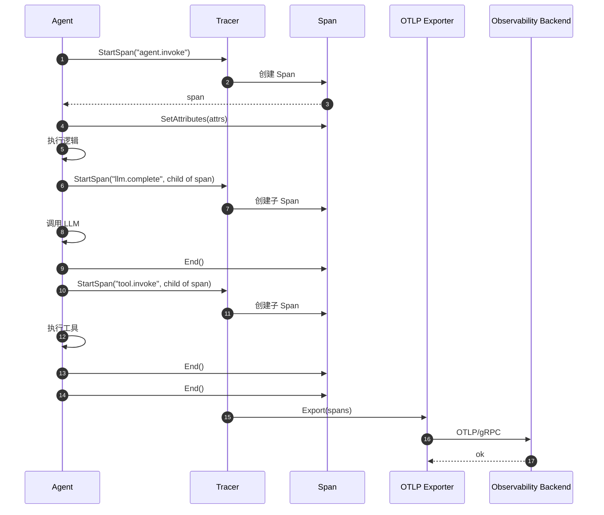
```mermaid
sequenceDiagram
    autonumber
    participant Agent as Agent
    participant Tracer as Tracer
    participant Span as Span
    participant Exporter as OTLP Exporter
    participant Backend as Observability Backend

    Agent->>Tracer: StartSpan("agent.invoke")
    Tracer->>Span: 创建 Span
    Span-->>Agent: span

    Agent->>Span: SetAttributes(attrs)
    Agent->>Agent: 执行逻辑

    Agent->>Tracer: StartSpan("llm.complete", child of span)
    Tracer->>Span: 创建子 Span
    Agent->>Agent: 调用 LLM
    Agent->>Span: End()

    Agent->>Tracer: StartSpan("tool.invoke", child of span)
    Tracer->>Span: 创建子 Span
    Agent->>Agent: 执行工具
    Agent->>Span: End()

    Agent->>Span: End()

    Tracer->>Exporter: Export(spans)
    Exporter->>Backend: OTLP/gRPC
    Backend-->>Exporter: ok
```

## 相关文档

- [流程图详解](FLOW_DIAGRAMS.md)
- [设计概述](DESIGN_OVERVIEW.md)
- [架构概述](../architecture/ARCHITECTURE.md)
