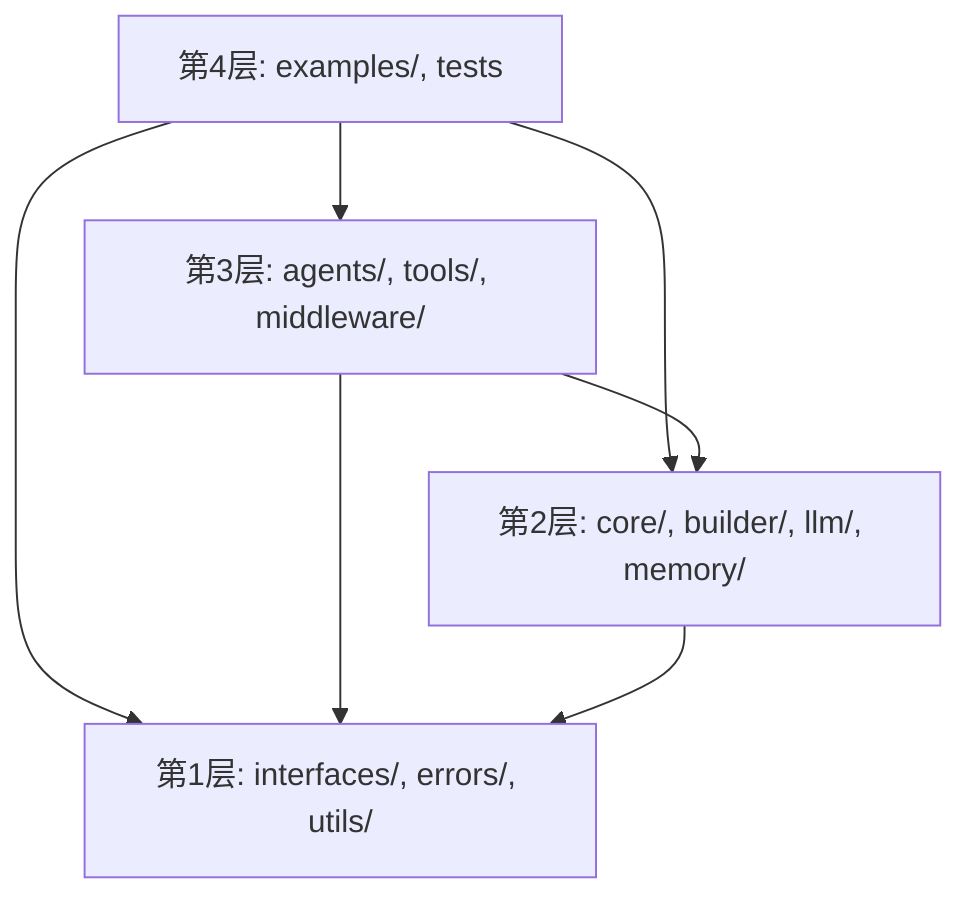

# GoAgent 开发指南

本文档为 GoAgent 框架的开发者提供完整的开发指南。

## 目录

- [开发环境设置](#开发环境设置)
- [项目结构](#项目结构)
- [代码规范](#代码规范)
- [扩展开发](#扩展开发)
- [测试指南](#测试指南)
- [调试技巧](#调试技巧)
- [性能优化](#性能优化)
- [贡献指南](#贡献指南)

---

## 开发环境设置

### 前提条件

```bash
# Go 版本要求
go version  # 需要 Go 1.25.0+

# 克隆项目
git clone https://github.com/kart-io/goagent.git
cd goagent

# 安装依赖
go mod download

# 验证安装
go build ./...
```

### 开发工具推荐

```bash
# golangci-lint - 代码检查
go install github.com/golangci/golangci-lint/cmd/golangci-lint@latest

# mockgen - Mock 生成
go install github.com/golang/mock/mockgen@latest

# gotestsum - 更好的测试输出
go install gotest.tools/gotestsum@latest
```

### IDE 配置

**VS Code 推荐扩展：**
- Go (golang.go)
- Go Test Explorer
- Error Lens

**.vscode/settings.json:**
```json
{
    "go.useLanguageServer": true,
    "go.lintTool": "golangci-lint",
    "go.lintFlags": ["--fast"],
    "go.testFlags": ["-v", "-race"],
    "editor.formatOnSave": true
}
```

---

## 项目结构

```
goagent/
├── agents/                 # Agent 推理实现
│   ├── base/              # 基础推理 Agent
│   ├── cot/               # Chain-of-Thought
│   ├── executor/          # 工具执行 Agent
│   ├── got/               # Graph-of-Thought
│   ├── metacot/           # Meta-CoT
│   ├── pot/               # Program-of-Thought
│   ├── react/             # ReAct
│   ├── sot/               # Skeleton-of-Thought
│   ├── specialized/       # 领域特定 Agent
│   └── tot/               # Tree-of-Thought
├── builder/               # Builder 模式实现
├── cache/                 # 缓存系统
├── core/                  # 核心执行引擎
│   ├── checkpoint/        # 检查点系统
│   ├── execution/         # 执行运行时
│   ├── middleware/        # 中间件框架
│   └── state/             # 状态管理
├── distributed/           # 分布式支持
├── docs/                  # 文档
├── errors/                # 错误定义
├── examples/              # 示例代码
├── interfaces/            # 核心接口定义
├── llm/                   # LLM 抽象和实现
│   ├── cache/             # LLM 缓存
│   ├── common/            # 通用工具
│   ├── constants/         # 常量
│   └── providers/         # LLM 提供商
├── mcp/                   # MCP 协议支持
├── memory/                # 内存管理
├── middleware/            # 全局中间件
├── multiagent/            # 多 Agent 协作
├── observability/         # 可观测性
├── options/               # 配置选项
├── parsers/               # 输出解析器
├── performance/           # 性能工具
├── planning/              # 规划系统
├── prompt/                # 提示词工程
├── reflection/            # 自反射
├── retrieval/             # 检索系统
├── store/                 # 存储实现
├── stream/                # 流式处理
├── testing/               # 测试工具
├── toolkits/              # 工具包
├── tools/                 # 工具系统
└── utils/                 # 工具函数
```

### 分层架构



**导入规则：**
- L1 不能导入任何 GoAgent 内部包
- L2 只能导入 L1
- L3 可以导入 L1 和 L2
- L4 可以导入所有层

---

## 代码规范

### 命名规范

```go
// 包名：小写，单词
package memory

// 接口名：动词或名词
type Reader interface {}
type Tool interface {}

// 结构体名：名词
type AgentBuilder struct {}
type ToolRegistry struct {}

// 方法名：动词开头
func (a *Agent) Invoke() {}
func (r *Registry) Register() {}

// 常量：大驼峰或全大写
const MaxRetries = 3
const DEFAULT_TIMEOUT = 30 * time.Second

// 变量：小驼峰
var defaultConfig = &Config{}
```

### 错误处理

```go
// 使用项目错误包
import agentErrors "github.com/kart-io/goagent/errors"

// 创建错误
if input == nil {
    return nil, agentErrors.NewValidationError("input", "input cannot be nil")
}

// 包装错误
result, err := doSomething()
if err != nil {
    return nil, agentErrors.Wrap(err, agentErrors.CodeInternal, "failed to do something")
}

// 检查错误类型
if agentErrors.IsValidationError(err) {
    // 处理验证错误
}
```

### 文档注释

```go
// Tool 表示智能体可以调用的可执行工具
//
// 所有工具实现都应实现此接口
//
// 实现位置：
//   - tools.BaseTool - 基础实现
//   - tools/compute/* - 计算工具
//
// 示例：
//
//	tool := NewBaseTool("my_tool", "description", schema, runFunc)
//	output, err := tool.Invoke(ctx, input)
type Tool interface {
    // Name 返回工具标识符
    //
    // 名称应在工具注册表中唯一
    Name() string

    // ... 其他方法
}
```

### 并发安全

```go
type Registry struct {
    tools map[string]Tool
    mu    sync.RWMutex  // 保护 tools 映射
}

func (r *Registry) Get(name string) Tool {
    r.mu.RLock()
    defer r.mu.RUnlock()
    return r.tools[name]
}

func (r *Registry) Register(tool Tool) error {
    r.mu.Lock()
    defer r.mu.Unlock()
    r.tools[tool.Name()] = tool
    return nil
}
```

---

## 扩展开发

### 添加新的 LLM Provider

1. **创建 Provider 文件**

```go
// llm/providers/myprovider.go
package providers

type MyProvider struct {
    *BaseProvider
    client *myclient.Client
}

func NewMyProviderWithOptions(opts ...ClientOption) (*MyProvider, error) {
    options := DefaultLLMOptions()
    for _, opt := range opts {
        opt(options)
    }

    client := myclient.New(options.APIKey)

    return &MyProvider{
        BaseProvider: NewBaseProvider(options),
        client:       client,
    }, nil
}

func (p *MyProvider) Complete(ctx context.Context, req *CompletionRequest) (*CompletionResponse, error) {
    // 实现补全逻辑
}

func (p *MyProvider) Provider() constants.Provider {
    return "myprovider"
}

func (p *MyProvider) IsAvailable() bool {
    return p.client != nil
}
```

2. **添加常量**

```go
// llm/constants/providers.go
const ProviderMyProvider Provider = "myprovider"
```

3. **添加测试**

```go
// llm/providers/myprovider_test.go
func TestMyProvider_Complete(t *testing.T) {
    // 测试实现
}
```

### 添加新的推理策略

1. **创建 Agent 目录**

```go
// agents/mystrategy/mystrategy.go
package mystrategy

type MyStrategyAgent struct {
    *core.BaseAgent
    llm    llm.Client
    config *Config
}

func New(llm llm.Client, opts ...Option) *MyStrategyAgent {
    // 实现
}

func (a *MyStrategyAgent) Invoke(ctx context.Context, input *interfaces.Input) (*interfaces.Output, error) {
    // 实现推理逻辑
}
```

2. **集成到 Builder**

```go
// builder/reasoning_presets.go
func (b *AgentBuilder[C, S]) WithMyStrategy(opts ...mystrategy.Option) *AgentBuilder[C, S] {
    // 实现
    return b
}
```

### 添加新的中间件

```go
// middleware/my_middleware.go
package middleware

type MyMiddleware struct {
    *BaseMiddleware
    // 自定义字段
}

func NewMyMiddleware(opts ...Option) *MyMiddleware {
    return &MyMiddleware{
        BaseMiddleware: NewBaseMiddleware("my_middleware"),
    }
}

func (m *MyMiddleware) OnBefore(ctx context.Context, req *MiddlewareRequest) (*MiddlewareRequest, error) {
    // 前置处理
    return req, nil
}

func (m *MyMiddleware) OnAfter(ctx context.Context, resp *MiddlewareResponse) (*MiddlewareResponse, error) {
    // 后置处理
    return resp, nil
}
```

---

## 测试指南

### 单元测试

```go
// tools/registry_test.go
func TestRegistry_Register(t *testing.T) {
    registry := NewRegistry()

    tool := &MockTool{name: "test_tool"}
    err := registry.Register(tool)

    assert.NoError(t, err)
    assert.Equal(t, 1, registry.Size())
}

func TestRegistry_Get(t *testing.T) {
    registry := NewRegistry()
    tool := &MockTool{name: "test_tool"}
    registry.Register(tool)

    got := registry.Get("test_tool")

    assert.NotNil(t, got)
    assert.Equal(t, "test_tool", got.Name())
}
```

### 表驱动测试

```go
func TestTool_Invoke(t *testing.T) {
    tests := []struct {
        name    string
        input   map[string]interface{}
        want    interface{}
        wantErr bool
    }{
        {
            name:    "valid input",
            input:   map[string]interface{}{"param": "value"},
            want:    "result",
            wantErr: false,
        },
        {
            name:    "missing param",
            input:   map[string]interface{}{},
            want:    nil,
            wantErr: true,
        },
    }

    for _, tt := range tests {
        t.Run(tt.name, func(t *testing.T) {
            tool := NewMyTool()
            got, err := tool.Invoke(context.Background(), &ToolInput{Args: tt.input})

            if tt.wantErr {
                assert.Error(t, err)
            } else {
                assert.NoError(t, err)
                assert.Equal(t, tt.want, got.Result)
            }
        })
    }
}
```

### 使用 Mock

```go
// testing/mocks/llm_mock.go
type MockLLMClient struct {
    mock.Mock
}

func (m *MockLLMClient) Complete(ctx context.Context, req *CompletionRequest) (*CompletionResponse, error) {
    args := m.Called(ctx, req)
    return args.Get(0).(*CompletionResponse), args.Error(1)
}

// 使用
func TestAgent_Invoke(t *testing.T) {
    mockLLM := new(MockLLMClient)
    mockLLM.On("Complete", mock.Anything, mock.Anything).Return(
        &CompletionResponse{Content: "response"},
        nil,
    )

    agent := NewAgent(mockLLM)
    // ...
}
```

### 基准测试

```go
func BenchmarkRegistry_Get(b *testing.B) {
    registry := NewRegistry()
    for i := 0; i < 100; i++ {
        registry.Register(&MockTool{name: fmt.Sprintf("tool_%d", i)})
    }

    b.ResetTimer()
    for i := 0; i < b.N; i++ {
        registry.Get("tool_50")
    }
}
```

### 运行测试

```bash
# 运行所有测试
go test ./...

# 运行特定包测试
go test ./tools/...

# 运行带覆盖率
go test -cover ./...

# 生成覆盖率报告
go test -coverprofile=coverage.out ./...
go tool cover -html=coverage.out

# 运行基准测试
go test -bench=. ./tools/...

# 运行带竞态检测
go test -race ./...
```

---

## 调试技巧

### 启用详细日志

```go
agent, _ := builder.NewSimpleBuilder(client).
    WithConfig(&builder.AgentConfig{
        Verbose: true,
    }).
    WithMiddleware(
        middleware.NewLoggingMiddleware(nil),
    ).
    Build()
```

### 使用 Delve 调试

```bash
# 安装 delve
go install github.com/go-delve/delve/cmd/dlv@latest

# 调试测试
dlv test ./tools/... -- -test.run TestMyFunction

# 调试程序
dlv debug ./cmd/main.go
```

### 追踪执行

```go
import "runtime/trace"

f, _ := os.Create("trace.out")
trace.Start(f)
defer trace.Stop()

// 执行代码
agent.Invoke(ctx, input)

// 分析
// go tool trace trace.out
```

---

## 性能优化

### 对象池

```go
var requestPool = sync.Pool{
    New: func() interface{} {
        return &MiddlewareRequest{}
    },
}

func GetRequest() *MiddlewareRequest {
    return requestPool.Get().(*MiddlewareRequest)
}

func PutRequest(req *MiddlewareRequest) {
    req.Reset()
    requestPool.Put(req)
}
```

### 避免不必要的分配

```go
// 不好
func process(items []string) []string {
    result := []string{}
    for _, item := range items {
        result = append(result, transform(item))
    }
    return result
}

// 好
func process(items []string) []string {
    result := make([]string, len(items))
    for i, item := range items {
        result[i] = transform(item)
    }
    return result
}
```

### 使用 pprof

```go
import _ "net/http/pprof"

go func() {
    http.ListenAndServe("localhost:6060", nil)
}()

// 分析
// go tool pprof http://localhost:6060/debug/pprof/profile
// go tool pprof http://localhost:6060/debug/pprof/heap
```

---

## 贡献指南

### 提交流程

1. Fork 项目
2. 创建功能分支：`git checkout -b feature/my-feature`
3. 提交更改：`git commit -m "feat: add my feature"`
4. 推送分支：`git push origin feature/my-feature`
5. 创建 Pull Request

### 提交信息规范

```
<type>(<scope>): <subject>

<body>

<footer>
```

**类型：**
- `feat`: 新功能
- `fix`: 修复 bug
- `docs`: 文档更新
- `style`: 代码格式
- `refactor`: 重构
- `test`: 测试相关
- `chore`: 构建/工具

**示例：**
```
feat(tools): add new calculator tool

- Add Calculator tool with basic math operations
- Support +, -, *, / operators
- Include comprehensive tests

Closes #123
```

### PR 检查清单

- [ ] 代码遵循项目规范
- [ ] 添加了必要的测试
- [ ] 所有测试通过
- [ ] 更新了相关文档
- [ ] 没有引入新的 lint 警告

---

## 相关文档

- [测试最佳实践](TESTING_BEST_PRACTICES.md)
- [Panic 处理指南](PANIC_HANDLING.md)
- [架构概述](../architecture/ARCHITECTURE.md)
- [API 参考](../api/CORE_API.md)
