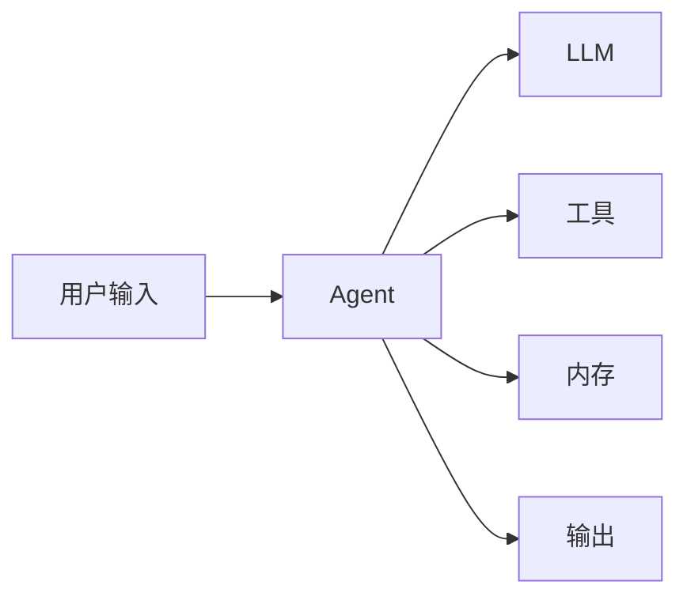
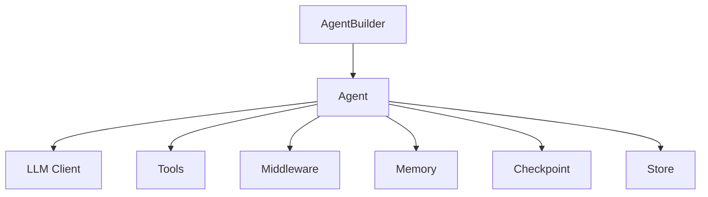

# GoAgent 使用指南

本文档提供 GoAgent 框架的完整使用指南。

## 目录

- [安装配置](#安装配置)
- [核心概念](#核心概念)
- [Agent 使用](#agent-使用)
- [工具使用](#工具使用)
- [内存管理](#内存管理)
- [中间件使用](#中间件使用)
- [流式处理](#流式处理)
- [错误处理](#错误处理)
- [最佳实践](#最佳实践)

---

## 安装配置

### 系统要求

- Go 1.25.0 或更高版本
- 支持的操作系统：Linux、macOS、Windows

### 安装

```bash
go get github.com/kart-io/goagent
```

### 环境变量配置

```bash
# LLM API 密钥
export OPENAI_API_KEY="sk-..."
export ANTHROPIC_API_KEY="sk-ant-..."
export DEEPSEEK_API_KEY="sk-..."
export GOOGLE_API_KEY="..."

# 国内服务
export KIMI_API_KEY="..."
export SILICONFLOW_API_KEY="..."

# 可选配置
export GOAGENT_LOG_LEVEL="info"     # debug, info, warn, error
export GOAGENT_LOG_FORMAT="json"    # json, text
export GOAGENT_TIMEOUT="30s"        # 默认超时
```

---

## 核心概念

### Agent

Agent 是能够推理、使用工具和做出决策的自主智能体。



### 推理模式

GoAgent 支持多种推理模式：

| 模式 | 描述 | 适用场景 |
|------|------|----------|
| ReAct | 推理与行动交替 | 需要工具调用的任务 |
| CoT | 思维链推理 | 复杂推理任务 |
| ToT | 思维树搜索 | 需要探索多种方案 |
| GoT | 思维图推理 | 复杂依赖关系 |
| PoT | 程序化思维 | 结构化问题 |

### 组件关系



---

## Agent 使用

### 基础用法

```go
import (
    "github.com/kart-io/goagent/builder"
    "github.com/kart-io/goagent/llm/providers"
)

// 1. 创建 LLM 客户端
client, _ := providers.NewOpenAIWithOptions(
    providers.WithAPIKey(os.Getenv("OPENAI_API_KEY")),
    providers.WithModel("gpt-4"),
)

// 2. 使用 Builder 创建 Agent
agent, _ := builder.NewSimpleBuilder(client).
    WithSystemPrompt("你是一个有帮助的助手").
    Build()

// 3. 调用 Agent
output, _ := agent.Invoke(ctx, &interfaces.Input{
    Messages: []interfaces.Message{
        {Role: "user", Content: "你好"},
    },
})

fmt.Println(output.Messages[0].Content)
```

### 配置选项

```go
agent, _ := builder.NewSimpleBuilder(client).
    WithSystemPrompt("你是一个助手").
    WithConfig(&builder.AgentConfig{
        MaxIterations:          10,              // 最大迭代次数
        Timeout:                30 * time.Second, // 超时时间
        EnableStreaming:        true,            // 启用流式
        EnableAutoSave:         true,            // 自动保存
        SaveInterval:           5 * time.Second, // 保存间隔
        MaxTokens:              2000,            // 最大 Token
        Temperature:            0.7,             // 温度
        SessionID:              "session-001",   // 会话 ID
        Verbose:                true,            // 详细模式
        MaxConversationHistory: 20,              // 最大历史数
        OutputFormat:           builder.OutputFormatMarkdown,
    }).
    Build()
```

### 使用不同推理模式

```go
// ReAct 模式
reactAgent, _ := builder.NewSimpleBuilder(client).
    WithReAct().
    WithTools(tools...).
    Build()

// 零样本思维链
cotAgent, _ := builder.NewSimpleBuilder(client).
    WithZeroShotCoT().
    Build()

// 少样本思维链
fewShotAgent, _ := builder.NewSimpleBuilder(client).
    WithFewShotCoT(examples).
    Build()

// 思维树（束搜索）
totAgent, _ := builder.NewSimpleBuilder(client).
    WithBeamSearchToT(beamWidth, maxDepth).
    Build()

// 思维树（蒙特卡洛）
mctsAgent, _ := builder.NewSimpleBuilder(client).
    WithMonteCarloToT().
    Build()
```

---

## 工具使用

### 创建工具

**方式 1: 实现 Tool 接口**

```go
type MyTool struct{}

func (t *MyTool) Name() string {
    return "my_tool"
}

func (t *MyTool) Description() string {
    return "工具描述"
}

func (t *MyTool) ArgsSchema() string {
    return `{
        "type": "object",
        "properties": {
            "param": {"type": "string"}
        },
        "required": ["param"]
    }`
}

func (t *MyTool) Invoke(ctx context.Context, input *interfaces.ToolInput) (*interfaces.ToolOutput, error) {
    param := input.Args["param"].(string)
    result := doSomething(param)
    return &interfaces.ToolOutput{
        Result:  result,
        Success: true,
    }, nil
}
```

**方式 2: 使用 FunctionTool**

```go
import "github.com/kart-io/goagent/tools"

myTool := tools.NewFunctionTool(
    "my_tool",
    "工具描述",
    `{"type": "object", "properties": {"param": {"type": "string"}}, "required": ["param"]}`,
    func(ctx context.Context, args map[string]interface{}) (interface{}, error) {
        param := args["param"].(string)
        return doSomething(param), nil
    },
)
```

**方式 3: 使用 Builder**

```go
myTool := tools.NewFunctionToolBuilder("my_tool").
    WithDescription("工具描述").
    WithArgsSchema(`{"type": "object", "properties": {"param": {"type": "string"}}}`).
    WithFunction(func(ctx context.Context, args map[string]interface{}) (interface{}, error) {
        return args["param"], nil
    }).
    MustBuild()
```

### 注册工具

```go
agent, _ := builder.NewSimpleBuilder(client).
    WithTools(tool1, tool2, tool3).
    Build()
```

### 使用内置工具

```go
import (
    "github.com/kart-io/goagent/tools/shell"
    "github.com/kart-io/goagent/tools/compute"
    "github.com/kart-io/goagent/tools/http"
)

// Shell 工具
shellTool := shell.NewShellTool()

// 计算器
calculator := compute.NewCalculator()

// HTTP 工具
apiTool := http.NewAPITool()

agent, _ := builder.NewSimpleBuilder(client).
    WithTools(shellTool, calculator, apiTool).
    Build()
```

---

## 内存管理

### 对话记忆

```go
import "github.com/kart-io/goagent/memory"

// 创建内存管理器
memManager := memory.NewDefaultManager()

// 创建带内存的 Agent
agent, _ := builder.NewSimpleBuilder(client).
    WithMemoryManager(memManager).
    WithConfig(&builder.AgentConfig{
        SessionID:              "session-001",
        MaxConversationHistory: 20,
    }).
    Build()

// 对话会自动保存
output1, _ := agent.Invoke(ctx, input1)
output2, _ := agent.Invoke(ctx, input2) // 包含历史上下文
```

### 手动管理对话

```go
// 添加对话
memManager.AddConversation(ctx, &interfaces.Conversation{
    SessionID: "session-001",
    Role:      "user",
    Content:   "你好",
    Timestamp: time.Now(),
})

// 获取历史
history, _ := memManager.GetConversationHistory(ctx, "session-001", 10)

// 清除对话
memManager.ClearConversation(ctx, "session-001")
```

### 案例记忆（基于案例推理）

```go
// 添加案例
memManager.AddCase(ctx, &interfaces.Case{
    Title:    "数据库连接超时",
    Problem:  "应用无法连接数据库",
    Solution: "增加连接超时到 30 秒",
    Category: "infrastructure",
    Tags:     []string{"database", "timeout"},
})

// 搜索相似案例
cases, _ := memManager.SearchSimilarCases(ctx, "数据库连接问题", 5)
for _, c := range cases {
    fmt.Printf("相似度 %.2f: %s\n", c.Similarity, c.Title)
}
```

### 使用 Checkpoint

```go
import "github.com/kart-io/goagent/core/checkpoint"

// 创建检查点管理器
cp := checkpoint.NewInMemorySaver()

// 或使用 Redis
// cp := checkpoint.NewRedisCheckpointer(redisClient)

agent, _ := builder.NewSimpleBuilder(client).
    WithCheckpointer(cp).
    WithConfig(&builder.AgentConfig{
        EnableAutoSave: true,
        SaveInterval:   5 * time.Second,
    }).
    Build()

// 手动保存检查点
checkpointID, _ := agent.SaveCheckpoint(ctx)

// 恢复检查点
agent.LoadCheckpoint(ctx, checkpointID)
```

---

## 中间件使用

### 添加中间件

```go
import "github.com/kart-io/goagent/core/middleware"

agent, _ := builder.NewSimpleBuilder(client).
    WithMiddleware(
        middleware.NewLoggingMiddleware(nil),
        middleware.NewTimingMiddleware(),
        middleware.NewCacheMiddleware(5 * time.Minute),
        middleware.NewRateLimitMiddleware(10), // 每秒 10 请求
    ).
    Build()
```

### 自定义中间件

```go
type MyMiddleware struct {
    *middleware.BaseMiddleware
}

func NewMyMiddleware() *MyMiddleware {
    return &MyMiddleware{
        BaseMiddleware: middleware.NewBaseMiddleware("my_middleware"),
    }
}

func (m *MyMiddleware) OnBefore(ctx context.Context, req *middleware.MiddlewareRequest) (*middleware.MiddlewareRequest, error) {
    // 前置处理
    req.Metadata["start_time"] = time.Now()
    return req, nil
}

func (m *MyMiddleware) OnAfter(ctx context.Context, resp *middleware.MiddlewareResponse) (*middleware.MiddlewareResponse, error) {
    // 后置处理
    return resp, nil
}
```

---

## 流式处理

### 基本流式输出

```go
stream, err := agent.Stream(ctx, input)
if err != nil {
    return err
}

for chunk := range stream {
    if chunk.Done {
        break
    }
    fmt.Print(chunk.Content)
}
```

### 带错误处理的流式

```go
stream, err := agent.Stream(ctx, input)
if err != nil {
    return err
}

var fullContent strings.Builder
for chunk := range stream {
    if chunk.Error != nil {
        log.Printf("流错误: %v", chunk.Error)
        continue
    }
    fullContent.WriteString(chunk.Content)
    fmt.Print(chunk.Content)
    if chunk.Done {
        break
    }
}

fmt.Println("\n完整内容:", fullContent.String())
```

---

## 错误处理

### 错误类型

```go
import agentErrors "github.com/kart-io/goagent/errors"

output, err := agent.Invoke(ctx, input)
if err != nil {
    switch {
    case agentErrors.IsValidationError(err):
        log.Printf("验证错误: %v", err)
    case agentErrors.IsLLMError(err):
        log.Printf("LLM 错误: %v", err)
    case agentErrors.IsToolError(err):
        log.Printf("工具错误: %v", err)
    case agentErrors.IsTimeoutError(err):
        log.Printf("超时错误: %v", err)
    default:
        log.Printf("未知错误: %v", err)
    }
}
```

### 自定义错误处理

```go
agent, _ := builder.NewSimpleBuilder(client).
    WithErrorHandler(func(err error) error {
        // 自定义错误处理逻辑
        log.Printf("Agent 错误: %v", err)

        // 可以转换或包装错误
        return fmt.Errorf("wrapped: %w", err)
    }).
    Build()
```

### 重试策略

```go
agent, _ := builder.NewSimpleBuilder(client).
    WithMiddleware(
        middleware.NewRetryMiddleware(3, 100*time.Millisecond).
            WithRetryCondition(func(err error) bool {
                return agentErrors.IsRetryable(err)
            }),
    ).
    Build()
```

---

## 最佳实践

### 1. 使用上下文控制

```go
// 设置超时
ctx, cancel := context.WithTimeout(context.Background(), 30*time.Second)
defer cancel()

output, err := agent.Invoke(ctx, input)
```

### 2. 资源清理

```go
defer func() {
    if closer, ok := agent.(io.Closer); ok {
        closer.Close()
    }
}()
```

### 3. 日志和监控

```go
agent, _ := builder.NewSimpleBuilder(client).
    WithMiddleware(
        middleware.NewLoggingMiddleware(func(msg string) {
            zap.L().Info(msg)
        }),
        middleware.NewTimingMiddleware(),
    ).
    WithCallbacks(
        &myCallback{},
    ).
    Build()
```

### 4. 配置管理

```go
config := &builder.AgentConfig{
    MaxIterations: getEnvInt("AGENT_MAX_ITERATIONS", 10),
    Timeout:       getEnvDuration("AGENT_TIMEOUT", 30*time.Second),
    Temperature:   getEnvFloat("AGENT_TEMPERATURE", 0.7),
}

agent, _ := builder.NewSimpleBuilder(client).
    WithConfig(config).
    Build()
```

### 5. 测试友好

```go
// 使用接口便于 mock
type AgentService interface {
    Process(ctx context.Context, input string) (string, error)
}

// 实现
type DefaultAgentService struct {
    agent *builder.ConfigurableAgent[any, *core.AgentState]
}

func (s *DefaultAgentService) Process(ctx context.Context, input string) (string, error) {
    output, err := s.agent.Invoke(ctx, &interfaces.Input{
        Messages: []interfaces.Message{{Role: "user", Content: input}},
    })
    if err != nil {
        return "", err
    }
    return output.Messages[0].Content, nil
}
```

---

## 相关文档

- [快速入门](QUICKSTART.md)
- [LLM 提供商指南](LLM_PROVIDERS.md)
- [工具中间件指南](TOOL_MIDDLEWARE.md)
- [API 参考](../api/CORE_API.md)
- [架构概述](../architecture/ARCHITECTURE.md)
