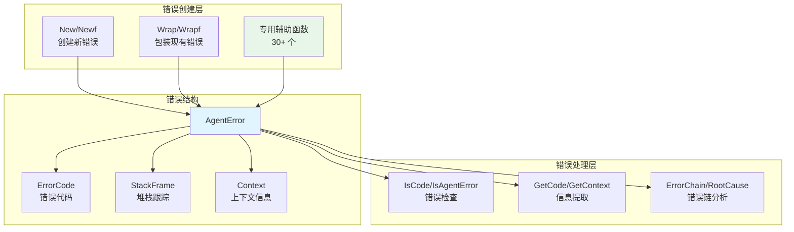
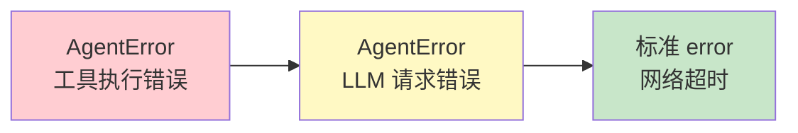

# errors 错误处理系统

本模块是 goagent 框架的统一错误处理系统，提供结构化、可追踪的错误管理机制。

## 目录

- [架构设计](#架构设计)
- [错误代码](#错误代码)
- [核心类型](#核心类型)
- [使用方法](#使用方法)
- [API 参考](#api-参考)
- [代码结构](#代码结构)

## 架构设计

### 系统架构图



### 错误链模型



## 错误代码

### 错误代码分类

| 分类 | 错误代码 | 说明 |
|------|---------|------|
| **Agent** | `AGENT_EXECUTION` | Agent 执行错误 |
| | `AGENT_VALIDATION` | Agent 验证错误 |
| | `AGENT_NOT_FOUND` | Agent 未找到 |
| | `AGENT_INITIALIZATION` | Agent 初始化错误 |
| **Tool** | `TOOL_EXECUTION` | 工具执行错误 |
| | `TOOL_NOT_FOUND` | 工具未找到 |
| | `TOOL_VALIDATION` | 工具验证错误 |
| | `TOOL_TIMEOUT` | 工具超时 |
| | `TOOL_RETRY_EXHAUSTED` | 重试次数耗尽 |
| **LLM** | `LLM_REQUEST` | LLM 请求错误 |
| | `LLM_RESPONSE` | LLM 响应错误 |
| | `LLM_TIMEOUT` | LLM 超时 |
| | `LLM_RATE_LIMIT` | LLM 速率限制 |
| **Stream** | `STREAM_READ` | 流读取错误 |
| | `STREAM_WRITE` | 流写入错误 |
| | `STREAM_TIMEOUT` | 流超时 |
| | `STREAM_CLOSED` | 流已关闭 |
| **分布式** | `DISTRIBUTED_CONNECTION` | 连接错误 |
| | `DISTRIBUTED_COORDINATION` | 协调错误 |
| | `DISTRIBUTED_SERIALIZATION` | 序列化错误 |
| **RAG** | `RETRIEVAL_SEARCH` | 检索搜索错误 |
| | `RETRIEVAL_EMBEDDING` | 嵌入生成错误 |
| | `DOCUMENT_NOT_FOUND` | 文档未找到 |
| | `VECTOR_DIM_MISMATCH` | 向量维度不匹配 |
| **规划** | `PLANNING_FAILED` | 规划失败 |
| | `PLAN_VALIDATION` | 计划验证错误 |
| | `PLAN_EXECUTION_FAILED` | 计划执行失败 |
| **通用** | `INVALID_INPUT` | 无效输入 |
| | `INVALID_CONFIG` | 无效配置 |
| | `NOT_IMPLEMENTED` | 未实现 |
| | `INTERNAL_ERROR` | 内部错误 |

## 核心类型

### AgentError 结构

```go
type AgentError struct {
    Code      ErrorCode              // 错误代码
    Message   string                 // 错误信息
    Operation string                 // 操作名称
    Component string                 // 组件名称
    Context   map[string]interface{} // 上下文信息
    Cause     error                  // 底层错误
    Stack     []StackFrame           // 堆栈跟踪
}

type StackFrame struct {
    File     string // 源文件路径
    Line     int    // 行号
    Function string // 函数名
}
```

### 方法链构造

```go
err := errors.New(errors.CodeLLMRateLimit, "rate limit exceeded").
    WithComponent("llm_client").
    WithOperation("request").
    WithContext("provider", "openai").
    WithContext("model", "gpt-4").
    WithContext("retry_after_seconds", 60)
```

## 使用方法

### 基础使用

```go
// 方式 1: 直接创建错误
err := errors.New(errors.CodeLLMTimeout, "request timed out after 30 seconds").
    WithComponent("llm").
    WithContext("timeout_seconds", 30)

// 方式 2: 使用专用辅助函数（推荐）
err := errors.NewLLMTimeoutError("openai", "gpt-4", 30)

// 方式 3: 包装现有错误
underlyingErr := fmt.Errorf("network error")
err := errors.Wrap(underlyingErr, errors.CodeLLMRequest, "LLM request failed").
    WithComponent("llm_client").
    WithContext("provider", "openai")
```

### 错误检查

```go
// 检查错误代码
if errors.IsCode(err, errors.CodeDocumentNotFound) {
    return 404, "Not Found"
}

if errors.IsCode(err, errors.CodeLLMRateLimit) {
    ctx := errors.GetContext(err)
    retryAfter := ctx["retry_after_seconds"].(int)
    time.Sleep(time.Duration(retryAfter) * time.Second)
}

// 检查是否为 AgentError
if errors.IsAgentError(err) {
    agentErr := err.(*errors.AgentError)
    fmt.Println(agentErr.FormatStack())
}
```

### 错误链处理

```go
// 查看完整错误链
chain := errors.ErrorChain(wrappedErr)
for i, e := range chain {
    fmt.Printf("[%d] %v\n", i, e)
}

// 获取根本原因
root := errors.RootCause(wrappedErr)
fmt.Printf("Root cause: %v\n", root)
```

### 重试逻辑

```go
for attempt := 1; attempt <= maxAttempts; attempt++ {
    err := doOperation()
    if err == nil {
        return nil
    }

    if errors.IsCode(err, errors.CodeLLMRateLimit) {
        ctx := errors.GetContext(err)
        retryAfter := ctx["retry_after_seconds"].(int)
        time.Sleep(time.Duration(retryAfter) * time.Second)
        continue
    }

    // 不可重试的错误
    return errors.NewToolRetryExhaustedError("operation", attempt, err)
}
```

### HTTP 状态码映射

```go
func errorToHTTPStatus(err error) (int, string) {
    switch errors.GetCode(err) {
    case errors.CodeDocumentNotFound:
        return 404, "Not Found"
    case errors.CodeInvalidInput:
        return 400, "Bad Request"
    case errors.CodeLLMRateLimit:
        return 429, "Too Many Requests"
    case errors.CodeLLMTimeout:
        return 504, "Gateway Timeout"
    default:
        return 500, "Internal Server Error"
    }
}
```

### 结构化日志

```go
// 提取错误信息用于日志
logger.Error("operation failed",
    "error_code", errors.GetCode(err),
    "component", errors.GetComponent(err),
    "operation", errors.GetOperation(err),
    "context", errors.GetContext(err),
)

// 打印堆栈跟踪
if agentErr, ok := err.(*errors.AgentError); ok {
    fmt.Println(agentErr.FormatStack())
}
```

## API 参考

### 构造函数

```go
// 创建新错误
New(code ErrorCode, message string) *AgentError
Newf(code ErrorCode, format string, args ...interface{}) *AgentError

// 包装现有错误
Wrap(err error, code ErrorCode, message string) *AgentError
Wrapf(err error, code ErrorCode, format string, args ...interface{}) *AgentError
```

### 流式方法

```go
func (e *AgentError) WithOperation(operation string) *AgentError
func (e *AgentError) WithComponent(component string) *AgentError
func (e *AgentError) WithContext(key string, value interface{}) *AgentError
func (e *AgentError) WithContextMap(ctx map[string]interface{}) *AgentError
```

### 检查函数

```go
// 错误代码检查
GetCode(err error) ErrorCode
IsCode(err error, code ErrorCode) bool

// 类型检查
IsAgentError(err error) bool

// 信息提取
GetOperation(err error) string
GetComponent(err error) string
GetContext(err error) map[string]interface{}

// 错误链
ErrorChain(err error) []error
RootCause(err error) error
```

### 专用辅助函数

```go
// Agent 相关
NewAgentExecutionError(agentName, operation string, cause error) *AgentError
NewAgentValidationError(agentName, reason string) *AgentError
NewAgentNotFoundError(agentName string) *AgentError
NewAgentInitializationError(agentName string, cause error) *AgentError

// Tool 相关
NewToolExecutionError(toolName, operation string, cause error) *AgentError
NewToolNotFoundError(toolName string) *AgentError
NewToolValidationError(toolName, reason string) *AgentError
NewToolTimeoutError(toolName string, timeoutSeconds int) *AgentError
NewToolRetryExhaustedError(toolName string, attempts int, lastError error) *AgentError

// LLM 相关
NewLLMRequestError(provider, model string, cause error) *AgentError
NewLLMResponseError(provider, model, reason string) *AgentError
NewLLMTimeoutError(provider, model string, timeoutSeconds int) *AgentError
NewLLMRateLimitError(provider, model string, retryAfterSeconds int) *AgentError

// Stream 相关
NewStreamReadError(cause error) *AgentError
NewStreamWriteError(cause error) *AgentError
NewStreamTimeoutError(operation string, timeoutSeconds int) *AgentError
NewStreamClosedError(operation string) *AgentError

// RAG 相关
NewRetrievalSearchError(query string, cause error) *AgentError
NewRetrievalEmbeddingError(text string, cause error) *AgentError
NewDocumentNotFoundError(docID string) *AgentError
NewVectorDimMismatchError(expected, actual int) *AgentError

// Planning 相关
NewPlanningError(goal string, cause error) *AgentError
NewPlanValidationError(planID, reason string) *AgentError
NewPlanExecutionError(planID, stepID string, cause error) *AgentError
NewPlanNotFoundError(planID string) *AgentError

// 通用工具
ErrorWithRetry(err error, attempt, maxAttempts int) *AgentError
ErrorWithDuration(err error, durationMs int64) *AgentError
```

## 代码结构

```text
errors/
├── errors.go       # 核心类型和基础方法
│                   # - ErrorCode 常量定义
│                   # - AgentError 结构体
│                   # - 构造函数和流式方法
│                   # - 错误检查和提取函数
│
├── helpers.go      # 30+ 个专用错误创建函数
│                   # - Agent/Tool/LLM/Stream 等
│
└── errors_test.go  # 单元测试
```

## 设计特点

### 结构化错误

- **错误代码分类**：43 种错误类型，覆盖全部业务场景
- **上下文信息**：灵活的 key-value 存储
- **堆栈跟踪**：自动捕获调用栈

### 错误链支持

- 实现 `Unwrap()` 支持 `errors.Is()` 和 `errors.As()`
- 提供 `ErrorChain()` 和 `RootCause()` 便捷函数

### 易于集成

- 与 Go 标准库 `errors` 包完全兼容
- 便于集成到日志、监控、告警系统

## 扩展阅读

- [core](../core/) - 核心执行引擎
- [observability](../observability/) - 可观测性
- [middleware](../middleware/) - 中间件
