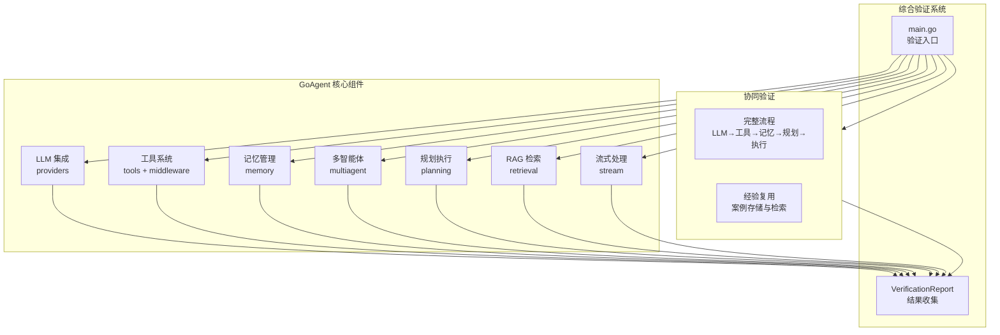
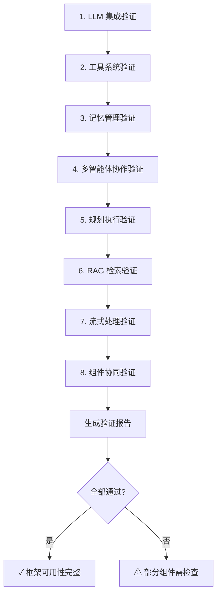

# GoAgent 综合示例 - 组件完整性验证

本示例用于验证 GoAgent 框架各组件的**完整性**、**协同能力**与**可用性**，通过系统化测试确保框架各模块正常工作。

## 验证范围

本示例覆盖以下 8 大核心组件：

| 组件 | 验证内容 |
|------|---------|
| **LLM 集成** | 客户端创建、多提供商支持、对话能力、消息构建器 |
| **工具系统** | 注册表创建、工具注册、工具执行、中间件、工具列表 |
| **记忆管理** | 管理器创建、对话历史、案例存储、案例搜索、键值存储 |
| **多智能体** | 系统创建、Agent 注册、并行协作、顺序协作、消息通信 |
| **规划执行** | 规划器创建、执行器创建、计划创建、计划验证、计划执行 |
| **RAG 检索** | 向量存储、文档添加、相似度搜索、RAG 检索器、向量存储检索器 |
| **流式处理** | 管理器创建、数据块创建、函数式处理器、流式缓冲区 |
| **组件协同** | 完整流程集成、经验复用 |

## 架构设计



## 验证流程



## 运行示例

### 前置条件

可选配置 LLM API Key（未配置时使用模拟模式）：

```bash
# 任选其一
export DEEPSEEK_API_KEY=your-key
export KIMI_API_KEY=your-key
export OPENAI_API_KEY=your-key
```

### 运行

```bash
cd examples/comprehensive
go run main.go
```

### 预期输出

```
╔════════════════════════════════════════════════════════════════╗
║          GoAgent 框架组件完整性验证                            ║
║   验证各组件的完整性、协同能力与可用性                          ║
╚════════════════════════════════════════════════════════════════╝

【1. LLM 集成验证】
════════════════════════════════════════════════════════════════
  ✓ LLM 客户端创建成功 (提供商: deepseek)
  ✓ LLM 对话成功 (响应: Agent 是一个能够自主执行任务的智能实体...)
  ✓ 消息构建器验证通过

【2. 工具系统验证】
════════════════════════════════════════════════════════════════
  ✓ 工具注册表创建成功
  ✓ 工具注册成功
  ✓ 工具执行成功: map[expression:1 + 1 result:42]
  ✓ 中间件验证成功 (调用次数: 1)
  ✓ 工具列表验证: 1 个工具

【3. 记忆管理验证】
════════════════════════════════════════════════════════════════
  ✓ 记忆管理器创建成功
  ✓ 对话历史验证成功: 1 条消息
  ✓ 案例存储验证成功: cf1cf08c-...
  ✓ 案例搜索验证成功: 1 个结果
  ✓ 键值存储验证成功

【4. 多智能体协作验证】
════════════════════════════════════════════════════════════════
  ✓ 多智能体系统创建成功
  ✓ Agent 注册成功: leader, worker_1, worker_2
  ✓ 并行协作验证成功: completed
  ✓ 顺序协作验证成功: completed
  ✓ 消息通信验证成功

【5. 规划执行验证】
════════════════════════════════════════════════════════════════
  ✓ SmartPlanner 创建成功
  ✓ AgentExecutor 创建成功
  ✓ 计划创建成功: plan_xxx (5 步骤)
  ✓ 计划验证: 有效=true
  ✓ 计划执行: 成功=true, 完成=5/5

【6. RAG 检索验证】
════════════════════════════════════════════════════════════════
  ✓ 向量存储创建成功
  ✓ 文档添加成功: 3 个
  ✓ 相似度搜索成功: 2 个结果
  ✓ RAG 检索器创建成功
  ✓ RAG 检索成功: 3 个文档
  ✓ 向量存储检索器验证成功: 3 个文档

【7. 流式处理验证】
════════════════════════════════════════════════════════════════
  ✓ 流管理器创建成功
  ✓ 流数据块创建成功
  ✓ 函数式处理器验证成功: 3 个数据块
  ✓ 流式缓冲区验证成功: 读取 5 个

【8. 组件协同验证】
════════════════════════════════════════════════════════════════
  ✓ 组件协同验证成功: 完整流程执行 成功=true
  ✓ 经验复用验证成功

╔════════════════════════════════════════════════════════════════╗
║                      验证报告                                  ║
╚════════════════════════════════════════════════════════════════╝

【LLM 集成】
────────────────────────────────────────
  ✓ 客户端创建 (1.234ms)
      提供商: deepseek
  ✓ 对话能力 (2.345s)
      响应长度: 128 字符
  ✓ 消息构建器 (0.001ms)
      System/User/Assistant 消息构建正常

... (其他组件结果)

════════════════════════════════════════════════════════════════
总计: 28 项测试 | 通过: 28 | 失败: 0 | 通过率: 100.0% | 总耗时: 5.678s
════════════════════════════════════════════════════════════════
               ✓ 所有组件验证通过！框架可用性完整。
════════════════════════════════════════════════════════════════
```

## 验证项目详解

### 1. LLM 集成验证

验证 LLM 客户端的创建和使用：

```go
// 多提供商支持
client := createLLMClient() // 支持 DeepSeek/Kimi/OpenAI

// 对话能力
messages := []llm.Message{
    llm.SystemMessage("你是一个简洁的助手。"),
    llm.UserMessage("用一句话解释什么是 Agent。"),
}
resp, err := client.Chat(ctx, messages)

// 消息构建器
sysMsg := llm.SystemMessage("系统提示")
userMsg := llm.UserMessage("用户消息")
assistantMsg := llm.AssistantMessage("助手回复")
```

### 2. 工具系统验证

验证工具注册、执行和中间件：

```go
// 创建注册表
registry := tools.NewRegistry()

// 创建并注册工具
calculatorTool := tools.NewFunctionTool(
    "calculator",
    "执行数学计算",
    `{"type": "object", "properties": {"expression": {"type": "string"}}}`,
    func(ctx context.Context, args map[string]any) (any, error) {
        // 执行计算逻辑
        return result, nil
    },
)
registry.Register(calculatorTool)

// 使用中间件包装
wrappedTool := tools.WithMiddleware(calculatorTool, metricsMW)
```

### 3. 记忆管理验证

验证对话历史、案例存储和键值存储：

```go
// 创建记忆管理器
memoryManager := memory.NewInMemoryManager(config)

// 对话历史
memoryManager.AddConversation(ctx, &interfaces.Conversation{...})
history, _ := memoryManager.GetConversationHistory(ctx, sessionID, 10)

// 案例存储
memoryManager.AddCase(ctx, &interfaces.Case{...})
cases, _ := memoryManager.SearchSimilarCases(ctx, "查询", 3)

// 键值存储
memoryManager.Store(ctx, "key", "value")
value, _ := memoryManager.Retrieve(ctx, "key")
```

### 4. 多智能体协作验证

验证多种协作模式：

```go
// 创建系统
system := multiagent.NewMultiAgentSystem(logger)

// 注册 Agent
system.RegisterAgent("leader", leaderAgent)
system.RegisterAgent("worker_1", worker1Agent)

// 并行协作
parallelTask := &multiagent.CollaborativeTask{
    Type: multiagent.CollaborationTypeParallel,
    ...
}
system.ExecuteTask(ctx, parallelTask)

// 顺序协作
sequentialTask := &multiagent.CollaborativeTask{
    Type: multiagent.CollaborationTypeSequential,
    ...
}
system.ExecuteTask(ctx, sequentialTask)
```

### 5. 规划执行验证

验证 SmartPlanner 和 AgentExecutor：

```go
// 创建规划器
planner := planning.NewSmartPlanner(llmClient, memoryManager,
    planning.WithMaxDepth(3),
    planning.WithTimeout(1*time.Minute),
)

// 创建执行器
executor := planning.NewAgentExecutor(logger)
executor.RegisterAgent("analysis_agent", analysisAgent)

// 创建并执行计划
plan, _ := planner.CreatePlan(ctx, goal, constraints)
result, _ := executor.Execute(ctx, plan)
```

### 6. RAG 检索验证

验证向量存储和 RAG 检索：

```go
// 创建向量存储
vectorStore := retrieval.NewMockVectorStore()
vectorStore.AddDocuments(ctx, docs)

// 创建 RAG 检索器
ragRetriever, _ := retrieval.NewRAGRetriever(retrieval.RAGRetrieverConfig{
    VectorStore:    vectorStore,
    TopK:           3,
    ScoreThreshold: 0.0,
})

// 检索
docs, _ := ragRetriever.Retrieve(ctx, "查询")
```

### 7. 流式处理验证

验证流管理器和处理器：

```go
// 创建流管理器
streamManager := stream.NewStreamManager(stream.StreamManagerConfig{
    BufferSize: 100,
    Timeout:    30 * time.Second,
})

// 创建处理器
handler := stream.NewFuncStreamHandler(
    func(c *stream.StreamChunk) error { ... },
    func() error { ... },
    func(err error) error { ... },
)

// 流式缓冲区
buffer := stream.NewBuffer(10)
buffer.Write(chunk)
for chunk := range buffer.Read() { ... }
```

### 8. 组件协同验证

验证完整的端到端流程：

```go
// 创建所有组件
memoryManager := memory.NewInMemoryManager(config)
registry := tools.NewRegistry()
llmClient := createLLMClient()
system := multiagent.NewMultiAgentSystem(logger)
planner := planning.NewSmartPlanner(llmClient, memoryManager)
executor := planning.NewAgentExecutor(logger)

// 执行完整流程
plan, _ := planner.CreatePlan(ctx, goal, constraints)
result, _ := executor.Execute(ctx, plan)

// 存储经验
memoryManager.AddCase(ctx, &interfaces.Case{...})
cases, _ := memoryManager.SearchSimilarCases(ctx, "查询", 1)
```

## 验证报告说明

验证完成后会生成详细报告，包括：

- **组件分组**：按组件类型分组显示结果
- **测试状态**：✓ 通过 / ✗ 失败
- **耗时统计**：每项测试的执行时间
- **详细消息**：具体的验证信息或错误原因
- **汇总统计**：总测试数、通过率、总耗时

## 模拟模式

如果未配置 LLM API Key，示例将自动切换到模拟模式：

- LLM 客户端使用模拟响应
- 规划器生成预定义的测试计划
- 所有功能验证仍然正常执行

这确保了即使在无网络环境下也能验证框架的基本功能。

## 扩展验证

如需添加新的验证项目，可以：

1. 在 `main.go` 中添加新的 `verify*` 函数
2. 使用 `report.Add()` 记录验证结果
3. 按照现有模式组织验证逻辑

## 相关示例

- [examples/basic/](../basic/) - 基础功能示例
- [examples/multiagent/](../multiagent/) - 多智能体示例
- [examples/planning/](../planning/) - 规划模块示例
- [examples/rag/](../rag/) - RAG 检索示例
