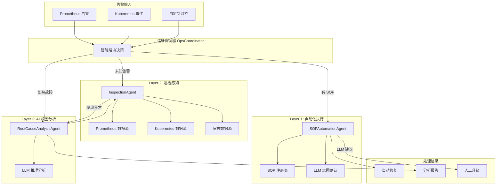
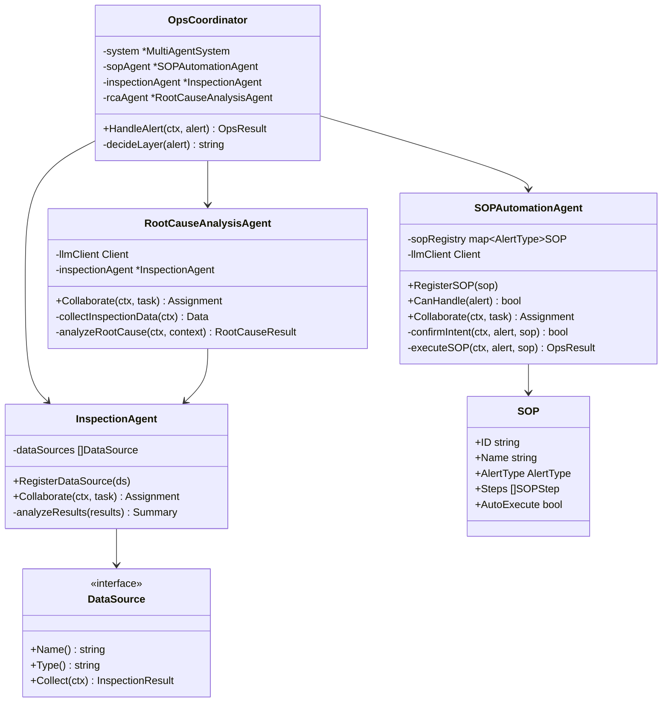
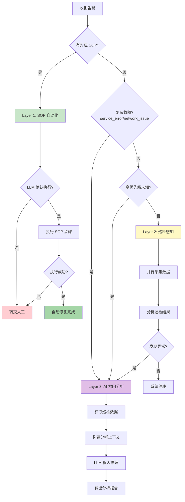
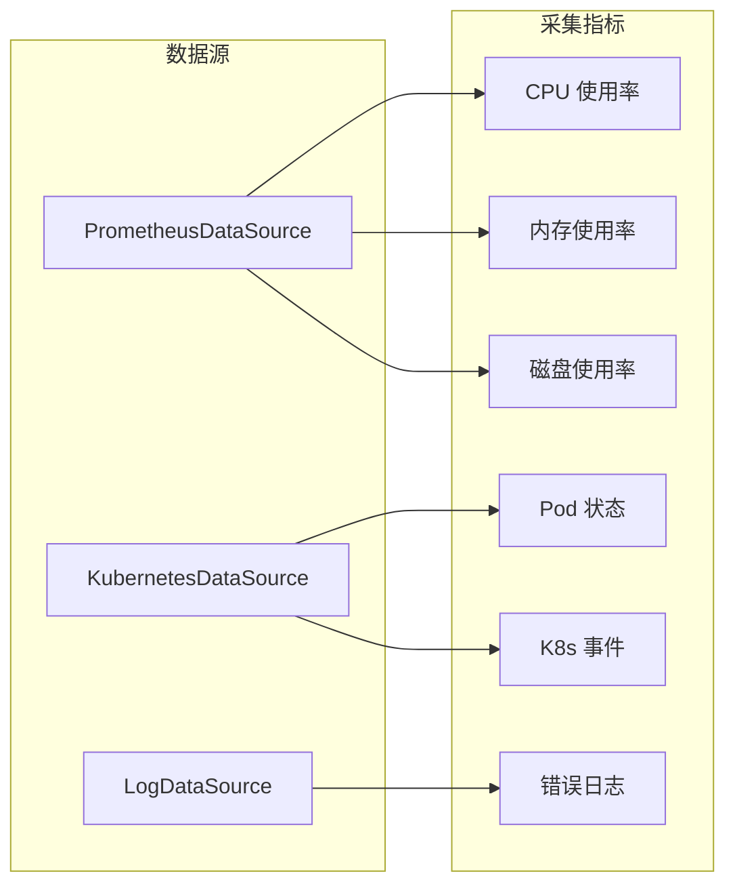
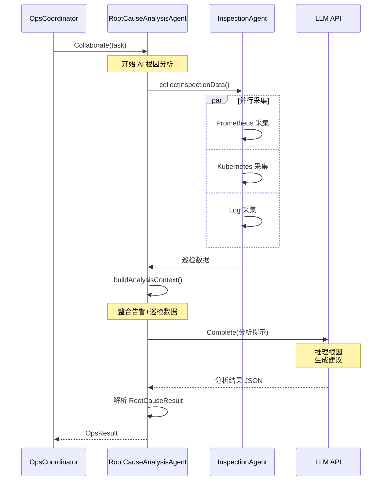
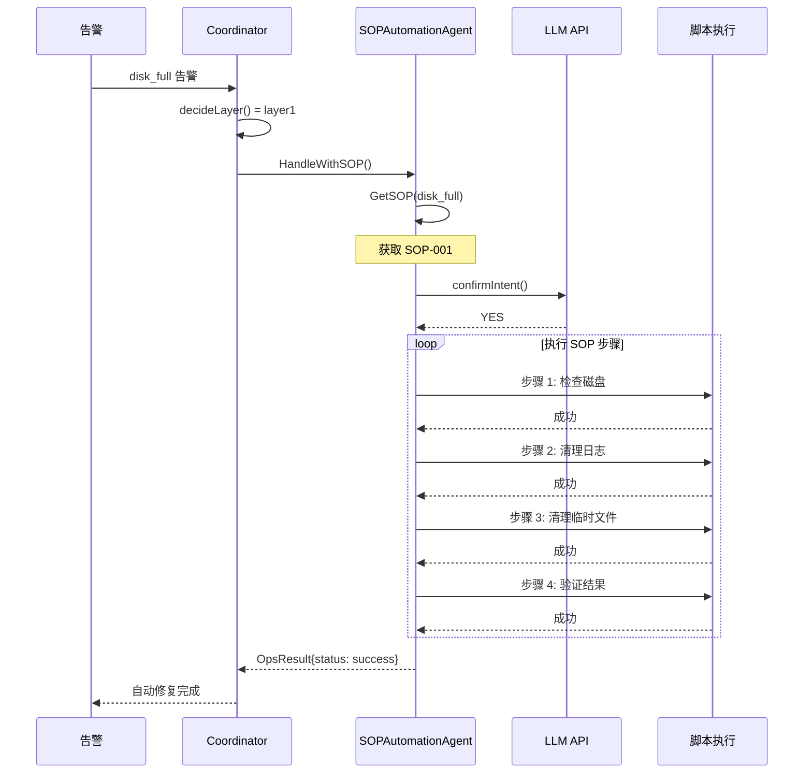
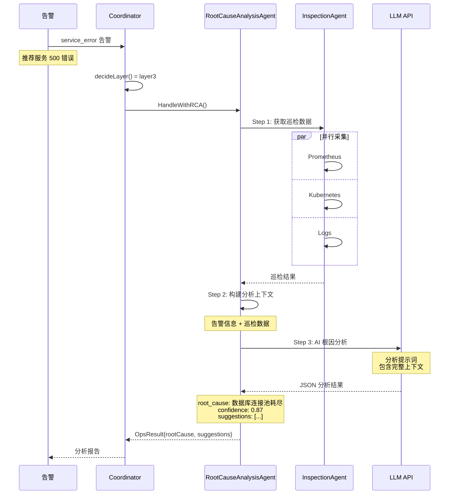
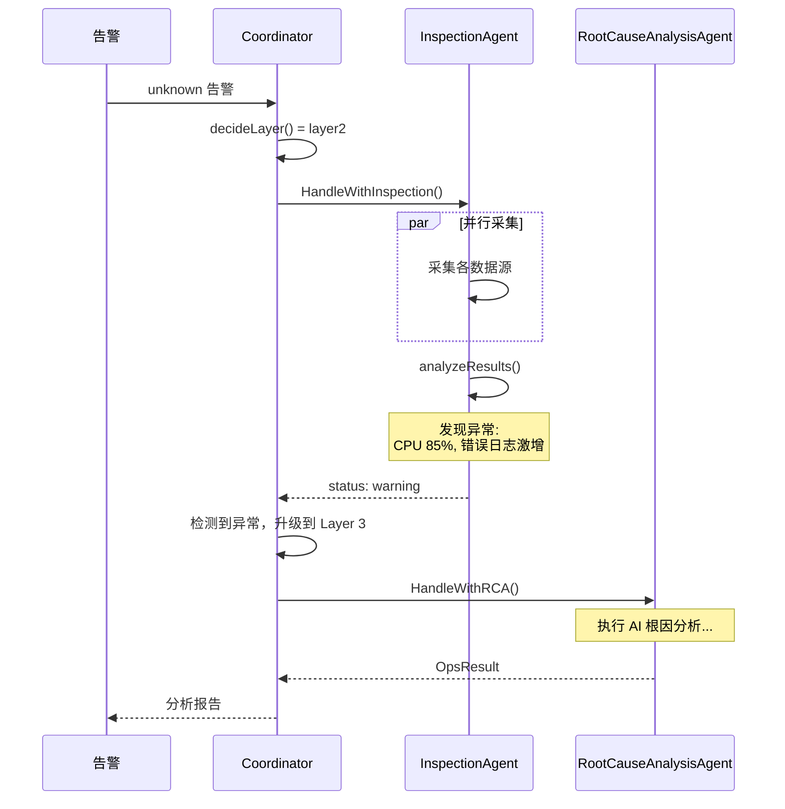
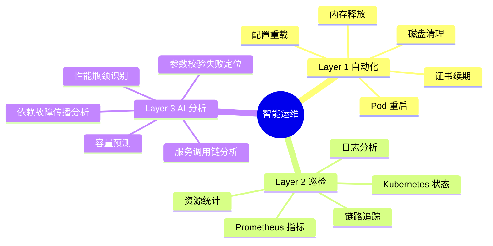
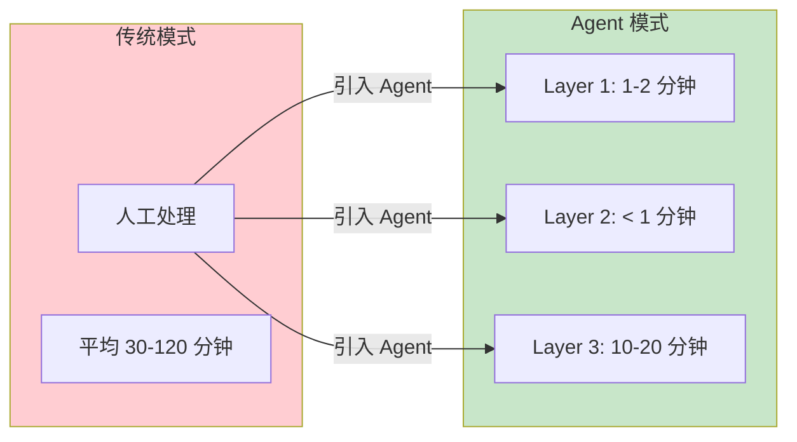

# 智能运维 Agent 分层治理体系

本示例演示基于《智能运维 Agent 演进与实践体系》设计方案实现的三层 Agent 架构，展示如何构建从标准化到智能化的渐进式运维自动化系统。

## 目录

- [设计理念](#设计理念)
- [架构设计](#架构设计)
- [核心组件](#核心组件)
- [执行流程](#执行流程)
- [使用方法](#使用方法)
- [应用场景](#应用场景)
- [扩展阅读](#扩展阅读)

## 设计理念

### 分层治理策略

本系统采用分层治理策略，根据故障复杂度将处理工作分配到不同层级：

| 层级 | 处理占比 | Agent 类型 | 适用场景 |
|------|---------|-----------|---------|
| **Layer 1** | 60% | SOPAutomationAgent | 确定性故障（磁盘清理、Pod 重启） |
| **Layer 2** | 25% | InspectionAgent | 数据采集与风险感知 |
| **Layer 3** | 15% | RootCauseAnalysisAgent | 复杂故障根因分析 |

### 演进路径

```
标准化 (SOP) → 数据驱动 (Data) → 智能化 (AI)
```

- **阶段 1**: 识别高频重复性工作，编写 SOP，引入自动化执行
- **阶段 2**: 部署巡检 Agent，统一数据协议，整合可观测数据
- **阶段 3**: 引入 AI 进行复杂链路根因分析，动态调用巡检工具

## 架构设计

### 整体架构



### Agent 类图



### 路由决策流程



## 核心组件

### 1. SOPAutomationAgent (Layer 1)

处理确定性故障的自动化执行 Agent。

**核心功能**:
- SOP 注册和管理
- LLM 意图确认（可选）
- 步骤化执行和回滚
- 执行结果记录

**预置 SOP**:

| SOP ID | 名称 | 告警类型 | 步骤数 |
|--------|------|---------|--------|
| SOP-001 | 磁盘空间清理 | disk_full | 4 |
| SOP-002 | Pod 重启恢复 | pod_crash | 3 |
| SOP-003 | 内存清理 | memory_high | 3 |

### 2. InspectionAgent (Layer 2)

非 AI 驱动的数据采集和风险感知 Agent。

**核心功能**:
- 并行数据采集
- 异常检测
- 结果汇总分析

**数据源**:



### 3. RootCauseAnalysisAgent (Layer 3)

AI 驱动的复杂故障根因分析 Agent。

**核心功能**:
- 动态调用巡检数据
- 构建分析上下文
- LLM 推理根因
- 生成建议报告

**分析流程**:



### 4. OpsCoordinator

运维协调器，负责智能路由和流程编排。

**路由规则**:

```go
// 规则 1: 如果有对应的 SOP，使用 Layer 1
if sopAgent.CanHandle(alert) {
    return "layer1"
}

// 规则 2: 服务错误等复杂问题，使用 Layer 3
if alert.Type == AlertTypeServiceError || alert.Type == AlertTypeNetworkIssue {
    return "layer3"
}

// 规则 3: 高优先级未知问题，使用 Layer 3
if alert.Severity == SeverityCritical && alert.Type == AlertTypeUnknown {
    return "layer3"
}

// 规则 4: 其他情况，先巡检再分析
return "layer2"
```

## 执行流程

### 场景 1: 磁盘告警 → Layer 1 (SOP)



### 场景 2: 服务错误 → Layer 3 (AI)



### 场景 3: 未知告警 → Layer 2 → Layer 3



## 使用方法

### 环境配置

```bash
# 使用 DeepSeek (推荐)
export DEEPSEEK_API_KEY="your-api-key"

# 或使用 Kimi
export KIMI_API_KEY="your-api-key"

# 或使用 OpenAI
export OPENAI_API_KEY="your-api-key"

# 无 API Key 时自动使用 Mock 客户端
```

### 运行示例

```bash
cd examples/intelligent-ops
go run main.go
```

### 预期输出

```text
╔════════════════════════════════════════════════════════════════════════════╗
║                     智能运维 Agent 分层治理体系                             ║
║         Intelligent Ops Agent Framework - Layered Governance               ║
╠════════════════════════════════════════════════════════════════════════════╣
║  Layer 1: 自动化执行 (SOP)     - 处理确定性故障                             ║
║  Layer 2: 巡检感知 (Data)     - 数据采集与风险感知                          ║
║  Layer 3: AI 根因分析 (AI)    - 复杂故障推理定位                            ║
╚════════════════════════════════════════════════════════════════════════════╝

✓ 已连接 LLM 提供商: deepseek

【场景 1】磁盘空间告警 - 预期路由到 Layer 1 (SOP 自动化)
━━━━━━━━━━━━━━━━━━━━━━━━━━━━━━━━━━━━━━━━━━━━━━━━━━━━━━━━━━
[INFO] 路由决策: layer1
[INFO] → 转交 Layer 1: SOP 自动化执行
[INFO] 执行 SOP: SOP-001 (磁盘空间清理)
[INFO]   步骤 1: 检查磁盘使用情况 ✓
[INFO]   步骤 2: 清理过期日志 ✓
[INFO]   步骤 3: 清理临时文件 ✓
[INFO]   步骤 4: 验证清理结果 ✓

┌─────────────────────────────────────────────────────────
│ 处理结果
├─────────────────────────────────────────────────────────
│ 状态:     success
│ 处理层:   layer1
│ 消息:     SOP SOP-001 执行成功，共 4 个步骤
└─────────────────────────────────────────────────────────

【场景 2】服务接口错误 - 预期路由到 Layer 3 (AI 根因分析)
━━━━━━━━━━━━━━━━━━━━━━━━━━━━━━━━━━━━━━━━━━━━━━━━━━━━━━━━━━
[INFO] 路由决策: layer3
[INFO] → 转交 Layer 3: AI 根因分析
[INFO]   Step 1: 获取巡检数据...
[INFO]   Step 2: 构建分析上下文...
[INFO]   Step 3: 执行 AI 根因分析...

┌─────────────────────────────────────────────────────────
│ 根因分析结果
├─────────────────────────────────────────────────────────
│ 根本原因: 数据库连接池耗尽导致请求超时
│ 置信度:   87.0%
│ 证据:
│   - 数据库连接数达到上限
│   - 请求队列积压
│   - 响应延迟显著增加
│ 建议:
│   - 增加连接池大小
│   - 优化慢查询
│   - 添加连接泄漏检测
└─────────────────────────────────────────────────────────
```

### 关键代码

#### 创建运维协调器

```go
// 创建多智能体系统
system := multiagent.NewMultiAgentSystem(logger, multiagent.WithMaxAgents(10))
defer system.Close()

// 创建运维协调器（自动创建三层 Agent）
coordinator := NewOpsCoordinator(system, llmClient)

// 处理告警
result, err := coordinator.HandleAlert(ctx, alert)
```

#### 注册自定义 SOP

```go
// 创建 SOP
sop := &SOP{
    ID:          "SOP-CUSTOM",
    Name:        "自定义处理流程",
    AlertType:   AlertTypeCustom,
    AutoExecute: true,
    Timeout:     5 * time.Minute,
    Steps: []SOPStep{
        {Order: 1, Name: "检查状态", Action: "check", Command: "..."},
        {Order: 2, Name: "执行修复", Action: "fix", Command: "..."},
        {Order: 3, Name: "验证结果", Action: "verify", Command: "..."},
    },
}

// 注册到 Agent
coordinator.sopAgent.RegisterSOP(sop)
```

#### 添加自定义数据源

```go
// 实现 DataSource 接口
type CustomDataSource struct{}

func (ds *CustomDataSource) Name() string { return "custom" }
func (ds *CustomDataSource) Type() string { return "custom_metrics" }
func (ds *CustomDataSource) Collect(ctx context.Context) (*InspectionResult, error) {
    // 自定义采集逻辑
    return &InspectionResult{
        Source:    "custom",
        Timestamp: time.Now(),
        Data:      map[string]interface{}{"custom_metric": 42},
    }, nil
}

// 注册数据源
coordinator.inspectionAgent.RegisterDataSource(&CustomDataSource{})
```

## 应用场景

### 场景矩阵



### 告警类型与处理策略

| 告警类型 | 典型场景 | 处理层级 | 处理方式 |
|---------|---------|---------|---------|
| `disk_full` | 磁盘空间不足 | Layer 1 | SOP 自动清理 |
| `pod_crash` | Pod CrashLoopBackOff | Layer 1 | SOP 自动重启 |
| `memory_high` | 内存使用率过高 | Layer 1 | SOP 清理缓存 |
| `cpu_high` | CPU 使用率过高 | Layer 2→3 | 巡检分析原因 |
| `service_error` | 服务接口 500 | Layer 3 | AI 根因分析 |
| `network_issue` | 网络连接异常 | Layer 3 | AI 链路分析 |
| `unknown` | 未知类型告警 | Layer 2→3 | 巡检后决策 |

### 效率提升



## 扩展阅读

- [05-llm-collaborative-agents](../multiagent/05-llm-collaborative-agents/) - LLM 协作 Agent 基础
- [10-multiagent-integrated](../multiagent/10-multiagent-integrated/) - 多智能体综合示例
- [multiagent 包文档](../../multiagent/) - MultiAgentSystem 使用指南
- [llm 包文档](../../llm/) - LLM 客户端使用指南

## 许可证

Apache License 2.0
