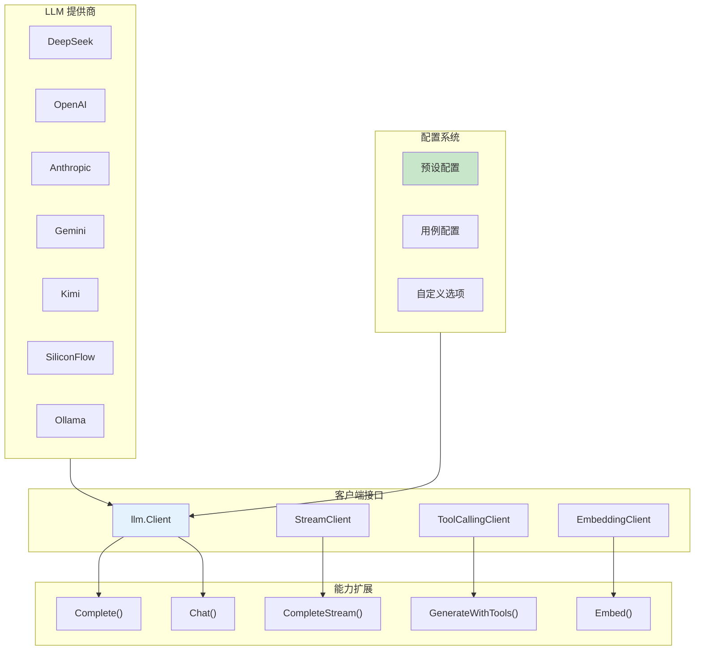
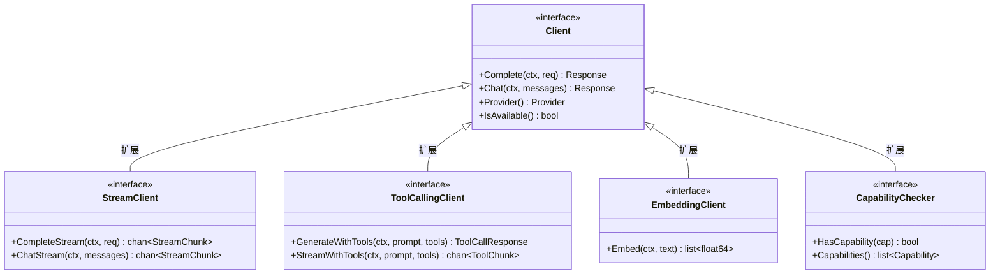
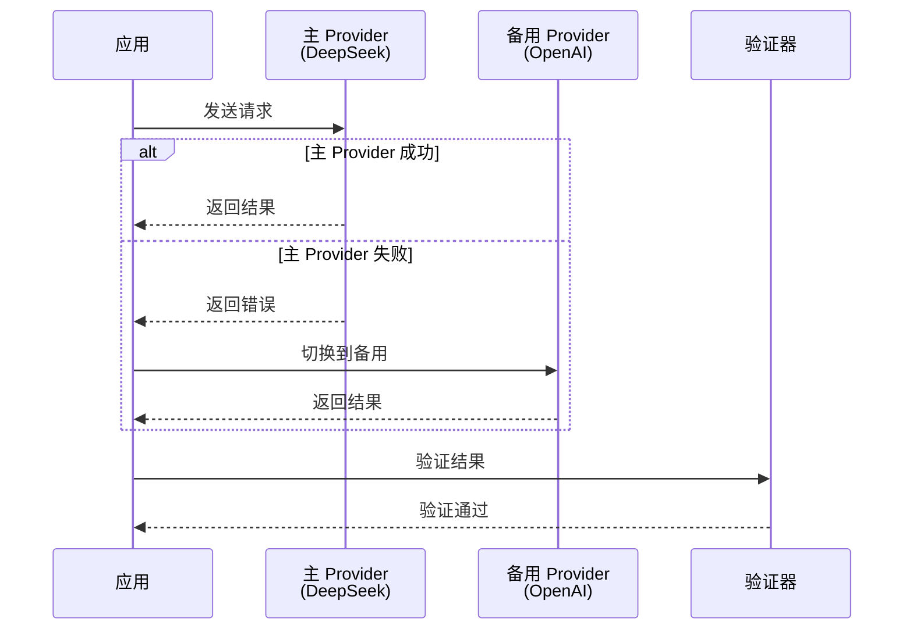
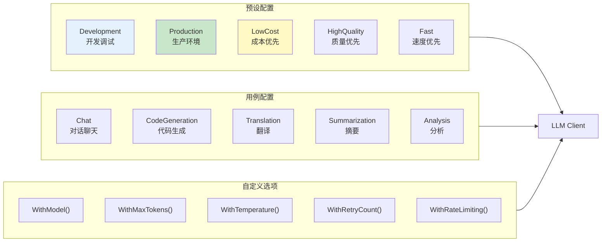
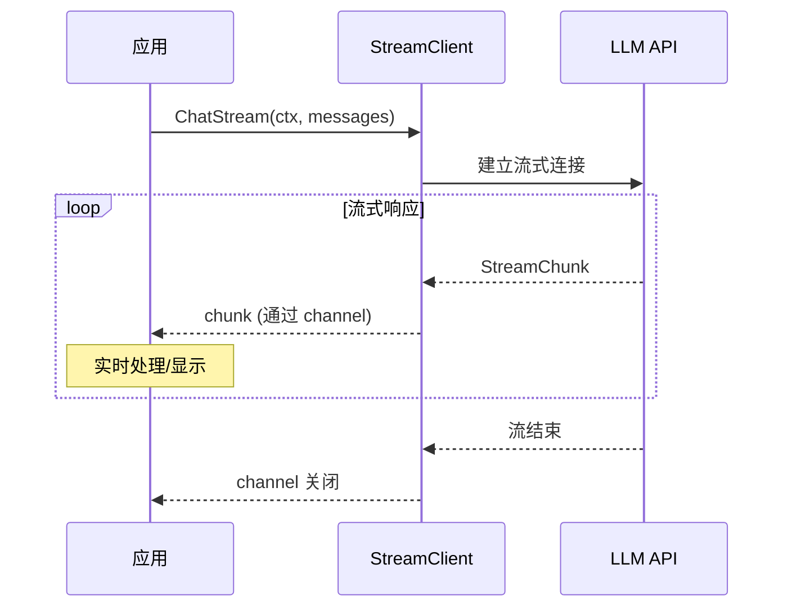
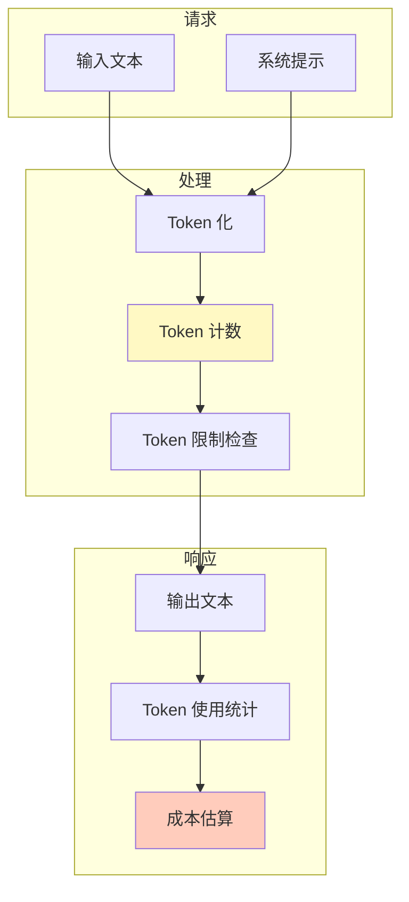
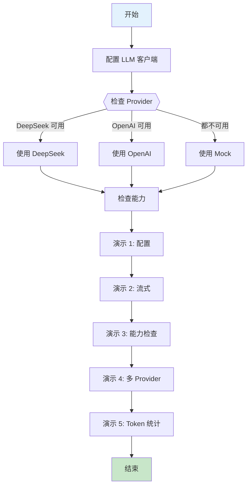

# LLM 高级用法示例

本示例演示 LLM 包的高级功能，包括多种客户端配置、流式响应、能力检查、多 Provider 协作和 Token 统计。

## 目录

- [架构设计](#架构设计)
- [核心功能](#核心功能)
- [执行流程](#执行流程)
- [使用方法](#使用方法)
- [配置参考](#配置参考)

## 架构设计

### LLM 客户端架构



### 能力检查机制



### 多 Provider 协作



## 核心功能

### 1. 客户端配置



### 2. 流式响应



### 3. Token 统计



## 执行流程

### 完整执行流程



## 使用方法

### 环境配置

```bash
# 使用 DeepSeek (推荐)
export DEEPSEEK_API_KEY="your-api-key"

# 或使用 OpenAI
export OPENAI_API_KEY="your-api-key"

# 未配置 API Key 时将使用模拟演示
```

### 运行示例

```bash
cd examples/llm/advanced
go run main.go
```

### 预期输出

```text
╔════════════════════════════════════════════════════════════════╗
║          LLM 高级用法示例                                       ║
║   展示 LLM 包的高级功能：流式、能力检查、多 Provider 等          ║
╚════════════════════════════════════════════════════════════════╝

【场景 1】LLM 客户端配置
════════════════════════════════════════════════════════════════

场景描述: 展示多种 LLM 客户端的配置方式

1. 使用预设配置 (Presets)
────────────────────────────────────────
  - Development: 适用于开发调试场景
  - Production: 适用于生产环境场景
  - LowCost: 适用于成本优先场景
  ...

【场景 2】流式响应处理
════════════════════════════════════════════════════════════════
✓ 客户端支持流式响应

提示: 用三句话介绍 Go 语言的优势。
响应: Go 语言具有简洁的语法设计...
✓ 流式完成，共 45 个 chunk

【场景 3】能力检查
════════════════════════════════════════════════════════════════
Provider: deepseek
  [✓] 基础补全 (Complete)
  [✓] 聊天对话 (Chat)
  [✓] 流式响应 (Stream)
  [✓] 工具调用 (ToolCalling)
  [✗] 文本嵌入 (Embedding)
```

## 配置参考

### 预设配置对比

| 预设 | Temperature | MaxTokens | 重试 | 适用场景 |
|------|------------|-----------|------|---------|
| Development | 0.8 | 1000 | 3 | 开发调试 |
| Production | 0.7 | 2000 | 5 | 生产环境 |
| LowCost | 0.5 | 500 | 2 | 成本敏感 |
| HighQuality | 0.3 | 4000 | 5 | 质量优先 |
| Fast | 0.5 | 256 | 1 | 低延迟 |

### Provider 对比

| Provider | 中文能力 | 工具调用 | 流式 | 嵌入 | 价格 |
|----------|---------|---------|------|------|------|
| DeepSeek | 优秀 | ✓ | ✓ | ✓ | 低 |
| OpenAI | 良好 | ✓ | ✓ | ✓ | 中 |
| Anthropic | 良好 | ✓ | ✓ | ✗ | 高 |
| Gemini | 良好 | ✓ | ✓ | ✓ | 中 |
| Ollama | 取决于模型 | ✓ | ✓ | ✓ | 免费 |

### 代码示例

#### 创建客户端

```go
// 使用预设
client, _ := providers.NewDeepSeekWithOptions(
    llm.WithPreset(llm.PresetProduction),
    llm.WithAPIKey(os.Getenv("DEEPSEEK_API_KEY")),
)

// 使用用例
client, _ := providers.NewOpenAIWithOptions(
    llm.WithUseCase(llm.UseCaseCodeGeneration),
    llm.WithAPIKey(os.Getenv("OPENAI_API_KEY")),
)

// 自定义配置
client, _ := providers.NewDeepSeekWithOptions(
    llm.WithAPIKey(apiKey),
    llm.WithModel("deepseek-chat"),
    llm.WithMaxTokens(2000),
    llm.WithTemperature(0.7),
    llm.WithRetryCount(3),
)
```

#### 能力检查

```go
// 检查流式能力
if streamClient := llm.AsStreamClient(client); streamClient != nil {
    // 支持流式
    stream := streamClient.ChatStream(ctx, messages)
    for chunk := range stream {
        fmt.Print(chunk.Content)
    }
}

// 检查工具调用能力
if toolCaller := llm.AsToolCaller(client); toolCaller != nil {
    // 支持工具调用
    resp, _ := toolCaller.GenerateWithTools(ctx, prompt, tools)
}
```

#### 流式响应处理

```go
stream := streamClient.ChatStream(ctx, messages)
for chunk := range stream {
    if chunk.Error != nil {
        log.Printf("Stream error: %v", chunk.Error)
        break
    }
    fmt.Print(chunk.Content)
}
```

## 扩展阅读

- [LLM 协作 Agent 示例](../../multiagent/05-llm-collaborative-agents/)
- [LLM 工具调用示例](../../multiagent/06-llm-tool-calling/)
- [工具注册与执行示例](../tools/registry/)
- [llm 包文档](../../../llm/) - LLM 客户端 API 参考
