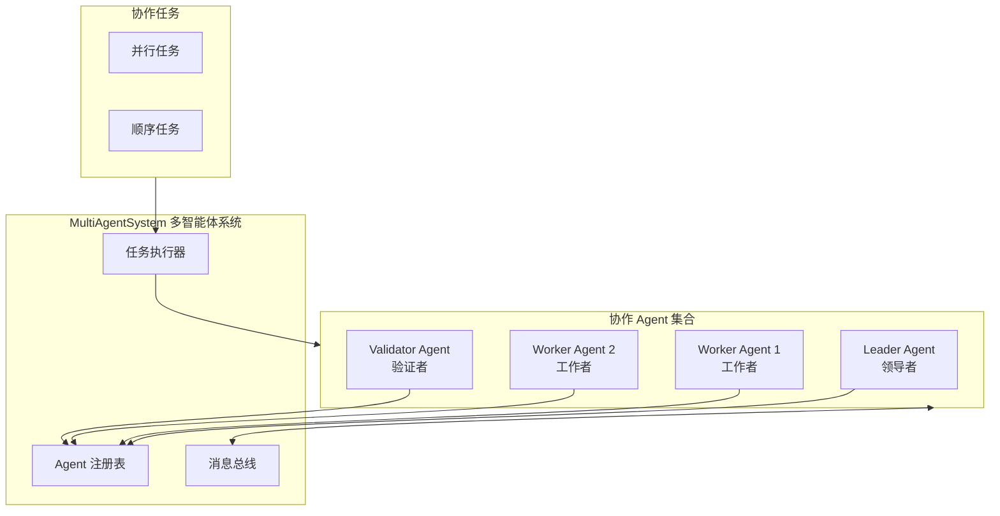
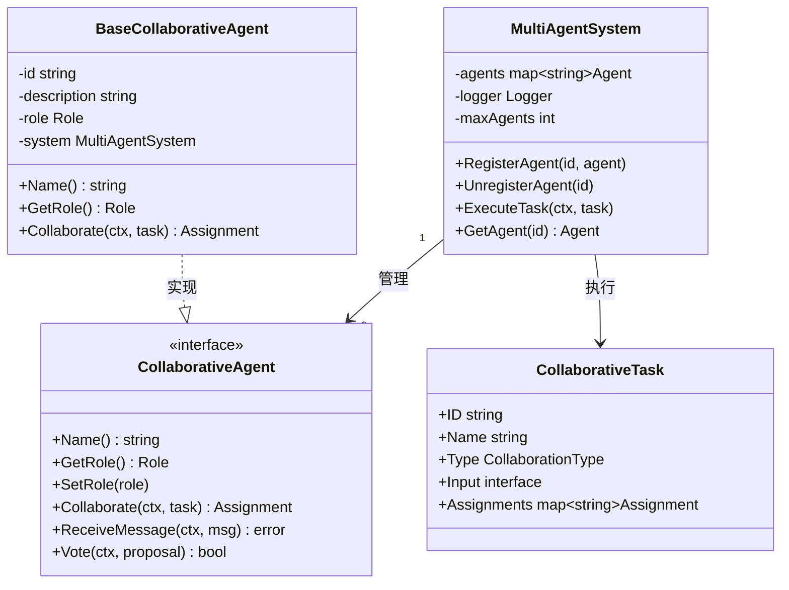
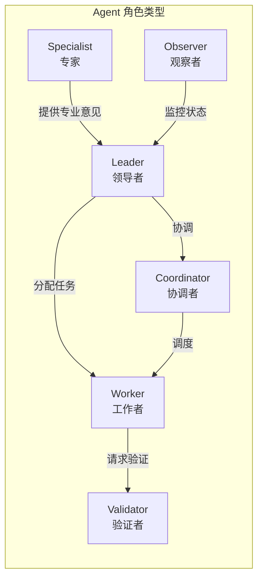
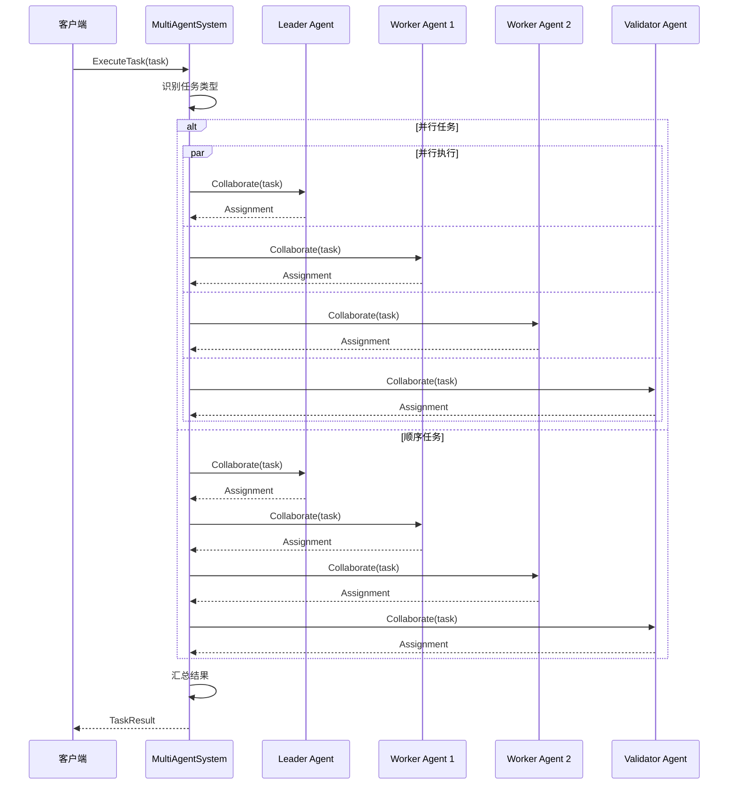
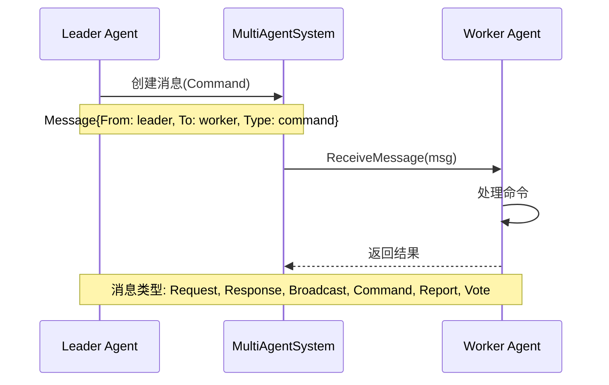
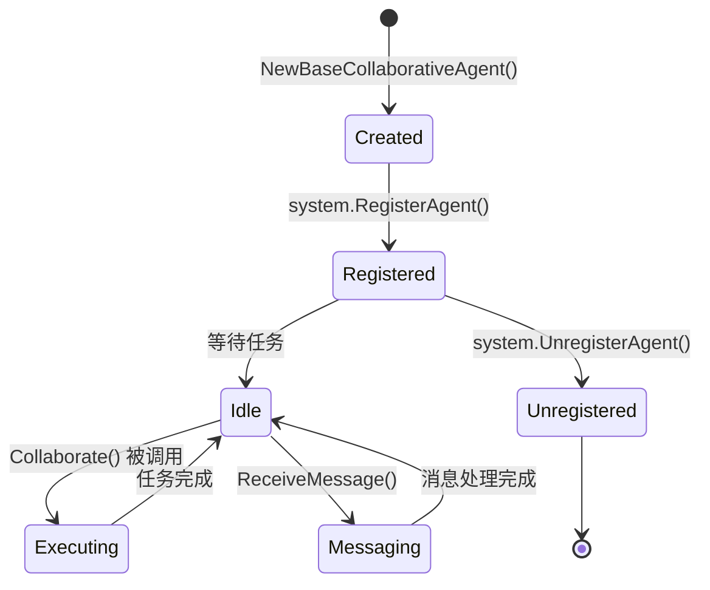

# 01-basic-system 基础系统示例

本示例演示 MultiAgentSystem 的核心功能，包括创建多智能体系统、注册 Agent、执行协作任务和 Agent 间消息通信。

## 目录

- [架构设计](#架构设计)
- [核心组件](#核心组件)
- [执行流程](#执行流程)
- [使用方法](#使用方法)
- [代码结构](#代码结构)

## 架构设计

### 系统架构图



### 组件关系图



## 核心组件

### 1. MultiAgentSystem

多智能体系统的核心管理器，负责：

- Agent 注册与生命周期管理
- 任务分发与执行协调
- Agent 间消息路由

### 2. CollaborativeAgent

协作 Agent 接口，定义了 Agent 的核心能力：

| 方法 | 说明 |
|------|------|
| `Name()` | 返回 Agent 唯一标识 |
| `GetRole()` | 获取 Agent 角色 |
| `Collaborate()` | 执行协作任务 |
| `ReceiveMessage()` | 接收消息 |
| `Vote()` | 参与投票决策 |

### 3. Agent 角色



## 执行流程

### 任务执行流程图



### Agent 消息通信流程



### Agent 生命周期



## 使用方法

### 运行示例

```bash
cd examples/multiagent/01-basic-system
go run main.go
```

### 预期输出

```text
╔════════════════════════════════════════════════════════════════╗
║          MultiAgentSystem 基础示例                             ║
╚════════════════════════════════════════════════════════════════╝

【步骤 1】创建 MultiAgentSystem
✓ MultiAgentSystem 创建成功

【步骤 2】创建并注册协作 Agent
✓ 注册 Agent: leader-1 (角色: leader)
✓ 注册 Agent: worker-1 (角色: worker)
✓ 注册 Agent: worker-2 (角色: worker)
✓ 注册 Agent: validator-1 (角色: validator)

【步骤 3】执行并行协作任务
✓ 任务状态: completed
✓ 执行时长: 100ms

【步骤 4】执行顺序协作任务
✓ 任务状态: completed

【步骤 5】Agent 消息通信
✓ 消息发送成功

【步骤 6】注销 Agent
✓ Agent worker-2 已注销
```

## 代码结构

```text
01-basic-system/
├── main.go          # 示例入口
└── README.md        # 本文档
```

### 关键代码片段

#### 创建系统和注册 Agent

```go
// 创建多智能体系统
system := multiagent.NewMultiAgentSystem(
    logger,
    multiagent.WithMaxAgents(10),
)

// 创建并注册 Agent
agent := multiagent.NewBaseCollaborativeAgent(
    "worker-1",
    "工作者 Agent",
    multiagent.RoleWorker,
    system,
)
system.RegisterAgent("worker-1", agent)
```

#### 执行协作任务

```go
task := &multiagent.CollaborativeTask{
    ID:          "task-001",
    Name:        "数据处理",
    Type:        multiagent.CollaborationTypeParallel,
    Input:       map[string]interface{}{"data": "..."},
    Assignments: make(map[string]multiagent.Assignment),
}

result, err := system.ExecuteTask(ctx, task)
```

#### 发送消息

```go
message := multiagent.Message{
    ID:        "msg-001",
    From:      "leader-1",
    To:        "worker-1",
    Type:      multiagent.MessageTypeCommand,
    Content:   "开始处理数据",
    Timestamp: time.Now(),
}
agent.ReceiveMessage(ctx, message)
```

## 扩展阅读

- [02-collaboration-types](../02-collaboration-types/) - 协作类型示例
- [03-team-management](../03-team-management/) - 团队管理示例
- [multiagent 包文档](../../../multiagent/)
