# 02-collaboration-types 协作类型示例

本示例演示 MultiAgentSystem 支持的五种协作模式：并行（Parallel）、顺序（Sequential）、分层（Hierarchical）、共识（Consensus）和管道（Pipeline）。

## 目录

- [架构设计](#架构设计)
- [五种协作模式](#五种协作模式)
- [执行流程](#执行流程)
- [使用方法](#使用方法)
- [适用场景](#适用场景)

## 架构设计

### 协作类型总览

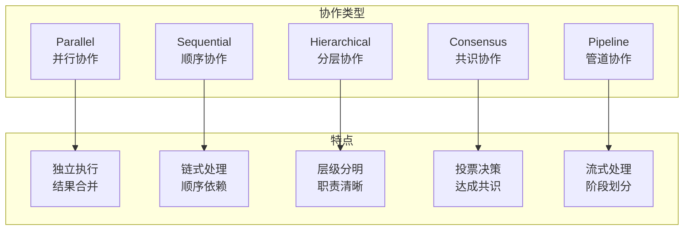

### 系统组件关系

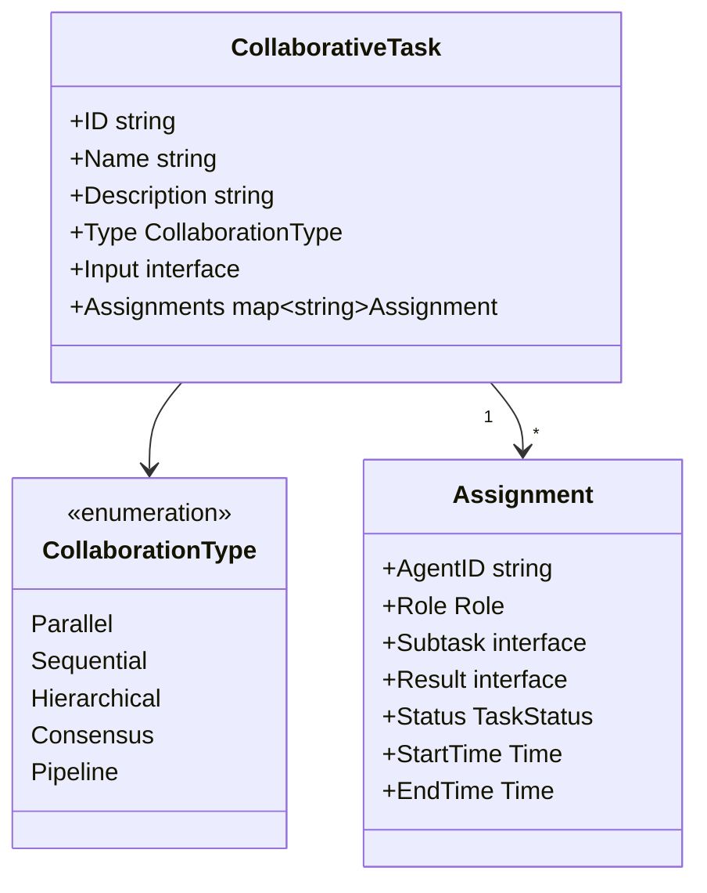

## 五种协作模式

### 1. Parallel 并行协作

多个 Agent 同时处理独立的子任务，最后合并结果。

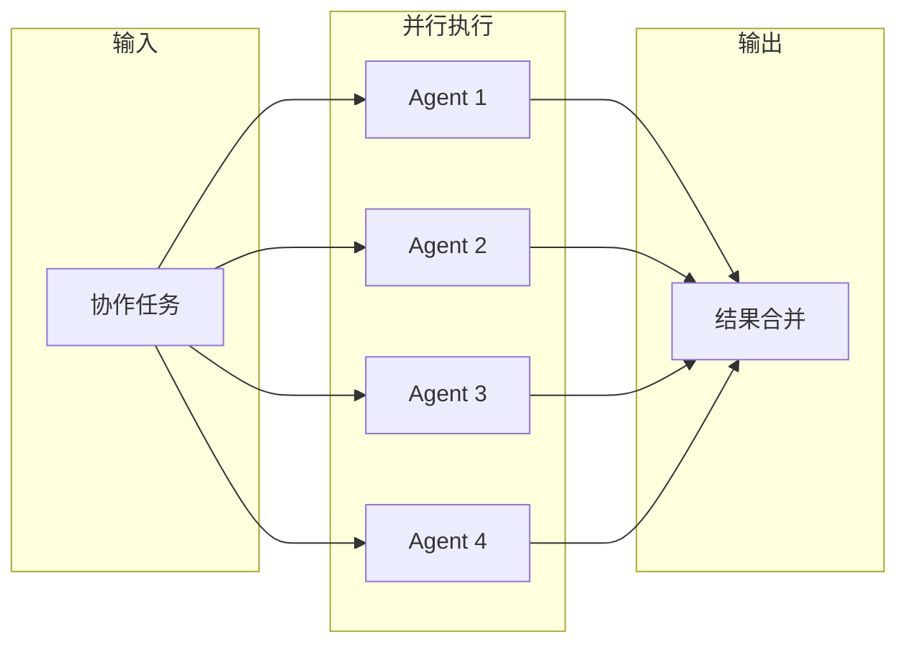

**执行时序**：

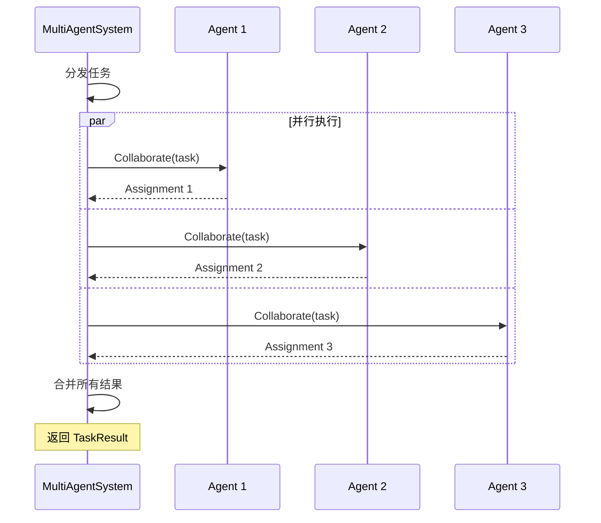

### 2. Sequential 顺序协作

Agent 按顺序依次处理，前一个的输出作为后一个的输入。

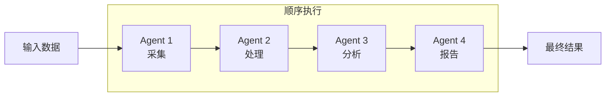

**执行时序**：

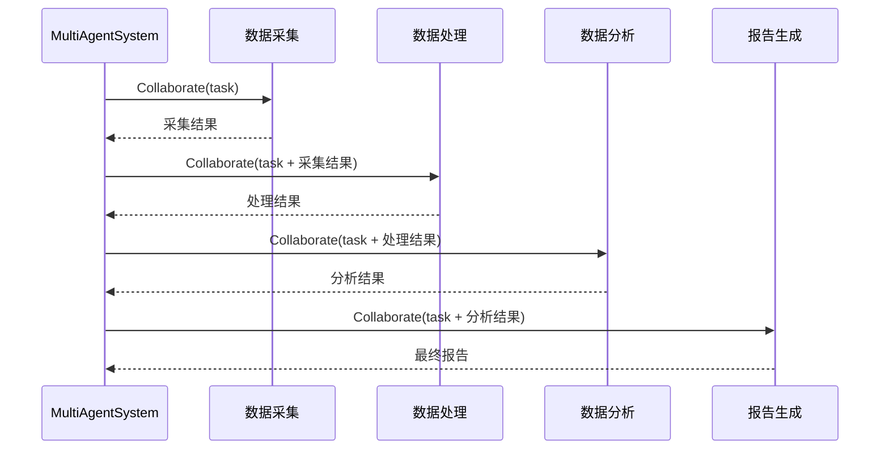

### 3. Hierarchical 分层协作

领导者分配任务，工作者执行，验证者检验结果。

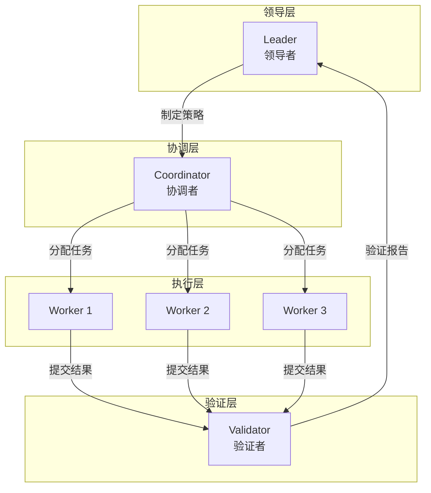

**执行时序**：

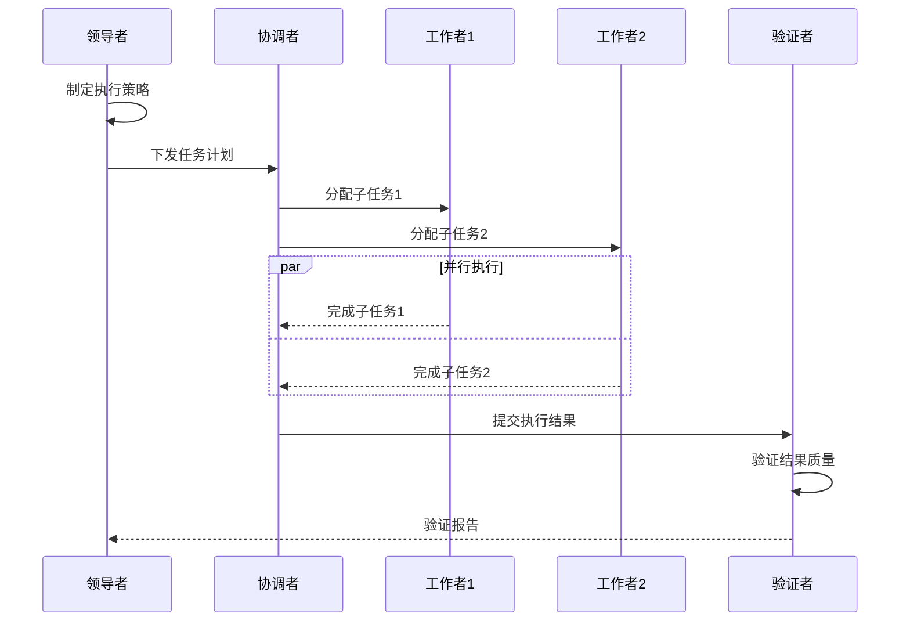

### 4. Consensus 共识协作

多个 Agent 对某个决策进行投票，达成共识。

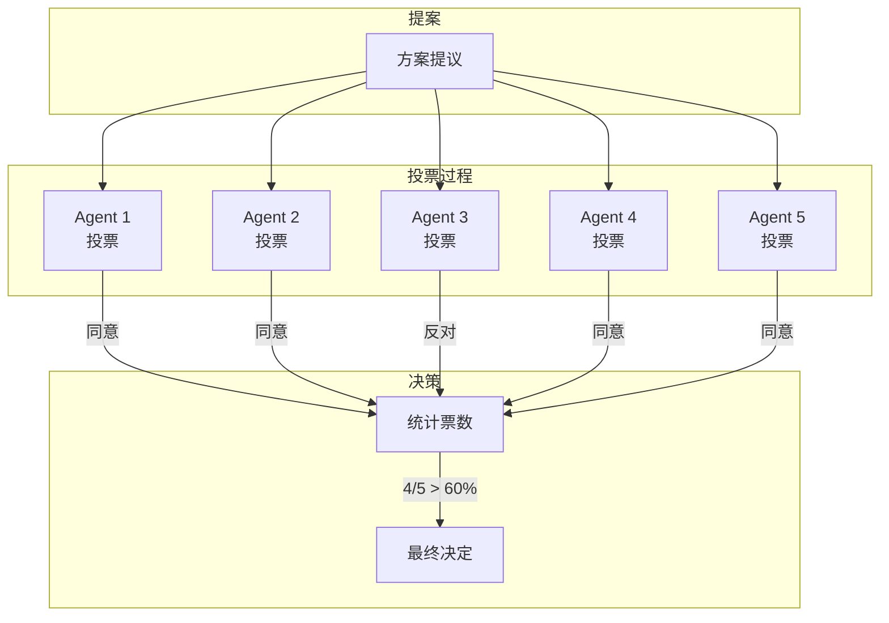

**执行时序**：

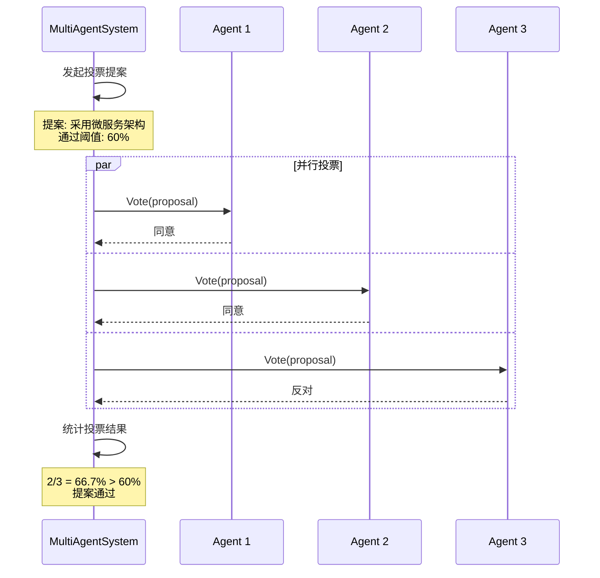

### 5. Pipeline 管道协作

数据流经多个处理阶段，每个阶段由专门的 Agent 处理。

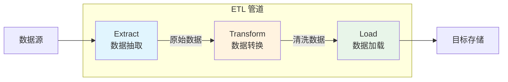

**执行时序**：

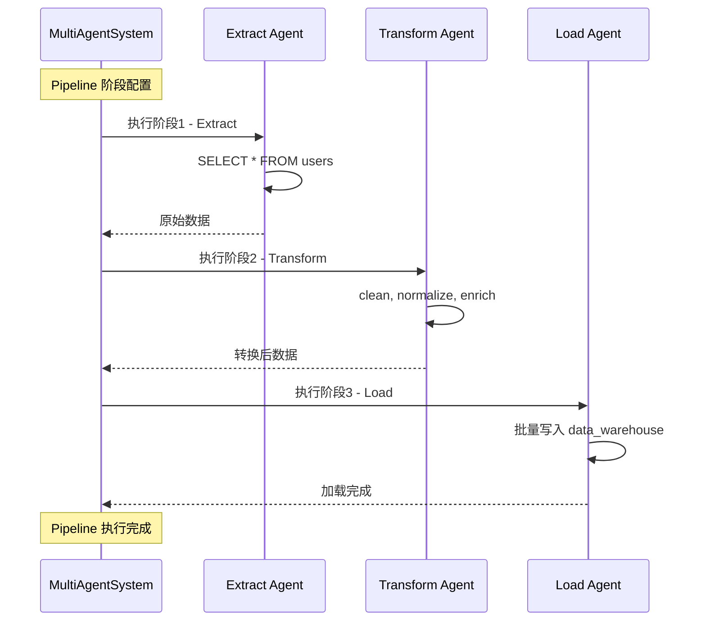

## 执行流程

### 任务类型路由

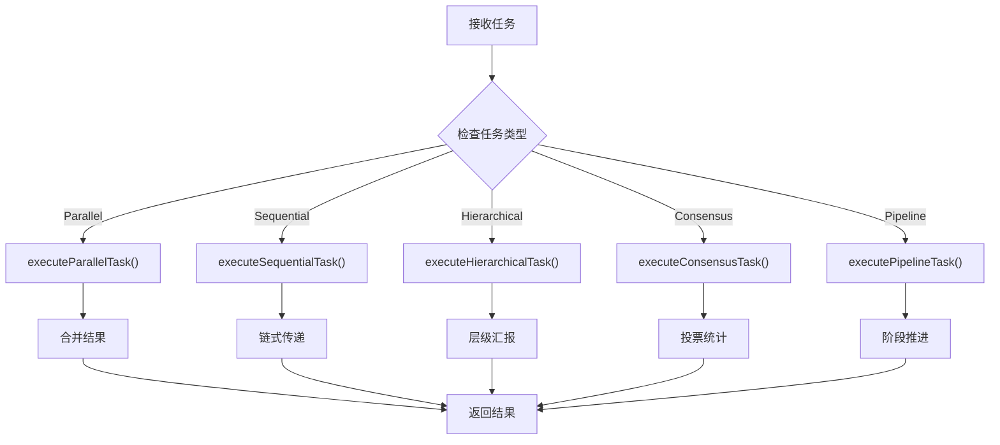

## 使用方法

### 运行示例

```bash
cd examples/multiagent/02-collaboration-types
go run main.go
```

### 预期输出

```text
╔════════════════════════════════════════════════════════════════╗
║          多智能体协作类型示例                                  ║
║   展示五种协作模式：并行、顺序、分层、共识、管道               ║
╚════════════════════════════════════════════════════════════════╝

【准备工作】注册协作 Agent
✓ 注册 Agent: data-collector       角色: worker
✓ 注册 Agent: data-processor       角色: worker
...

╭────────────────────────────────────────╮
│  协作类型 1: Parallel（并行协作）      │
╰────────────────────────────────────────╯
✓ 执行状态: completed
✓ 参与 Agent 数: 8

╭────────────────────────────────────────╮
│  协作类型 2: Sequential（顺序协作）    │
╰────────────────────────────────────────╯
✓ 执行状态: completed

... (其他协作类型)
```

## 适用场景

| 协作类型 | 适用场景 | 示例 |
|---------|---------|------|
| **Parallel** | 独立任务并行处理 | 数据分片处理、批量文件处理 |
| **Sequential** | 有依赖的任务链 | 数据流水线、工作流引擎 |
| **Hierarchical** | 层级分明的项目 | 项目管理、组织协作 |
| **Consensus** | 需要投票决策 | 方案选择、审批流程 |
| **Pipeline** | 流式数据处理 | ETL、日志处理、消息处理 |

### 选择决策树

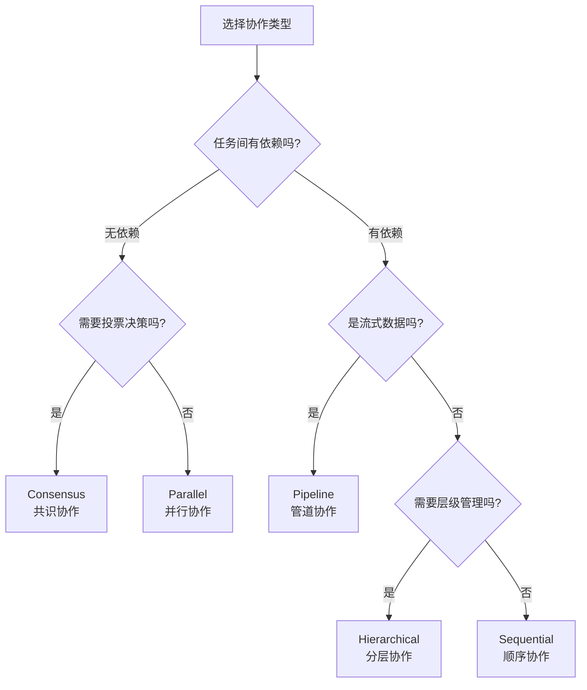

## 扩展阅读

- [01-basic-system](../01-basic-system/) - 基础系统示例
- [03-team-management](../03-team-management/) - 团队管理示例
- [05-llm-collaborative-agents](../05-llm-collaborative-agents/) - LLM 协作示例
