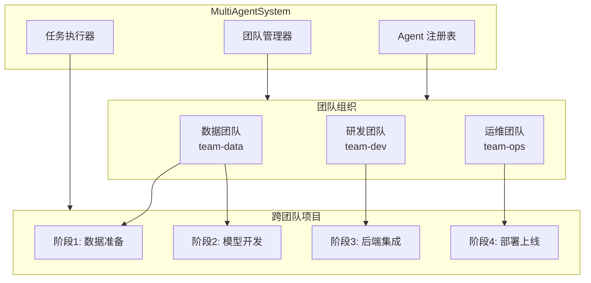
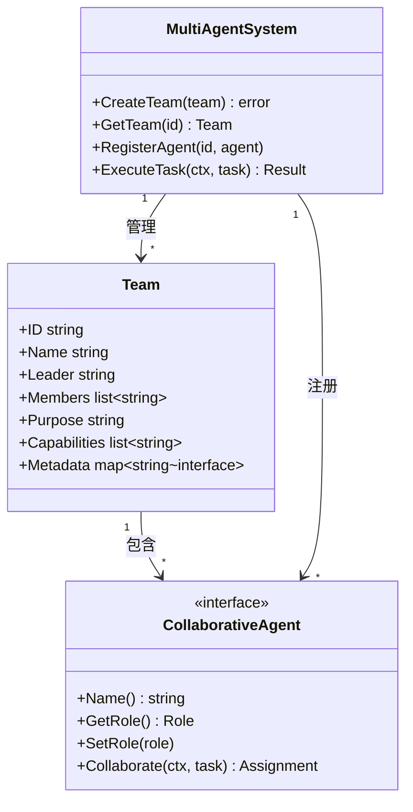
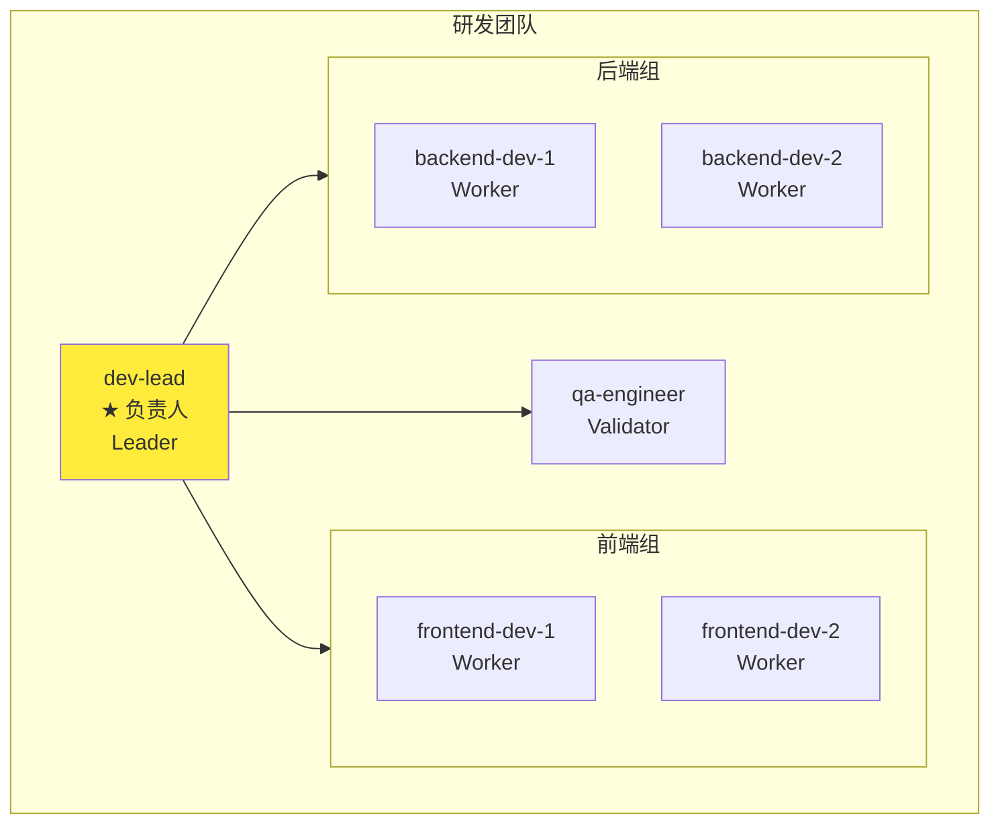
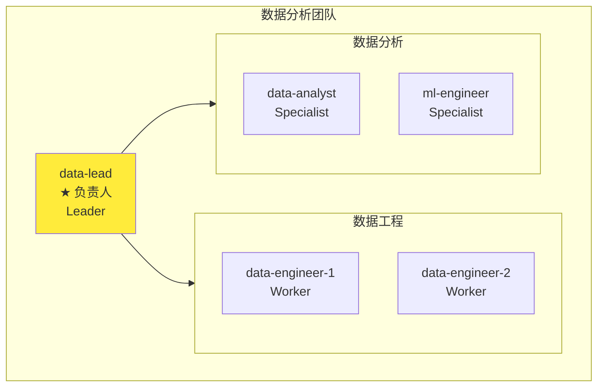
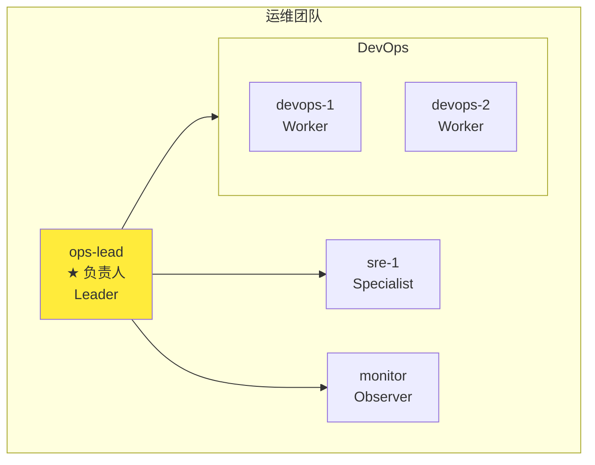
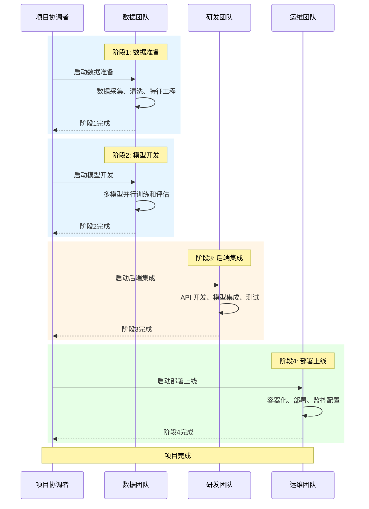
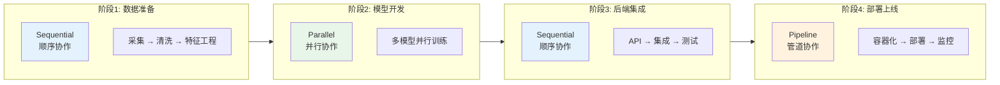
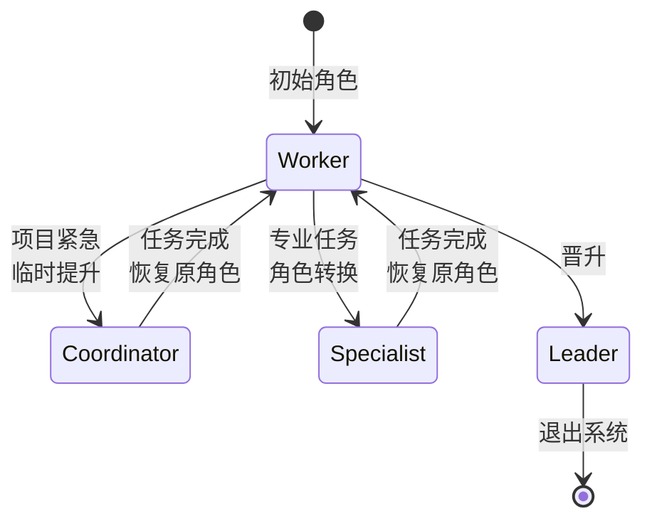
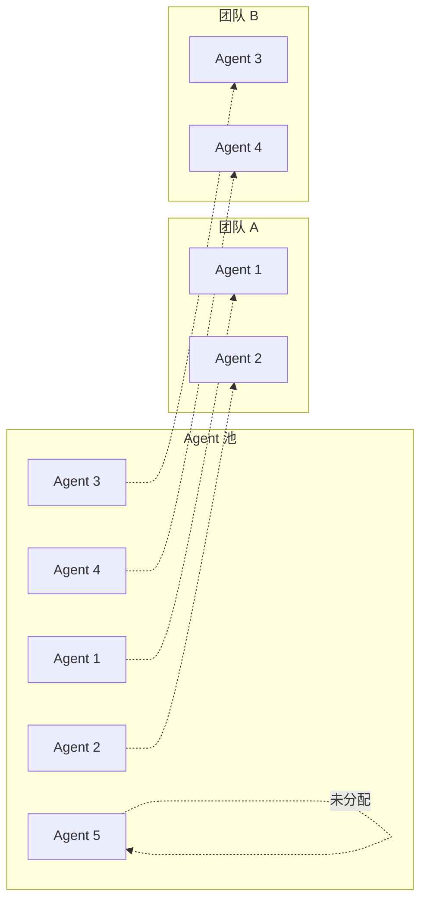

# 03-team-management 团队管理示例

本示例演示多智能体系统的团队管理功能，包括创建团队、分配角色、管理团队成员和跨团队协作项目。

## 目录

- [架构设计](#架构设计)
- [团队结构](#团队结构)
- [执行流程](#执行流程)
- [使用方法](#使用方法)
- [核心功能](#核心功能)

## 架构设计

### 整体架构图



### 团队与 Agent 关系



## 团队结构

### 研发团队 (team-dev)



**团队能力**：

- 前端开发
- 后端开发
- API 设计
- 单元测试
- 集成测试

### 数据分析团队 (team-data)



**团队能力**：

- 数据采集
- 数据清洗
- 数据分析
- 机器学习
- 报表生成

### 运维团队 (team-ops)



**团队能力**：

- CI/CD
- 容器化部署
- 系统监控
- 故障排查
- 性能优化

## 执行流程

### 跨团队项目执行流程



### 项目阶段与协作类型



### 角色动态调整流程



## 使用方法

### 运行示例

```bash
cd examples/multiagent/03-team-management
go run main.go
```

### 预期输出

```text
╔════════════════════════════════════════════════════════════════╗
║          多智能体团队管理示例                                  ║
║   展示如何创建团队、分配角色、管理团队成员                     ║
╚════════════════════════════════════════════════════════════════╝

【步骤 1】创建 Agent 池
✓ 共创建 17 个 Agent

【步骤 2】创建研发团队
┌─────────────────────────────────────────┐
│ 团队: 研发团队                          │
│ 成员数: 6                               │
└─────────────────────────────────────────┘

【步骤 3】创建数据分析团队
【步骤 4】创建运维团队

【步骤 5】跨团队协作项目
项目名称: 智能推荐系统 v2.0

【阶段 1】数据准备阶段
✓ 阶段完成 - 状态: completed

【阶段 2】模型开发阶段
✓ 阶段完成 - 状态: completed

【阶段 3】后端集成阶段
✓ 阶段完成 - 状态: completed

【阶段 4】部署上线阶段
✓ 阶段完成 - 状态: completed

✓ 项目所有阶段执行完成!

【步骤 6】角色动态调整
调整前: frontend-dev-1 角色为 worker
调整后: frontend-dev-1 角色为 coordinator
恢复后: frontend-dev-1 角色为 worker
```

## 核心功能

### 1. 团队创建

```go
team := &multiagent.Team{
    ID:      "team-dev",
    Name:    "研发团队",
    Leader:  "dev-lead",
    Members: []string{"dev-lead", "frontend-dev-1", "backend-dev-1"},
    Purpose: "负责产品功能开发和质量保证",
    Capabilities: []string{"前端开发", "后端开发", "API 设计"},
    Metadata: map[string]interface{}{
        "tech_stack": []string{"React", "Go", "PostgreSQL"},
    },
}

system.CreateTeam(team)
```

### 2. Agent 池管理



### 3. 角色动态调整

```go
// 获取 Agent
agent := agents["frontend-dev-1"]

// 临时提升为协调者
agent.SetRole(multiagent.RoleCoordinator)

// 执行协调任务...

// 恢复原角色
agent.SetRole(multiagent.RoleWorker)
```

### 功能总结

| 功能 | 说明 | API |
|------|------|-----|
| 团队创建 | 创建具有特定能力的团队 | `CreateTeam()` |
| 成员管理 | 添加/移除团队成员 | `Team.Members` |
| 角色分配 | 为 Agent 分配角色 | `SetRole()` |
| 能力定义 | 定义团队核心能力 | `Team.Capabilities` |
| 跨团队协作 | 多团队协同完成项目 | `ExecuteTask()` |
| 角色动态调整 | 根据需要调整角色 | `SetRole()` |

## 扩展阅读

- [01-basic-system](../01-basic-system/) - 基础系统示例
- [02-collaboration-types](../02-collaboration-types/) - 协作类型示例
- [04-specialized-agents](../04-specialized-agents/) - 专业化 Agent 示例
