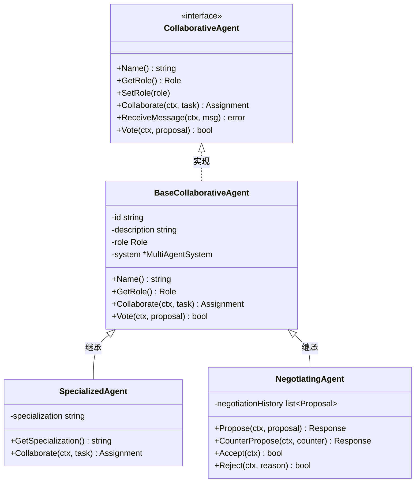
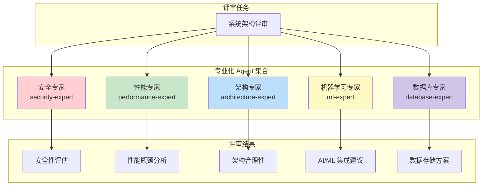
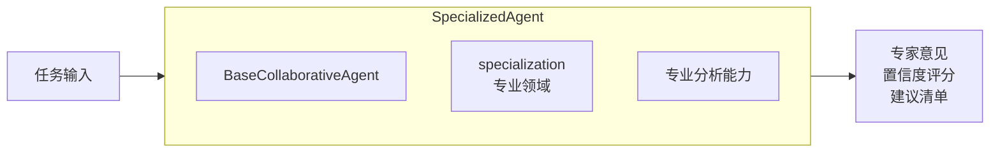
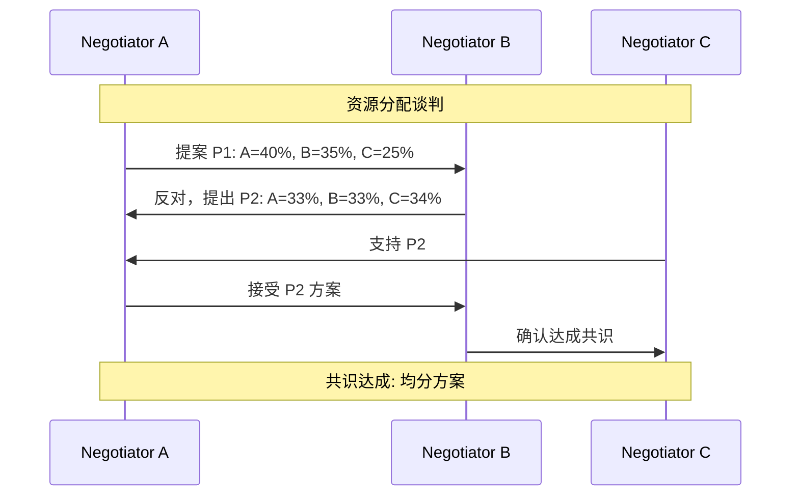
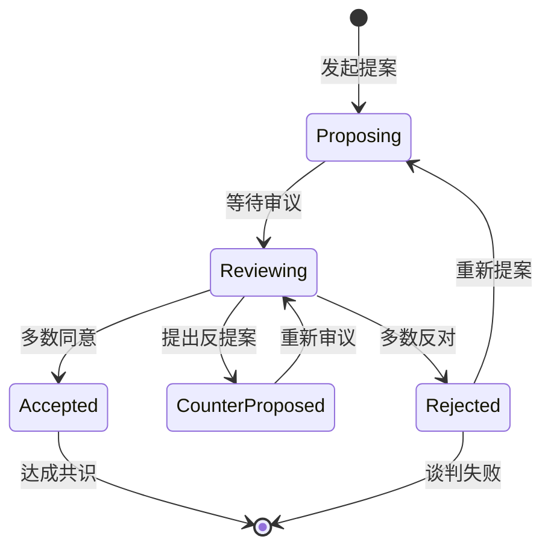
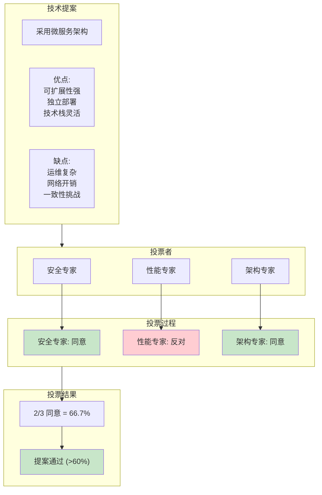
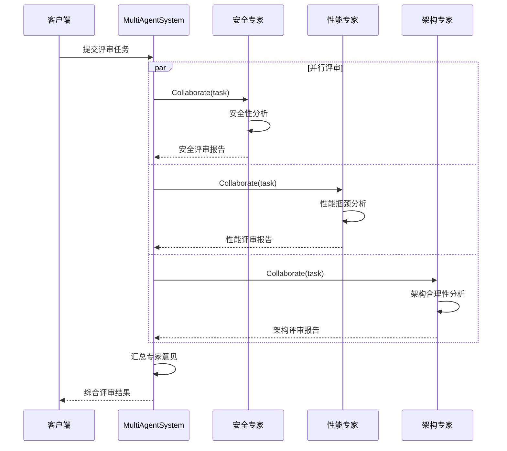
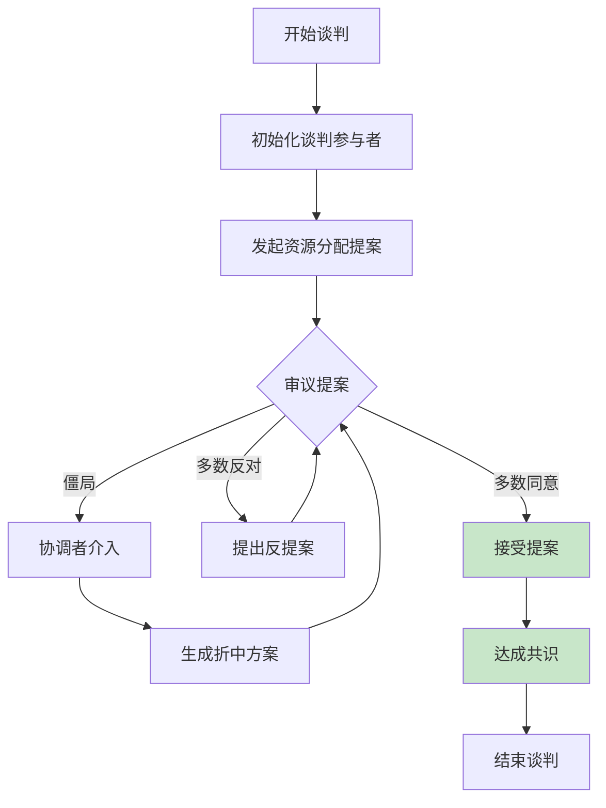
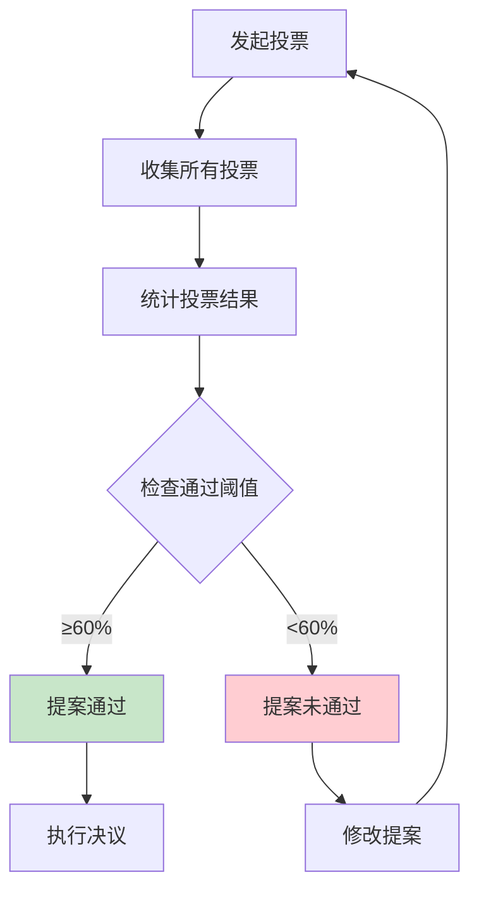
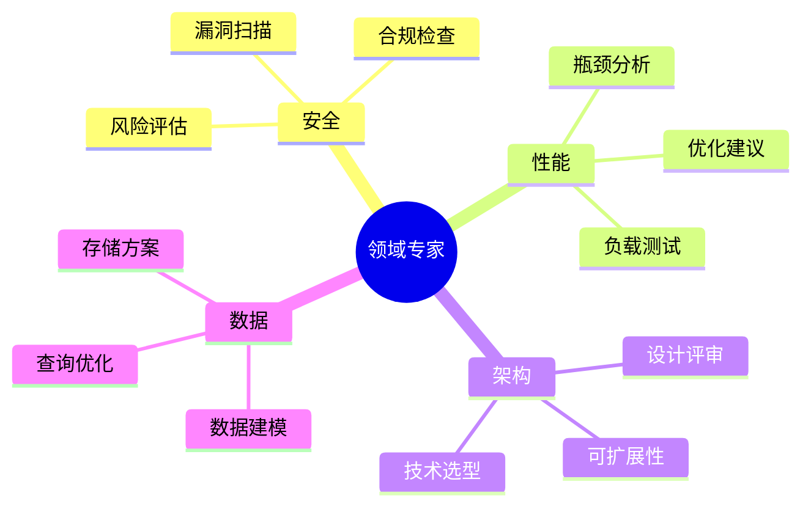

# 04-specialized-agents 专业化 Agent 示例

本示例演示专业化 Agent 的使用，包括 SpecializedAgent（领域专家）、NegotiatingAgent（谈判 Agent）以及投票决策机制。

## 目录

- [架构设计](#架构设计)
- [Agent 类型](#agent-类型)
- [执行流程](#执行流程)
- [使用方法](#使用方法)
- [应用场景](#应用场景)

## 架构设计

### Agent 类型继承关系



### 专业化 Agent 架构



## Agent 类型

### 1. SpecializedAgent 领域专家

领域专家 Agent 具有特定专业领域知识，能够提供专业化分析和建议。



**核心能力**：

| 能力 | 说明 |
|------|------|
| 领域分析 | 基于专业领域提供深度分析 |
| 置信度评估 | 对分析结果给出置信度评分 |
| 专业建议 | 提供领域相关的优化建议 |

### 2. NegotiatingAgent 谈判 Agent

谈判 Agent 支持多轮协商，能够提出提案、反馈和修改直至达成共识。



**谈判流程状态图**：



### 3. 投票机制

多个 Agent 通过投票进行民主决策。



## 执行流程

### 专家评审流程



### 谈判协商流程



### 投票决策流程



## 使用方法

### 运行示例

```bash
cd examples/multiagent/04-specialized-agents
go run main.go
```

### 预期输出

```text
╔════════════════════════════════════════════════════════════════╗
║          专业化 Agent 示例                                     ║
║   展示 SpecializedAgent 和 NegotiatingAgent 的高级用法         ║
╚════════════════════════════════════════════════════════════════╝

【演示 1】专业化 Agent (SpecializedAgent)
✓ 创建专家: security-expert      专业: 安全分析
✓ 创建专家: performance-expert   专业: 性能优化
✓ 创建专家: architecture-expert  专业: 架构设计
✓ 创建专家: ml-expert            专业: 机器学习
✓ 创建专家: database-expert      专业: 数据库优化

专家评审结果:
【security-expert】
  专业领域: 安全分析
  置信度: 85%

【演示 2】谈判 Agent (NegotiatingAgent)
✓ 创建谈判 Agent: negotiator-A
✓ 创建谈判 Agent: negotiator-B
✓ 创建谈判 Agent: negotiator-C

提出的分配方案:
方案 P1: A=40%, B=35%, C=25%
方案 P2: A=33%, B=33%, C=34%
方案 P3: A=50%, B=30%, C=20%

✓ 谈判完成，状态: completed

【演示 3】专业化 Agent 混合协作
✓ 混合协作任务完成

【演示 4】Agent 投票决策
提案: 采用微服务架构
投票结果: 2/3 同意 (66.7%)
✓ 提案通过！
```

### 关键代码

#### 创建 SpecializedAgent

```go
agent := multiagent.NewSpecializedAgent(
    "security-expert",
    "安全分析",
    system,
)
system.RegisterAgent("security-expert", agent)
```

#### 创建 NegotiatingAgent

```go
agent := multiagent.NewNegotiatingAgent("negotiator-A", system)
system.RegisterAgent("negotiator-A", agent)
```

#### 发起投票

```go
proposal := map[string]interface{}{
    "title":       "采用微服务架构",
    "description": "将单体应用拆分为微服务架构",
    "pros":        []string{"可扩展性强", "独立部署"},
    "cons":        []string{"运维复杂度高", "网络开销大"},
}

vote, err := agent.Vote(ctx, proposal)
```

## 应用场景

### SpecializedAgent 应用场景



### NegotiatingAgent 应用场景

| 场景 | 说明 | 示例 |
|------|------|------|
| 资源分配 | 多方协商资源分配方案 | CPU、内存、带宽分配 |
| 价格谈判 | 买卖双方价格协商 | 服务定价、合同谈判 |
| 任务分配 | 团队间任务协商 | 项目工作量分配 |
| 冲突解决 | 多方利益冲突调解 | 优先级争议、资源竞争 |

### 投票机制应用场景

| 场景 | 说明 | 通过阈值 |
|------|------|---------|
| 技术方案选择 | 多位专家投票选择最佳方案 | 60% |
| 代码审核 | 多位审核者投票决定是否合并 | 100% |
| 功能上线 | 多方投票决定是否发布 | 75% |
| 紧急变更 | 快速投票决定紧急修复 | 50% |

## 扩展阅读

- [01-basic-system](../01-basic-system/) - 基础系统示例
- [02-collaboration-types](../02-collaboration-types/) - 协作类型示例
- [05-llm-collaborative-agents](../05-llm-collaborative-agents/) - LLM 协作示例
