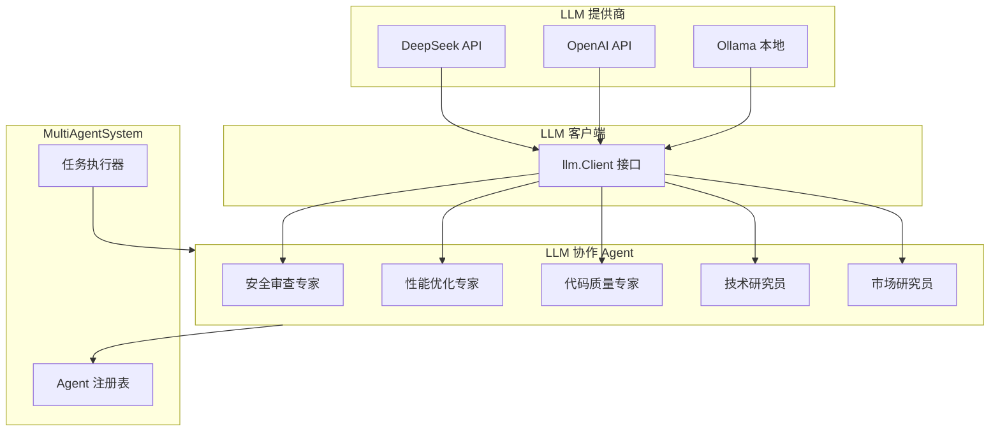
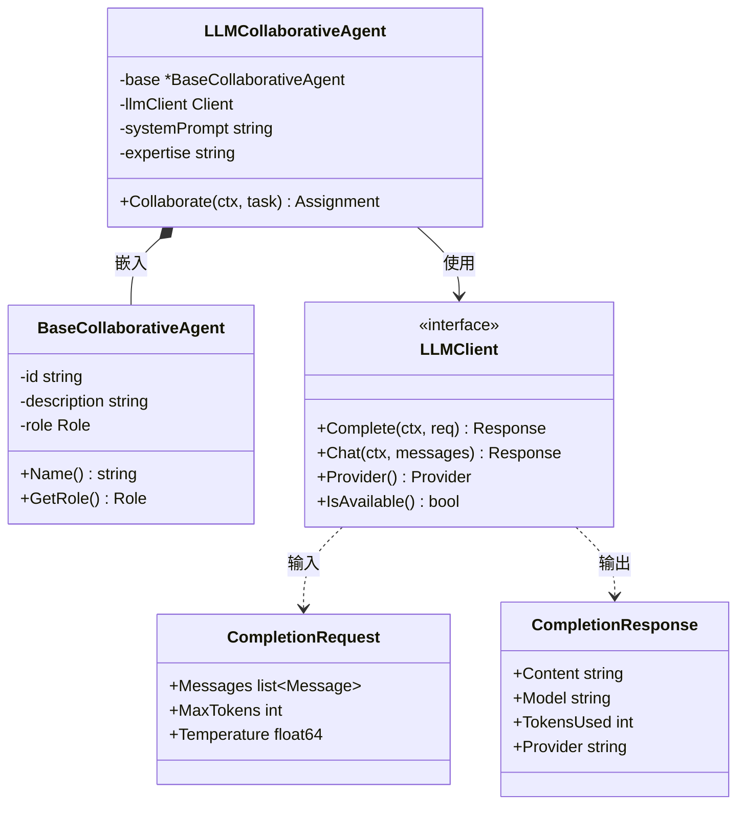
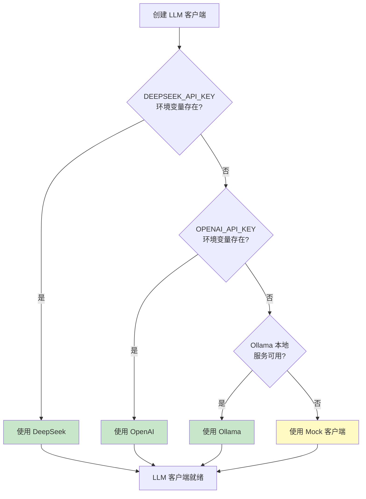
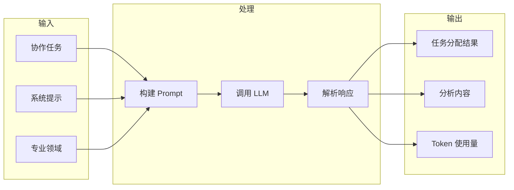
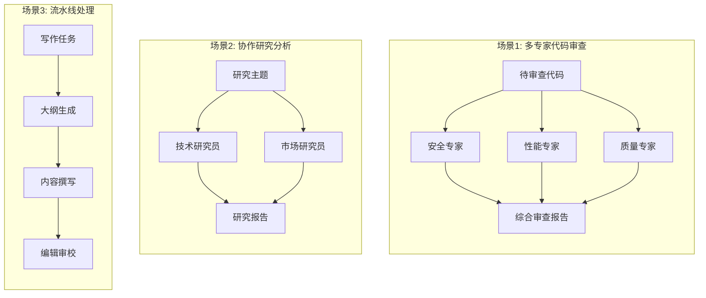
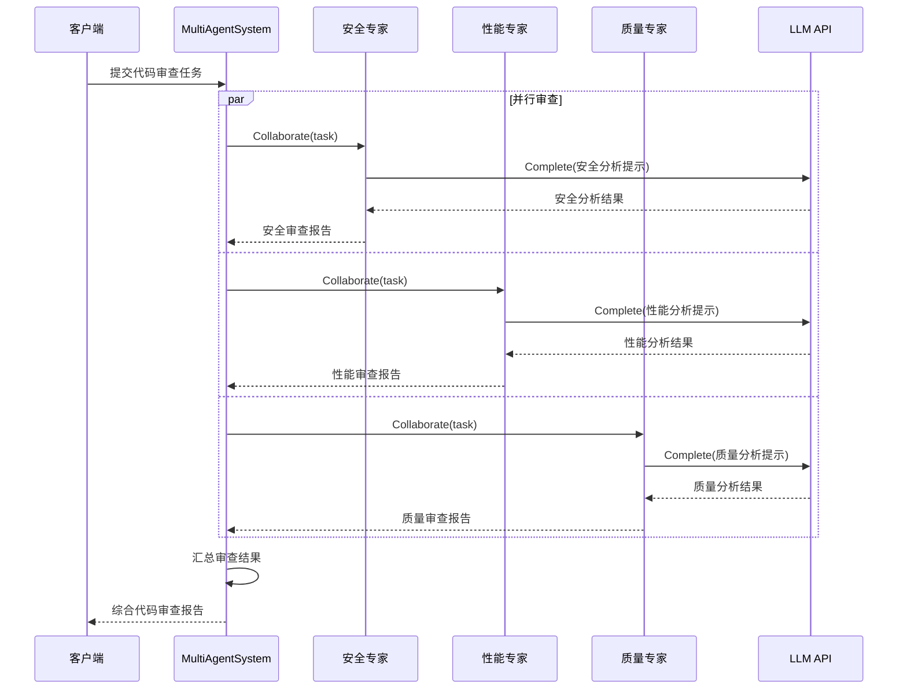
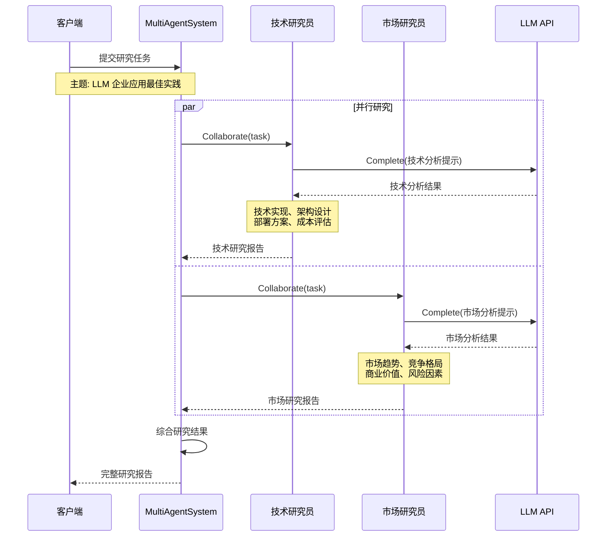
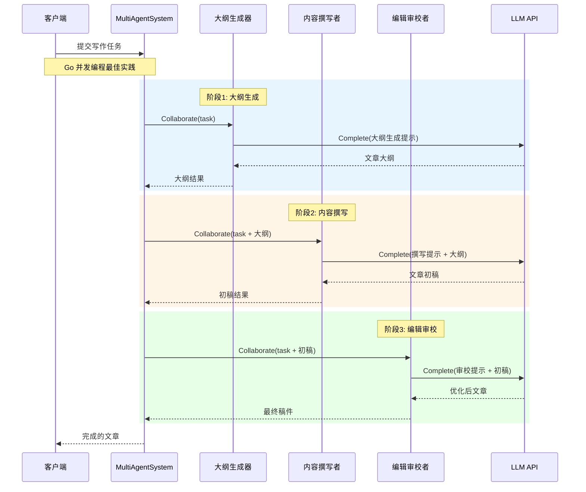
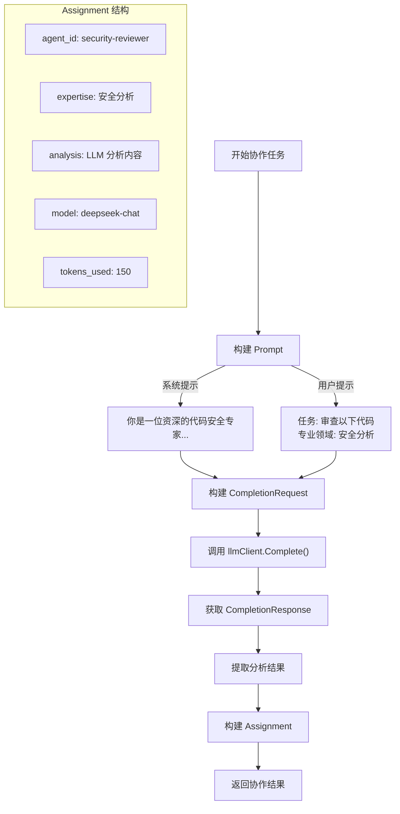
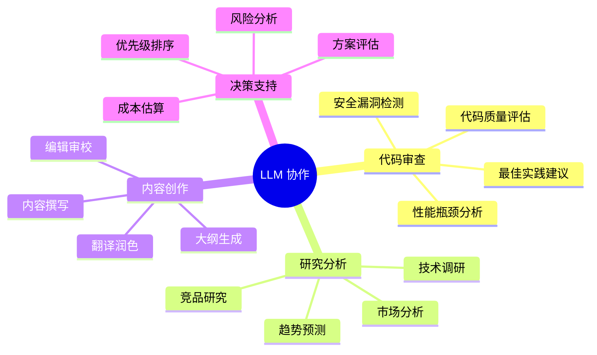

# 05-llm-collaborative-agents LLM 协作 Agent 示例

本示例演示如何创建具有 LLM 推理能力的协作 Agent，展示多专家代码审查、协作研究分析和流水线处理等场景。

## 目录

- [架构设计](#架构设计)
- [核心组件](#核心组件)
- [执行流程](#执行流程)
- [使用方法](#使用方法)
- [应用场景](#应用场景)

## 架构设计

### LLM 协作架构



### LLMCollaborativeAgent 结构



### LLM 提供商选择流程



## 核心组件

### 1. LLMCollaborativeAgent

将 LLM 能力与协作 Agent 框架结合的核心组件。



### 2. 三种协作场景



## 执行流程

### 场景1: 多专家代码审查



### 场景2: 协作研究分析



### 场景3: 流水线处理



### LLM 调用流程



## 使用方法

### 环境配置

```bash
# 使用 DeepSeek (推荐)
export DEEPSEEK_API_KEY="your-api-key"

# 或使用 OpenAI
export OPENAI_API_KEY="your-api-key"

# 或使用本地 Ollama
ollama run qwen2:7b
```

### 运行示例

```bash
cd examples/multiagent/05-llm-collaborative-agents
go run main.go
```

### 预期输出

```text
╔════════════════════════════════════════════════════════════════╗
║          LLM 多智能体协作示例                                  ║
║   展示如何创建具有 LLM 推理能力的协作 Agent                    ║
╚════════════════════════════════════════════════════════════════╝

【场景 1】多专家代码审查
════════════════════════════════════════════════════════════════

场景描述: 多位专家从不同角度审查代码

✓ 注册专家: security-reviewer
✓ 注册专家: performance-reviewer
✓ 注册专家: quality-reviewer

待审查代码:
────────────────────────────────────────
func ProcessUserData(db *sql.DB, userID string) ([]byte, error) {
    query := "SELECT * FROM users WHERE id = '" + userID + "'"
    ...
}
────────────────────────────────────────

执行多专家并行审查...
✓ 审查完成 (耗时: 35s)

审查结果:
════════════════════════════════════════

【security-reviewer】
## 安全分析报告
**严重问题:**
1. SQL 注入漏洞：直接拼接用户输入到 SQL 查询中
   - 风险等级: 高危
   - 建议: 使用参数化查询

【performance-reviewer】
## 性能分析报告
**性能问题:**
1. SELECT * 查询效率低
2. 未使用连接池配置
...

【quality-reviewer】
## 代码质量分析报告
**质量问题:**
1. 函数职责不单一
2. 缺少文档注释
...
```

### 关键代码

#### 创建 LLM 协作 Agent

```go
agent := NewLLMCollaborativeAgent(
    "security-reviewer",
    "安全审查专家",
    multiagent.RoleSpecialist,
    system,
    llmClient,
    "你是一位资深的代码安全专家，专注于识别安全漏洞和潜在风险。",
    "安全分析",
)
```

#### 实现 Collaborate 方法

```go
func (a *LLMCollaborativeAgent) Collaborate(ctx context.Context, task *multiagent.CollaborativeTask) (*multiagent.Assignment, error) {
    prompt := fmt.Sprintf(`任务: %s
请根据你的专业领域(%s)分析并完成此任务。`, task.Input, a.expertise)

    response, err := a.llmClient.Complete(ctx, &llm.CompletionRequest{
        Messages: []llm.Message{
            {Role: "system", Content: a.systemPrompt},
            {Role: "user", Content: prompt},
        },
    })

    return &multiagent.Assignment{
        AgentID: a.Name(),
        Result: map[string]interface{}{
            "analysis":    response.Content,
            "tokens_used": response.TokensUsed,
        },
        Status: multiagent.TaskStatusCompleted,
    }, nil
}
```

## 应用场景

### LLM 协作应用矩阵



### 协作模式对比

| 模式 | 说明 | 适用场景 | LLM 调用方式 |
|------|------|---------|-------------|
| **并行专家** | 多专家同时分析 | 代码审查、方案评估 | 并行调用 |
| **协作研究** | 多领域协同分析 | 技术调研、市场分析 | 并行调用 |
| **流水线** | 链式顺序处理 | 内容创作、数据处理 | 顺序调用 |

### LLM 提供商对比

| 提供商 | 优势 | 劣势 | 推荐场景 |
|--------|------|------|---------|
| **DeepSeek** | 中文能力强、性价比高 | 国际可用性 | 中文项目 |
| **OpenAI** | 能力全面、生态丰富 | 成本较高 | 复杂推理 |
| **Ollama** | 本地部署、隐私安全 | 需要 GPU | 敏感数据 |

## 扩展阅读

- [01-basic-system](../01-basic-system/) - 基础系统示例
- [02-collaboration-types](../02-collaboration-types/) - 协作类型示例
- [04-specialized-agents](../04-specialized-agents/) - 专业化 Agent 示例
- [llm 包文档](../../../llm/) - LLM 客户端使用指南
