# 06-llm-tool-calling LLM 工具调用示例

本示例演示如何在 MultiAgent 系统中使用 LLM 进行工具调用（Tool Calling），展示 LLM 自动选择和执行工具的能力。

## 目录

- [架构设计](#架构设计)
- [核心组件](#核心组件)
- [执行流程](#执行流程)
- [使用方法](#使用方法)
- [应用场景](#应用场景)

## 架构设计

### LLM 工具调用架构

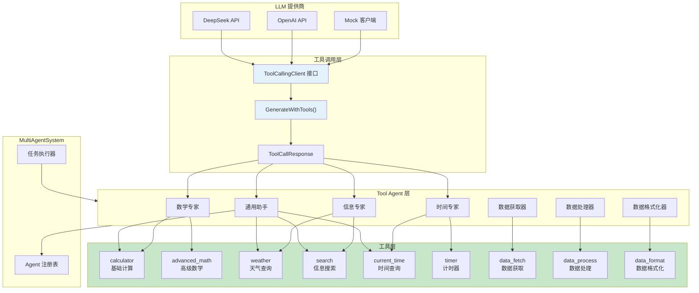

### ToolAgent 结构

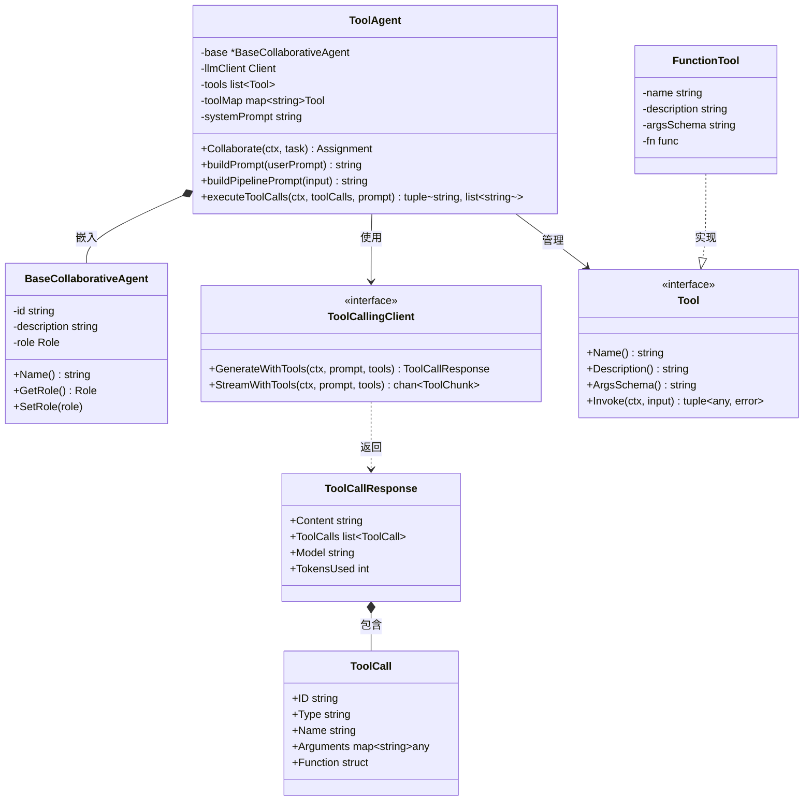

### 工具调用决策流程

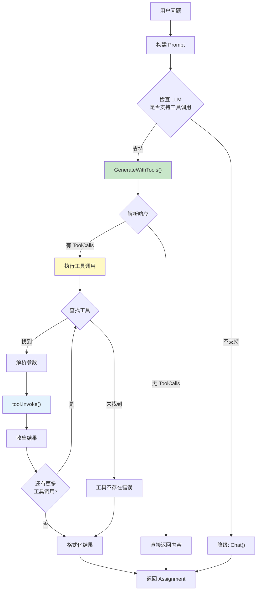

## 核心组件

### 1. ToolAgent 工具代理

将 LLM 工具调用能力与协作 Agent 框架结合的核心组件。

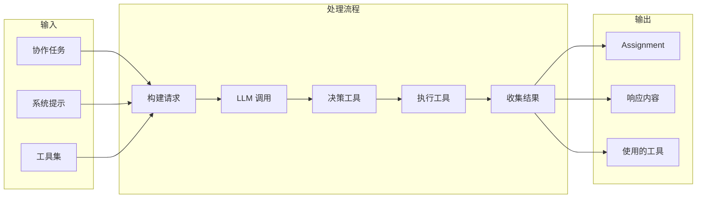

### 2. 工具定义

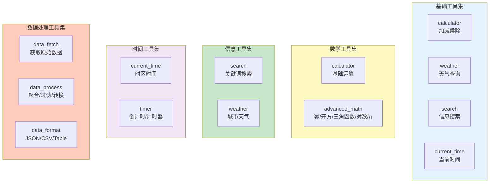

### 3. 三种使用场景

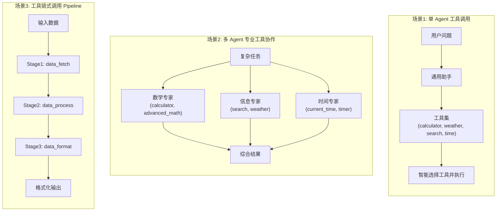

## 执行流程

### 场景1: 单 Agent 工具调用

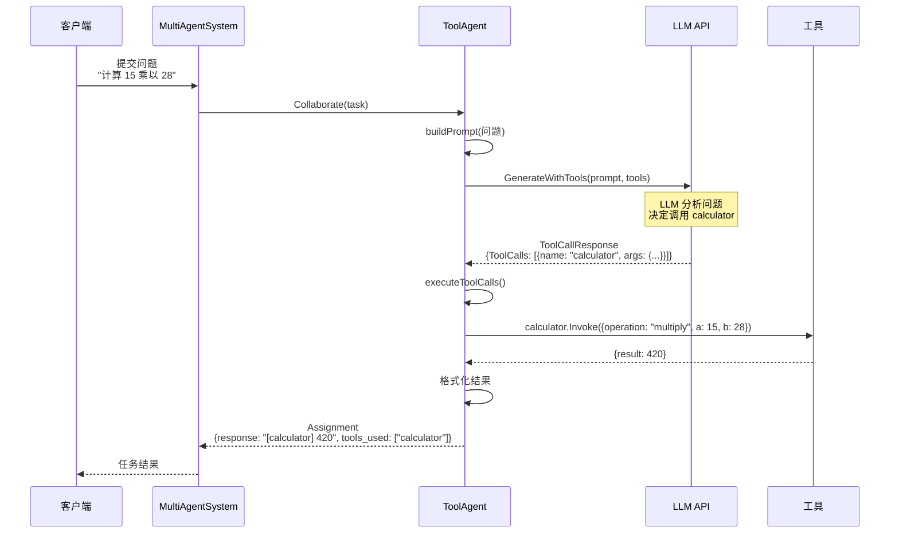

### 场景2: 多 Agent 专业工具协作

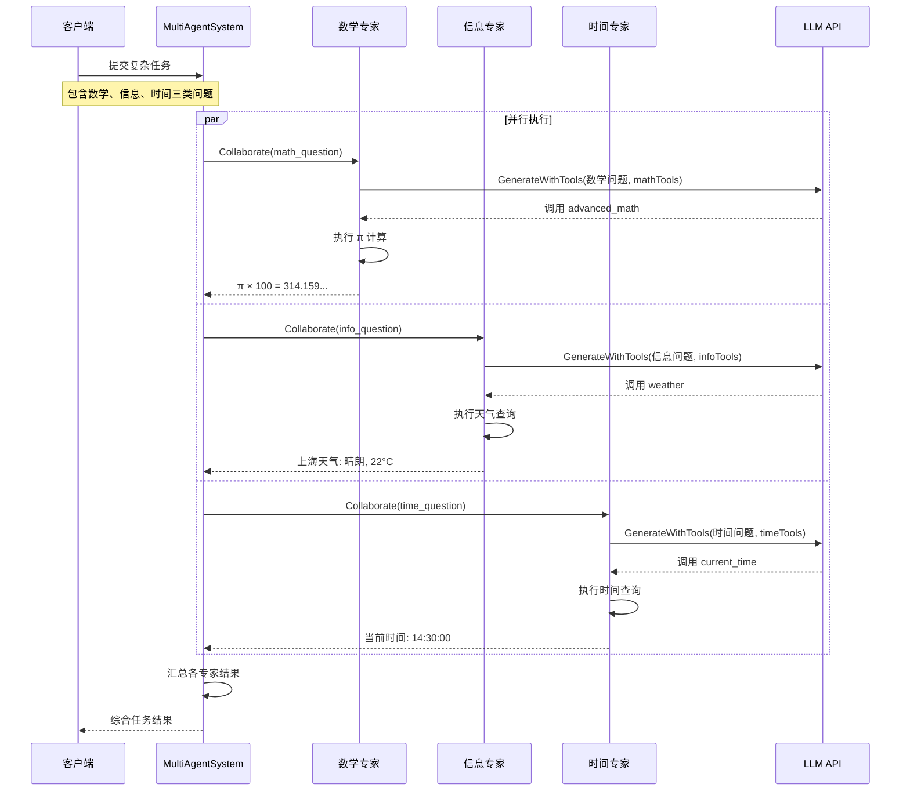

### 场景3: 工具链式调用 (Pipeline)

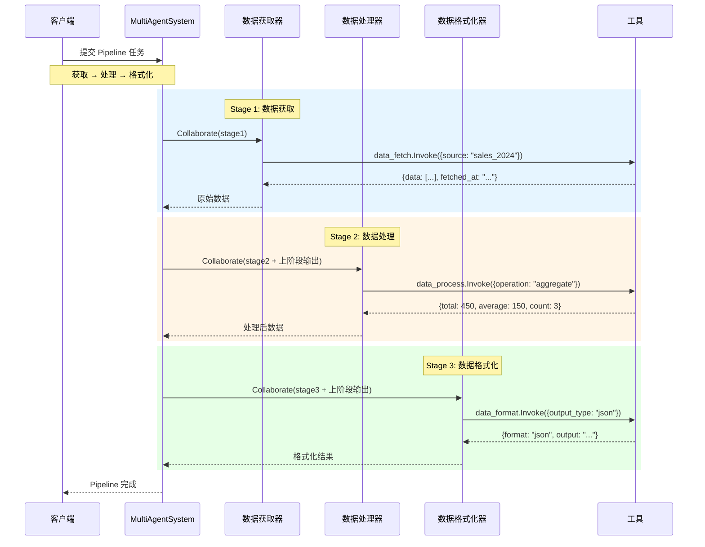

### 工具调用内部流程

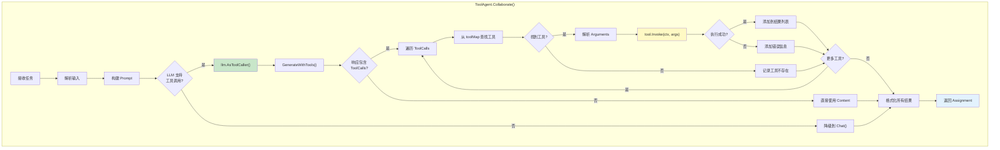

## 使用方法

### 环境配置

```bash
# 使用 DeepSeek（推荐，中文能力强）
export DEEPSEEK_API_KEY="your-api-key"

# 或使用 OpenAI
export OPENAI_API_KEY="your-api-key"

# 未配置 API Key 时将使用 Mock 客户端
```

### 运行示例

```bash
cd examples/multiagent/06-llm-tool-calling
go run main.go
```

### 预期输出

```text
╔════════════════════════════════════════════════════════════════╗
║          LLM Tool Calling 多智能体协作示例                     ║
║   展示如何让 LLM Agent 调用工具完成任务                        ║
╚════════════════════════════════════════════════════════════════╝

LLM 提供商: deepseek

【场景 1】单 Agent 工具调用
════════════════════════════════════════════════════════════════

场景描述: 单个 Agent 配备多个工具，根据用户问题自动选择合适的工具

可用工具:
  - calculator: 执行基本数学计算（加减乘除）
  - weather: 查询指定城市的天气信息
  - search: 搜索相关信息和资料
  - current_time: 获取当前时间
✓ 注册工具 Agent: assistant

问题 1: 计算 15 乘以 28 等于多少？
────────────────────────────────────────
回答: [calculator] map[a:15 b:28 operation:multiply result:420]
使用的工具: [calculator]

问题 2: 今天北京的天气怎么样？
────────────────────────────────────────
回答: [weather] map[aqi:45 city:北京 condition:晴朗 humidity:65 ...]
使用的工具: [weather]

问题 3: 搜索关于 Go 语言并发编程的资料
────────────────────────────────────────
回答: [search] map[count:3 query:Go 语言并发编程 results:[...]]
使用的工具: [search]

问题 4: 现在是几点钟？
────────────────────────────────────────
回答: [current_time] map[date:2024-12-05 datetime:... time:14:30:00 ...]
使用的工具: [current_time]

【场景 2】多 Agent 专业工具协作
════════════════════════════════════════════════════════════════

场景描述: 多个专业 Agent 各自拥有不同的工具集，协作完成复杂任务

注册的专家 Agent:
  ✓ math-expert: 数学专家 (calculator, advanced_math)
  ✓ info-expert: 信息专家 (search, weather)
  ✓ time-expert: 时间专家 (current_time, timer)

执行综合任务...

各专家执行结果:
────────────────────────────────────────

【math-expert】
  响应: [advanced_math] map[input:0 operation:pi result:3.141592653589793]
  使用工具: [advanced_math]

【info-expert】
  响应: [weather] map[city:上海 condition:晴朗 temperature:22 ...]
  使用工具: [weather]

【time-expert】
  响应: [current_time] map[datetime:2024-12-05 14:30:00 timezone:Asia/Shanghai ...]
  使用工具: [current_time]

【场景 3】工具链式调用（Pipeline）
════════════════════════════════════════════════════════════════

场景描述: 工具的输出作为下一个工具的输入，形成处理管道

Pipeline 阶段:
  Stage 1: data-fetcher  [data_fetch]
  Stage 2: data-processor [data_process]
  Stage 3: data-formatter [data_format]

执行数据处理管道...
✓ Pipeline 完成，状态: completed

各阶段结果:
  fetch: map[data:[...] fetched_at:2024-12-05T14:30:00Z source:sales_2024]
  process: map[operation:aggregate processed:map[average:150 count:3 total:450] ...]
  format: map[format:json formatted_at:2024-12-05T14:30:01Z output:数据已格式化为 json 格式]

╔════════════════════════════════════════════════════════════════╗
║                        示例完成                                ║
╚════════════════════════════════════════════════════════════════╝
```

### 关键代码示例

#### 创建工具

```go
// 使用 tools.NewFunctionTool 创建工具
calculatorTool := tools.NewFunctionTool(
    "calculator",
    "执行基本数学计算（加减乘除）",
    `{
        "type": "object",
        "properties": {
            "operation": {"type": "string", "enum": ["add", "subtract", "multiply", "divide"]},
            "a": {"type": "number"},
            "b": {"type": "number"}
        },
        "required": ["operation", "a", "b"]
    }`,
    func(ctx context.Context, args map[string]interface{}) (interface{}, error) {
        op := args["operation"].(string)
        a := args["a"].(float64)
        b := args["b"].(float64)

        var result float64
        switch op {
        case "add":
            result = a + b
        case "multiply":
            result = a * b
        // ...
        }
        return map[string]interface{}{"result": result}, nil
    },
)
```

#### 创建 ToolAgent

```go
agent := NewToolAgent(
    "assistant",           // ID
    "通用助手",            // 描述
    multiagent.RoleWorker, // 角色
    system,                // MultiAgentSystem
    llmClient,             // LLM 客户端
    toolSet,               // 工具集
    "你是一个智能助手，可以使用工具来帮助用户完成任务。", // 系统提示
)
```

#### 实现 Collaborate 方法

```go
func (a *ToolAgent) Collaborate(ctx context.Context, task *multiagent.CollaborativeTask) (*multiagent.Assignment, error) {
    // 尝试使用工具调用
    toolCaller := llm.AsToolCaller(a.llmClient)
    if toolCaller != nil && len(a.tools) > 0 {
        result, err := toolCaller.GenerateWithTools(ctx, a.buildPrompt(userPrompt), a.tools)
        if err == nil && len(result.ToolCalls) > 0 {
            response, toolsUsed = a.executeToolCalls(ctx, result.ToolCalls, userPrompt)
        }
    }

    return &multiagent.Assignment{
        AgentID: a.Name(),
        Result: map[string]interface{}{
            "response":   response,
            "tools_used": toolsUsed,
        },
        Status: multiagent.TaskStatusCompleted,
    }, nil
}
```

## 应用场景

### LLM 工具调用应用矩阵

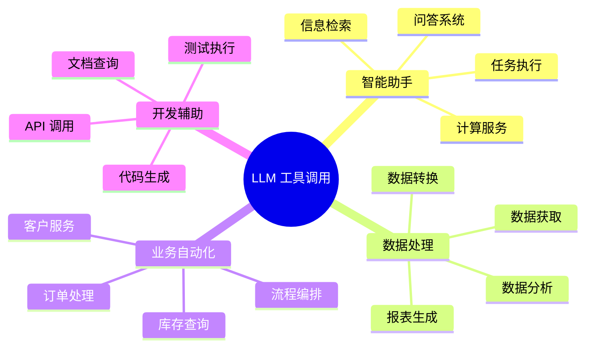

### 工具调用模式对比

| 模式 | 说明 | 适用场景 | Agent 数量 |
|------|------|---------|-----------|
| **单 Agent 多工具** | 一个 Agent 配备多种工具 | 通用助手、问答系统 | 1 |
| **多 Agent 专业工具** | 每个 Agent 专注特定工具集 | 专家协作、复杂分析 | N |
| **Pipeline 工具链** | 工具按顺序链式执行 | 数据处理、流程编排 | N |

### 与其他示例的关系

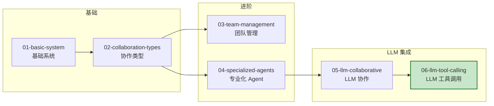

## 扩展阅读

- [01-basic-system](../01-basic-system/) - 基础系统示例
- [02-collaboration-types](../02-collaboration-types/) - 协作类型示例
- [05-llm-collaborative-agents](../05-llm-collaborative-agents/) - LLM 协作 Agent 示例
- [llm 包文档](../../../llm/) - LLM 客户端使用指南
- [tools 包文档](../../../tools/) - 工具定义与实现
- [interfaces 包文档](../../../interfaces/) - 工具接口定义
