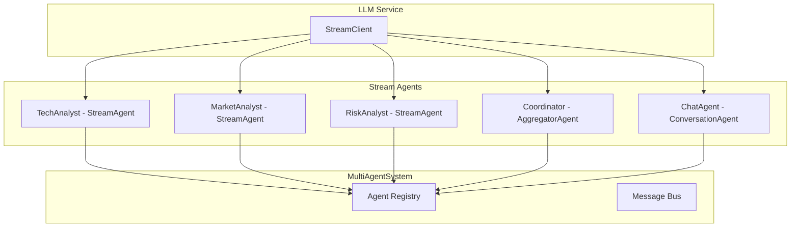
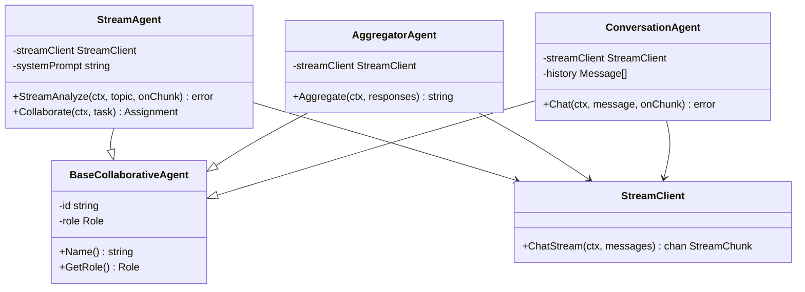
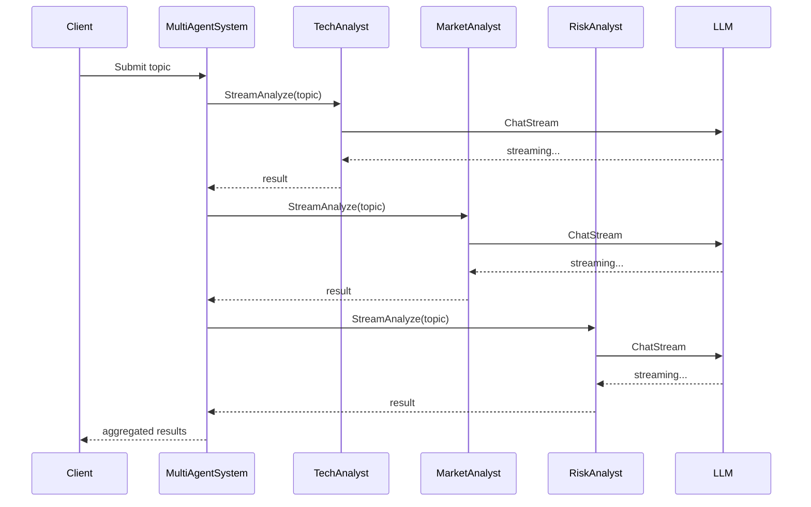
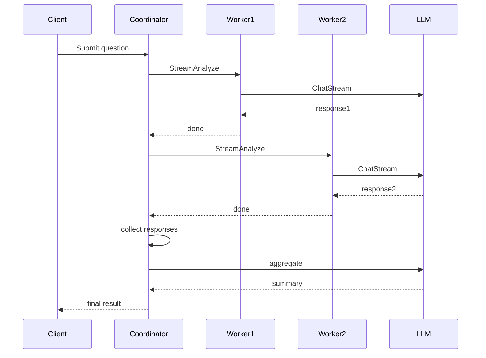
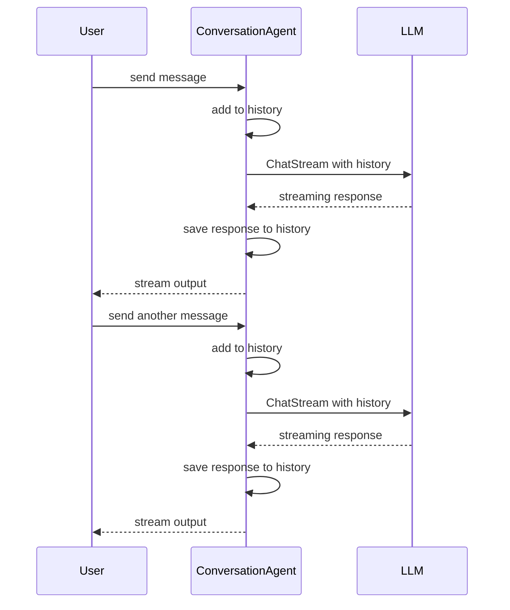

# 07-multiagent-llm-stream 多智能体 LLM 流式响应示例

本示例演示多智能体系统中使用 LLM 流式响应进行协作处理。

## 目录

- [架构设计](#架构设计)
- [核心组件](#核心组件)
- [执行流程](#执行流程)
- [使用方法](#使用方法)
- [代码结构](#代码结构)

## 架构设计

### 系统架构图



### 组件关系图



## 核心组件

### 1. StreamAgent

支持流式响应的基础 Agent，负责：

- 使用 LLM 流式 API 进行分析
- 实时回调处理流式数据
- 支持协作任务接口

### 2. AggregatorAgent

响应聚合器 Agent，负责：

- 收集多个 Agent 的流式响应
- 使用 LLM 综合多方观点
- 生成统一的总结报告

### 3. ConversationAgent

多轮对话 Agent，负责：

- 维护对话历史
- 支持上下文感知的流式对话
- 保证对话原子性（用户消息和助手响应成对出现）

## 执行流程

### 场景 1：多 Agent 流式响应协作



### 场景 2：流式响应聚合



### 场景 3：多轮流式对话



## 使用方法

### 环境变量

```bash
# 设置 LLM API Key（二选一）
export DEEPSEEK_API_KEY=your_deepseek_key
# 或
export OPENAI_API_KEY=your_openai_key
```

### 运行示例

```bash
cd examples/multiagent/07-multiagent-llm-stream
go run main.go
```

### 预期输出

```text
╔════════════════════════════════════════════════════════════════╗
║          多智能体 LLM 流式响应示例                              ║
║   展示多 Agent 使用 LLM 流式响应协作处理任务                    ║
╚════════════════════════════════════════════════════════════════╝

【场景 1】多 Agent 流式响应协作
════════════════════════════════════════════════════════════════

场景描述: 多个专家 Agent 并行使用 LLM 流式响应分析问题

✓ LLM 提供商: deepseek (支持流式)

  ✓ 注册: 技术分析师 (技术评估)
  ✓ 注册: 市场分析师 (市场评估)
  ✓ 注册: 风险分析师 (风险评估)

分析主题: 在企业中部署大语言模型应用
────────────────────────────────────────

分析结果:

【技术评估】
  大语言模型部署需要高性能GPU集群支持...

【市场评估】
  企业AI应用市场快速增长...

【风险评估】
  数据隐私和合规是主要风险点...
```

## 代码结构

```text
07-multiagent-llm-stream/
├── main.go          # 示例入口
└── README.md        # 本文档
```

### 关键代码片段

#### 创建流式 Agent

```go
// 创建流式 Agent
agent := NewStreamAgent(
    "tech-analyst",
    "技术分析师",
    multiagent.RoleSpecialist,
    system,
    streamClient,
    "你是技术分析师。简短分析技术可行性（3句话内）。",
)
```

#### 执行流式分析

```go
// 流式分析，实时处理响应
var content strings.Builder
err := agent.StreamAnalyze(ctx, topic, func(chunk string) {
    content.WriteString(chunk)
    fmt.Print(chunk) // 实时输出
})
```

#### 多轮对话

```go
// 创建对话 Agent
chatAgent := NewConversationAgent("chat-agent", "对话助手", system, streamClient)

// 进行多轮对话
for _, msg := range messages {
    err := chatAgent.Chat(ctx, msg, func(chunk string) {
        fmt.Print(chunk)
    })
}
```

## 扩展阅读

- [05-llm-collaborative-agents](../05-llm-collaborative-agents/) - LLM 协作 Agent 示例
- [06-llm-tool-calling](../06-llm-tool-calling/) - LLM 工具调用示例
- [llm 包文档](../../../llm/) - LLM 客户端文档
