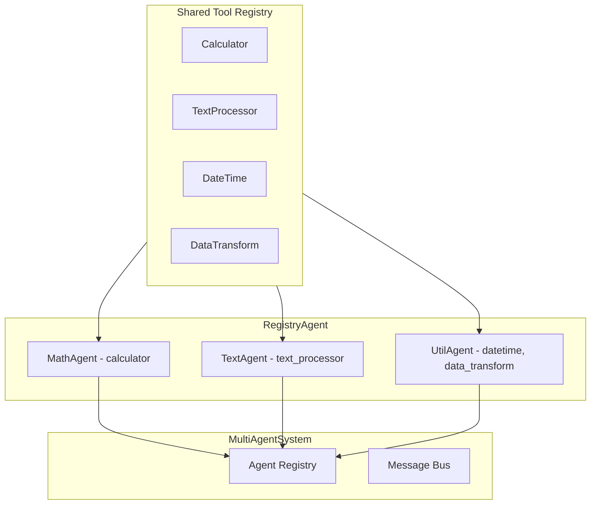
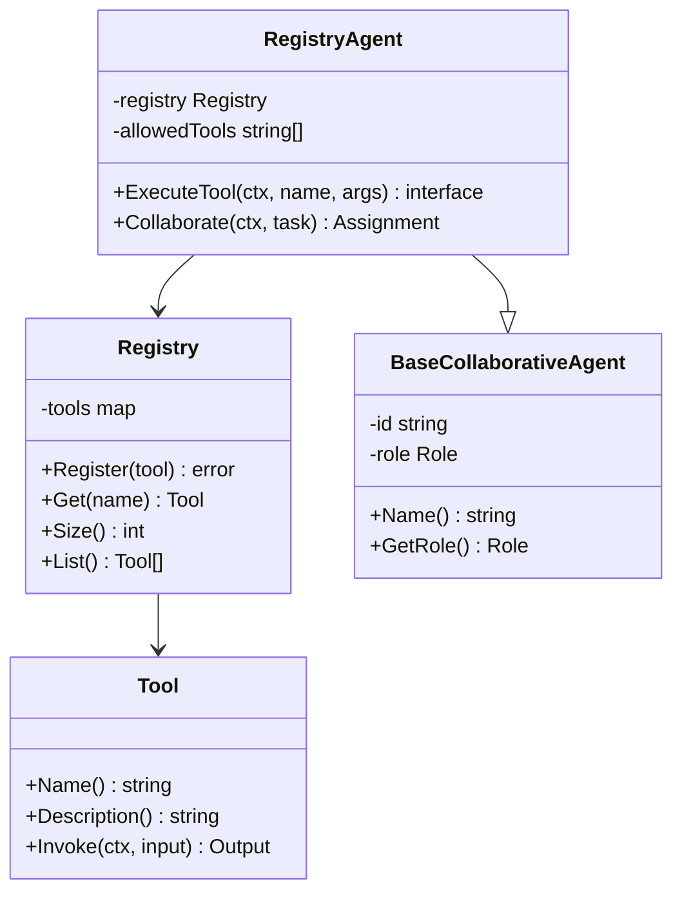
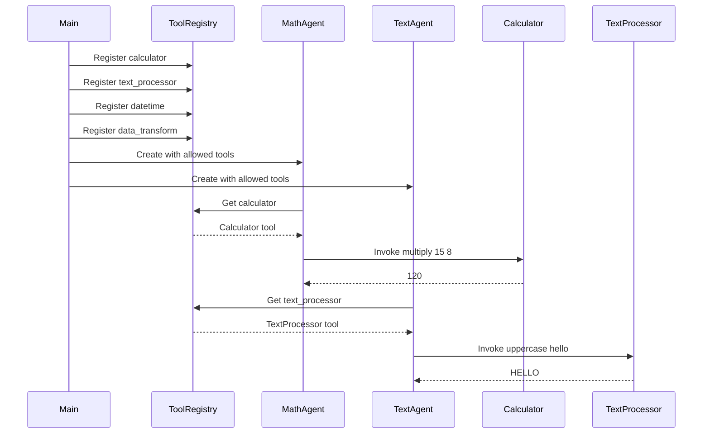
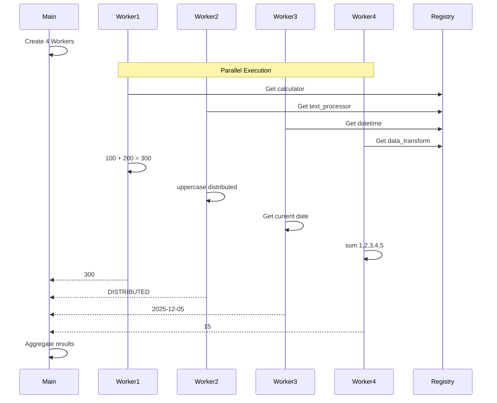
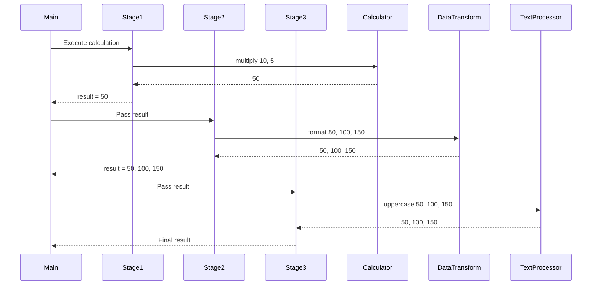

# 08-multiagent-tool-registry 多智能体工具注册表示例

本示例演示多智能体系统中使用工具注册表进行协作处理。

## 目录

- [架构设计](#架构设计)
- [核心组件](#核心组件)
- [执行流程](#执行流程)
- [使用方法](#使用方法)
- [代码结构](#代码结构)

## 架构设计

### 系统架构图



### 组件关系图



## 核心组件

### 1. 工具注册表 (Registry)

集中管理所有工具的注册表，负责：

- 工具的注册和注销
- 按名称查找工具
- 提供工具列表查询

### 2. RegistryAgent

使用工具注册表的 Agent，负责：

- 通过注册表获取授权的工具
- 执行工具调用
- 支持工具白名单权限控制

### 3. 内置工具

示例提供了四种工具：

| 工具名称 | 描述 | 功能 |
|---------|------|------|
| calculator | 计算工具 | 加减乘除四则运算 |
| text_processor | 文本处理 | 大写、小写、反转 |
| datetime | 日期时间 | 获取当前日期时间 |
| data_transform | 数据转换 | 数组求和、格式化 |

## 执行流程

### 场景 1：共享工具注册表



### 场景 2：分布式工具执行



### 场景 3：工具结果传递



## 使用方法

### 运行示例

```bash
cd examples/multiagent/08-multiagent-tool-registry
go run main.go
```

### 预期输出

```text
╔════════════════════════════════════════════════════════════════╗
║          多智能体工具注册表示例                                 ║
║   展示多 Agent 共享和协作使用工具注册表                         ║
╚════════════════════════════════════════════════════════════════╝

【场景 1】共享工具注册表
════════════════════════════════════════════════════════════════

场景描述: 多个 Agent 共享同一个工具注册表，按需获取工具

注册工具到共享注册表:
  ✓ calculator: 执行基本数学计算
  ✓ text_processor: 处理文本
  ✓ datetime: 获取当前日期时间
  ✓ data_transform: 数据转换工具

注册表状态: 4 个工具可用

注册 Agent 及其可用工具:
  ✓ math-agent: [calculator]
  ✓ text-agent: [text_processor]
  ✓ util-agent: [datetime, data_transform]

执行工具调用:
────────────────────────────────────────
  math-agent: 15 × 8 = map[result:120]
  text-agent: uppercase('hello world') = map[result:HELLO WORLD]
  util-agent: 当前时间 = map[result:2025-12-05 10:30:00]
```

## 代码结构

```text
08-multiagent-tool-registry/
├── main.go          # 示例入口
└── README.md        # 本文档
```

### 关键代码片段

#### 创建共享注册表

```go
// 创建共享工具注册表
registry := tools.NewRegistry()

// 注册各类工具
toolsToRegister := []interfaces.Tool{
    createCalculatorTool(),
    createTextProcessorTool(),
    createDateTimeTool(),
    createDataTransformTool(),
}

for _, tool := range toolsToRegister {
    _ = registry.Register(tool)
}
```

#### 创建使用注册表的 Agent

```go
// 创建使用共享注册表的 Agent，指定允许使用的工具
mathAgent := NewRegistryAgent(
    "math-agent",
    "数学Agent",
    multiagent.RoleWorker,
    system,
    registry,
    []string{"calculator"},  // 只允许使用 calculator 工具
)
```

#### 执行工具调用

```go
// 通过 Agent 执行工具
result, err := mathAgent.ExecuteTool(ctx, "calculator", map[string]interface{}{
    "operation": "multiply",
    "a":         15.0,
    "b":         8.0,
})
```

#### 定义自定义工具

```go
func createCalculatorTool() *tools.FunctionTool {
    return tools.NewFunctionTool(
        "calculator",
        "执行基本数学计算",
        `{"type": "object", "properties": {...}}`,
        func(ctx context.Context, args map[string]interface{}) (interface{}, error) {
            op := args["operation"].(string)
            a := args["a"].(float64)
            b := args["b"].(float64)
            // 执行计算...
            return map[string]interface{}{"result": result}, nil
        },
    )
}
```

## 扩展阅读

- [05-llm-collaborative-agents](../05-llm-collaborative-agents/) - LLM 协作 Agent 示例
- [06-llm-tool-calling](../06-llm-tool-calling/) - LLM 工具调用示例
- [07-multiagent-llm-stream](../07-multiagent-llm-stream/) - LLM 流式响应示例
- [tools 包文档](../../../tools/) - 工具包文档
