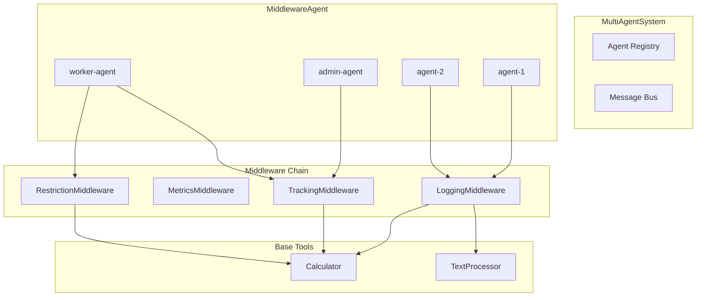
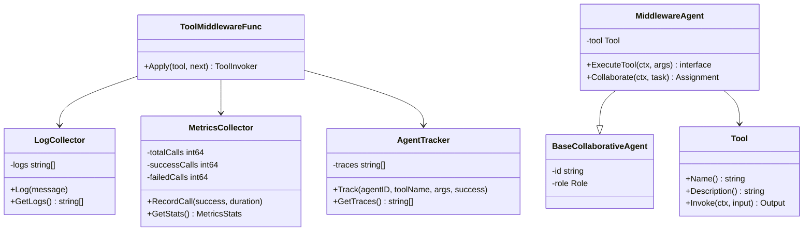
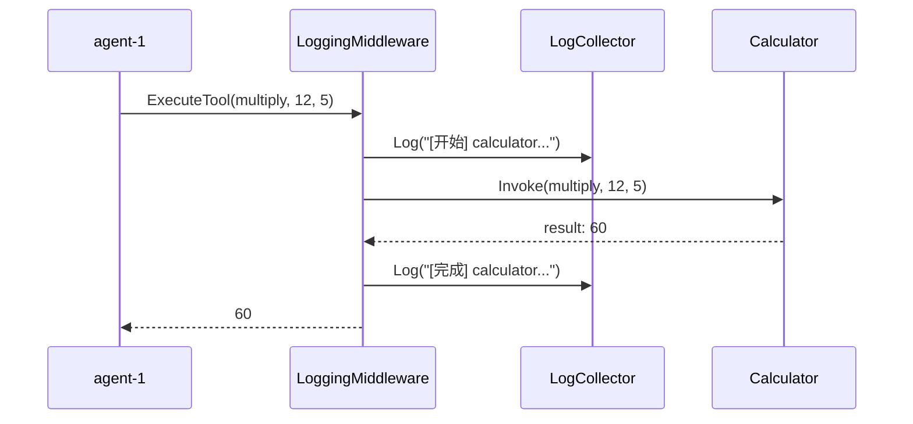
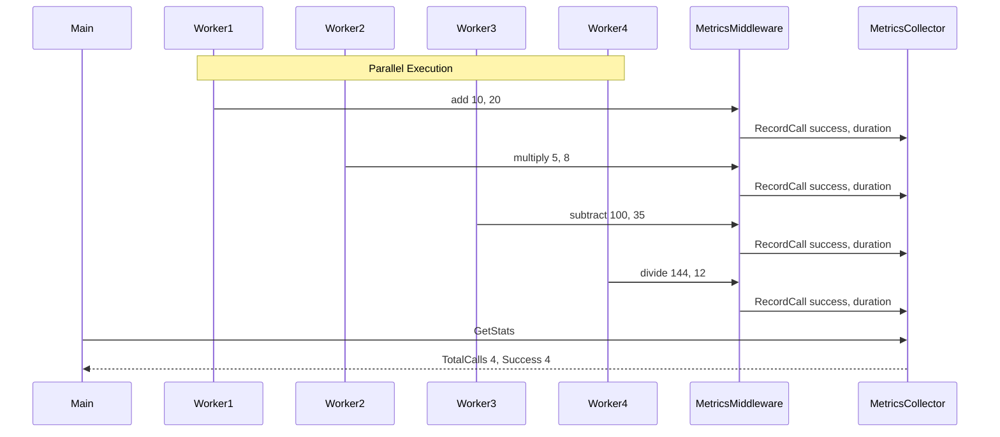
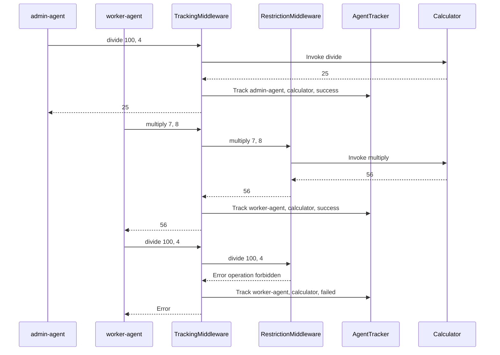

# 09-multiagent-with-middleware 多智能体中间件示例

本示例演示多智能体系统中使用工具中间件进行增强和监控。

## 目录

- [架构设计](#架构设计)
- [核心组件](#核心组件)
- [执行流程](#执行流程)
- [使用方法](#使用方法)
- [代码结构](#代码结构)

## 架构设计

### 系统架构图



### 组件关系图



## 核心组件

### 1. 中间件类型

| 中间件 | 功能 | 应用场景 |
|-------|------|---------|
| LoggingMiddleware | 记录工具调用日志 | 调试和审计 |
| MetricsMiddleware | 收集调用指标 | 性能监控 |
| TrackingMiddleware | 追踪 Agent 调用 | 调用链分析 |
| RestrictionMiddleware | 限制特定操作 | 权限控制 |

### 2. MiddlewareAgent

使用带中间件工具的 Agent，负责：

- 通过中间件链调用工具
- 自动记录和追踪调用
- 支持权限控制

### 3. 收集器

- **LogCollector**: 收集和存储日志消息
- **MetricsCollector**: 使用原子操作收集调用指标
- **AgentTracker**: 追踪 Agent 级别的调用记录

## 执行流程

### 场景 1：带日志中间件的 Agent 协作



### 场景 2：带指标中间件的分布式执行



### 场景 3：Agent 级别的自定义中间件



## 使用方法

### 运行示例

```bash
cd examples/multiagent/09-multiagent-with-middleware
go run main.go
```

### 预期输出

```text
╔════════════════════════════════════════════════════════════════╗
║          多智能体中间件示例                                     ║
║   展示多 Agent 使用带中间件的工具进行协作                        ║
╚════════════════════════════════════════════════════════════════╝

【场景 1】带日志中间件的 Agent 协作
════════════════════════════════════════════════════════════════

场景描述: 多个 Agent 使用带日志中间件的工具，追踪调用链

Agent 配置:
  agent-1: 使用带日志的 calculator 工具
  agent-2: 使用带日志的 text_processor 工具

执行工具调用:
────────────────────────────────────────
  agent-1: 12 × 5 = map[result:60]
  agent-2: uppercase('hello middleware') = map[result:HELLO MIDDLEWARE]

日志记录:
────────────────────────────────────────
  [开始] calculator - 参数: map[a:12 b:5 operation:multiply]
  [完成] calculator - 耗时: 15.208µs, 结果: map[result:60]
  [开始] text_processor - 参数: map[action:uppercase text:hello middleware]
  [完成] text_processor - 耗时: 8.125µs, 结果: map[result:HELLO MIDDLEWARE]
```

## 代码结构

```text
09-multiagent-with-middleware/
├── main.go          # 示例入口
└── README.md        # 本文档
```

### 关键代码片段

#### 创建日志中间件

```go
// 创建日志中间件
func createLoggingMiddleware(collector *LogCollector) middleware.ToolMiddlewareFunc {
    return func(tool interfaces.Tool, next middleware.ToolInvoker) middleware.ToolInvoker {
        return func(ctx context.Context, input *interfaces.ToolInput) (*interfaces.ToolOutput, error) {
            start := time.Now()
            collector.Log(fmt.Sprintf("[开始] %s - 参数: %v", tool.Name(), input.Args))

            output, err := next(ctx, input)

            duration := time.Since(start)
            if err != nil {
                collector.Log(fmt.Sprintf("[失败] %s - 耗时: %v, 错误: %v", tool.Name(), duration, err))
            } else {
                collector.Log(fmt.Sprintf("[完成] %s - 耗时: %v, 结果: %v", tool.Name(), duration, output.Result))
            }

            return output, err
        }
    }
}
```

#### 创建指标中间件

```go
// 创建指标中间件
func createMetricsMiddleware(collector *MetricsCollector) middleware.ToolMiddlewareFunc {
    return func(tool interfaces.Tool, next middleware.ToolInvoker) middleware.ToolInvoker {
        return func(ctx context.Context, input *interfaces.ToolInput) (*interfaces.ToolOutput, error) {
            start := time.Now()
            output, err := next(ctx, input)
            duration := time.Since(start)

            collector.RecordCall(err == nil, duration)

            return output, err
        }
    }
}
```

#### 创建操作限制中间件

```go
// 创建操作限制中间件
func createOperationRestrictionMiddleware(forbiddenOps []string) middleware.ToolMiddlewareFunc {
    forbidden := make(map[string]bool)
    for _, op := range forbiddenOps {
        forbidden[op] = true
    }

    return func(tool interfaces.Tool, next middleware.ToolInvoker) middleware.ToolInvoker {
        return func(ctx context.Context, input *interfaces.ToolInput) (*interfaces.ToolOutput, error) {
            if op, ok := input.Args["operation"].(string); ok {
                if forbidden[op] {
                    return nil, fmt.Errorf("操作 '%s' 被禁止", op)
                }
            }
            return next(ctx, input)
        }
    }
}
```

#### 应用中间件到工具

```go
// 创建带中间件的工具
baseTool := createCalculatorTool()

// 单个中间件
calcTool := tools.WithMiddleware(baseTool, loggingMW)

// 多个中间件链
workerTool := tools.WithMiddleware(baseTool, trackingMW, restrictionMW)
```

#### 原子操作收集指标

```go
type MetricsCollector struct {
    totalCalls    int64
    successCalls  int64
    failedCalls   int64
    totalDuration int64 // 纳秒
}

func (c *MetricsCollector) RecordCall(success bool, duration time.Duration) {
    atomic.AddInt64(&c.totalCalls, 1)
    if success {
        atomic.AddInt64(&c.successCalls, 1)
    } else {
        atomic.AddInt64(&c.failedCalls, 1)
    }
    atomic.AddInt64(&c.totalDuration, int64(duration))
}
```

## 扩展阅读

- [06-llm-tool-calling](../06-llm-tool-calling/) - LLM 工具调用示例
- [08-multiagent-tool-registry](../08-multiagent-tool-registry/) - 工具注册表示例
- [tools/middleware 包文档](../../../tools/middleware/) - 中间件包文档
