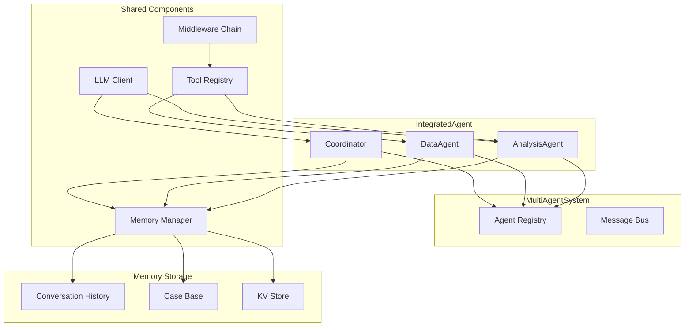
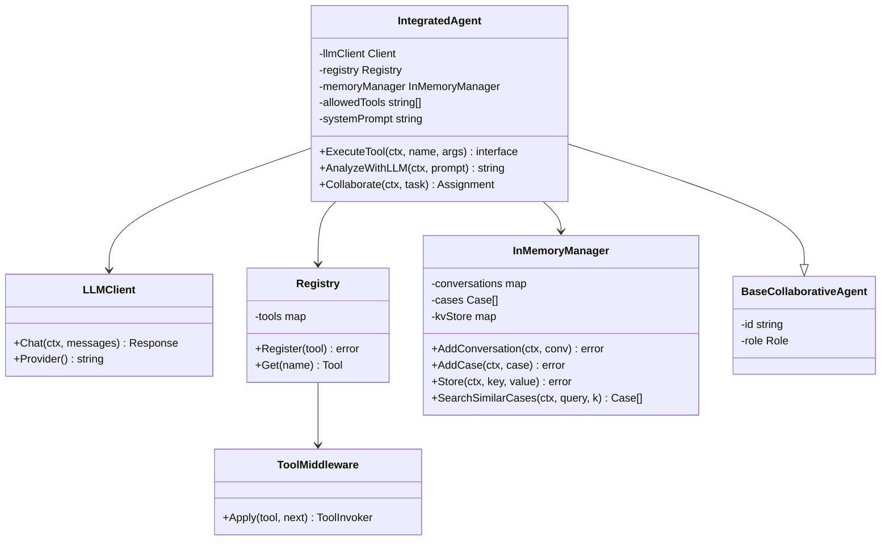
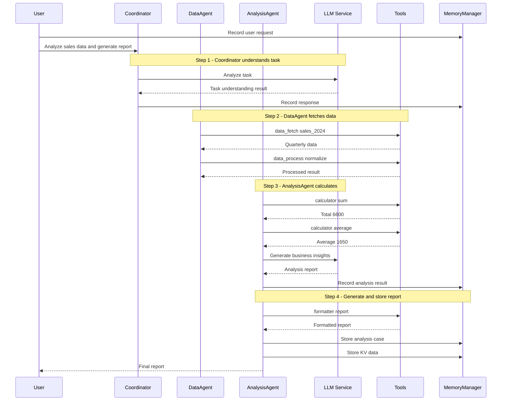
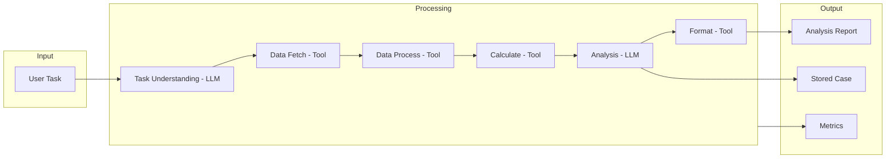

# 10-multiagent-integrated 多智能体综合示例

本示例演示多智能体系统综合使用 LLM、工具注册表、中间件和记忆管理器进行协作。

## 目录

- [架构设计](#架构设计)
- [核心组件](#核心组件)
- [执行流程](#执行流程)
- [使用方法](#使用方法)
- [代码结构](#代码结构)

## 架构设计

### 系统架构图



### 组件关系图



## 核心组件

### 1. IntegratedAgent

综合 Agent，同时支持所有能力：

| 能力 | 描述 | 应用 |
|-----|------|------|
| LLM 决策 | 使用 LLM 理解任务和生成分析 | 协调者、分析 Agent |
| 工具执行 | 通过注册表调用带中间件的工具 | 数据 Agent、分析 Agent |
| 记忆管理 | 存储对话历史、案例和键值数据 | 所有 Agent |

### 2. 共享组件

| 组件 | 功能 |
|------|------|
| LLM 客户端 | 提供智能决策能力（支持 DeepSeek/OpenAI） |
| 工具注册表 | 集中管理所有工具 |
| 中间件链 | 日志和指标收集 |
| 记忆管理器 | 对话历史 + 案例库 + 键值存储 |

### 3. 工具集

| 工具名称 | 功能 | 使用者 |
|---------|------|--------|
| data_fetch | 从数据源获取数据 | 数据 Agent |
| data_process | 处理和转换数据 | 数据 Agent |
| calculator | 执行数学计算 | 分析 Agent |
| formatter | 格式化输出报告 | 分析 Agent |

## 执行流程

### 智能数据分析流水线



### 数据流图



## 使用方法

### 环境变量

```bash
# 设置 LLM API Key（二选一）
export DEEPSEEK_API_KEY=your_deepseek_key
# 或
export OPENAI_API_KEY=your_openai_key
```

### 运行示例

```bash
cd examples/multiagent/10-multiagent-integrated
go run main.go
```

### 预期输出

```text
╔════════════════════════════════════════════════════════════════╗
║          多智能体综合示例                                       ║
║   展示多 Agent 同时使用 LLM、工具、中间件和记忆                   ║
╚════════════════════════════════════════════════════════════════╝

【综合场景】智能数据分析流水线
════════════════════════════════════════════════════════════════

场景描述:
  多个 Agent 协作完成智能数据分析任务
  - 协调者 Agent：使用 LLM 理解任务并分配工作
  - 数据 Agent：使用带中间件的工具获取和处理数据
  - 分析 Agent：使用 LLM 进行智能分析
  - 记忆管理器：存储对话历史和分析案例
  - 所有工具调用经过日志和指标中间件

【步骤 1】创建共享组件
────────────────────────────────────────
  ✓ LLM 客户端: deepseek
  ✓ 工具注册表已创建
  ✓ 记忆管理器已创建 (对话历史 + 案例存储)
  ✓ 日志中间件已创建
  ✓ 指标中间件已创建

【步骤 2】注册带中间件的工具
────────────────────────────────────────
  ✓ data_fetch: 已注册（带日志和指标中间件）
  ✓ data_process: 已注册（带日志和指标中间件）
  ✓ calculator: 已注册（带日志和指标中间件）
  ✓ formatter: 已注册（带日志和指标中间件）
  注册表状态: 4 个工具可用

...

【最终报告】
════════════════════════════════════════════════════════════════
┌────────────────────────────────────────┐
│ 2024年销售分析报告
├────────────────────────────────────────┤
│ 总销售额: 6600.00
│ 平均销售额: 1650.00
├────────────────────────────────────────┤
│ 分析: 销售数据呈现持续增长趋势...
└────────────────────────────────────────┘
```

## 代码结构

```text
10-multiagent-integrated/
├── main.go          # 示例入口
└── README.md        # 本文档
```

### 关键代码片段

#### 创建综合 Agent

```go
// 创建综合 Agent
coordinator := NewIntegratedAgent(
    "coordinator",
    "协调者",
    multiagent.RoleCoordinator,
    system,
    llmClient,       // LLM 客户端
    registry,        // 工具注册表
    memoryManager,   // 记忆管理器
    []string{},      // 允许的工具
    "你是一个任务协调者...", // 系统提示词
)
```

#### 使用 LLM 进行分析

```go
// AnalyzeWithLLM 使用 LLM 进行分析
func (a *IntegratedAgent) AnalyzeWithLLM(ctx context.Context, prompt string) string {
    if a.llmClient == nil {
        return simulateLLMResponse(a.Name(), prompt)
    }

    messages := []llm.Message{
        llm.SystemMessage(a.systemPrompt),
        llm.UserMessage(prompt),
    }

    resp, err := a.llmClient.Chat(ctx, messages)
    if err != nil {
        return fmt.Sprintf("LLM 调用失败: %v", err)
    }

    return resp.Content
}
```

#### 执行带中间件的工具

```go
// 应用中间件并注册工具
toolsWithMW := []struct {
    name string
    tool interfaces.Tool
}{
    {"data_fetch", tools.WithMiddleware(dataFetchTool, loggingMW, metricsMW)},
    {"calculator", tools.WithMiddleware(calculatorTool, loggingMW, metricsMW)},
}

for _, t := range toolsWithMW {
    _ = registry.Register(t.tool)
}
```

#### 使用记忆管理器

```go
// 记录对话
_ = memoryManager.AddConversation(ctx, &interfaces.Conversation{
    SessionID: sessionID,
    Role:      "user",
    Content:   userTask,
    Timestamp: time.Now(),
})

// 存储分析案例
analysisCase := &interfaces.Case{
    Title:       "2024年销售数据分析",
    Problem:     userTask,
    Solution:    llmAnalysis,
    Category:    "sales-analysis",
    Tags:        []string{"sales", "quarterly", "2024"},
}
_ = memoryManager.AddCase(ctx, analysisCase)

// 存储键值数据
_ = memoryManager.Store(ctx, "total_sales_2024", sumResult)

// 搜索相似案例
cases, _ := memoryManager.SearchSimilarCases(ctx, "销售分析", 3)
```

#### 完整协作流程

```go
// Collaborate 实现协作接口
func (a *IntegratedAgent) Collaborate(ctx context.Context, task *multiagent.CollaborativeTask) (*multiagent.Assignment, error) {
    assignment := &multiagent.Assignment{
        AgentID:   a.Name(),
        Role:      a.GetRole(),
        Status:    multiagent.TaskStatusExecuting,
        StartTime: time.Now(),
    }

    // 根据输入类型决定处理方式
    switch input := task.Input.(type) {
    case string:
        // 使用 LLM 分析
        result := a.AnalyzeWithLLM(ctx, input)
        assignment.Result = result

    case map[string]interface{}:
        // 执行工具调用
        toolName, _ := input["tool"].(string)
        toolArgs, _ := input["args"].(map[string]interface{})
        result, err := a.ExecuteTool(ctx, toolName, toolArgs)
        if err != nil {
            assignment.Status = multiagent.TaskStatusFailed
            return assignment, err
        }
        assignment.Result = result
    }

    assignment.Status = multiagent.TaskStatusCompleted
    assignment.EndTime = time.Now()
    return assignment, nil
}
```

## 扩展阅读

- [05-llm-collaborative-agents](../05-llm-collaborative-agents/) - LLM 协作 Agent 示例
- [07-multiagent-llm-stream](../07-multiagent-llm-stream/) - LLM 流式响应示例
- [08-multiagent-tool-registry](../08-multiagent-tool-registry/) - 工具注册表示例
- [09-multiagent-with-middleware](../09-multiagent-with-middleware/) - 中间件示例
- [memory 包文档](../../../memory/) - 记忆管理器文档
