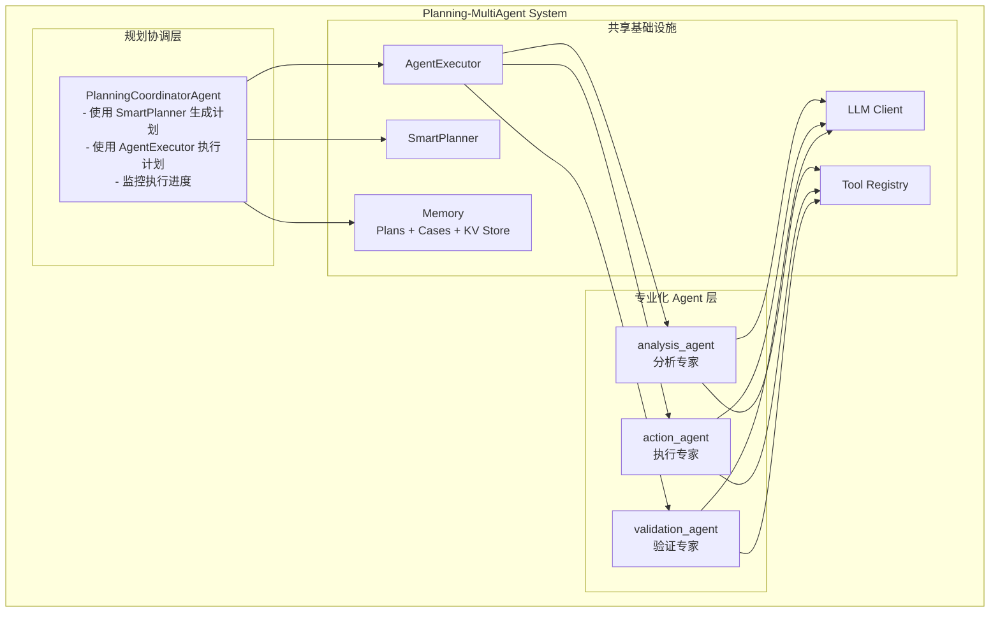
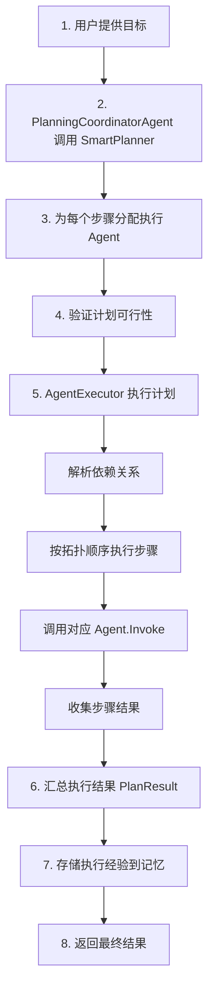

# 11 - Planning + MultiAgent 集成示例

本示例展示如何将 Planning 规划模块与 MultiAgent 多智能体系统进行集成，实现基于规划的智能任务执行。

## 功能特性

1. **Planning + MultiAgent 集成架构** - 规划模块与多智能体系统的无缝协作
2. **规划协调 Agent** - 使用 SmartPlanner 生成和管理计划
3. **专业化 Agent 执行** - 不同类型的步骤由专业 Agent 执行
4. **planning.AgentExecutor 集成** - 直接使用 planning 模块的执行器
5. **完整执行流程** - 规划-验证-执行-存储的完整生命周期
6. **经验复用** - 执行结果存储到记忆供后续参考

## 架构设计



## 核心组件

### 1. PlanningCoordinatorAgent

规划协调 Agent，负责：
- 使用 SmartPlanner 创建结构化计划
- 根据步骤类型分配执行 Agent
- 使用 planning.AgentExecutor 执行计划
- 收集和汇总执行结果

```go
type PlanningCoordinatorAgent struct {
    *multiagent.BaseCollaborativeAgent
    llmClient     llm.Client
    planner       *planning.SmartPlanner
    executor      *planning.AgentExecutor  // 使用 planning 模块的执行器
    memoryManager *memory.InMemoryManager
}

// CreatePlan 创建计划并分配 Agent
func (a *PlanningCoordinatorAgent) CreatePlan(ctx context.Context, goal string, constraints planning.PlanConstraints) (*planning.Plan, error) {
    plan, err := a.planner.CreatePlan(ctx, goal, constraints)
    if err != nil {
        return nil, err
    }
    // 为每个步骤分配 Agent
    for _, step := range plan.Steps {
        step.Agent = selectAgentForStep(step)
    }
    return plan, nil
}

// ExecutePlan 使用 AgentExecutor 执行计划
func (a *PlanningCoordinatorAgent) ExecutePlan(ctx context.Context, plan *planning.Plan) (*planning.PlanResult, error) {
    return a.executor.Execute(ctx, plan)
}
```

### 2. SpecialistAgent

专业化 Agent，包括：
- **analysis_agent** - 执行 `analysis` 类型步骤，配备 `data_analyzer`、`requirement_analyzer` 工具
- **action_agent** - 执行 `action` 类型步骤，配备 `code_generator`、`api_builder` 工具
- **validation_agent** - 执行 `validation` 类型步骤，配备 `test_runner`、`quality_checker` 工具

每个 Agent 都配备专门的工具集和系统提示词。

```go
type SpecialistAgent struct {
    *multiagent.BaseCollaborativeAgent
    llmClient    llm.Client
    registry     *tools.Registry
    allowedTools []string
    systemPrompt string
}
```

### 3. 步骤到 Agent 的映射

```go
func selectAgentForStep(step *planning.Step) string {
    switch step.Type {
    case planning.StepTypeAnalysis:
        return "analysis_agent"
    case planning.StepTypeAction:
        return "action_agent"
    case planning.StepTypeValidation:
        return "validation_agent"
    case planning.StepTypeDecision:
        return "analysis_agent"
    case planning.StepTypeOptimization:
        return "action_agent"
    default:
        return "default_agent"
    }
}
```

### 4. Agent 注册

Agent 需要同时注册到两个系统：
- **MultiAgentSystem** - 用于消息通信和协作
- **AgentExecutor** - 用于计划执行

```go
// 注册到 MultiAgentSystem（用于消息通信）
system.RegisterAgent("analysis_agent", analysisAgent)
system.RegisterAgent("action_agent", actionAgent)
system.RegisterAgent("validation_agent", validationAgent)

// 注册到 AgentExecutor（用于计划执行）
executor.RegisterAgent("analysis_agent", analysisAgent)
executor.RegisterAgent("action_agent", actionAgent)
executor.RegisterAgent("validation_agent", validationAgent)
executor.RegisterAgent("default_agent", actionAgent)
```

## 执行流程



## 工具集

示例中注册了以下工具（均带有指标收集中间件）：

| 工具名称 | 描述 | 使用 Agent |
|---------|------|-----------|
| `requirement_analyzer` | 分析用户需求并提取关键要素 | analysis_agent |
| `data_analyzer` | 分析数据结构和模式 | analysis_agent |
| `code_generator` | 生成代码框架 | action_agent |
| `api_builder` | 构建 API 端点 | action_agent |
| `test_runner` | 运行测试用例 | validation_agent |
| `quality_checker` | 检查代码质量 | validation_agent |

## 运行示例

### 前置条件

可选配置 LLM API Key（未配置时使用模拟模式）：

```bash
# 任选其一
export DEEPSEEK_API_KEY=your-key
export KIMI_API_KEY=your-key
export OPENAI_API_KEY=your-key
```

### 运行

```bash
cd examples/multiagent/11-planning-multiagent
go run main.go
```

### 预期输出

```
╔════════════════════════════════════════════════════════════════╗
║          Planning + MultiAgent 集成示例                        ║
║   展示规划模块与多智能体系统的协同工作                          ║
╚════════════════════════════════════════════════════════════════╝

【综合场景】基于规划的智能任务执行系统
════════════════════════════════════════════════════════════════

场景描述:
  构建一个基于规划的智能任务执行系统
  - 规划协调 Agent：使用 SmartPlanner 生成和管理计划
  - 分析 Agent：执行分析类型步骤
  - 执行 Agent：执行行动类型步骤
  - 验证 Agent：执行验证类型步骤
  - 使用 planning.AgentExecutor 执行计划

【步骤 1】创建共享组件
────────────────────────────────────────
  ✓ LLM 客户端: deepseek
  ✓ 记忆管理器已创建 (对话历史 + 案例存储 + 计划存储)
  ✓ 工具注册表已创建
  ✓ 已注册 6 个工具
  ✓ SmartPlanner 已创建
  ✓ AgentExecutor 已创建

【步骤 2】创建专业化 Agent
────────────────────────────────────────
  ✓ planning_coordinator: 规划协调者 (SmartPlanner + AgentExecutor)
  ✓ analysis_agent: 分析专家 (data_analyzer, requirement_analyzer)
  ✓ action_agent: 执行专家 (code_generator, api_builder)
  ✓ validation_agent: 验证专家 (test_runner, quality_checker)

【步骤 3】执行规划任务
────────────────────────────────────────

用户目标: 开发一个用户认证 API，包括登录、注册和密码重置功能

[3.1] 创建计划...
  ✓ 计划创建成功 (耗时: 16.06s)

  计划 ID: plan_1764951023
  目标: 开发一个用户认证 API，包括登录、注册和密码重置功能
  策略: decomposition
  状态: ready
  步骤数: 5

  步骤列表:
    1. [action] Prepare Analyze Current State → action_agent
    2. [analysis] Execute Analyze Current State → analysis_agent
    3. [validation] Verify Analyze Current State → validation_agent
    4. [action] Plan Execution → action_agent
    5. [validation] Validate Results → validation_agent

[3.2] 验证计划...
  ✓ 计划验证通过

[3.3] 执行计划...
  步骤执行进度:
    → [validation_agent] 执行: Validate Results
    → [analysis_agent] 执行: Execute Analyze Current State
    → [action_agent] 执行: Prepare Analyze Current State
    → [validation_agent] 执行: Verify Analyze Current State
    → [action_agent] 执行: Plan Execution

  ✓ 计划执行完成
  计划 ID: plan_1764951023
  执行成功: true
  完成步骤: 5
  失败步骤: 0
  跳过步骤: 0
  总耗时: 201.10ms

[3.4] 存储执行经验...
  ✓ 执行经验已存储 (案例 ID: cf1cf08c-1ca8-4de7-b625-a7db2d997f11)
  ✓ 关键数据已存储到键值存储

【步骤 4】复用执行经验
────────────────────────────────────────

相似案例搜索 (查询: 'API 开发'):
  1. 用户认证 API 开发计划 (相似度: 0.80)
     问题: 开发一个用户认证 API，包括登录、注册和密码重置功能
     方案: 执行了 5 个步骤，成功率: 100.0%

【步骤 5】执行统计
────────────────────────────────────────
  工具调用次数: 5
  成功次数: 5
  失败次数: 0
  平均耗时: 156.79ms

╔════════════════════════════════════════════════════════════════╗
║                        示例完成                                ║
╚════════════════════════════════════════════════════════════════╝
```

## 关键实现要点

### 1. 使用 planning.AgentExecutor

本示例直接使用 planning 模块提供的 `AgentExecutor`，而不是自定义执行逻辑：

```go
// 创建执行器
executor := planning.NewAgentExecutor(logger)

// 注册 Agent
executor.RegisterAgent("analysis_agent", analysisAgent)
executor.RegisterAgent("action_agent", actionAgent)
executor.RegisterAgent("validation_agent", validationAgent)

// 执行计划
result, err := executor.Execute(ctx, plan)
```

AgentExecutor 提供的功能：
- 基于依赖关系的拓扑排序执行
- 并行执行无依赖的步骤
- 自动重试失败步骤
- 详细的执行结果和指标

### 2. 双重注册机制

Agent 需要注册到两个系统以支持不同场景：

```go
// MultiAgentSystem: 支持 Agent 间消息通信和协作任务
system.RegisterAgent("analysis_agent", analysisAgent)

// AgentExecutor: 支持计划步骤的执行
executor.RegisterAgent("analysis_agent", analysisAgent)
```

### 3. 统一的命名约定

所有 Agent ID 使用下划线命名：
- `analysis_agent`
- `action_agent`
- `validation_agent`
- `planning_coordinator`

### 4. 经验学习与复用

执行结果存储到记忆系统，供后续规划参考：

```go
// 存储执行案例
planCase := &interfaces.Case{
    Title:       "用户认证 API 开发计划",
    Problem:     userGoal,
    Solution:    fmt.Sprintf("执行了 %d 个步骤，成功率: %.1f%%", ...),
    Category:    "api-development",
    Tags:        []string{"authentication", "api", "user-management"},
    Metadata: map[string]any{
        "plan_id":         plan.ID,
        "completed_steps": result.CompletedSteps,
        "success_rate":    successRate,
    },
}
memoryManager.AddCase(ctx, planCase)

// 后续规划时检索相似案例
cases, _ := memoryManager.SearchSimilarCases(ctx, newGoal, 3)
```

### 5. 工具中间件

所有工具都包装了指标收集中间件：

```go
// 创建指标收集器
metricsCollector := &MetricsCollector{}
metricsMW := createMetricsMiddleware(metricsCollector)

// 包装工具
toolsList := []interfaces.Tool{
    tools.WithMiddleware(requirementAnalyzer, metricsMW),
    tools.WithMiddleware(dataAnalyzer, metricsMW),
    // ...
}

// 获取统计
stats := metricsCollector.GetStats()
fmt.Printf("工具调用次数: %d\n", stats.TotalCalls)
```

## 与其他示例的区别

| 特性 | 10-integrated | 11-planning-multiagent |
|-----|--------------|------------------------|
| 规划器 | 无 | SmartPlanner |
| 执行器 | 自定义 | planning.AgentExecutor |
| 计划结构 | 无 | planning.Plan + Steps |
| 步骤分配 | 手动 | 自动按类型分配 |
| 依赖管理 | 无 | 拓扑排序执行 |
| 经验存储 | 基础 | 完整案例存储 |

## 扩展建议

1. **自定义策略** - 实现 `planning.PlanStrategy` 接口添加新的规划策略
2. **动态规划** - 根据执行结果动态调整后续计划
3. **失败恢复** - 利用 AgentExecutor 的重试机制处理临时失败
4. **并行优化** - 调整 `WithMaxConcurrency` 优化并行执行
5. **计划持久化** - 将计划存储到数据库供后续恢复

## 相关示例

- [01-basic-system](../01-basic-system/) - 多智能体基础
- [05-llm-collaborative-agents](../05-llm-collaborative-agents/) - LLM 协作
- [10-multiagent-integrated](../10-multiagent-integrated/) - 综合集成示例
- [examples/planning](../../planning/) - Planning 模块示例
