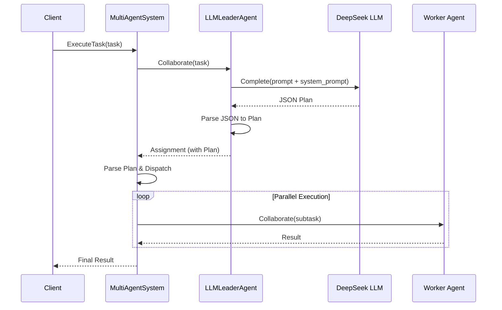

# 12-structured-planning 结构化规划示例

本示例演示如何在多智能体系统中使用结构化数据（`Plan` 结构体）和 System Prompt 来指导 LLM 生成精确的任务分配计划。

## 目录

- [简介](#简介)
- [核心特性](#核心特性)
- [执行流程](#执行流程)
- [使用方法](#使用方法)
- [代码结构](#代码结构)

## 简介

在复杂的多智能体协作中，Leader Agent 需要将大任务分解为具体的子任务并分配给 Worker Agent。传统的非结构化文本输出难以被程序精确解析。本示例展示了如何结合 DeepSeek LLM 的 JSON 输出能力和 GoAgent 的结构化规划对象，实现稳定可靠的任务分配。

## 核心特性

### 1. 结构化 Plan 对象

系统定义了标准的 `Plan` 和 `TaskAssignment` 结构体，用于规范化 Leader Agent 的输出。

```go
type Plan struct {
    Strategy    string           `json:"strategy"`
    Description string           `json:"description,omitempty"`
    Tasks       []TaskAssignment `json:"tasks"`
}
```

### 2. System Prompt 增强

通过 `llm.WithSystemPrompt` 明确设定 Agent 的角色和输出格式要求，确保 LLM 始终返回符合预期的 JSON 数据。

### 3. DeepSeek JSON 模式

利用 DeepSeek Provider 的 `WithJSONResponse` 选项，强制 LLM 输出有效的 JSON 格式。

## 执行流程



## 使用方法

### 前置要求

- 设置 `DEEPSEEK_API_KEY` 环境变量。

### 运行示例

```bash
export DEEPSEEK_API_KEY=your_api_key
cd examples/multiagent/12-structured-planning
go run main.go
```

### 预期输出

```text
[INFO] Agent registered [agent_id worker-1 role worker]
[INFO] Agent registered [agent_id worker-2 role worker]
[INFO] Agent registered [agent_id leader role leader]
Starting Hierarchical Task with DeepSeek Leader...
[INFO] Starting collaborative task [task_id task-1 type hierarchical]
[leader] Generating plan using DeepSeek...
[leader] LLM Response: {
  "tasks": [
    {
      "worker_id": "worker-1",
      "task": "Analyze Q1 2024 sales data..."
    },
    ...
  ],
  "strategy": "parallel"
}
[INFO] Task completed ...
```

## 代码结构

```text
12-structured-planning/
├── main.go          # 示例入口
└── README.md        # 本文档
```

### 关键代码

```go
// 初始化 DeepSeek 客户端，配置 System Prompt 和 JSON 模式
client, err := providers.NewDeepSeekWithOptions(
    llm.WithAPIKey(apiKey),
    llm.WithModel("deepseek-chat"),
    llm.WithJSONResponse(),
    llm.WithSystemPrompt("你是一个智能的领导者Agent。请始终以JSON格式输出任务分配计划。"),
)

// Leader Agent 使用 LLM 生成计划
func (a *LLMLeaderAgent) Collaborate(...) {
    // ... 构建提示词 ...
    resp, err := a.llmClient.Complete(ctx, req)
    // ... 解析 JSON ...
}
```
