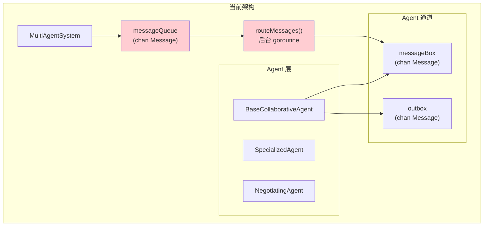
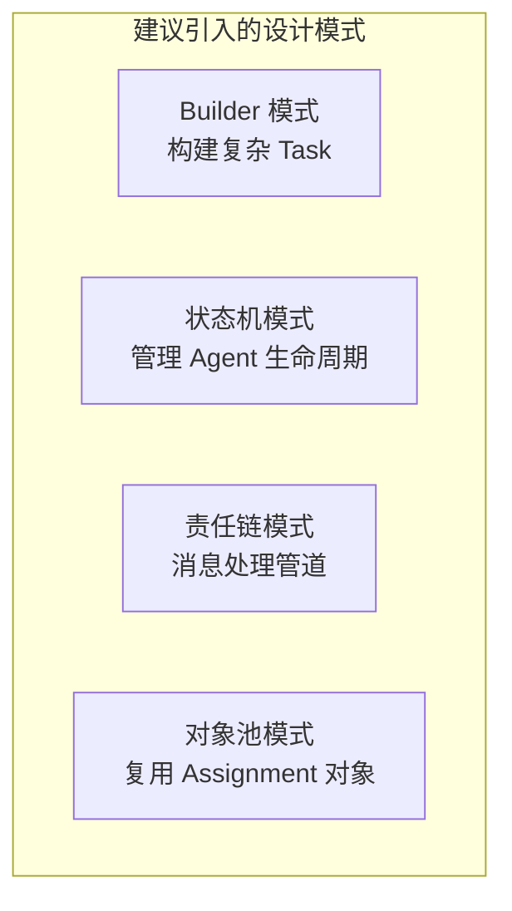
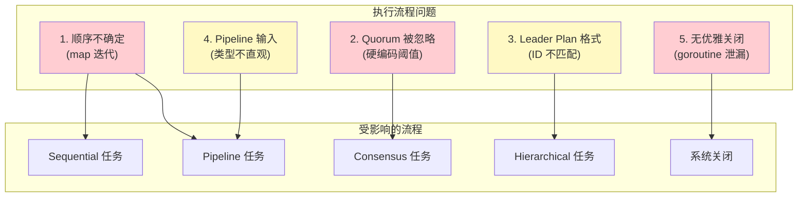

# MultiAgent 系统设计模式与代码执行流程分析报告

**分析日期**: 2024-12-05
**分析范围**: `multiagent/` 核心包 + `examples/multiagent/` 示例代码
**分析版本**: 基于当前 optimization 分支

## 执行摘要

本报告对 GoAgent MultiAgent 系统进行了全面的设计模式与代码执行流程分析。共识别出 **3 个严重问题**、**5 个中等问题** 和 **8 个轻微问题**，并提供了相应的优化建议。

---

## 一、架构概览



---

## 二、严重问题 (Critical)

### 2.1 消息路由 goroutine 无法优雅关闭

**位置**: `system.go:170`, `system.go:687-711`

**问题描述**:
`routeMessages()` 在 `NewMultiAgentSystem()` 中作为后台 goroutine 启动，但没有关闭机制。

```go
// system.go:170
go system.routeMessages()

// system.go:687-711
func (s *MultiAgentSystem) routeMessages() {
    for message := range s.messageQueue {  // 永远不会退出
        // ...
    }
}
```

**影响**:
- 内存泄漏：goroutine 永远不会退出
- 无法安全关闭系统
- 单元测试中可能导致 goroutine 泄漏警告

**建议修复**:
```go
type MultiAgentSystem struct {
    // ... existing fields
    done     chan struct{}  // 新增：关闭信号
    wg       sync.WaitGroup // 新增：等待 goroutine 完成
}

func NewMultiAgentSystem(log loggercore.Logger, opts ...SystemOption) *MultiAgentSystem {
    system := &MultiAgentSystem{
        // ...
        done: make(chan struct{}),
    }
    system.wg.Add(1)
    go system.routeMessages()
    return system
}

func (s *MultiAgentSystem) routeMessages() {
    defer s.wg.Done()
    for {
        select {
        case message, ok := <-s.messageQueue:
            if !ok {
                return
            }
            // ... handle message
        case <-s.done:
            return
        }
    }
}

func (s *MultiAgentSystem) Close() error {
    close(s.done)
    close(s.messageQueue)
    s.wg.Wait()
    return nil
}
```

---

### 2.2 顺序/管道任务执行顺序不确定

**位置**: `system.go:724-730`

**问题描述**:
`getAvailableAgentsOrdered()` 使用 Go map 迭代，但 Go map 的迭代顺序是**不确定的**。

```go
func (s *MultiAgentSystem) getAvailableAgentsOrdered() []string {
    ordered := make([]string, 0, len(s.agents))
    for id := range s.agents {  // ❌ map 迭代顺序不确定
        ordered = append(ordered, id)
    }
    return ordered
}
```

**影响**:
- `Sequential` 和 `Pipeline` 任务每次执行顺序可能不同
- 示例 02-collaboration-types 和 03-team-management 的执行结果不可预测
- 难以调试和复现问题

**建议修复**:
```go
// 方案1：按注册顺序保持
type MultiAgentSystem struct {
    agents      map[string]CollaborativeAgent
    agentOrder  []string  // 新增：记录注册顺序
    // ...
}

func (s *MultiAgentSystem) RegisterAgent(id string, agent CollaborativeAgent) error {
    // ...
    s.agents[id] = agent
    s.agentOrder = append(s.agentOrder, id)  // 记录顺序
    // ...
}

func (s *MultiAgentSystem) getAvailableAgentsOrdered() []string {
    return s.agentOrder  // 返回注册顺序
}

// 方案2：在任务中显式指定顺序
type CollaborativeTask struct {
    // ...
    AgentOrder []string `json:"agent_order,omitempty"`  // 显式指定执行顺序
}
```

---

### 2.3 共识任务忽略自定义 quorum 阈值

**位置**: `system.go:543-611`

**问题描述**:
示例中设置了 `quorum: 0.6`（60%），但 `executeConsensusTask` 使用硬编码的简单多数：

```go
// 示例代码设置
task := &multiagent.CollaborativeTask{
    Input: map[string]interface{}{
        "quorum": 0.6,  // 期望 60% 通过
    },
}

// system.go:590-592 - 实际实现
consensusThreshold := len(votes)/2 + 1  // ❌ 硬编码简单多数
consensusReached := yesVotes >= consensusThreshold
```

**影响**:
- 用户设置的 quorum 被完全忽略
- 文档与实际行为不一致
- 示例输出与预期不符

**建议修复**:
```go
func (s *MultiAgentSystem) executeConsensusTask(ctx context.Context, task *CollaborativeTask) error {
    // 解析 quorum 参数
    quorum := 0.5  // 默认简单多数
    if inputMap, ok := task.Input.(map[string]interface{}); ok {
        if q, exists := inputMap["quorum"].(float64); exists {
            quorum = q
        }
    }

    // ...投票收集...

    // 使用用户定义的 quorum
    consensusThreshold := int(float64(len(votes)) * quorum)
    if consensusThreshold < 1 {
        consensusThreshold = 1
    }
    consensusReached := yesVotes >= consensusThreshold
    // ...
}
```

---

## 三、中等问题 (Medium)

### 3.1 消息类型定义重复

**位置**: `system.go:39-49` vs `communication.go:34-44`

**问题描述**:
存在两个功能相似但定义不同的消息结构：

| 字段 | `Message` | `AgentMessage` |
|------|-----------|----------------|
| Content | `interface{}` | - |
| Payload | - | `interface{}` |
| Metadata | `map[string]interface{}` | `map[string]string` |
| Topic | - | `string` |
| TraceContext | - | `propagation.MapCarrier` |

**影响**:
- API 不一致，开发者困惑
- `Message` 用于系统内部，`AgentMessage` 用于 Communicator，但边界不清

**建议**:
统一为一个消息结构，或明确文档化两者的使用场景差异。

---

### 3.2 分层任务 Leader 计划格式假设过于严格

**位置**: `system.go:486-492`

**问题描述**:
```go
// Leader 必须返回这种格式的 plan
plan, ok := leaderResult.Result.(map[string]interface{})
if !ok {
    return agentErrors.New(agentErrors.CodeInvalidInput, "invalid plan from leader")
}

// 然后期望 plan 中有 worker ID 作为 key
for workerID, worker := range workers {
    if subtask, exists := plan[workerID]; exists {  // ❌ 期望 key 是 worker ID
        // ...
    }
}
```

**影响**:
- BaseCollaborativeAgent 的 `executeLeaderTask` 返回的 plan 使用 `worker_1`, `worker_2` 等占位符
- 实际注册的 worker ID 可能是 `frontend-dev-1`, `backend-dev-1` 等
- 导致 worker 任务分配失败

**建议修复**:
```go
// 方案1：Leader 返回任务列表而非 ID 映射
type LeaderPlan struct {
    Strategy string      `json:"strategy"`
    Subtasks []Subtask   `json:"subtasks"`  // 任务列表，自动分配给 workers
}

// 方案2：系统自动分配任务给 workers
func (s *MultiAgentSystem) executeHierarchicalTask(ctx context.Context, task *CollaborativeTask) error {
    // ... 获取 leader plan ...

    subtasks := extractSubtasks(plan)  // 提取任务列表
    workerList := sortedKeys(workers)  // 获取 worker 列表

    for i, subtask := range subtasks {
        if i >= len(workerList) {
            break
        }
        workerID := workerList[i]
        // 分配任务...
    }
}
```

---

### 3.3 Pipeline 输入格式不直观

**位置**: `system.go:616-621`

**问题描述**:
```go
pipeline, ok := task.Input.([]interface{})
if !ok {
    return agentErrors.New(agentErrors.CodeInvalidInput, "pipeline task requires array of stages")
}
```

**影响**:
- 开发者必须使用 `[]interface{}` 而非更直观的结构
- 示例中多次因此出现 `[ERROR] Task failed`

**建议修复**:
```go
// 定义专用的 Pipeline 阶段结构
type PipelineStage struct {
    Name   string                 `json:"name"`
    Config map[string]interface{} `json:"config,omitempty"`
}

// 支持多种输入格式
func (s *MultiAgentSystem) executePipelineTask(ctx context.Context, task *CollaborativeTask) error {
    var stages []PipelineStage

    switch input := task.Input.(type) {
    case []PipelineStage:
        stages = input
    case []interface{}:
        // 兼容旧格式
        for _, s := range input {
            stages = append(stages, PipelineStage{Config: toMap(s)})
        }
    case []map[string]interface{}:
        // 支持 map 切片
        for _, s := range input {
            stages = append(stages, PipelineStage{Config: s})
        }
    default:
        return errors.New("invalid pipeline input format")
    }
    // ...
}
```

---

### 3.4 Observer 角色未真正实现观察功能

**位置**: `collaborative_agent.go:226-237`

**问题描述**:
```go
func (a *BaseCollaborativeAgent) executeObserverTask(ctx context.Context, task *CollaborativeTask) (interface{}, error) {
    // ❌ 返回硬编码数据，未实际观察
    observation := map[string]interface{}{
        "observed_agents": len(task.Assignments),  // 只是数量
        "status":          "monitoring",
        "metrics": map[string]interface{}{
            "avg_response_time": "150ms",  // 硬编码
            "success_rate":      0.98,      // 硬编码
        },
    }
    return observation, nil
}
```

**影响**:
- Observer 角色名不副实
- 无法真正监控系统状态

**建议**:
实现真正的观察功能，或重命名为更准确的角色名。

---

### 3.5 示例中 simpleLogger 重复定义

**位置**: 所有 5 个示例的 `main.go`

**问题描述**:
每个示例都复制粘贴了相同的 38 行 `simpleLogger` 实现。

**影响**:
- 代码重复，维护困难
- 如果 `loggercore.Logger` 接口变化，需要修改 5 处

**建议修复**:
```go
// examples/multiagent/common/logger.go
package common

import (
    "context"
    "fmt"
    loggercore "github.com/kart-io/logger/core"
)

// SimpleLogger 提供简单的日志实现
type SimpleLogger struct{}

func (l *SimpleLogger) Debug(args ...interface{}) { fmt.Print("[DEBUG] "); fmt.Println(args...) }
// ... 其他方法 ...

// 各示例中使用
import "github.com/kart-io/goagent/examples/multiagent/common"
logger := &common.SimpleLogger{}
```

---

## 四、轻微问题 (Minor)

### 4.1 Agent 忙碌状态未实现

**位置**: `system.go:715-721`

```go
func (s *MultiAgentSystem) getAvailableAgents() map[string]CollaborativeAgent {
    available := make(map[string]CollaborativeAgent)
    for id, agent := range s.agents {
        // Check if agent is not busy (simplified)
        available[id] = agent  // ❌ 注释说要检查忙碌状态，但实际未检查
    }
    return available
}
```

---

### 4.2 Team.Leader 未验证是否在 Members 中

**位置**: `system.go:266-277`

```go
// 验证 leader 存在
if team.Leader != "" {
    if _, exists := s.agents[team.Leader]; !exists {
        return error
    }
    // ❌ 未验证 leader 是否在 Members 列表中
    s.agents[team.Leader].SetRole(RoleLeader)
}
```

---

### 4.3 Assignment 结果类型不统一

**问题**:
- Parallel/Sequential 任务将 Assignment 存入 `task.Assignments`
- Consensus 任务只设置 `task.Output`
- Hierarchical 任务将最终结果存入 `task.Results["final"]`

**建议**:
统一所有协作类型的结果存储方式。

---

### 4.4 Vote 方法随机性可预测

**位置**: `collaborative_agent.go:105-116`

```go
func (a *BaseCollaborativeAgent) Vote(ctx context.Context, proposal interface{}) (bool, error) {
    n, err := cryptorand.Int(cryptorand.Reader, big.NewInt(1000))
    // ...
    return float64(n.Int64())/1000.0 > 0.3, nil  // 70% 概率投同意
}
```

**问题**:
- 投票逻辑应该基于 proposal 内容，而非随机
- 作为基类实现可能误导开发者

---

### 4.5 错误码定义分散

**问题**:
错误码如 `CodeMultiAgentRegistration`, `CodeMultiAgentMessage` 等定义在 `errors` 包，但使用分散在各处，缺乏集中文档。

---

### 4.6 示例未处理 context 取消

**位置**: 所有示例的 `main.go`

```go
ctx, cancel := context.WithTimeout(context.Background(), 60*time.Second)
defer cancel()
// ❌ 未检查 ctx.Done()，长时间任务可能超时后继续执行
```

---

### 4.7 消息优先级未使用

**位置**: `system.go:45`

```go
type Message struct {
    // ...
    Priority  int  // ❌ 定义了但从未使用
    // ...
}
```

---

### 4.8 测试覆盖率不足

**问题**:
- `collaborative_agent_test.go` 测试不够全面
- 缺少对 Pipeline、Hierarchical 等复杂场景的集成测试

---

## 五、设计模式分析

### 5.1 当前使用的设计模式

| 模式 | 位置 | 评价 |
|------|------|------|
| **策略模式** | `executeRoleBasedTask()` | ✅ 良好，根据角色选择执行策略 |
| **工厂模式** | `NewBaseCollaborativeAgent()` | ✅ 良好 |
| **观察者模式** | `routeMessages()` 消息路由 | ⚠️ 部分实现，缺少取消订阅 |
| **组合模式** | `SpecializedAgent` 嵌入 `BaseCollaborativeAgent` | ✅ 良好 |
| **函数式选项** | `SystemOption` | ✅ 良好，灵活配置 |

### 5.2 建议引入的设计模式



---

## 六、执行流程问题汇总



---

## 七、优先级修复建议

### 高优先级 (P0) - 立即修复

1. **添加系统关闭机制** - 防止 goroutine 泄漏
2. **修复执行顺序问题** - 保证 Sequential/Pipeline 可预测
3. **实现 quorum 参数** - 确保文档与行为一致

### 中优先级 (P1) - 近期修复

4. **统一消息类型** - 简化 API
5. **优化 Pipeline 输入格式** - 提升开发体验
6. **修复 Hierarchical 任务分配** - 确保任务正确分发

### 低优先级 (P2) - 后续迭代

7. **提取公共 Logger** - 减少代码重复
8. **实现 Observer 实际功能** - 名副其实
9. **添加 Agent 忙碌状态** - 更精确的调度

---

## 八、总结

### 问题统计

| 严重程度 | 数量 | 主要影响 |
|---------|------|---------|
| 严重 (Critical) | 3 | 系统稳定性、数据一致性 |
| 中等 (Medium) | 5 | 开发体验、代码质量 |
| 轻微 (Minor) | 8 | 代码规范、可维护性 |

### 整体评价

MultiAgent 系统的核心设计理念是正确的，五种协作模式的抽象合理。主要问题集中在：

1. **实现细节不完善** - 如 quorum 未实现、顺序不确定
2. **资源管理缺失** - 无优雅关闭机制
3. **API 不够直观** - Pipeline 输入格式复杂

建议按优先级逐步修复，优先解决影响系统稳定性的严重问题。
