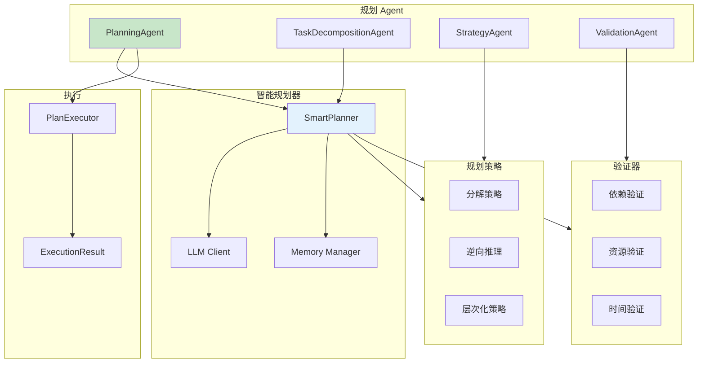
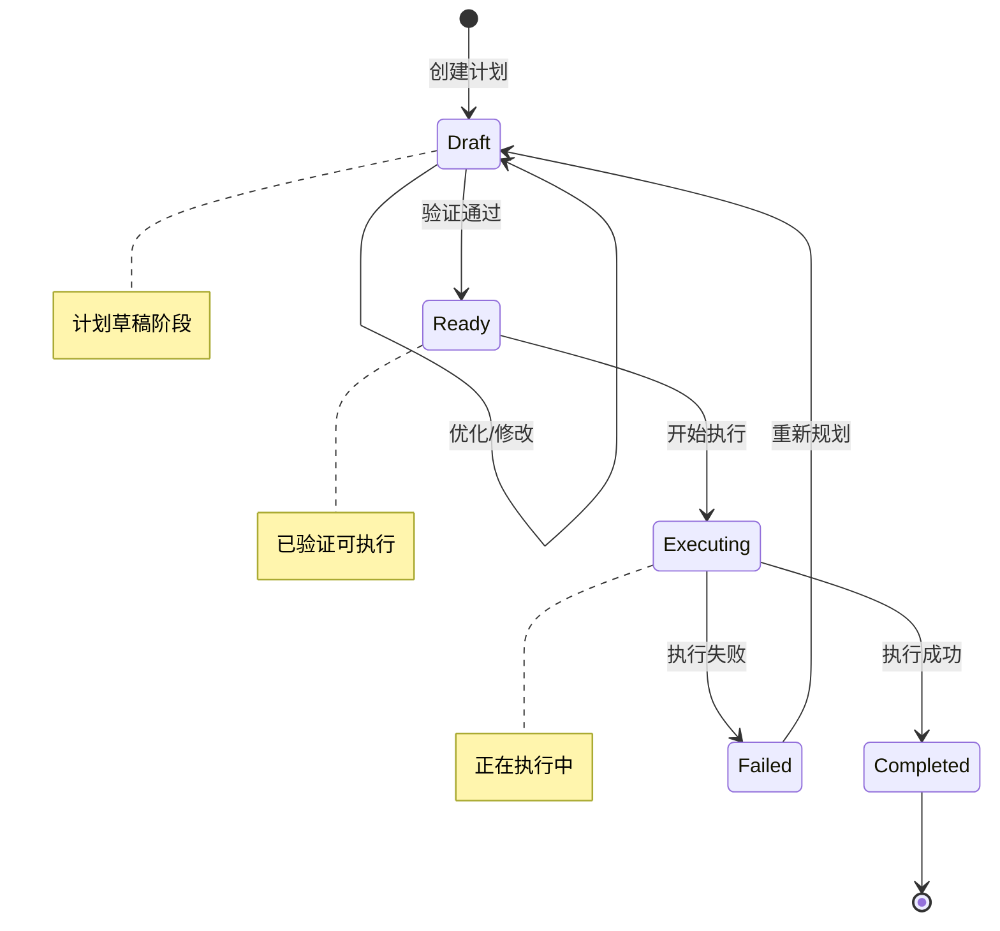
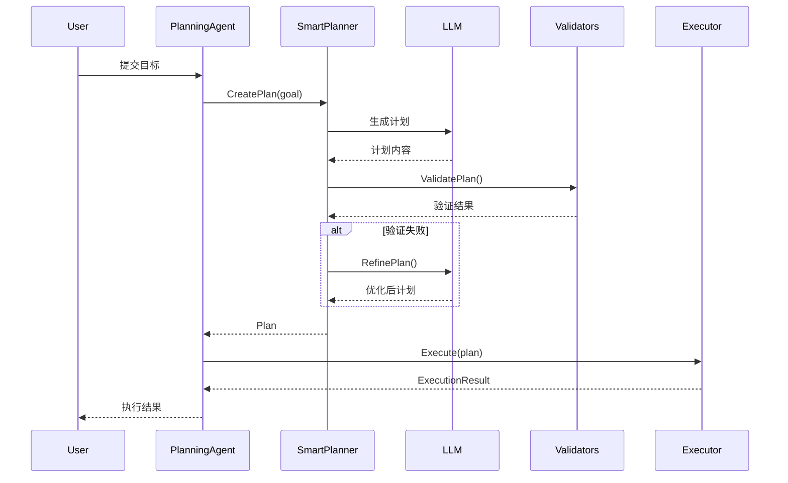

# Planning 智能规划示例

本示例演示 `planning` 包的使用，包括智能规划器、任务分解、计划优化和执行。

## 目录

- [架构设计](#架构设计)
- [核心组件](#核心组件)
- [使用方法](#使用方法)
- [API 参考](#api-参考)

## 架构设计

### Planning 系统架构



### 计划生命周期



### 执行流程



## 核心组件

### 1. SmartPlanner - 智能规划器

```go
// 创建智能规划器
planner := planning.NewSmartPlanner(
    llmClient,
    memoryManager,
    planning.WithMaxDepth(3),            // 最大规划深度
    planning.WithTimeout(5*time.Minute), // 规划超时
    planning.WithOptimizer(optimizer),   // 计划优化器
)

// 创建计划
plan, err := planner.CreatePlan(ctx, goal, planning.PlanConstraints{
    MaxSteps:    10,
    MaxDuration: 30 * time.Minute,
})

// 验证计划
valid, issues, err := planner.ValidatePlan(ctx, plan)

// 优化计划
optimizedPlan, err := planner.OptimizePlan(ctx, plan)

// 细化计划
refinedPlan, err := planner.RefinePlan(ctx, plan, feedback)

// 分解步骤
subSteps, err := planner.DecomposePlan(ctx, plan, step)
```

### 2. Plan - 计划结构

```go
type Plan struct {
    ID           string                 // 计划 ID
    Goal         string                 // 目标描述
    Strategy     string                 // 使用的策略
    Steps        []*Step                // 步骤列表
    Dependencies map[string][]string    // 步骤依赖关系
    Context      map[string]interface{} // 上下文数据
    Status       PlanStatus             // 当前状态
    Metrics      *PlanMetrics           // 执行指标
}

type Step struct {
    ID                string           // 步骤 ID
    Name              string           // 步骤名称
    Description       string           // 步骤描述
    Type              StepType         // 步骤类型
    Agent             string           // 执行 Agent
    Parameters        map[string]any   // 执行参数
    Expected          *ExpectedOutcome // 预期结果
    Priority          int              // 优先级
    EstimatedDuration time.Duration    // 预计时长
    Status            StepStatus       // 当前状态
    Result            *StepResult      // 执行结果
}
```

### 3. Planning Agents

| Agent | 说明 | 用途 |
|-------|------|------|
| `PlanningAgent` | 规划执行 Agent | 创建计划并执行 |
| `TaskDecompositionAgent` | 任务分解 Agent | 将复杂任务分解为子任务 |
| `StrategyAgent` | 策略 Agent | 选择和应用规划策略 |
| `OptimizationAgent` | 优化 Agent | 优化计划效率 |
| `ValidationAgent` | 验证 Agent | 验证计划可行性 |

### 4. 规划策略

```go
// 内置策略
const (
    StrategyDecomposition    = "decomposition"     // 任务分解
    StrategyBackwardChaining = "backward_chaining" // 逆向推理
    StrategyHierarchical     = "hierarchical"      // 层次化规划
)

// 自定义策略
type PlanStrategy interface {
    Apply(ctx context.Context, plan *Plan, constraints PlanConstraints) (*Plan, error)
}
```

### 5. 计划验证器

```go
// 内置验证器
- DependencyValidator: 检查步骤依赖关系
- ResourceValidator:   检查资源约束
- TimeValidator:       检查时间约束

// 自定义验证器
type PlanValidator interface {
    Validate(ctx context.Context, plan *Plan) (bool, []string, error)
}
```

## 使用方法

### 环境配置

```bash
# 使用 DeepSeek (推荐)
export DEEPSEEK_API_KEY="your-api-key"

# 或使用 Kimi
export KIMI_API_KEY="your-api-key"

# 或使用 OpenAI
export OPENAI_API_KEY="your-api-key"
```

### 运行示例

```bash
cd examples/planning
go run main.go
```

### 预期输出

```text
╔════════════════════════════════════════════════════════════════╗
║          Planning 智能规划示例                                  ║
║   展示任务分解、计划生成、验证和执行的完整流程                    ║
╚════════════════════════════════════════════════════════════════╝

✓ LLM 提供商: deepseek

【场景 1】基础规划流程
════════════════════════════════════════════════════════════════

场景描述: 使用 SmartPlanner 创建和管理计划

1. 创建智能规划器
────────────────────────────────────────
  ✓ SmartPlanner 创建成功
  - 最大深度: 3
  - 超时时间: 2 分钟
  - 内置策略: decomposition, backward_chaining, hierarchical
  - 内置验证器: dependency, resource, time

2. 创建计划
────────────────────────────────────────
  目标: 开发一个用户注册功能，包括表单验证、密码加密和邮件通知

  ✓ 计划创建成功 (耗时: 约 20-30s)

  计划 ID: plan_xxxxxxxxxx
  目标: 开发一个用户注册功能，包括表单验...
  策略: (由 DecompositionStrategy 应用)
  状态: ready
  步骤数: 5

  步骤列表:
    1. [action] Prepare Analyze Current State
       Prepare data and context for Analyze Current State
    2. [analysis] Execute Analyze Current State
       Analyze the current situation and gather context
    3. [validation] Verify Analyze Current State
       Verify results of Analyze Current State
    4. [action] Plan Execution
       Execute the main action to achieve the goal
    5. [validation] Validate Results
       Validate that the goal has been achieved

3. 验证计划
────────────────────────────────────────
  ✓ 计划验证通过

【场景 2】任务分解
════════════════════════════════════════════════════════════════
...
```

## API 参考

### PlanConstraints

| 字段 | 类型 | 说明 |
|------|------|------|
| `MaxSteps` | `int` | 最大步骤数 |
| `MaxDuration` | `time.Duration` | 最大执行时间 |
| `RequiredSteps` | `[]string` | 必须包含的步骤 |
| `ForbiddenSteps` | `[]string` | 禁止的步骤 |
| `Resources` | `map[string]any` | 可用资源 |
| `Priority` | `int` | 优先级 |

### StepType

| 类型 | 说明 |
|------|------|
| `StepTypeAnalysis` | 分析步骤 |
| `StepTypeDecision` | 决策步骤 |
| `StepTypeAction` | 执行步骤 |
| `StepTypeValidation` | 验证步骤 |
| `StepTypeOptimization` | 优化步骤 |

### PlanStatus

| 状态 | 说明 |
|------|------|
| `PlanStatusDraft` | 草稿 |
| `PlanStatusReady` | 就绪 |
| `PlanStatusExecuting` | 执行中 |
| `PlanStatusCompleted` | 已完成 |
| `PlanStatusFailed` | 失败 |
| `PlanStatusCancelled` | 已取消 |

## 扩展阅读

- [Planning + Execution 优化示例](../optimization/planning_execution/)
- [推理型 Agent 示例](../basic/14-reasoning-agents/)
- [多 Agent 协作示例](../multiagent/)
- [planning 包文档](../../planning/) - Planning API 参考
