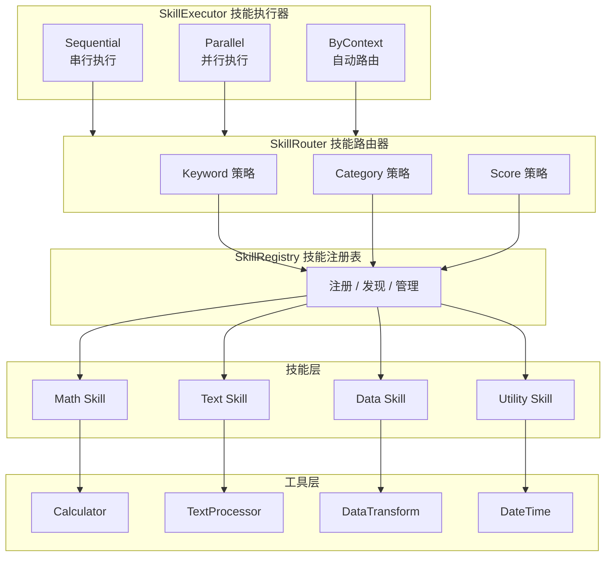

# 多技能协作示例

本示例演示 goagent 框架中多技能（Skill）协作系统的完整实现，包括技能注册与发现、自动路由、串行/并行执行以及结果聚合与错误处理。

## 概述

Skill（技能）是一组相关工具和能力的封装，它：

- 包含一组相关的工具（Tools）
- 有明确的领域/类别标识
- 能够基于上下文自动路由
- 支持与其他 Skill 协作执行

## 架构设计



## 核心组件

### 1. Skill 技能接口

```go
type Skill interface {
    Name() string                                    // 技能名称
    Description() string                             // 技能描述
    Category() SkillCategory                         // 技能类别
    Keywords() []string                              // 关键词（用于路由）
    GetTools() []interfaces.Tool                     // 获取工具列表
    Execute(ctx, input) (*SkillOutput, error)        // 执行技能
    CanHandle(ctx *RoutingContext) float64           // 判断处理能力
}
```

### 2. SkillRegistry 技能注册表

管理技能的注册、发现和生命周期：

```go
registry := NewSkillRegistry()

// 注册技能
registry.Register(createMathSkill())
registry.Register(createTextSkill())

// 按名称获取
skill, _ := registry.Get("math")

// 按类别列出
mathSkills := registry.ListByCategory(CategoryMath)

// 按关键词查找
foundSkills := registry.FindByKeyword("计算")
```

### 3. SkillRouter 技能路由器

基于上下文自动选择最合适的技能：

```go
router := NewSkillRouter(registry)

// 定义路由上下文
ctx := &RoutingContext{
    Query:    "计算两个数的和",
    Category: CategoryMath,
    Keywords: []string{"计算", "加法"},
}

// 路由到最合适的技能
result, _ := router.Route(ctx)
// result.SelectedSkills 按分数排序
```

支持的路由策略：

- **KeywordRoutingStrategy**: 基于关键词匹配
- **CategoryRoutingStrategy**: 基于类别匹配
- **ScoreRoutingStrategy**: 基于技能自评分

### 4. SkillExecutor 技能执行器

支持多种执行模式：

```go
executor := NewSkillExecutor(registry, router)
executor.SetMaxConcurrency(5)
executor.SetTimeout(30 * time.Second)

// 按名称执行
output, _ := executor.ExecuteByName(ctx, "math", input)

// 自动路由执行
output, _ := executor.ExecuteByContext(ctx, routingCtx, input)

// 串行执行
outputs, _ := executor.ExecuteSequential(ctx, skills, inputs)

// 并行执行
outputs, _ := executor.ExecuteParallel(ctx, skills, inputs)
```

### 5. SkillResultAggregator 结果聚合器

合并多技能执行结果：

```go
aggregator := NewSkillResultAggregator(AggregateMerge)
result := aggregator.Aggregate(outputs)
```

支持的聚合模式：

| 模式 | 说明 |
|------|------|
| `AggregateMerge` | 合并所有成功结果 |
| `AggregateBest` | 选择置信度最高的结果 |
| `AggregateConsensus` | 选择出现次数最多的结果 |
| `AggregateWeighted` | 按置信度加权聚合 |
| `AggregateChain` | 链式聚合，保留执行顺序 |

## 运行示例

```bash
cd examples/skills
go run main.go
```

## 演示场景

### 场景 1：多 Skill 注册与发现

展示技能的注册、查询和管理：

```go
// 创建注册表
registry := NewSkillRegistry()

// 注册多个技能
registry.Register(createMathSkill())
registry.Register(createTextSkill())
registry.Register(createDataSkill())

// 按类别查找
mathSkills := registry.ListByCategory(CategoryMath)

// 按关键词查找
found := registry.FindByKeyword("计算")
```

### 场景 2：基于上下文的 Skill 自动路由

根据用户输入自动选择最合适的技能：

```go
ctx := &RoutingContext{
    Query:    "我需要计算两个数的和",
    Category: CategoryMath,
    Keywords: []string{"计算"},
}

result, _ := router.Route(ctx)
// 返回按分数排序的技能列表
```

### 场景 3：多 Skill 串行执行

技能链式执行，前一步结果传递给下一步：

```go
skills := []Skill{mathSkill, dataSkill, textSkill}
inputs := []*SkillInput{...}

outputs, _ := executor.ExecuteSequential(ctx, skills, inputs)
// 每个输出的 Context 包含前一步结果
```

### 场景 4：多 Skill 并行执行

多技能同时执行，提高效率：

```go
executor.SetMaxConcurrency(4)

outputs, _ := executor.ExecuteParallel(ctx, skills, inputs)
// 所有技能并行执行
```

### 场景 5：结果聚合与错误处理

处理部分失败场景，聚合成功结果：

```go
aggregator := NewSkillResultAggregator(AggregateMerge)
result := aggregator.Aggregate(outputs)

fmt.Printf("成功: %d, 失败: %d\n", result.SuccessCount, result.FailureCount)
fmt.Printf("错误: %v\n", result.Errors)
fmt.Printf("聚合结果: %v\n", result.MergedResult)
```

## 内置技能

### Math 数学计算技能

```go
// 基础计算
input := &SkillInput{
    Action: "calculate",
    Args: map[string]interface{}{
        "operation": "add", // add, subtract, multiply, divide, power, mod
        "a": 10.0,
        "b": 20.0,
    },
}

// 统计分析
input := &SkillInput{
    Action: "statistics",
    Args: map[string]interface{}{
        "data": []interface{}{1.0, 2.0, 3.0, 4.0, 5.0},
    },
}
// 返回: count, sum, average, median, stddev, min, max
```

### Text 文本处理技能

```go
// 文本转换
input := &SkillInput{
    Action: "transform",
    Args: map[string]interface{}{
        "text": "hello world",
        "operation": "uppercase", // uppercase, lowercase, reverse, trim, title
    },
}

// 文本分析
input := &SkillInput{
    Action: "analyze",
    Args: map[string]interface{}{
        "text": "hello world",
    },
}
// 返回: length, word_count, line_count, char_count, has_numbers, has_special
```

### Data 数据处理技能

```go
// 数据过滤
input := &SkillInput{
    Action: "filter",
    Args: map[string]interface{}{
        "data": []interface{}{1.0, 2.0, 3.0, 4.0, 5.0},
        "condition": "gt", // gt, lt, eq, gte, lte
        "threshold": 3.0,
    },
}

// 数据转换
input := &SkillInput{
    Action: "transform",
    Args: map[string]interface{}{
        "data": []interface{}{1.0, 2.0, 3.0},
        "operation": "multiply", // multiply, divide, add, subtract, square, sqrt
        "factor": 2.0,
    },
}

// 数据聚合
input := &SkillInput{
    Action: "aggregate",
    Args: map[string]interface{}{
        "data": []interface{}{1.0, 2.0, 3.0},
    },
}
```

### Utility 实用工具技能

```go
// 日期时间
input := &SkillInput{
    Action: "datetime",
    Args: map[string]interface{}{
        "format": "full", // date, time, full, iso, unix
    },
}

// 生成 ID
input := &SkillInput{
    Action: "generate_id",
    Args: map[string]interface{}{
        "prefix": "order_",
    },
}

// 数字格式化
input := &SkillInput{
    Action: "format_number",
    Args: map[string]interface{}{
        "number": 3.14159,
        "precision": 2.0,
    },
}
```

## 扩展技能

创建自定义技能：

```go
skill := NewBaseSkill(
    "custom",                    // 名称
    "自定义技能描述",            // 描述
    CategoryCustom,              // 类别
    []string{"自定义", "关键词"}, // 关键词
)

// 添加工具
skill.AddTool(myTool)

// 注册动作
skill.RegisterAction("my_action", func(ctx context.Context, args map[string]interface{}) (interface{}, error) {
    // 实现逻辑
    return result, nil
})

// 注册到注册表
registry.Register(skill)
```

## 错误处理最佳实践

```go
// 1. 设置合理的超时
executor.SetTimeout(30 * time.Second)

// 2. 使用聚合器处理部分失败
aggregator := NewSkillResultAggregator(AggregateMerge)
result := aggregator.Aggregate(outputs)

if result.FailureCount > 0 {
    log.Printf("部分技能执行失败: %v", result.Errors)
}

// 3. 检查单个技能输出
for _, output := range outputs {
    if !output.Success {
        log.Printf("[%s] 失败: %s", output.SkillName, output.Error)
        // 可选：重试或降级处理
    }
}

// 4. 使用上下文取消
ctx, cancel := context.WithCancel(context.Background())
defer cancel()

// 在需要时取消所有执行
cancel()
```

## 性能优化建议

1. **合理设置并发数**: 根据系统资源和技能特性调整 `MaxConcurrency`
2. **使用并行执行**: 对于独立的技能调用，使用 `ExecuteParallel`
3. **缓存路由结果**: 对于相同上下文，可缓存路由结果避免重复计算
4. **精简关键词**: 使用准确的关键词提高路由效率

## 相关示例

- [tools/registry](../tools/registry) - 工具注册表示例
- [multiagent/08-multiagent-tool-registry](../multiagent/08-multiagent-tool-registry) - 多智能体工具注册表
- [multiagent/10-multiagent-integrated](../multiagent/10-multiagent-integrated) - 多智能体集成示例
