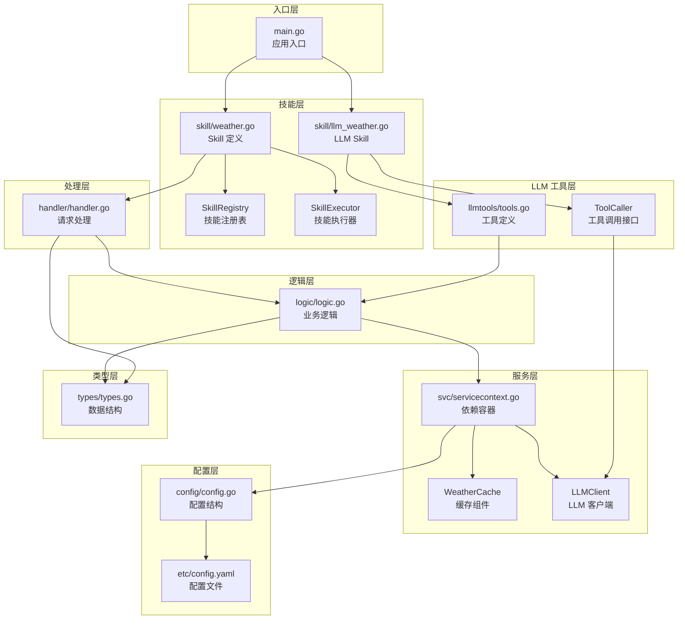
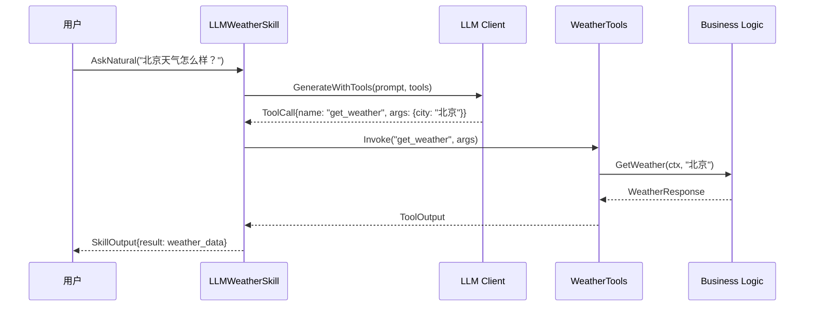

# 天气技能示例 (Weather Skill)

本示例展示了一个完整的 Skill 定义、注册、调用流程，并集成了 LLM 工具调用能力。

## 概述

Weather Skill 是一个天气查询技能，支持：

- 获取指定城市的当前天气
- 获取未来 1-7 天的天气预报
- 列出支持的城市列表
- **LLM 自然语言理解与工具调用**

## 架构设计

采用分层架构设计，并集成 LLM 工具调用：



## 目录结构

```text
02-weather-skill/
├── etc/
│   └── config.yaml           # 配置文件
├── internal/
│   ├── config/
│   │   └── config.go         # 配置结构定义
│   ├── handler/
│   │   └── handler.go        # 请求处理层（薄层）
│   ├── llmtools/
│   │   └── tools.go          # LLM 工具定义
│   ├── logic/
│   │   └── logic.go          # 业务逻辑层
│   ├── skill/
│   │   ├── weather.go        # Skill 定义、注册、执行
│   │   └── llm_weather.go    # LLM 增强版 Skill
│   ├── svc/
│   │   └── servicecontext.go # 服务依赖容器
│   └── types/
│       └── types.go          # 数据类型定义
├── main.go                   # 入口文件
└── README.md                 # 本文档
```

## 设计原则

遵循以下核心设计原则：

| 原则 | 说明 |
|------|------|
| **Handler 层薄** | Handler 只负责请求解析和响应构建，禁止包含业务逻辑 |
| **Logic 层厚** | 所有业务逻辑集中在 Logic 层，便于测试和复用 |
| **依赖注入** | 通过 ServiceContext 统一管理依赖 |
| **配置驱动** | 通过 YAML 配置文件管理技能参数 |
| **类型独立** | 请求/响应类型独立定义，便于维护 |
| **LLM 集成** | 工具封装业务逻辑，LLM 负责意图理解 |

## 快速开始

### 运行示例

支持从项目根目录或示例目录运行：

```bash
# 从项目根目录运行（推荐）
go run examples/skills/02-weather-skill/main.go

# 或从示例目录运行
cd examples/skills/02-weather-skill
go run main.go
```

### 启用 LLM 功能

设置环境变量以启用 LLM 工具调用：

```bash
# 使用 DeepSeek（推荐）
export DEEPSEEK_API_KEY=your-api-key
go run examples/skills/02-weather-skill/main.go

# 或使用 OpenAI
export OPENAI_API_KEY=your-api-key
go run examples/skills/02-weather-skill/main.go
```

如果未设置 API Key，程序会使用 Mock 模式演示工具调用功能。

### 输出示例

```text
╔════════════════════════════════════════════════════════════════╗
║          天气技能示例 (Weather Skill Demo)                      ║
║   基于分层架构设计的 goagent 技能实现                            ║
╚════════════════════════════════════════════════════════════════╝

✓ 使用默认配置
【场景 1】Skill 定义与创建
════════════════════════════════════════════════════════════════
  名称: weather
  描述: 天气查询与预报技能
  版本: v1.0.0
  关键词: [天气 气温 预报 weather forecast temperature]
...

【场景 6】LLM 工具调用 (Tool Calling)
════════════════════════════════════════════════════════════════

创建 LLM 天气技能:
────────────────────────────────────────
  名称: weather-llm
  描述: 天气查询与预报技能 (LLM 增强版)
  LLM 提供商: deepseek

可用工具:
  - get_weather: 获取指定城市的当前天气信息
  - get_forecast: 获取指定城市未来几天的天气预报
  - list_cities: 获取支持查询天气的城市列表

自然语言查询测试:
────────────────────────────────────────

1. 查询: 今天北京的天气怎么样？
  使用工具: get_weather
  结果: map[city:北京 condition:晴 temperature:15 ...]
  耗时: 2.889s
```

## 核心组件

### 1. Skill 接口

```go
type Skill interface {
    // 元数据
    Name() string
    Description() string
    Version() string
    Keywords() []string

    // 能力评估
    CanHandle(ctx *RoutingContext) float64

    // 执行入口
    Execute(ctx context.Context, input *types.SkillInput) *types.SkillOutput
}
```

### 2. LLM 工具定义

```go
// 创建天气工具集
weatherTools := llmtools.NewWeatherTools(svcCtx)

// 获取所有工具
tools := weatherTools.GetTools()
// - get_weather: 获取当前天气
// - get_forecast: 获取天气预报
// - list_cities: 列出支持城市
```

### 3. LLMWeatherSkill

```go
// 创建 LLM 天气技能
llmSkill := skill.NewLLMWeatherSkill(cfg)

// 自然语言查询
output := llmSkill.AskNatural(ctx, "今天北京天气怎么样？")
// LLM 自动选择 get_weather 工具并执行
```

### 4. SkillRegistry 技能注册表

```go
registry := skill.NewSkillRegistry()

// 注册技能
registry.Register(weatherSkill)

// 获取技能
s, ok := registry.Get("weather")

// 路由匹配
routingCtx := &skill.RoutingContext{
    Query:    "今天天气怎么样",
    Keywords: []string{"天气"},
}
matchedSkill, score := registry.Route(routingCtx)
```

### 5. SkillExecutor 技能执行器

```go
executor := skill.NewSkillExecutor(registry)
executor.SetTimeout(10 * time.Second)

// 按名称执行
output := executor.ExecuteByName(ctx, "weather", &types.SkillInput{
    Action: "get_weather",
    Args:   map[string]interface{}{"city": "北京"},
})

// 按路由执行
output := executor.ExecuteByRouting(ctx, routingCtx, input)
```

## 使用方式

### 直接调用技能

```go
// 创建技能
weatherSkill := skill.NewWeatherSkill(cfg)

// 获取天气
output := weatherSkill.GetWeather(ctx, "北京")
if output.Success {
    resp := output.Result.(*types.WeatherResponse)
    fmt.Println(handler.FormatWeatherOutput(resp))
}

// 获取预报
output := weatherSkill.GetForecast(ctx, "上海", 5)
```

### 通过 LLM 自然语言查询

```go
// 创建 LLM 技能
llmSkill := skill.NewLLMWeatherSkill(cfg)

// 自然语言查询
output := llmSkill.AskNatural(ctx, "上海明天会下雨吗？")
// LLM 自动理解意图，调用 get_forecast 工具
```

### 通过通用输入调用

```go
input := &types.SkillInput{
    Action: "get_weather",
    Args: map[string]interface{}{
        "city": "广州",
    },
}
output := weatherSkill.Execute(ctx, input)
```

### 支持的 Action

| Action | 说明 | 参数 |
|--------|------|------|
| `get_weather` | 获取当前天气 | `city`: 城市名 |
| `get_forecast` | 获取天气预报 | `city`: 城市名, `days`: 天数(1-7) |
| `list_cities` | 列出支持的城市 | 无 |
| `natural_query` | LLM 自然语言查询 | `query`: 查询文本 |

## 配置说明

`etc/config.yaml` 配置文件：

```yaml
# 服务名称
Name: weather-skill

# 技能配置
Skill:
  Name: weather
  Description: 天气查询与预报技能
  Version: v1.0.0
  DefaultCity: 北京
  SupportedCities:
    - 北京
    - 上海
    - 广州
    - 深圳
  Cache:
    Enabled: true
    TTL: 300  # 缓存时间（秒）

# 路由关键词
Keywords:
  - 天气
  - 气温
  - 预报
  - weather

# LLM 配置
LLM:
  Provider: deepseek    # 或 openai
  Model: deepseek-chat
  MaxTokens: 1000
  Temperature: 0.7
```

## LLM 工具调用流程



## 扩展指南

### 添加新的工具

在 `llmtools/tools.go` 中定义新工具：

```go
func (wt *WeatherTools) createNewTool() *tools.FunctionTool {
    return tools.NewFunctionTool(
        "tool_name",
        "工具描述",
        `{"type": "object", "properties": {...}}`,
        func(ctx context.Context, args map[string]interface{}) (interface{}, error) {
            // 实现逻辑
            return result, nil
        },
    )
}
```

然后在 `NewWeatherTools` 中注册工具，并更新 LLM 系统提示词。

### 添加新的 Action

1. 在 `types/types.go` 中定义请求/响应类型
2. 在 `logic/logic.go` 中实现业务逻辑
3. 在 `handler/handler.go` 中添加处理方法
4. 在 `HandleSkillInput` 中注册路由

### 创建新的 Skill

1. 复制 `internal/skill/weather.go` 作为模板
2. 修改技能名称、描述、关键词
3. 实现 `Execute` 方法
4. 注册到 `SkillRegistry`

## 与 01-demo 的区别

| 特性 | 01-demo | 02-weather-skill |
|------|---------|------------------|
| 架构风格 | 单文件实现 | 分层架构 |
| 配置方式 | 硬编码 | YAML 配置文件 |
| 目录结构 | 扁平 | 分层（handler/logic/svc/types） |
| 依赖管理 | 直接引用 | ServiceContext 注入 |
| 缓存支持 | 无 | 内置缓存组件 |
| LLM 集成 | 无 | 完整工具调用支持 |
| 可测试性 | 较低 | 高（各层独立可测） |

## 相关资源

- [01-demo](../01-demo) - 基础 Skill 示例
- [06-llm-tool-calling](../../multiagent/06-llm-tool-calling) - LLM 工具调用示例
