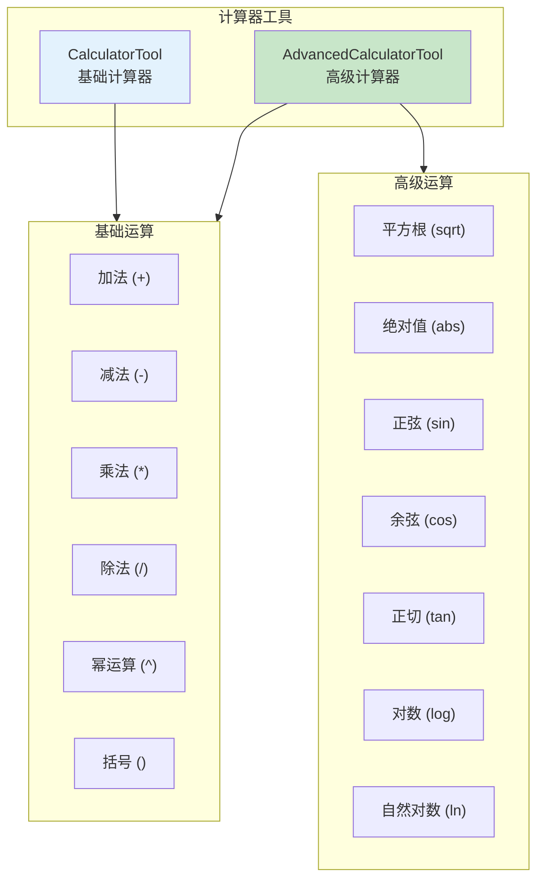
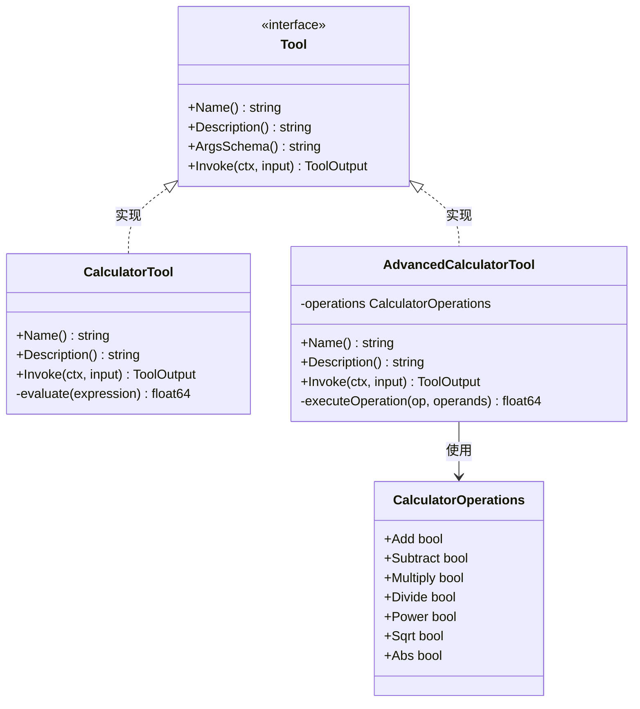
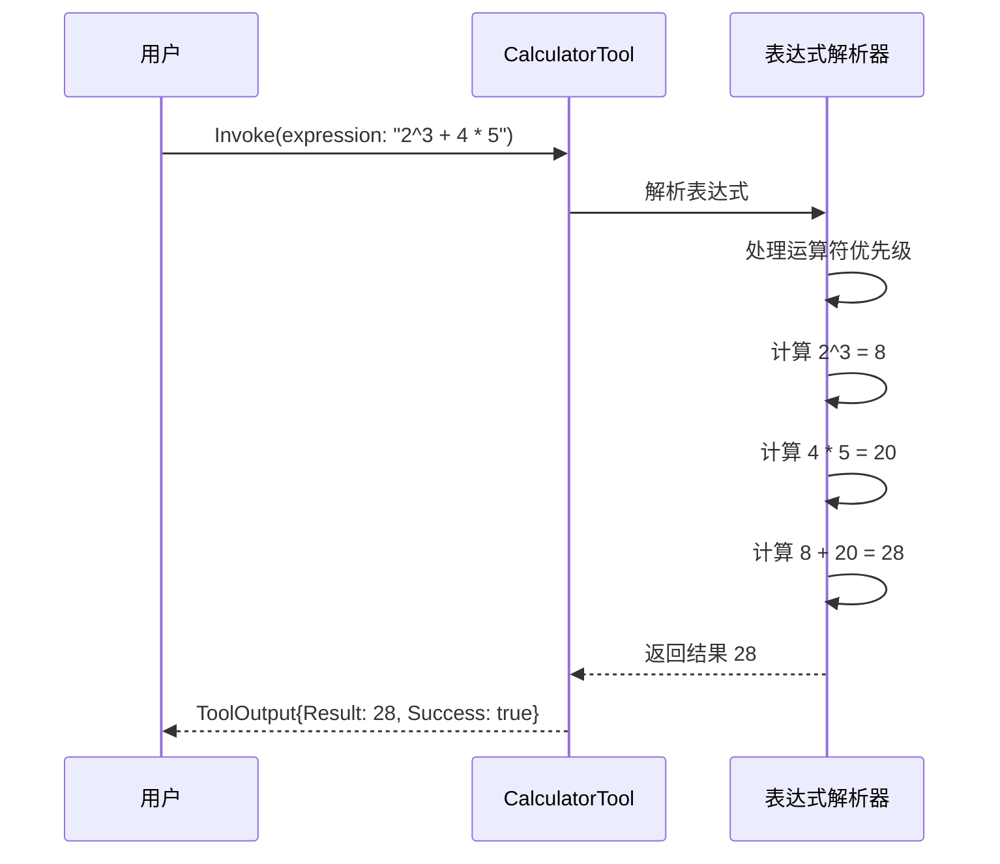
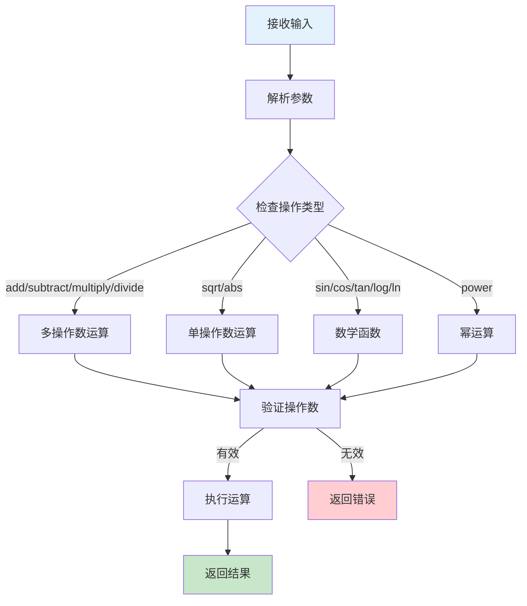

# 01-calculator 计算器工具示例

本示例演示 `CalculatorTool` 和 `AdvancedCalculatorTool` 的使用方法，展示基础和高级数学计算功能。

## 目录

- [架构设计](#架构设计)
- [核心组件](#核心组件)
- [执行流程](#执行流程)
- [使用方法](#使用方法)
- [代码结构](#代码结构)

## 架构设计

### 计算器工具架构



### 类图



## 核心组件

### 1. CalculatorTool 基础计算器

基础计算器支持表达式求值：

| 运算符 | 说明 | 示例 |
|--------|------|------|
| `+` | 加法 | `2 + 3` = 5 |
| `-` | 减法 | `10 - 4` = 6 |
| `*` | 乘法 | `6 * 7` = 42 |
| `/` | 除法 | `20 / 4` = 5 |
| `^` | 幂运算 | `2^8` = 256 |
| `()` | 括号 | `(10 + 5) * 2` = 30 |

### 2. AdvancedCalculatorTool 高级计算器

高级计算器支持数学函数：

| 操作 | 说明 | 示例 |
|------|------|------|
| `add` | 多操作数加法 | `add(1, 2, 3, 4, 5)` = 15 |
| `subtract` | 多操作数减法 | `subtract(100, 30, 20)` = 50 |
| `multiply` | 多操作数乘法 | `multiply(2, 3, 4)` = 24 |
| `divide` | 多操作数除法 | `divide(100, 2, 5)` = 10 |
| `power` | 幂运算 | `power(2, 10)` = 1024 |
| `sqrt` | 平方根 | `sqrt(144)` = 12 |
| `abs` | 绝对值 | `abs(-42)` = 42 |
| `sin` | 正弦 | `sin(0)` = 0 |
| `cos` | 余弦 | `cos(0)` = 1 |
| `log` | 常用对数 | `log(100)` = 2 |
| `ln` | 自然对数 | `ln(e)` ≈ 1 |

## 执行流程

### 基础计算器执行流程



### 高级计算器执行流程



## 使用方法

### 运行示例

```bash
cd examples/tools/01-calculator
go run main.go
```

### 预期输出

```text
╔════════════════════════════════════════════════════════════════╗
║              计算器工具 (Calculator Tool) 示例                 ║
╚════════════════════════════════════════════════════════════════╝

【步骤 1】使用基础计算器 (CalculatorTool)
────────────────────────────────────────
工具名称: calculator
工具描述: 计算器工具，支持基本数学运算

基本运算测试:
  ✓ 2 + 3 = 5
  ✓ 10 - 4 = 6
  ✓ 6 * 7 = 42
  ✓ 20 / 4 = 5
  ✓ 2^8 = 256
  ✓ (10 + 5) * 2 = 30
  ...

【步骤 2】使用高级计算器 (AdvancedCalculatorTool)
────────────────────────────────────────
  ✓ 加法: 1+2+3+4+5 = 15
  ✓ 平方根: √144 = 12
  ...

【步骤 3】错误处理示例
────────────────────────────────────────
  ✓ 除零错误: 正确捕获错误
  ✓ 括号不匹配: 正确捕获错误
```

### 关键代码片段

#### 创建基础计算器

```go
import "github.com/kart-io/goagent/tools/compute"

calculator := compute.NewCalculatorTool()

output, err := calculator.Invoke(ctx, &interfaces.ToolInput{
    Args: map[string]interface{}{
        "expression": "2^3 + 4 * 5",
    },
    Context: ctx,
})
// output.Result = 28
```

#### 创建高级计算器

```go
advancedCalc := compute.NewAdvancedCalculatorTool(compute.CalculatorOperations{
    Add:      true,
    Subtract: true,
    Multiply: true,
    Divide:   true,
    Power:    true,
    Sqrt:     true,
    Abs:      true,
})

output, err := advancedCalc.Invoke(ctx, &interfaces.ToolInput{
    Args: map[string]interface{}{
        "operation": "sqrt",
        "operands":  []interface{}{144.0},
    },
    Context: ctx,
})
// output.Result = 12
```

## 代码结构

```text
01-calculator/
├── main.go          # 示例入口
└── README.md        # 本文档
```

## 扩展阅读

- [02-http-api](../02-http-api/) - HTTP API 工具示例
- [07-function-tool](../07-function-tool/) - 自定义函数工具示例
- [tools/compute 包](../../../tools/compute/) - 计算工具实现
