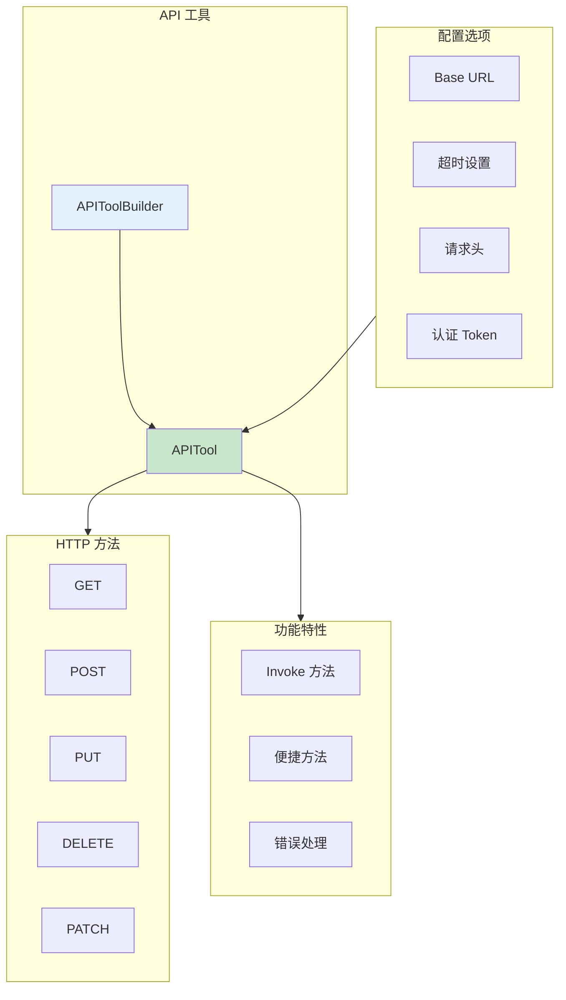
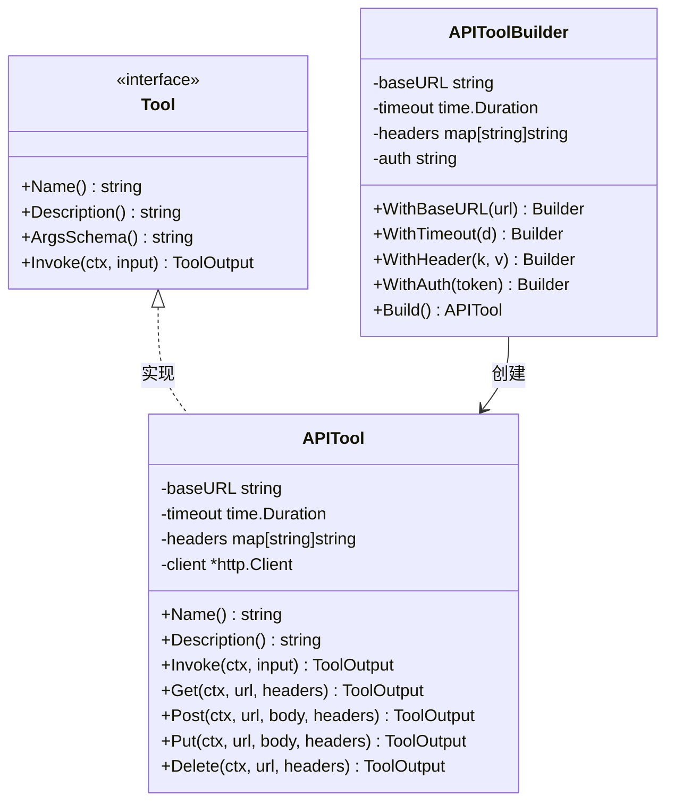
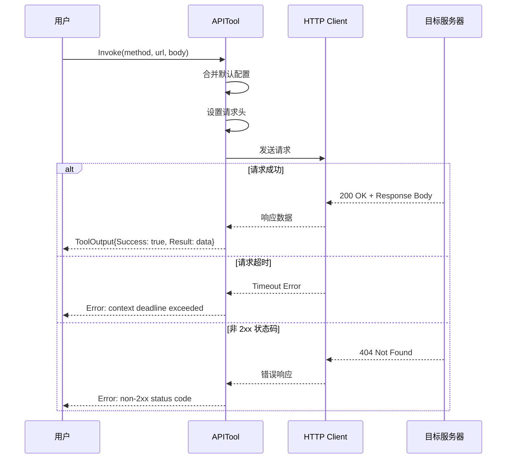
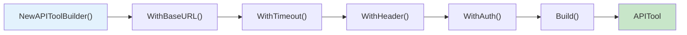

# 02-http-api HTTP API 工具示例

本示例演示 `APITool` 的使用方法，展示如何进行 HTTP 请求操作，包括 GET、POST、PUT、DELETE 等方法。

## 目录

- [架构设计](#架构设计)
- [核心组件](#核心组件)
- [执行流程](#执行流程)
- [使用方法](#使用方法)
- [代码结构](#代码结构)

## 架构设计

### HTTP API 工具架构



### 类图



## 核心组件

### 1. 创建方式

| 方式 | 说明 | 适用场景 |
|------|------|----------|
| `NewAPITool` | 直接创建 | 简单配置 |
| `NewAPIToolBuilder` | Builder 模式 | 复杂配置 |

### 2. HTTP 方法支持

| 方法 | 说明 | 便捷方法 |
|------|------|----------|
| GET | 获取资源 | `Get()` |
| POST | 创建资源 | `Post()` |
| PUT | 更新资源 | `Put()` |
| DELETE | 删除资源 | `Delete()` |
| PATCH | 部分更新 | 通过 `Invoke()` |

### 3. 配置选项

| 选项 | 说明 | 默认值 |
|------|------|--------|
| `baseURL` | API 基础 URL | 空 |
| `timeout` | 请求超时时间 | 30s |
| `headers` | 默认请求头 | 空 |
| `auth` | Bearer Token | 空 |

## 执行流程

### 请求执行流程



### Builder 模式流程



## 使用方法

### 运行示例

```bash
cd examples/tools/02-http-api
go run main.go
```

### 预期输出

```text
╔════════════════════════════════════════════════════════════════╗
║              HTTP API 工具 (APITool) 示例                      ║
╚════════════════════════════════════════════════════════════════╝

【步骤 1】创建 API 工具
────────────────────────────────────────
工具名称: api
工具描述: HTTP API 调用工具

【步骤 2】GET 请求示例
────────────────────────────────────────
✓ GET 请求成功
  状态码: 200
  耗时: 1.5s

【步骤 3】POST 请求示例
────────────────────────────────────────
✓ POST 请求成功
  状态码: 200

【步骤 7】错误处理示例
────────────────────────────────────────
✓ 正确捕获 404 错误
✓ 正确捕获超时错误
```

### 关键代码片段

#### 直接创建 API 工具

```go
import "github.com/kart-io/goagent/tools/http"

apiTool := http.NewAPITool("", 30*time.Second, map[string]string{
    "User-Agent": "GoAgent/1.0",
})
```

#### 使用 Builder 模式

```go
apiTool := http.NewAPIToolBuilder().
    WithBaseURL("https://api.example.com").
    WithTimeout(30 * time.Second).
    WithHeader("Accept", "application/json").
    WithAuth("your-api-token").
    Build()
```

#### GET 请求

```go
// 使用 Invoke 方法
output, err := apiTool.Invoke(ctx, &interfaces.ToolInput{
    Args: map[string]interface{}{
        "method": "GET",
        "url":    "https://httpbin.org/get",
        "headers": map[string]interface{}{
            "X-Custom-Header": "value",
        },
    },
    Context: ctx,
})

// 使用便捷方法
output, err := apiTool.Get(ctx, "https://httpbin.org/get", nil)
```

#### POST 请求

```go
body := map[string]interface{}{
    "name":    "GoAgent",
    "version": "1.0.0",
}
output, err := apiTool.Post(ctx, "https://httpbin.org/post", body, nil)
```

## 代码结构

```text
02-http-api/
├── main.go          # 示例入口
└── README.md        # 本文档
```

## 扩展阅读

- [01-calculator](../01-calculator/) - 计算器工具示例
- [06-web-scraper](../06-web-scraper/) - 网页抓取工具示例
- [tools/http 包](../../../tools/http/) - HTTP 工具实现
