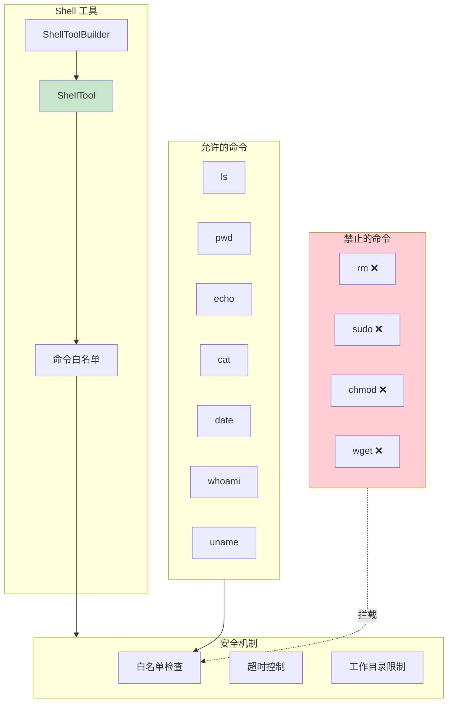
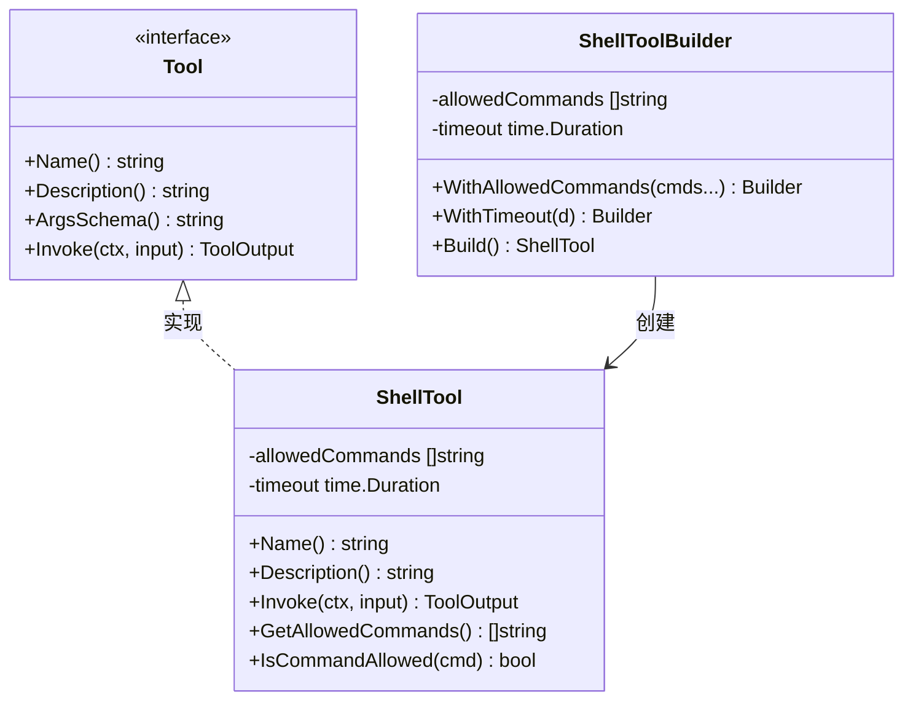
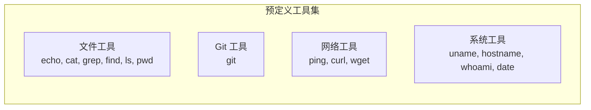
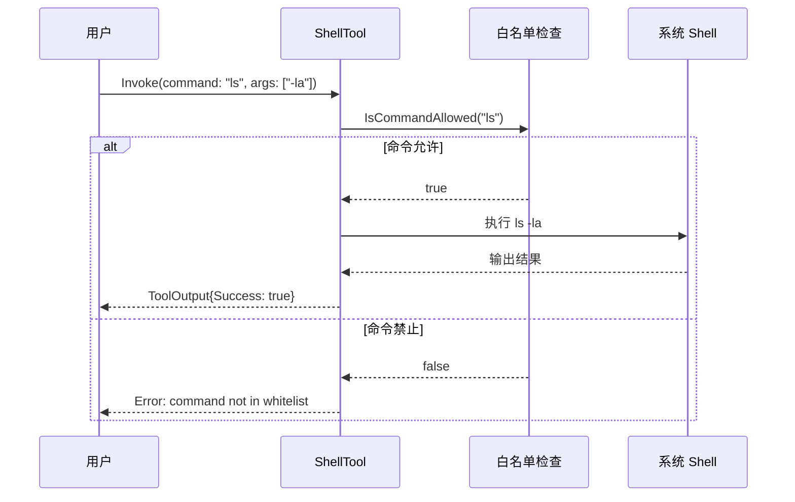
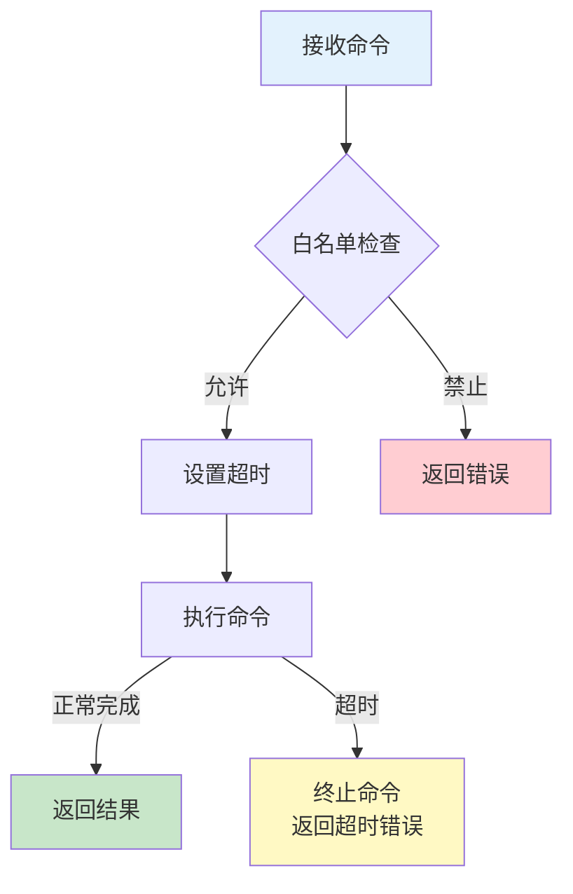

# 03-shell Shell 命令工具示例

本示例演示 `ShellTool` 的使用方法，展示如何安全地执行系统命令，包括白名单机制、超时控制等安全特性。

## 目录

- [架构设计](#架构设计)
- [核心组件](#核心组件)
- [执行流程](#执行流程)
- [使用方法](#使用方法)
- [代码结构](#代码结构)

## 架构设计

### Shell 工具架构



### 类图



## 核心组件

### 1. 安全机制

| 机制 | 说明 | 作用 |
|------|------|------|
| 命令白名单 | 只允许执行白名单中的命令 | 防止危险命令执行 |
| 超时控制 | 限制命令执行时间 | 防止无限循环 |
| 工作目录 | 可指定命令执行目录 | 限制访问范围 |

### 2. 预定义工具集



### 3. 输出格式

| 字段 | 类型 | 说明 |
|------|------|------|
| `output` | string | 命令标准输出 |
| `exit_code` | int | 退出码 |
| `duration` | string | 执行耗时 |

## 执行流程

### 命令执行流程



### 超时控制流程



## 使用方法

### 运行示例

```bash
cd examples/tools/03-shell
go run main.go
```

### 预期输出

```text
╔════════════════════════════════════════════════════════════════╗
║              Shell 工具 (ShellTool) 示例                       ║
╚════════════════════════════════════════════════════════════════╝

【步骤 1】创建 Shell 工具（带白名单）
────────────────────────────────────────
允许的命令: [ls pwd echo cat date whoami uname]

【步骤 2】执行基本命令
────────────────────────────────────────
✓ pwd 执行成功
  输出: /home/user/goagent/examples/tools/03-shell

【步骤 4】安全检查 - 白名单测试
────────────────────────────────────────
✓ 命令 'rm' 被正确拦截
✓ 命令 'sudo' 被正确拦截

【步骤 8】超时控制
────────────────────────────────────────
✓ 正确捕获超时
```

### 关键代码片段

#### 创建 Shell 工具

```go
import "github.com/kart-io/goagent/tools/shell"

// 直接创建
shellTool := shell.NewShellTool(
    []string{"ls", "pwd", "echo", "cat", "date"},
    30*time.Second,
)

// 使用 Builder 模式
shellTool := shell.NewShellToolBuilder().
    WithAllowedCommands("ls", "pwd", "echo", "date").
    WithTimeout(30 * time.Second).
    Build()
```

#### 执行命令

```go
output, err := shellTool.Invoke(ctx, &interfaces.ToolInput{
    Args: map[string]interface{}{
        "command": "ls",
        "args":    []interface{}{"-la"},
    },
    Context: ctx,
})

if result, ok := output.Result.(map[string]interface{}); ok {
    fmt.Println("输出:", result["output"])
    fmt.Println("退出码:", result["exit_code"])
}
```

#### 指定工作目录

```go
output, err := shellTool.Invoke(ctx, &interfaces.ToolInput{
    Args: map[string]interface{}{
        "command":  "ls",
        "args":     []interface{}{"-la"},
        "work_dir": "/tmp",
    },
    Context: ctx,
})
```

#### 使用预定义工具集

```go
commonTools := shell.CommonShellTools()
// 返回多个预配置的工具：文件工具、Git 工具、网络工具、系统工具
```

## 代码结构

```text
03-shell/
├── main.go          # 示例入口
└── README.md        # 本文档
```

## 安全注意事项

- 始终使用白名单限制允许的命令
- 不要在白名单中包含危险命令（rm、sudo、chmod 等）
- 设置合理的超时时间
- 限制工作目录范围
- 避免执行用户输入的命令

## 扩展阅读

- [05-file-operations](../05-file-operations/) - 文件操作工具示例
- [tools/shell 包](../../../tools/shell/) - Shell 工具实现
