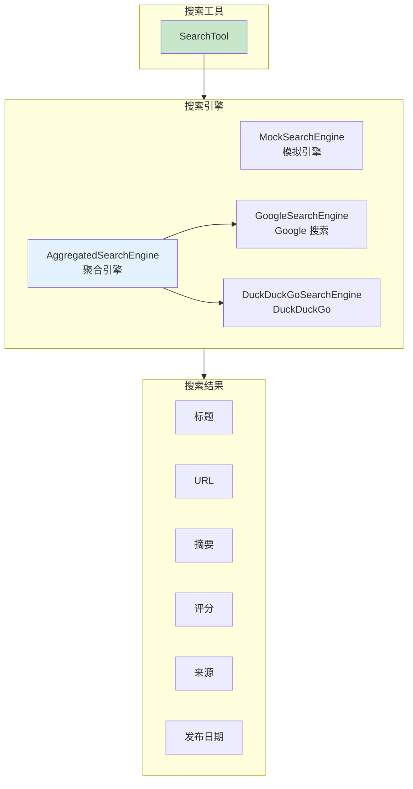
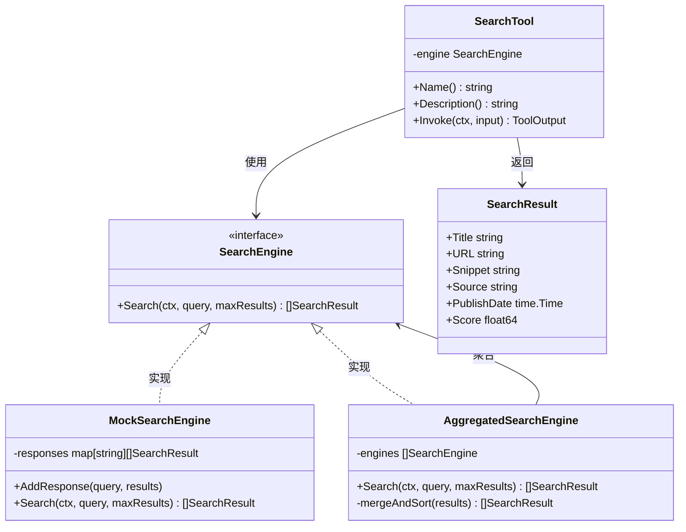
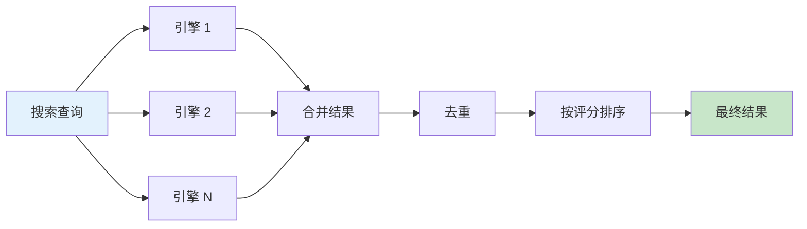
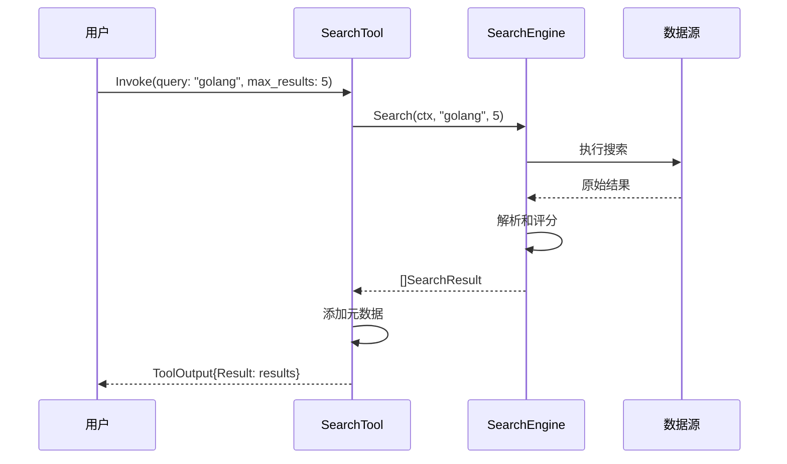
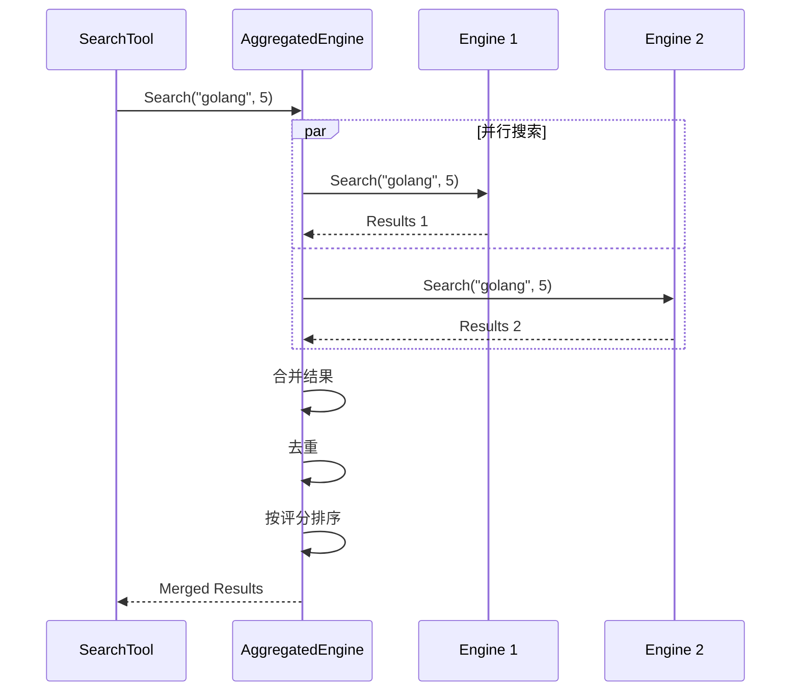

# 04-search 搜索工具示例

本示例演示 `SearchTool` 的使用方法，展示搜索引擎的创建、搜索查询执行和聚合搜索功能。

## 目录

- [架构设计](#架构设计)
- [核心组件](#核心组件)
- [执行流程](#执行流程)
- [使用方法](#使用方法)
- [代码结构](#代码结构)

## 架构设计

### 搜索工具架构



### 类图



## 核心组件

### 1. 搜索引擎类型

| 引擎 | 说明 | 适用场景 |
|------|------|----------|
| `MockSearchEngine` | 模拟搜索引擎 | 测试和演示 |
| `GoogleSearchEngine` | Google 搜索 | 生产环境 |
| `DuckDuckGoSearchEngine` | DuckDuckGo 搜索 | 隐私优先 |
| `AggregatedSearchEngine` | 聚合搜索引擎 | 多源合并 |

### 2. 搜索结果字段

| 字段 | 类型 | 说明 |
|------|------|------|
| `Title` | string | 结果标题 |
| `URL` | string | 结果链接 |
| `Snippet` | string | 内容摘要 |
| `Source` | string | 来源网站 |
| `PublishDate` | time.Time | 发布日期 |
| `Score` | float64 | 相关性评分 |

### 3. 聚合搜索特性



## 执行流程

### 搜索执行流程



### 聚合搜索流程



## 使用方法

### 运行示例

```bash
cd examples/tools/04-search
go run main.go
```

### 预期输出

```text
╔════════════════════════════════════════════════════════════════╗
║              搜索工具 (SearchTool) 示例                        ║
╚════════════════════════════════════════════════════════════════╝

【步骤 1】创建模拟搜索引擎
────────────────────────────────────────
✓ 模拟搜索引擎创建成功

【步骤 3】执行搜索
────────────────────────────────────────
搜索: 'golang' (最多 5 条结果)
✓ 搜索成功
  找到 3 条结果:
  1. Go 编程语言官网
     URL: https://golang.org
     评分: 0.98

【步骤 5】聚合搜索
────────────────────────────────────────
✓ 聚合搜索成功
  合并并排序后得到 4 条结果
```

### 关键代码片段

#### 创建模拟搜索引擎

```go
import "github.com/kart-io/goagent/tools/search"

mockEngine := search.NewMockSearchEngine()

// 添加预设响应
mockEngine.AddResponse("golang", []search.SearchResult{
    {
        Title:   "Go 编程语言官网",
        URL:     "https://golang.org",
        Snippet: "Go 是一门开源的编程语言...",
        Score:   0.98,
    },
})
```

#### 创建搜索工具

```go
searchTool := search.NewSearchTool(mockEngine)

output, err := searchTool.Invoke(ctx, &interfaces.ToolInput{
    Args: map[string]interface{}{
        "query":       "golang",
        "max_results": float64(5),
    },
    Context: ctx,
})
```

#### 使用聚合搜索

```go
engine1 := search.NewMockSearchEngine()
engine2 := search.NewMockSearchEngine()

// 创建聚合搜索引擎
aggregatedEngine := search.NewAggregatedSearchEngine(engine1, engine2)
aggregatedTool := search.NewSearchTool(aggregatedEngine)
```

#### 使用 Google 搜索引擎

```go
googleEngine := search.NewGoogleSearchEngine("your-api-key", "your-cx")
googleTool := search.NewSearchTool(googleEngine)
```

## 代码结构

```text
04-search/
├── main.go          # 示例入口
└── README.md        # 本文档
```

## 生产环境提示

- 需要集成真实的搜索 API（如 Google Custom Search）
- 注意 API 调用限制和费用
- 考虑添加搜索结果缓存
- 实现搜索结果过滤和排序

## 扩展阅读

- [06-web-scraper](../06-web-scraper/) - 网页抓取工具示例
- [tools/search 包](../../../tools/search/) - 搜索工具实现
