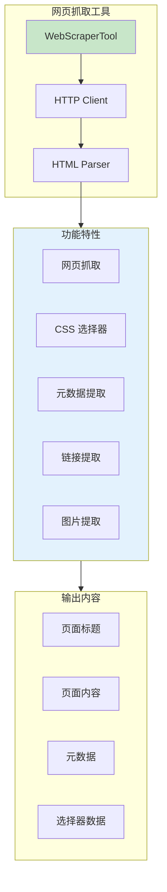
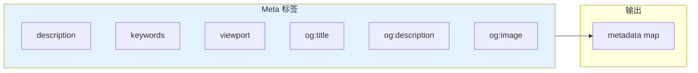
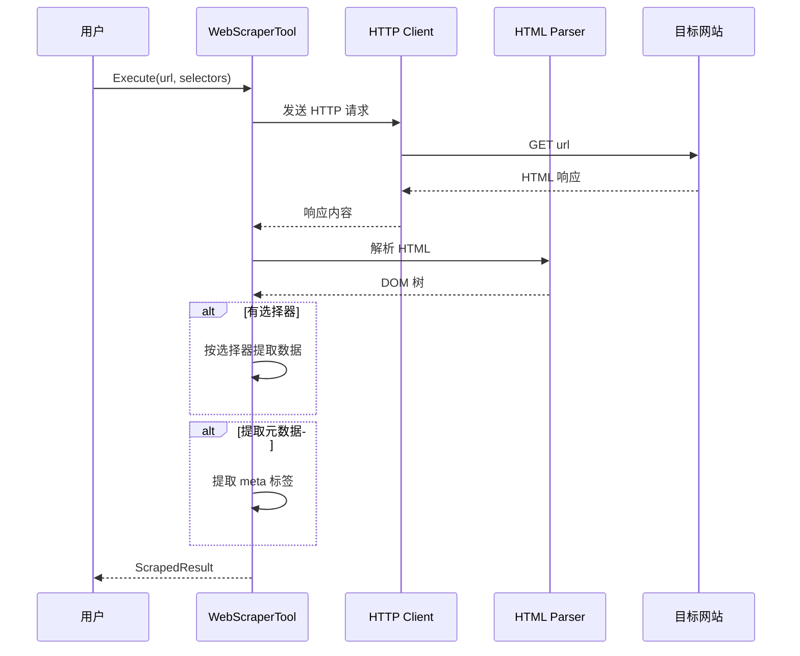
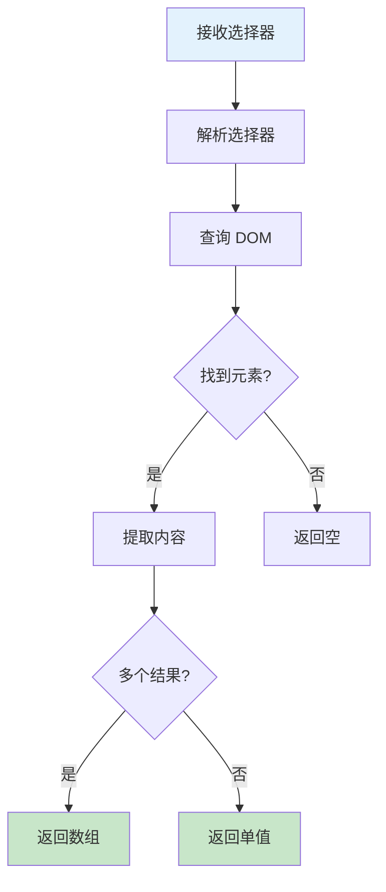

# 06-web-scraper 网页抓取工具示例

本示例演示 `WebScraperTool` 的使用方法，展示网页内容抓取、CSS 选择器数据提取、元数据提取等功能。

## 目录

- [架构设计](#架构设计)
- [核心组件](#核心组件)
- [执行流程](#执行流程)
- [使用方法](#使用方法)
- [代码结构](#代码结构)

## 架构设计

### 网页抓取工具架构



### 类图

```mermaid
classDiagram
    class Tool {
        <<interface>>
        +Name() string
        +Description() string
        +Invoke(ctx, input) ToolOutput
    }

    class WebScraperTool {
        -client *http.Client
        +Name() string
        +Description() string
        +Execute(ctx, input) ToolOutput
        -fetch(url) *html.Node
        -extractBySelector(node, selector) []string
        -extractMetadata(node) map[string]string
    }

    class ScrapedResult {
        +Title string
        +Content string
        +Metadata map[string]string
        +Links []string
        +Images []string
        +Custom map[string]interface{}
    }

    Tool <|.. WebScraperTool : 实现
    WebScraperTool --> ScrapedResult : 返回
```

## 核心组件

### 1. 抓取选项

| 选项 | 类型 | 说明 |
|------|------|------|
| `url` | string | 目标 URL |
| `selectors` | map | CSS 选择器映射 |
| `extract_metadata` | bool | 是否提取元数据 |
| `max_content_length` | int | 最大内容长度 |

### 2. 支持的 CSS 选择器

| 选择器 | 示例 | 说明 |
|--------|------|------|
| 标签 | `h1`, `p`, `a` | 选择标签元素 |
| 类 | `.class-name` | 选择类名 |
| ID | `#element-id` | 选择 ID |
| 属性 | `[href]`, `[src]` | 选择属性 |
| 组合 | `div.content p` | 后代选择器 |

### 3. 元数据提取



## 执行流程

### 网页抓取执行流程



### 选择器提取流程



## 使用方法

### 运行示例

```bash
cd examples/tools/06-web-scraper
go run main.go
```

### 预期输出

```text
╔════════════════════════════════════════════════════════════════╗
║          网页抓取工具 (WebScraperTool) 示例                    ║
╚════════════════════════════════════════════════════════════════╝

【步骤 2】抓取网页基本信息
────────────────────────────────────────
✓ 抓取成功: https://httpbin.org/html
  标题: ...
  内容摘要: Herman Melville - Moby-Dick...

【步骤 3】使用 CSS 选择器提取数据
────────────────────────────────────────
✓ 使用选择器抓取成功
  标题 (h1): Example Domain
  内容 (p): This domain is for use in...

【步骤 4】提取页面元数据
────────────────────────────────────────
✓ 提取元数据成功
  description: Wikipedia is a free online encyclopedia...
  og:title: Wikipedia, the free encyclopedia
```

### 关键代码片段

#### 创建网页抓取工具

```go
import "github.com/kart-io/goagent/tools/practical"

scraper := practical.NewWebScraperTool()
```

#### 抓取网页基本信息

```go
output, err := scraper.Execute(ctx, &interfaces.ToolInput{
    Args: map[string]interface{}{
        "url":              "https://example.com",
        "extract_metadata": true,
        "max_content_length": 5000,
    },
    Context: ctx,
})
```

#### 使用 CSS 选择器

```go
output, err := scraper.Execute(ctx, &interfaces.ToolInput{
    Args: map[string]interface{}{
        "url": "https://example.com",
        "selectors": map[string]interface{}{
            "title":   "h1",
            "content": "p",
            "links":   "a",
        },
    },
    Context: ctx,
})

if result, ok := output.Result.(map[string]interface{}); ok {
    fmt.Println("标题:", result["title"])
    fmt.Println("内容:", result["content"])
}
```

#### 提取图片

```go
output, err := scraper.Execute(ctx, &interfaces.ToolInput{
    Args: map[string]interface{}{
        "url": "https://example.com",
        "selectors": map[string]interface{}{
            "images": "img",
        },
    },
    Context: ctx,
})
```

#### 自定义选择器

```go
output, err := scraper.Execute(ctx, &interfaces.ToolInput{
    Args: map[string]interface{}{
        "url": "https://example.com",
        "selectors": map[string]interface{}{
            "custom": map[string]interface{}{
                "heading":    "h1",
                "paragraphs": "p",
                "nav_links":  "nav a",
            },
        },
    },
    Context: ctx,
})
```

## 代码结构

```text
06-web-scraper/
├── main.go          # 示例入口
└── README.md        # 本文档
```

## 使用提示

- 遵守网站的 robots.txt 和服务条款
- 设置合理的请求间隔，避免对目标服务器造成压力
- 某些网站可能需要设置特定的 User-Agent
- JavaScript 渲染的内容可能无法直接抓取
- 考虑使用缓存减少重复请求

## 扩展阅读

- [02-http-api](../02-http-api/) - HTTP API 工具示例
- [04-search](../04-search/) - 搜索工具示例
- [tools/practical 包](../../../tools/practical/) - 实用工具实现
