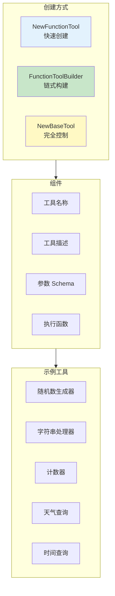
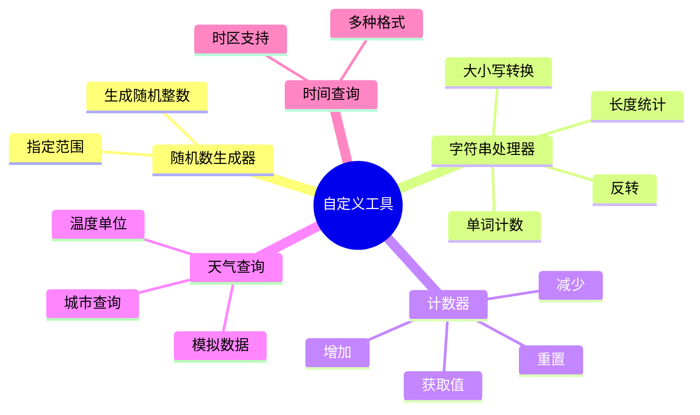
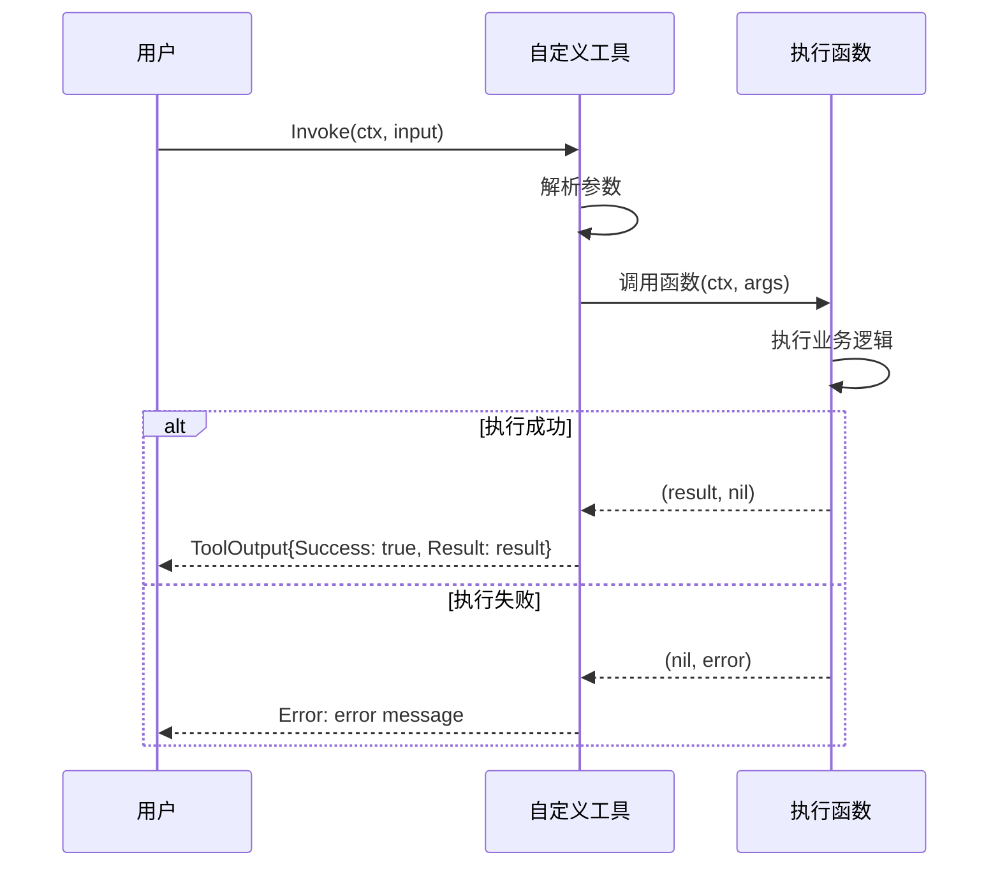
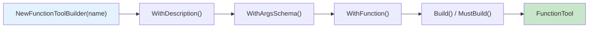

# 07-function-tool 自定义函数工具示例

本示例演示如何使用 `FunctionTool`、`FunctionToolBuilder` 和 `BaseTool` 创建自定义工具，展示多种工具创建方式和最佳实践。

## 目录

- [架构设计](#架构设计)
- [核心组件](#核心组件)
- [执行流程](#执行流程)
- [使用方法](#使用方法)
- [代码结构](#代码结构)

## 架构设计

### 自定义工具创建方式



### 类图

```mermaid
classDiagram
    class Tool {
        <<interface>>
        +Name() string
        +Description() string
        +ArgsSchema() string
        +Invoke(ctx, input) ToolOutput
    }

    class FunctionTool {
        -name string
        -description string
        -argsSchema string
        -fn func(ctx, args) (interface{}, error)
        +Name() string
        +Description() string
        +Invoke(ctx, input) ToolOutput
    }

    class FunctionToolBuilder {
        -name string
        -description string
        -argsSchema string
        -fn func
        +WithDescription(desc) Builder
        +WithArgsSchema(schema) Builder
        +WithFunction(fn) Builder
        +Build() Tool
        +MustBuild() Tool
    }

    class BaseTool {
        -name string
        -description string
        -argsSchema string
        -fn func(ctx, input) (ToolOutput, error)
        +Name() string
        +Description() string
        +Invoke(ctx, input) ToolOutput
    }

    Tool <|.. FunctionTool : 实现
    Tool <|.. BaseTool : 实现
    FunctionToolBuilder --> FunctionTool : 创建
```

## 核心组件

### 1. 创建方式对比

| 方式 | 适用场景 | 特点 |
|------|----------|------|
| `NewFunctionTool` | 简单工具 | 一行代码创建 |
| `FunctionToolBuilder` | 复杂工具 | 链式调用，可读性好 |
| `NewBaseTool` | 需要完全控制 | 直接操作 ToolInput/ToolOutput |

### 2. 参数 Schema（JSON Schema）

```json
{
    "type": "object",
    "properties": {
        "param1": {
            "type": "string",
            "description": "参数描述"
        },
        "param2": {
            "type": "integer",
            "default": 10
        }
    },
    "required": ["param1"]
}
```

### 3. 示例工具功能



## 执行流程

### 工具执行流程



### Builder 模式流程



## 使用方法

### 运行示例

```bash
cd examples/tools/07-function-tool
go run main.go
```

### 预期输出

```text
╔════════════════════════════════════════════════════════════════╗
║          自定义函数工具 (FunctionTool) 示例                    ║
╚════════════════════════════════════════════════════════════════╝

【步骤 1】使用 NewFunctionTool 创建工具
────────────────────────────────────────
✓ 随机数 #1: map[random_number:93 range:[1, 100]]

【步骤 2】使用 FunctionToolBuilder 创建工具
────────────────────────────────────────
✓ uppercase('Hello World') = HELLO WORLD
✓ reverse('Hello World') = dlroW olleH

【步骤 3】创建带状态的工具（计数器）
────────────────────────────────────────
✓ increment: 计数器 = 1
✓ reset: 计数器 = 0

【步骤 4】创建天气查询工具（模拟）
────────────────────────────────────────
✓ 北京: 22°C, 晴, 湿度 45%

【步骤 5】使用 BaseTool 创建工具
────────────────────────────────────────
✓ human: 2025年12月08日 10:00:00
```

### 关键代码片段

#### 方式 1：使用 NewFunctionTool

```go
import "github.com/kart-io/goagent/tools"

randomTool := tools.NewFunctionTool(
    "random_number",
    "生成指定范围内的随机整数",
    `{
        "type": "object",
        "properties": {
            "min": {"type": "integer", "default": 0},
            "max": {"type": "integer", "default": 100}
        }
    }`,
    func(ctx context.Context, args map[string]interface{}) (interface{}, error) {
        min := int(args["min"].(float64))
        max := int(args["max"].(float64))
        result := rand.Intn(max-min+1) + min
        return map[string]interface{}{"random_number": result}, nil
    },
)
```

#### 方式 2：使用 FunctionToolBuilder

```go
stringTool := tools.NewFunctionToolBuilder("string_processor").
    WithDescription("处理字符串，支持多种操作").
    WithArgsSchema(`{
        "type": "object",
        "properties": {
            "text": {"type": "string"},
            "operation": {
                "type": "string",
                "enum": ["uppercase", "lowercase", "reverse"]
            }
        },
        "required": ["text", "operation"]
    }`).
    WithFunction(func(ctx context.Context, args map[string]interface{}) (interface{}, error) {
        text := args["text"].(string)
        operation := args["operation"].(string)

        var result string
        switch operation {
        case "uppercase":
            result = strings.ToUpper(text)
        case "lowercase":
            result = strings.ToLower(text)
        case "reverse":
            // 反转字符串
        }
        return map[string]interface{}{"result": result}, nil
    }).
    MustBuild()
```

#### 方式 3：使用 BaseTool

```go
timeTool := tools.NewBaseTool(
    "current_time",
    "获取当前时间，支持多种格式",
    `{
        "type": "object",
        "properties": {
            "format": {
                "type": "string",
                "enum": ["rfc3339", "date", "time", "unix", "human"]
            }
        }
    }`,
    func(ctx context.Context, input *interfaces.ToolInput) (*interfaces.ToolOutput, error) {
        format := input.Args["format"].(string)
        now := time.Now()

        var result string
        switch format {
        case "human":
            result = now.Format("2006年01月02日 15:04:05")
        // ...
        }

        return &interfaces.ToolOutput{
            Result:  map[string]interface{}{"time": result},
            Success: true,
        }, nil
    },
)
```

#### 创建带状态的工具

```go
counter := 0
counterTool := tools.NewFunctionToolBuilder("counter").
    WithDescription("计数器工具").
    WithArgsSchema(`{
        "type": "object",
        "properties": {
            "action": {"type": "string", "enum": ["increment", "decrement", "reset", "get"]}
        },
        "required": ["action"]
    }`).
    WithFunction(func(ctx context.Context, args map[string]interface{}) (interface{}, error) {
        action := args["action"].(string)
        switch action {
        case "increment":
            counter++
        case "decrement":
            counter--
        case "reset":
            counter = 0
        }
        return map[string]interface{}{"counter": counter}, nil
    }).
    MustBuild()
```

## 代码结构

```text
07-function-tool/
├── main.go          # 示例入口
└── README.md        # 本文档
```

## 最佳实践

- 使用清晰的工具名称和描述
- 定义完整的 JSON Schema 参数
- 处理所有可能的错误情况
- 返回结构化的结果
- 对于复杂工具，使用 Builder 模式提高可读性
- 对于需要完全控制输入输出的场景，使用 BaseTool

## 扩展阅读

- [08-tool-with-agent](../08-tool-with-agent/) - 工具与 Agent 集成示例
- [tools 包](../../../tools/) - 工具系统实现
