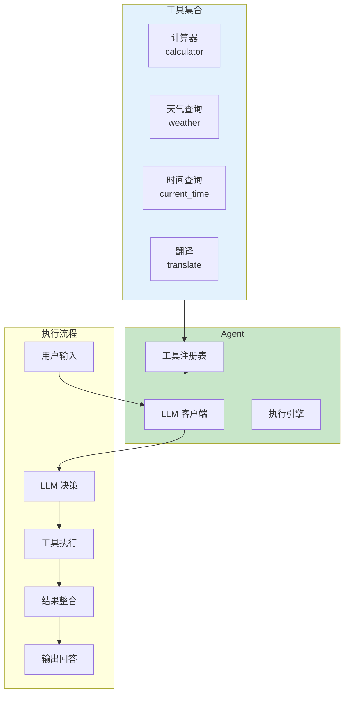
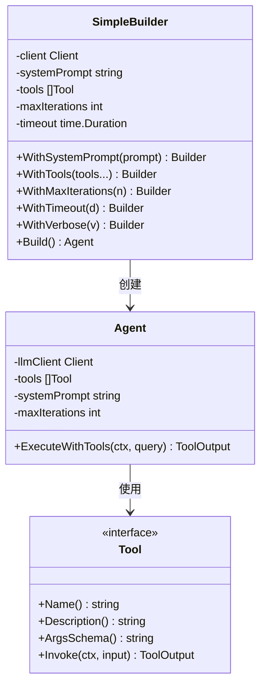
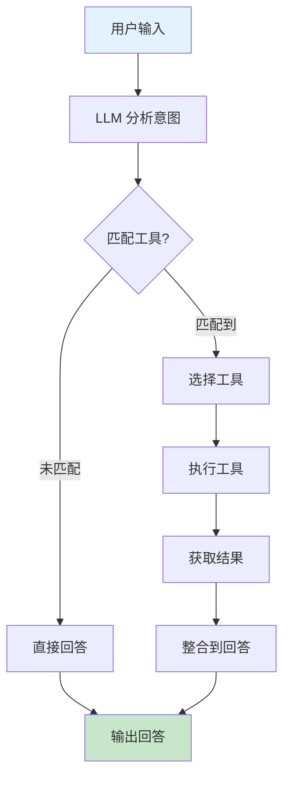
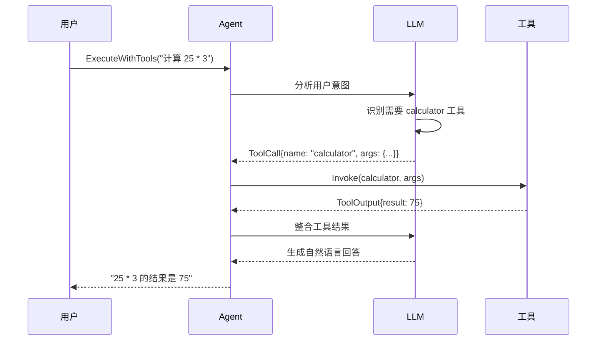
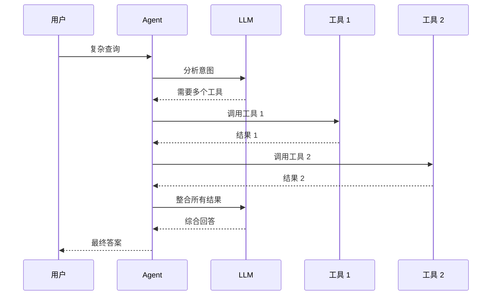

# 08-tool-with-agent 工具与 Agent 集成示例

本示例演示如何将自定义工具集成到 Agent 中，展示 Agent 自动选择和执行工具的完整流程。

## 目录

- [架构设计](#架构设计)
- [核心组件](#核心组件)
- [执行流程](#执行流程)
- [使用方法](#使用方法)
- [代码结构](#代码结构)

## 架构设计

### 工具与 Agent 集成架构



### 类图



## 核心组件

### 1. Agent 配置选项

| 选项 | 说明 | 默认值 |
|------|------|--------|
| `systemPrompt` | 系统提示词 | 空 |
| `tools` | 工具列表 | 空 |
| `maxIterations` | 最大迭代次数 | 5 |
| `timeout` | 超时时间 | 60s |
| `verbose` | 详细输出 | false |

### 2. 工具选择机制



### 3. 示例工具说明

| 工具 | 功能 | 触发示例 |
|------|------|----------|
| `calculator` | 数学计算 | "计算 (25 + 17) * 3" |
| `weather` | 天气查询 | "北京今天天气怎么样" |
| `current_time` | 时间查询 | "现在几点了" |
| `translate` | 文本翻译 | "翻译 Hello World" |

## 执行流程

### Agent 工具调用流程



### 多工具协作流程



## 使用方法

### 环境配置

```bash
# 使用 OpenAI（推荐）
export OPENAI_API_KEY="your-api-key"

# 或使用其他提供商
export DEEPSEEK_API_KEY="your-api-key"
```

### 运行示例

```bash
cd examples/tools/08-tool-with-agent
go run main.go
```

### 预期输出（有 API Key）

```text
╔════════════════════════════════════════════════════════════════╗
║          工具与 Agent 集成示例                                 ║
╚════════════════════════════════════════════════════════════════╝

【步骤 1】创建 LLM 客户端
────────────────────────────────────────
✓ LLM 客户端创建成功

【步骤 2】创建工具集合
────────────────────────────────────────
✓ 创建工具: calculator
✓ 创建工具: weather
✓ 创建工具: current_time
✓ 创建工具: translate

【步骤 4】执行测试查询
────────────────────────────────────────
查询 1: 计算 (25 + 17) * 3 的结果
回答: 计算结果是 126

查询 2: 北京今天的天气怎么样？
回答: 北京今天晴朗，温度 22°C，湿度 45%
```

### 预期输出（无 API Key）

```text
⚠️  警告: 未设置 OPENAI_API_KEY 环境变量
   本示例将展示工具创建和注册流程

【演示模式】仅展示工具功能
────────────────────────────────────────
1. 计算器工具测试:
   (25 + 17) * 3 = 126

2. 天气工具测试:
   北京: 22°C, 晴, 湿度 45%
```

### 关键代码片段

#### 创建 LLM 客户端

```go
import (
    "github.com/kart-io/goagent/llm"
    "github.com/kart-io/goagent/llm/providers"
)

client, err := providers.NewOpenAIWithOptions(
    llm.WithAPIKey(apiKey),
    llm.WithModel("gpt-4"),
    llm.WithTemperature(0.7),
)
```

#### 创建工具集合

```go
import (
    "github.com/kart-io/goagent/tools"
    "github.com/kart-io/goagent/tools/compute"
)

// 内置工具
calculator := compute.NewCalculatorTool()

// 自定义工具
weatherTool := tools.NewFunctionToolBuilder("weather").
    WithDescription("查询指定城市的天气信息").
    WithArgsSchema(`{
        "type": "object",
        "properties": {
            "city": {"type": "string", "description": "城市名称"}
        },
        "required": ["city"]
    }`).
    WithFunction(func(ctx context.Context, args map[string]interface{}) (interface{}, error) {
        city := args["city"].(string)
        // 返回天气信息
        return map[string]interface{}{
            "city":        city,
            "temperature": "22°C",
            "condition":   "晴",
        }, nil
    }).
    MustBuild()

toolList := []interfaces.Tool{calculator, weatherTool, timeTool, translateTool}
```

#### 创建带工具的 Agent

```go
import "github.com/kart-io/goagent/builder"

agent, err := builder.NewSimpleBuilder(client).
    WithSystemPrompt(`你是一个智能助手，可以使用以下工具：
- calculator: 数学计算
- weather: 查询天气
- current_time: 获取当前时间
- translate: 翻译文本

根据用户的问题，选择合适的工具来回答。`).
    WithTools(toolList...).
    WithMaxIterations(5).
    WithTimeout(60 * time.Second).
    WithVerbose(true).
    Build()
```

#### 执行工具调用

```go
output, err := agent.ExecuteWithTools(ctx, "计算 (25 + 17) * 3 的结果")
if err != nil {
    log.Fatal(err)
}

fmt.Println("回答:", output.Result)

// 查看工具调用信息
if toolCalls, ok := output.Metadata["tool_calls"]; ok {
    fmt.Println("使用的工具:", toolCalls)
}
```

## 代码结构

```text
08-tool-with-agent/
├── main.go          # 示例入口
└── README.md        # 本文档
```

## 集成最佳实践

- 为每个工具提供清晰的名称和描述
- 在 System Prompt 中说明可用工具及其用途
- 设置合理的 MaxIterations 防止无限循环
- 处理工具执行失败的情况
- 使用 Verbose 模式调试工具调用过程
- 考虑工具调用的成本和延迟

## 扩展阅读

- [07-function-tool](../07-function-tool/) - 自定义函数工具示例
- [examples/agents](../../agents/) - Agent 示例目录
- [builder 包](../../../builder/) - Agent 构建器实现
- [llm 包](../../../llm/) - LLM 客户端实现
