# 中间件与可观测性示例

本示例演示工具中间件的使用，包括日志、缓存、限流中间件，以及自定义中间件和可观测性指标收集。

## 目录

- [架构设计](#架构设计)
- [核心组件](#核心组件)
- [执行流程](#执行流程)
- [使用方法](#使用方法)
- [API 参考](#api-参考)

## 架构设计

### 中间件架构

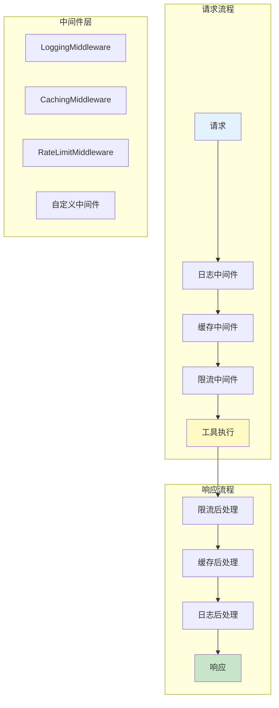

### 中间件接口体系

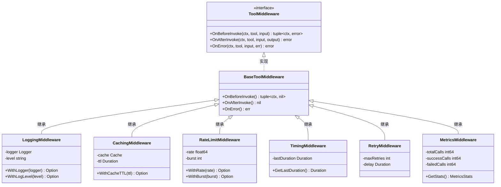

### 洋葱模型执行流程

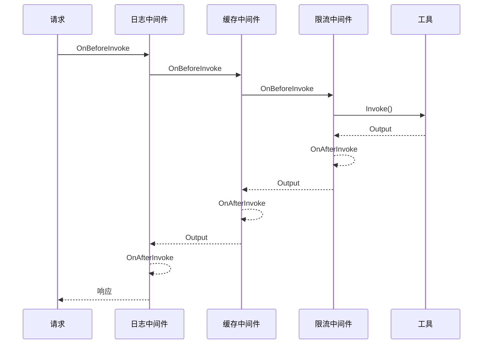

## 核心组件

### 1. 日志中间件 (LoggingMiddleware)

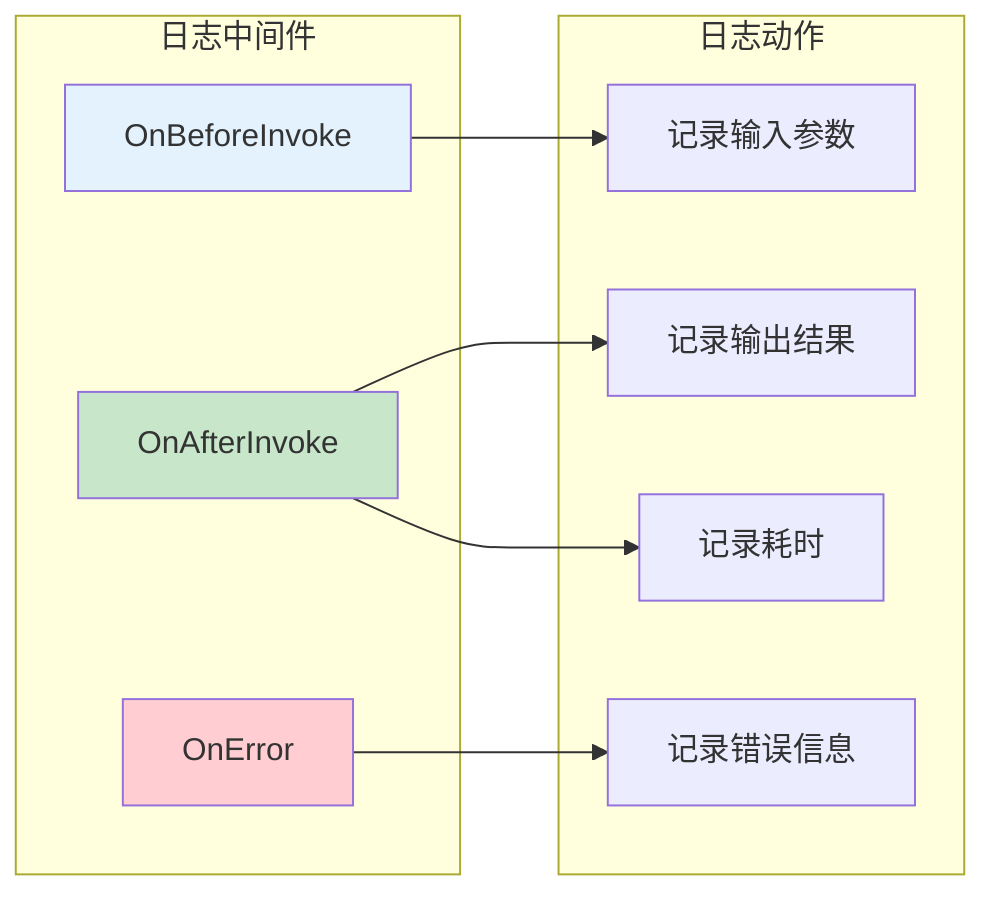

### 2. 缓存中间件 (CachingMiddleware)

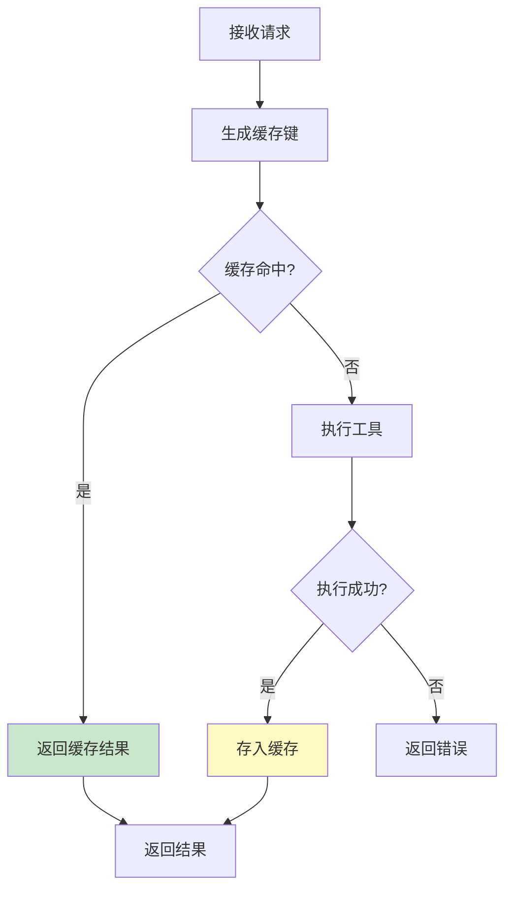

### 3. 限流中间件 (RateLimitMiddleware)

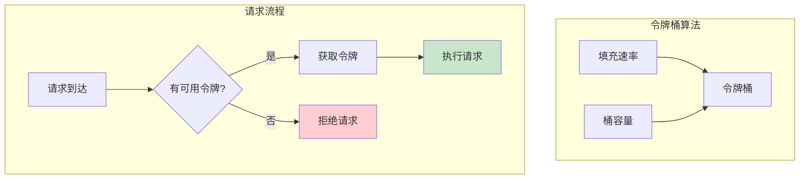

### 4. 中间件链 (Chain)

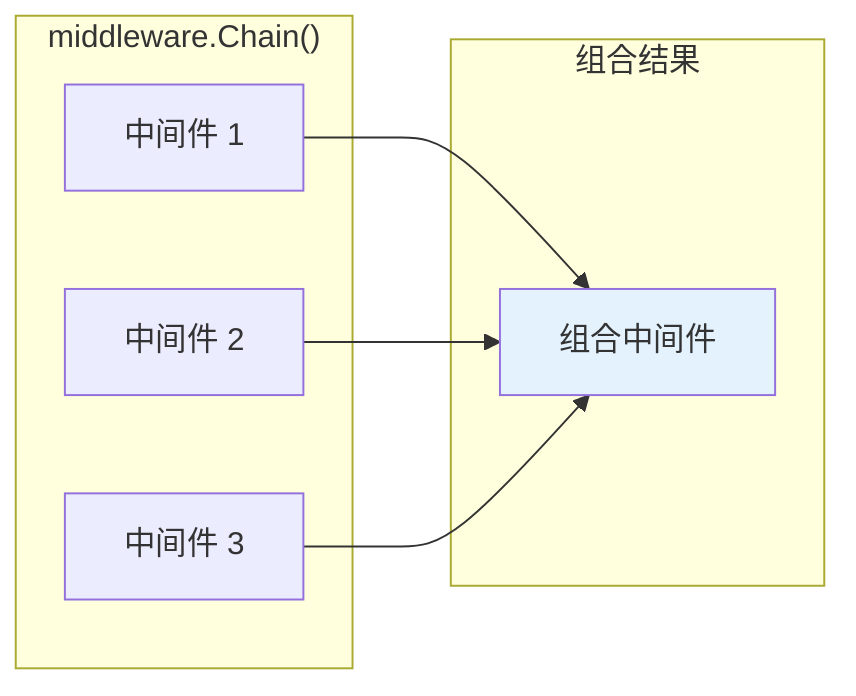

## 执行流程

### 场景 1: 日志中间件执行流程

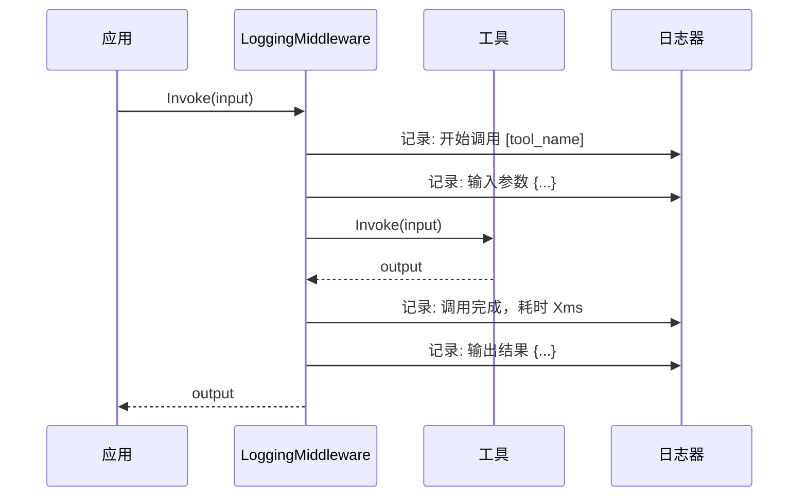

### 场景 2: 缓存中间件执行流程

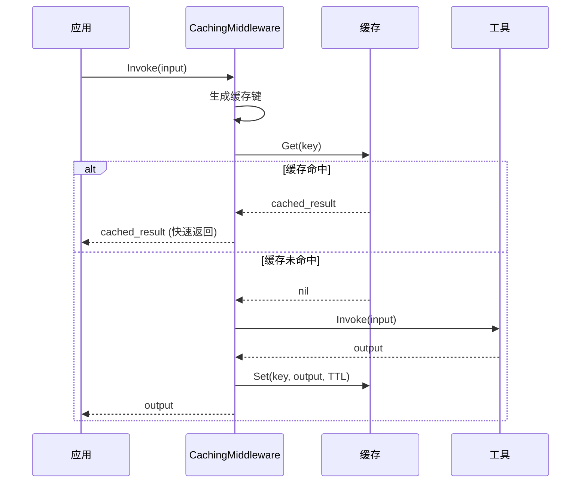

### 场景 3: 限流中间件执行流程

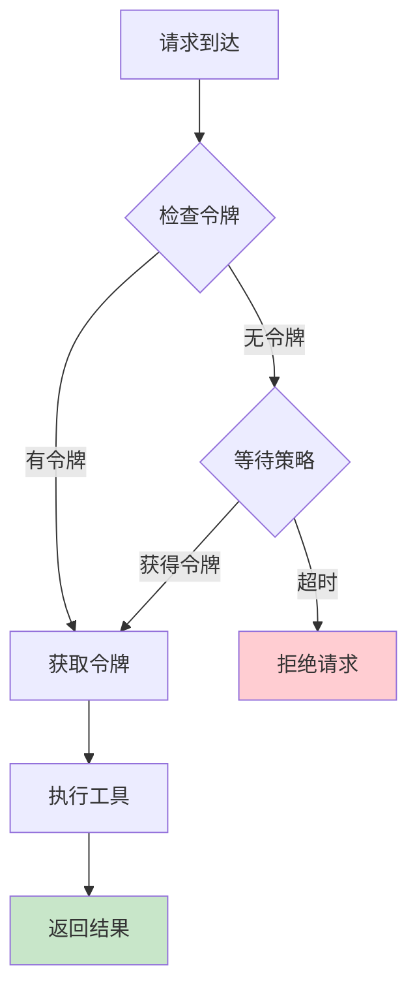

### 场景 4: 中间件链组合

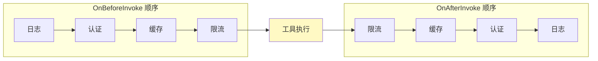

## 使用方法

### 运行示例

```bash
cd examples/tools/middleware
go run main.go
```

### 预期输出

```text
╔════════════════════════════════════════════════════════════════╗
║          中间件与可观测性示例                                   ║
║   展示日志、缓存、限流中间件和可观测性指标收集                   ║
╚════════════════════════════════════════════════════════════════╝

【场景 1】日志中间件
════════════════════════════════════════════════════════════════

场景描述: 展示日志中间件记录工具调用的输入输出

1. 创建带日志中间件的工具
────────────────────────────────────────
  原始工具: calculator
  包装后工具: calculator

2. 执行工具调用
────────────────────────────────────────
  ✓ 调用成功: map[result:60]

3. 日志记录
────────────────────────────────────────
  [INFO] 工具调用开始: calculator
  [INFO] 工具调用完成: calculator, 耗时: 0ms

【场景 2】缓存中间件
════════════════════════════════════════════════════════════════

1. 首次调用（缓存未命中）
  结果: map[input:10 result:100]
  耗时: 100.5ms
  实际执行次数: 1

2. 第二次调用（相同参数，缓存命中）
  结果: map[input:10 result:100]
  耗时: 50µs
  实际执行次数: 1 (未增加，使用缓存)

3. 缓存效果统计
  缓存命中率: 33.3%

【场景 3】限流中间件
════════════════════════════════════════════════════════════════

1. 限流配置
  速率限制: 2 请求/秒
  突发容量: 3 请求

2. 快速连续调用测试
  请求 1: ✓ 成功
  请求 2: ✓ 成功
  请求 3: ✓ 成功
  请求 4: ✗ 被限流
  请求 5: ✗ 被限流
  请求 6: ✗ 被限流

【场景 4】中间件链式组合
════════════════════════════════════════════════════════════════

执行顺序记录:
  1. 日志中间件: OnBeforeInvoke
  2. 认证中间件: OnBeforeInvoke
  3. 缓存中间件: OnBeforeInvoke
  4. 工具执行
  5. 缓存中间件: OnAfterInvoke
  6. 认证中间件: OnAfterInvoke
  7. 日志中间件: OnAfterInvoke

【场景 5】自定义中间件
════════════════════════════════════════════════════════════════

1. 计时中间件
  [计时] slow_operation 执行耗时: 150ms

2. 重试中间件
  [重试] 第 1 次重试 (原因: 模拟失败)
  [重试] 第 2 次重试成功
  ✓ 最终成功: 成功 (经过 3 次尝试)

3. 指标收集中间件
  总调用次数: 5
  成功次数: 5
  失败次数: 0
  平均耗时: 50µs

【场景 6】可观测性指标收集
════════════════════════════════════════════════════════════════

3. 可观测性报告
  ┌─────────────────┬────────┬────────┬────────┬──────────┬──────────┐
  │ 工具名称        │ 总调用 │ 成功   │ 失败   │ 平均耗时 │ 最大耗时 │
  ├─────────────────┼────────┼────────┼────────┼──────────┼──────────┤
  │ calculator      │     10 │     10 │      0 │     50µs │    100µs │
  │ text_processor  │      5 │      5 │      0 │     30µs │     60µs │
  │ datetime        │      3 │      3 │      0 │     20µs │     40µs │
  └─────────────────┴────────┴────────┴────────┴──────────┴──────────┘

4. 告警检查
  ✓ 无告警
```

## API 参考

### LoggingMiddleware（接口式中间件）

| 选项 | 说明 | 默认值 |
|------|------|--------|
| `WithLogger(logger)` | 设置日志记录器 | nil |

```go
loggingMW := middleware.NewLoggingMiddleware(
    middleware.WithLogger(logger),
)

// 应用到工具
wrappedTool := tools.WithMiddleware(tool, loggingMW)
```

### CachingMiddleware（函数式中间件）

| 选项 | 说明 | 默认值 |
|------|------|--------|
| `WithTTL(ttl)` | 设置缓存过期时间 | 5 分钟 |
| `WithCache(cache)` | 设置自定义缓存实现 | 内置缓存 |

```go
// 使用默认缓存
cachingMW := middleware.Caching(
    middleware.WithTTL(10*time.Minute),
)

// 使用自定义缓存
cachingMW := middleware.Caching(
    middleware.WithCache(customCache),
    middleware.WithTTL(5*time.Minute),
)

// 应用到工具
wrappedTool := tools.WithMiddleware(tool, cachingMW)
```

### RateLimitMiddleware（函数式中间件）

| 选项 | 说明 | 默认值 |
|------|------|--------|
| `WithQPS(qps)` | 设置每秒请求数 | 10 |
| `WithBurst(burst)` | 设置突发容量 | 20 |

```go
rateLimitMW := middleware.RateLimit(
    middleware.WithQPS(5),
    middleware.WithBurst(10),
)

// 应用到工具
wrappedTool := tools.WithMiddleware(tool, rateLimitMW)
```

### 中间件组合

```go
// 使用 WithMiddleware 组合多个中间件（推荐）
// 执行顺序：mw1 → mw2 → mw3 → 工具 → mw3 → mw2 → mw1
wrappedTool := tools.WithMiddleware(tool, mw1, mw2, mw3)

// 也可以逐层包装
tool1 := tools.WithMiddleware(tool, mw3)
tool2 := tools.WithMiddleware(tool1, mw2)
wrappedTool := tools.WithMiddleware(tool2, mw1)
```

### 自定义中间件（函数式实现，推荐）

```go
// 使用 ToolMiddlewareFunc 类型创建自定义中间件
func createTimingMiddleware() middleware.ToolMiddlewareFunc {
    return func(tool interfaces.Tool, next middleware.ToolInvoker) middleware.ToolInvoker {
        return func(ctx context.Context, input *interfaces.ToolInput) (*interfaces.ToolOutput, error) {
            // 前置处理
            start := time.Now()

            // 调用下一个中间件或工具
            output, err := next(ctx, input)

            // 后置处理
            duration := time.Since(start)
            fmt.Printf("[计时] %s 执行耗时: %v\n", tool.Name(), duration)

            return output, err
        }
    }
}

// 使用自定义中间件
timingMW := createTimingMiddleware()
wrappedTool := tools.WithMiddleware(tool, timingMW)
```

### 自定义中间件（接口式实现）

```go
// 实现 ToolMiddleware 接口
type CustomMiddleware struct{}

func (m *CustomMiddleware) Wrap(tool interfaces.Tool, next middleware.ToolInvoker) middleware.ToolInvoker {
    return func(ctx context.Context, input *interfaces.ToolInput) (*interfaces.ToolOutput, error) {
        // 前置处理
        fmt.Println("Before invoke")

        // 调用下一个中间件或工具
        output, err := next(ctx, input)

        // 后置处理（包含错误处理）
        if err != nil {
            fmt.Printf("Error: %v\n", err)
        } else {
            fmt.Println("After invoke: success")
        }

        return output, err
    }
}

// 使用自定义中间件
customMW := &CustomMiddleware{}
wrappedTool := tools.WithMiddleware(tool, customMW)
```

## 扩展阅读

- [LLM 工具调用示例](../../multiagent/06-llm-tool-calling/)
- [LLM 高级用法示例](../../llm/advanced/)
- [工具注册与执行示例](../registry/)
- [tools/middleware 包文档](../../../tools/middleware/) - 中间件 API 参考
