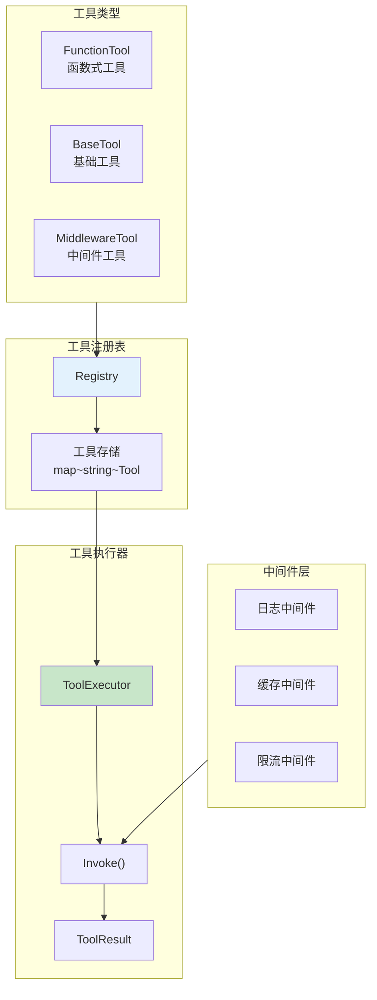
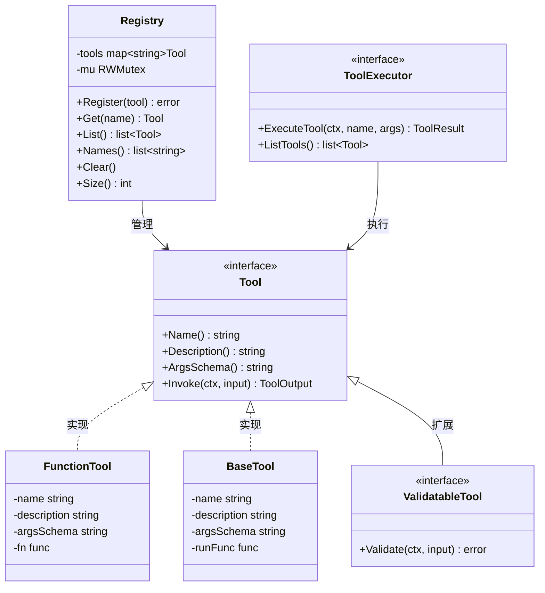
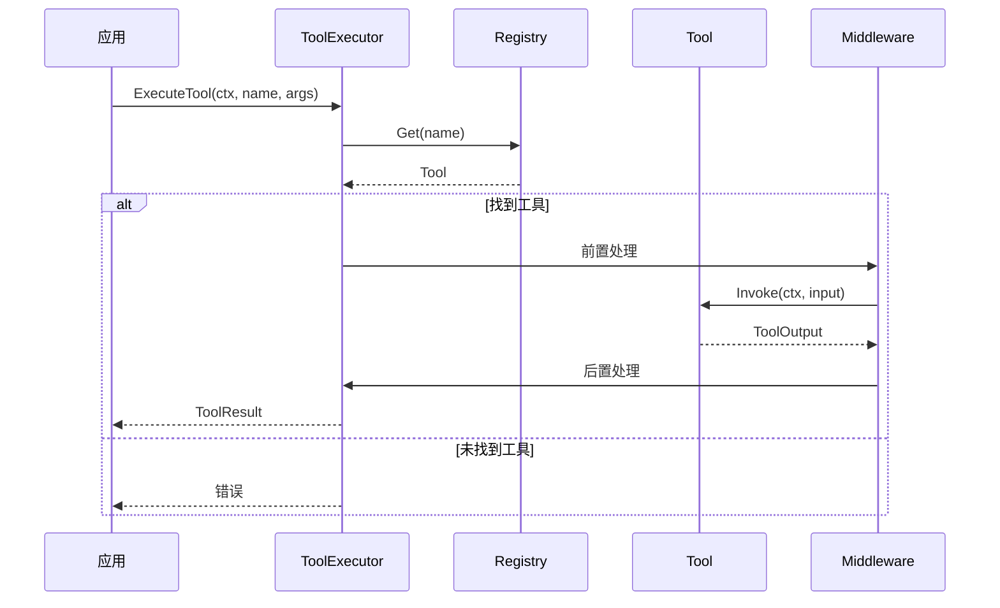
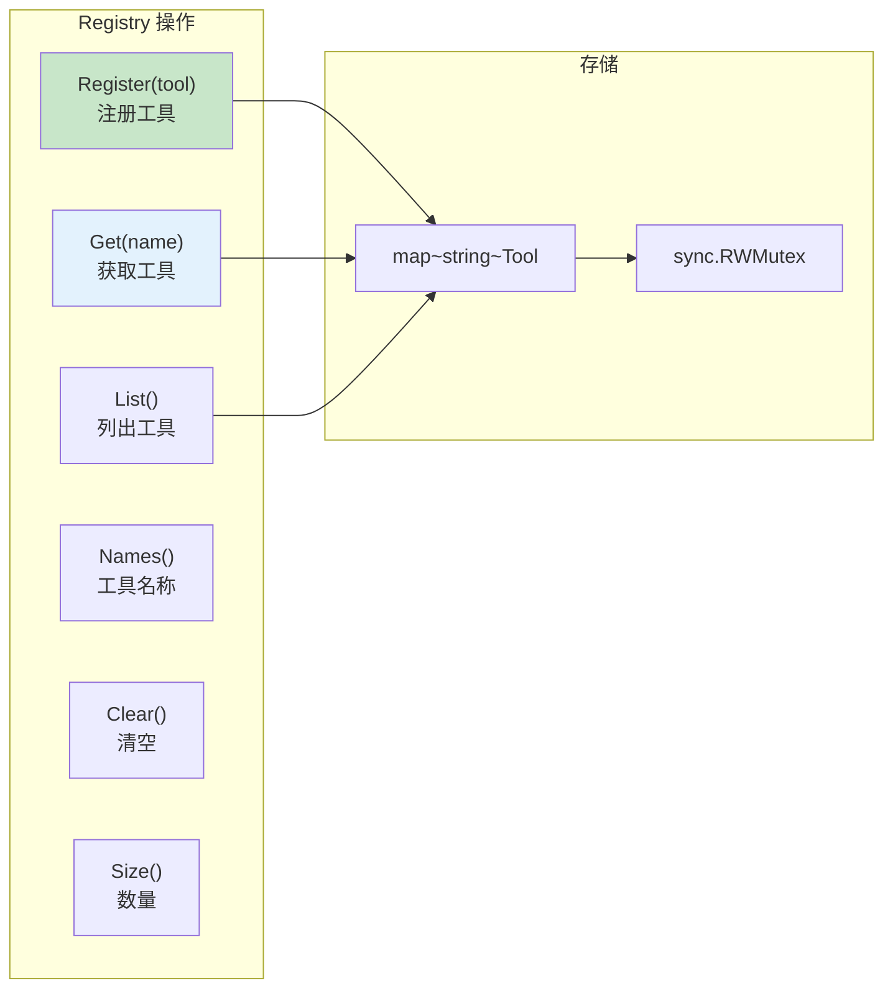
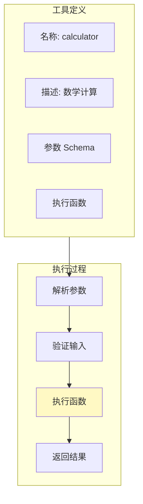
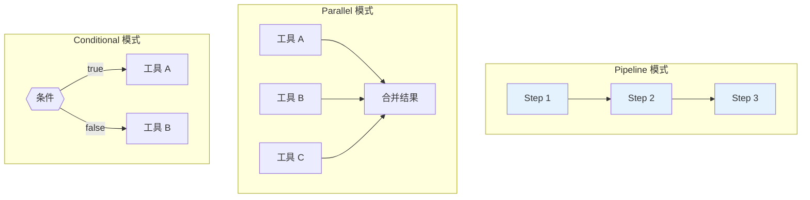
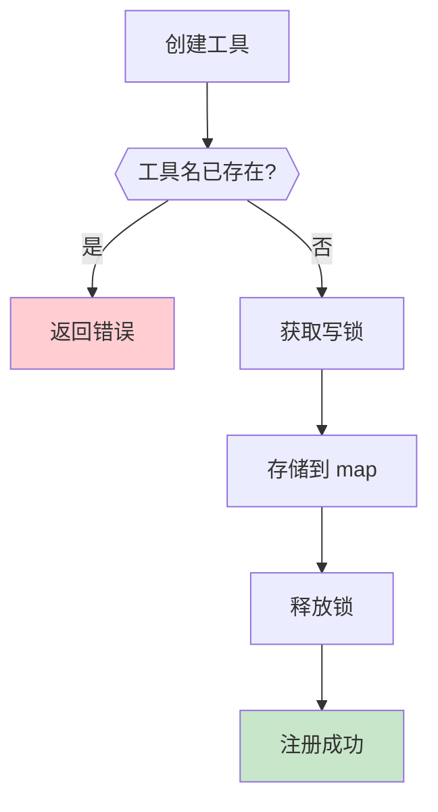
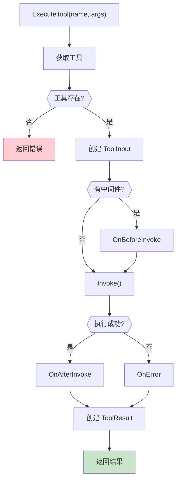

# 工具注册与执行示例

本示例演示 tools 包的核心功能，包括工具注册表管理、自定义工具创建、工具执行器和工具组合。

## 目录

- [架构设计](#架构设计)
- [核心组件](#核心组件)
- [执行流程](#执行流程)
- [使用方法](#使用方法)
- [API 参考](#api-参考)

## 架构设计

### 工具系统架构



### 工具接口体系



### 工具执行流程



## 核心组件

### 1. Registry 工具注册表



### 2. FunctionTool 函数式工具



### 3. 工具组合模式



## 执行流程

### 工具注册流程



### 工具执行流程



## 使用方法

### 运行示例

```bash
cd examples/tools/registry
go run main.go
```

### 预期输出

```text
╔════════════════════════════════════════════════════════════════╗
║          工具注册与执行示例                                     ║
║   展示工具注册表、自定义工具和执行器的使用                       ║
╚════════════════════════════════════════════════════════════════╝

【场景 1】工具注册表管理
════════════════════════════════════════════════════════════════

✓ 创建工具注册表

注册工具:
────────────────────────────────────────
  ✓ calculator: 执行基本数学计算
  ✓ text_processor: 处理文本
  ✓ datetime: 获取当前日期和时间
  ✓ random: 生成随机数

注册表状态:
────────────────────────────────────────
  已注册工具数: 4
  工具列表: [calculator text_processor datetime random]

【场景 2】自定义工具创建
════════════════════════════════════════════════════════════════
  ✓ 调用成功: map[greeting:你好，张三！ language:zh]
  ✓ 文本反转: map[operation:reverse result:dlroW olleH]
  ✓ 除零错误被正确捕获: 除数不能为零

【场景 3】工具执行器
════════════════════════════════════════════════════════════════
  ✓ calculator: map[a:7 b:8 operation:multiply result:56] (耗时: 0ms)
  ✓ text_processor: map[action:uppercase input:hello world output:HELLO WORLD] (耗时: 0ms)
```

## API 参考

### Registry API

| 方法 | 说明 | 返回值 |
|------|------|--------|
| `NewRegistry()` | 创建注册表 | `*Registry` |
| `Register(tool)` | 注册工具 | `error` |
| `Get(name)` | 获取工具 | `Tool` |
| `List()` | 列出所有工具 | `[]Tool` |
| `Names()` | 获取工具名称 | `[]string` |
| `Clear()` | 清空注册表 | - |
| `Size()` | 获取工具数量 | `int` |

### FunctionTool API

```go
// 创建函数式工具
tool := tools.NewFunctionTool(
    "name",           // 工具名称
    "description",    // 工具描述
    argsSchema,       // JSON Schema
    func(ctx context.Context, args map[string]interface{}) (interface{}, error) {
        // 工具逻辑
        return result, nil
    },
)
```

### BaseTool API

```go
// 创建基础工具
tool := tools.NewBaseTool(
    "name",
    "description",
    argsSchema,
    func(ctx context.Context, input *interfaces.ToolInput) (*interfaces.ToolOutput, error) {
        // 工具逻辑
        return &interfaces.ToolOutput{
            Result:  result,
            Success: true,
        }, nil
    },
)
```

### 代码示例

#### 创建和注册工具

```go
// 创建注册表
registry := tools.NewRegistry()

// 创建工具
calcTool := tools.NewFunctionTool(
    "calculator",
    "执行数学计算",
    `{"type":"object","properties":{"a":{"type":"number"},"b":{"type":"number"}}}`,
    func(ctx context.Context, args map[string]interface{}) (interface{}, error) {
        a := args["a"].(float64)
        b := args["b"].(float64)
        return a + b, nil
    },
)

// 注册工具
if err := registry.Register(calcTool); err != nil {
    log.Fatal(err)
}
```

#### 执行工具

```go
// 获取工具
tool := registry.Get("calculator")
if tool == nil {
    log.Fatal("工具未找到")
}

// 执行工具
output, err := tool.Invoke(ctx, &interfaces.ToolInput{
    Args: map[string]interface{}{
        "a": 10.0,
        "b": 20.0,
    },
})

fmt.Printf("结果: %v\n", output.Result)
```

#### 工具组合

```go
// Pipeline 执行
tools := []interfaces.Tool{tool1, tool2, tool3}
var result interface{}

for _, tool := range tools {
    output, _ := tool.Invoke(ctx, &interfaces.ToolInput{
        Args: map[string]interface{}{"input": result},
    })
    result = output.Result
}
```

## 扩展阅读

- [LLM 工具调用示例](../../multiagent/06-llm-tool-calling/)
- [LLM 高级用法示例](../llm/advanced/)
- [中间件与可观测性示例](../middleware/)
- [tools 包文档](../../../tools/) - 工具 API 参考
